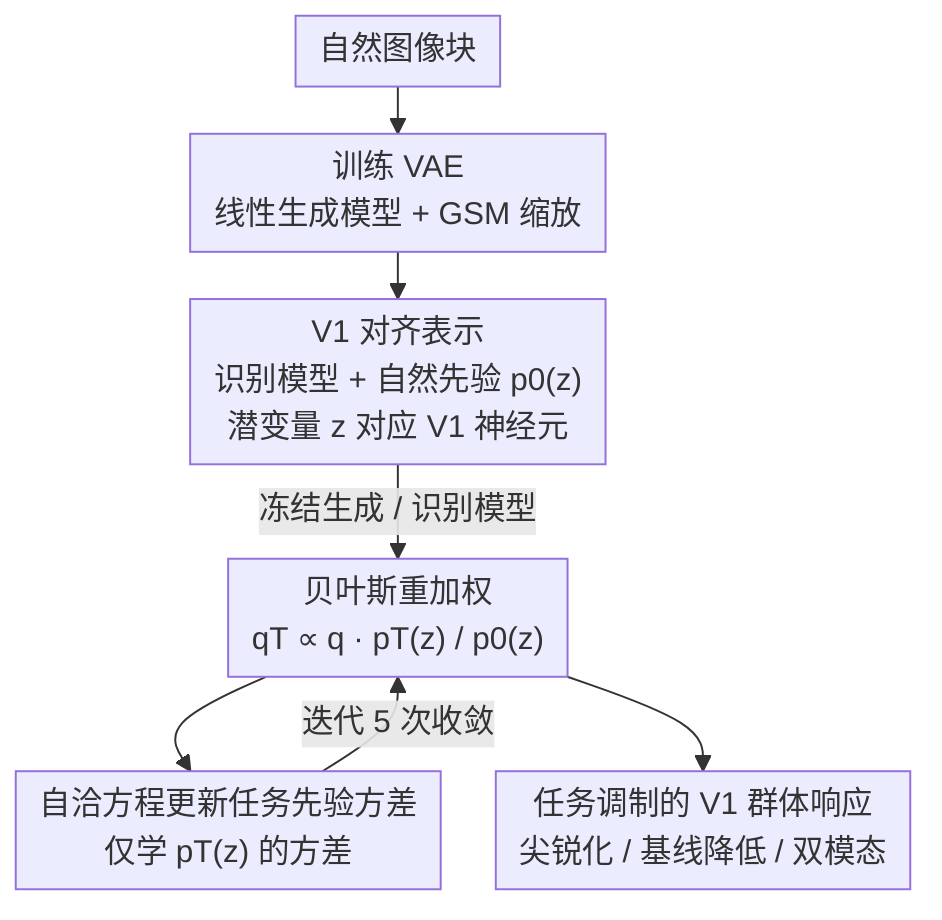

# TAVAE: A VAE with Adaptable Priors Explains Contextual Modulation in the Visual Cortex

**会议**: ICLR 2026  
**arXiv**: [2602.11956](https://arxiv.org/abs/2602.11956)  
**代码**: [https://github.com/CSNLWigner/mouse-V1-task-priors](https://github.com/CSNLWigner/mouse-V1-task-priors)  
**领域**: 计算神经科学 / 视觉皮层建模  
**关键词**: 变分自编码器, 任务先验, V1, 上下文调制, 概率推断

## 一句话总结
扩展 VAE 形式主义提出 Task-Amortized VAE (TAVAE)，通过在已学表示上灵活学习任务特异性先验来解释视觉皮层 V1 中的上下文调制现象，包括方向辨别任务中训练刺激与测试刺激不匹配时出现的双模态群体响应。

## 研究背景与动机

**领域现状**：深度学习模型（判别式和生成式）已被成功用于建模视觉系统的神经元响应。V1 的群体活动被解释为生成模型中潜变量后验的表示。自然图像统计学习的先验已被证明能解释 V1 的部分特性。

**现有痛点**：V1 响应不仅取决于刺激本身，还受任务等非刺激属性的强烈影响。最近研究发现 V1 中存在任务特异性的系统性偏差。但现有模型无法解释这些偏差——标准 VAE 适应新任务需要从头重训，既数据低效又不符合生物学可信性。

**核心矛盾**：任务学习应该复用已学到的视觉表示（不能每学一个任务就重训整个网络），但又需要灵活引入任务特异性的先验来调制推断。

**本文目标** 发展一个能灵活获取任务先验同时复用已学表示的 VAE 框架，并用它解释小鼠 V1 中与任务相关的上下文调制。

**切入角度**：保持 VAE 的似然（生成模型）和识别模型不变，仅通过贝叶斯规则用新的任务先验重新加权变分后验：$q_T(\mathbf{z}|\mathbf{x}) \propto q(\mathbf{z}|\mathbf{x}) \cdot p_T(\mathbf{z}) / p_0(\mathbf{z})$。

**核心 idea**：通过仅学习任务先验（不重训 VAE）来解释 V1 中任务依赖的响应偏差，包括不确定性下的双模态响应。

## 方法详解

### 整体框架
这篇论文要解释的现象是：小鼠 V1 在做方向辨别任务时，神经元响应会被任务本身（而非刺激）系统性地调制——可一旦训练刺激和测试刺激不匹配，群体响应甚至会出现反直觉的双模态。难点在于，标准 VAE 要适应一个新任务得把整个网络从头重训，既数据低效、又不符合"大脑复用已学表示"的生物学直觉。

TAVAE 的整条 pipeline 分两阶段。**第一阶段**先在自然图像上训练一个 VAE，但刻意约束成线性生成模型并加上 GSM 缩放，让学出来的潜变量 $\mathbf{z}$ 一一对应到 V1 神经元，同时得到识别模型 $q(\mathbf{z}|\mathbf{x})$ 和自然图像先验 $p_0(\mathbf{z})$。**第二阶段**是核心：把生成模型和识别模型整个冻住，只学一个任务特异性先验 $p_T(\mathbf{z})$，再用贝叶斯规则把它接到原后验上做重加权得到任务后验 $q_T$。而 $p_T$ 的求解又被进一步化简成一个自洽方程，与重加权后的后验互相依赖、迭代 5 次即收敛。最终这套任务后验就能直接拿来和 15K 个神经元的钙成像数据对照。

### 关键设计

**1. 线性生成模型 + GSM 缩放：把 VAE 的潜变量对齐到 V1 神经元**

要让模型能和真实 V1 记录对照，生成模型必须先"长得像 V1"。这里把 VAE 的生成模型约束成线性形式

$$p(\mathbf{x}|\mathbf{z},s) = \mathcal{N}(\mathbf{x}; e^s \mathbf{A}\mathbf{z}, \sigma^2 \mathbf{I}),$$

潜空间取高维（1799 维）以匹配 V1 的过完备结构。Laplace 先验 $p_0(\mathbf{z})$ 的稀疏性会逼着字典 $\mathbf{A}$ 学出 Gabor 形状的滤波器，正好对应 V1 简单细胞的感受野；额外的高斯尺度混合（GSM）缩放因子 $e^s$ 用来建模对比度，在低对比度刺激下能给出更可靠的推断。正是这套约束让潜变量 $\mathbf{z}$ 与 V1 神经元一一对应，框架图里"V1 对齐表示"这一步才能成立，后续的任务先验调制也才有资格直接和钙成像数据比对。

**2. 任务先验的贝叶斯重加权：不重训 VAE 也能产生任务适应的后验**

有了对齐 V1 的表示，怎么让它解释任务诱导的偏差？标准做法是重训整个 VAE，但那样既数据低效、又可能破坏发育期辛苦学到的表示。TAVAE 的核心扩展是：保持似然（生成模型）和识别模型完全不变，只把先验从自然图像先验 $p_0(\mathbf{z})$ 换成任务先验 $p_T(\mathbf{z})$，并通过贝叶斯规则对变分后验重加权

$$q_T(\mathbf{z}|\mathbf{x}) \propto q(\mathbf{z}|\mathbf{x}) \cdot p_T(\mathbf{z}) / p_0(\mathbf{z}).$$

任务先验取零均值的 Laplace 分布族，每个潜变量只需学一个方差参数 $\sigma_{T,i}$。这一步在生物学上有清晰对应：高层皮层通过自上而下连接把任务相关的先验信息传回 V1，从而调制其推断——表示本身不动，变的只是先验。这也正是框架图里那条"冻结生成/识别模型"边的含义。

**3. 自洽方程求解：把任务先验学习简化成迭代不动点**

只学先验方差听起来仍要做一遍优化，但 TAVAE 把它进一步压成一个不动点迭代。对任务损失（先验的对数似然）求极值后，最优方差满足自洽方程

$$\sigma_{T,i} = \frac{1}{n} \sum_{\mathbf{x}} \mathbb{E}_{q_T}[|z_i|],$$

即每个潜变量的先验方差等于它在任务后验 $q_T$ 下绝对值的平均。方程两边都含 $\sigma_{T,i}$（右边的 $q_T$ 又依赖先验），所以它和上一步的重加权互相耦合——这正是框架图里 $D \leftrightarrow E$ 那条回环：用当前 $p_T$ 重加权得到 $q_T$，再用 $q_T$ 更新方差，实测 5 次即收敛。这样就绕开了完整的 ELBO 优化，让任务学习变得极其数据高效，也呼应了生物体能快速形成任务先验的能力。

### 损失函数 / 训练策略

VAE 阶段优化标准 ELBO（重构的负对数似然加 KL 散度项）。TAVAE 阶段不再动 ELBO，只优化任务先验的对数似然（Eq. 4），并把它化简为上面的自洽方程迭代求解。

## 实验关键数据

### 主实验

10 只小鼠 V1 钙成像记录（15,027 个神经元）vs TAVAE 模型预测：

| 模型配置 | 群体响应相关性 $r$ | 上下文调制相关性 |
|---------|-----------------|----------------|
| **TAVAE (45°, 90°)** | **0.78±0.02** | **0.58±0.09** |
| VAE (无任务先验) | 0.53±0.12 | — |
| TAVAE (45°, 135°) | 0.54±0.10 | 0.32±0.17 |
| TAVAE (eager adapter) | 0.53±0.11 | -0.10±0.23 |

### 消融实验

| 分析 | 关键发现 |
|------|---------|
| 任务学习效应 | 群体响应尖锐化 + 基线活动降低——与训练小鼠 vs 幼稚小鼠的差异定性一致 |
| OOD 刺激双模态 | 当测试刺激偏离训练分布时，群体响应出现双模态（峰值偏离刺激方向）——模型和实验一致 |
| 先验更新轨迹（D2内） | 会话内早期vs晚期试次的双模态不对称性变化，与先验逐步更新的模型预测一致 |
| GSM 缩放消融 | 去掉缩放仍能工作，但拟合度略降 |
| 对比度依赖 | 低对比度增加不确定性→双模态更明显→更匹配实验 |

### 关键发现
- TAVAE 的任务先验导致对偏好方向匹配任务的神经元响应增强、不匹配的抑制——产生群体响应尖锐化
- 最引人注目的发现：当测试刺激方向与先验不匹配时，群体响应出现反直觉的双模态——在刺激方向处出现低谷，两侧出现峰值。这是概率推断中不确定性的直接特征
- 先验更新速度的证据：D2 会话内试次分组分析显示先验逐步从 (45°,135°) 转向 (45°,90°)
- 从群体响应的模式位置可以反推似然函数和先验——反推出的似然函数与未训练动物的群体响应几乎一致

## 亮点与洞察
- **双模态作为不确定性的签名**：在高维潜空间中后验是单模态的，但投影到一维方向空间后变成双模态——这揭示了多选项不确定性如何在群体水平上表现，对理解神经编码有深刻意义
- **极其高效的任务适应**：仅学习先验方差参数（自洽方程5次迭代），不修改识别模型和生成模型——计算效率极高，且对应生物学上"自上而下先验调制"的合理机制
- **模型-实验闭环**：不是拟合神经数据，而是从规范性原则出发预测，然后在15,027个神经元上验证——这种"prediction-first"的研究范式比"fit-then-interpret"更有说服力
- **从群体响应反推生成模型参数**：利用模式位置的偏移量推断似然宽度和先验强度——为从神经数据反向工程概率推断参数提供了方法论

## 局限与展望
- 线性生成模型过于简化——V1 的计算可能涉及非线性成分
- 任务先验假设残基独立+零均值 Laplace，限制了表达力（无法建模跨特征的相关性先验）
- 钙成像的时间分辨率有限，无法验证"采样"vs"MAP估计"的后验表示问题
- 仅在简单的方向辨别任务上验证，未扩展到更复杂的视觉任务
- 假设先验在 D2 之后就不再更新，这一假设的生物学依据主要来自行为学（错误报警率的变化趋势）

## 相关工作与启发
- **vs 标准 VAE 模型**: 标准 VAE 只有自然图像先验，无法解释任务诱导的响应偏差。TAVAE 通过引入任务先验，在不改变表示的前提下解释偏差
- **vs Csikor et al. (2025)**: 他们用层级 VAE 学习自然图像的上下文先验。TAVAE 扩展到任务特异性先验，两者互补
- **对 VLM/多模态研究的启发**: TAVAE 的"保留表示+灵活适应先验"的思路可类比为多模态模型的参数高效微调——不改变backbone，仅通过先验/prompt调制输出

## 评分
- 新颖性: ⭐⭐⭐⭐⭐ 理论形式主义新颖优雅，双模态的预测和验证非常striking
- 实验充分度: ⭐⭐⭐⭐ 15K神经元的大规模录像数据+多种模型变体对比
- 写作质量: ⭐⭐⭐⭐ 理论和实验结合紧密，但需要神经科学背景知识
- 价值: ⭐⭐⭐⭐⭐ 对计算神经科学有重大推进，为VAE在神经科学中的应用提供新范式

<!-- RELATED:START -->

## 相关论文

- [\[ICLR 2026\] Eliminating VAE for Fast and High-Resolution Generative Detail Restoration](eliminating_vae_for_fast_and_high-resolution_generative_detail_restoration.md)
- [\[CVPR 2026\] ViHOI: Human-Object Interaction Synthesis with Visual Priors](../../CVPR2026/image_generation/vihoi_human-object_interaction_synthesis_with_visual_priors.md)
- [\[CVPR 2025\] Learning Visual Generative Priors without Text](../../CVPR2025/image_generation/learning_visual_generative_priors_without_text.md)
- [\[ICLR 2026\] SongEcho: Towards Cover Song Generation via Instance-Adaptive Element-wise Linear Modulation](songecho_towards_cover_song_generation_via_instance-adaptive_element-wise_linear.md)
- [\[ICLR 2026\] Mod-Adapter: Tuning-Free and Versatile Multi-concept Personalization via Modulation Adapter](mod-adapter_tuning-free_and_versatile_multi-concept_personalization_via_modulati.md)

<!-- RELATED:END -->
