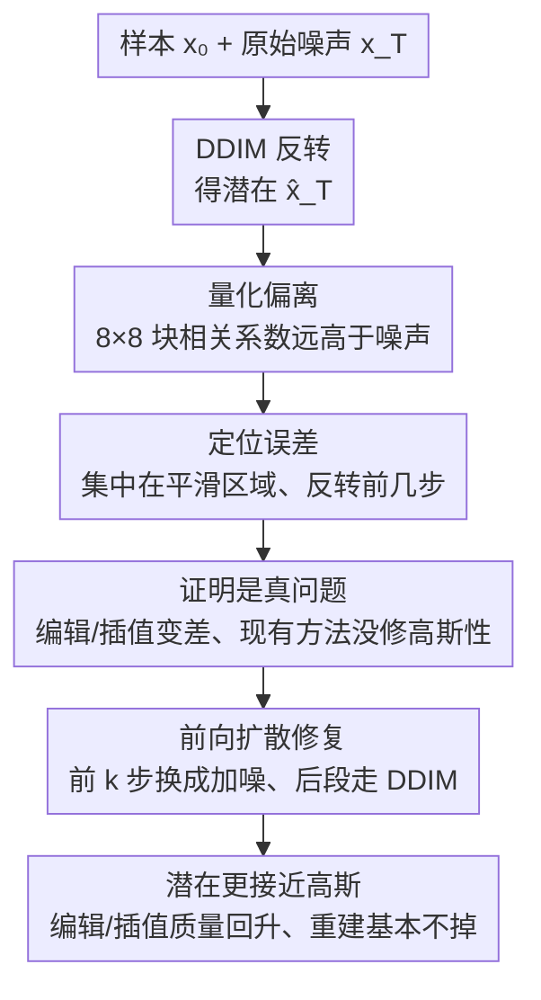

# There and Back Again: On the Relation between Noise and Image Inversions in Diffusion Models

**会议**: ICLR 2026  
**arXiv**: [2410.23530](https://arxiv.org/abs/2410.23530)  
**代码**: [GitHub](https://github.com/luk-st/taba)  
**领域**: 扩散模型 / 反转分析 / 图像编辑  
**关键词**: DDIM反转, 潜在编码, 噪声相关性, 平滑区域, 正向扩散修复

## 一句话总结

深入分析 DDIM 反转的误差机制，发现潜在编码在平滑图像区域（如天空）呈现低多样性和高相关性，并追溯到反转初始步骤的噪声预测不准确，提出用正向扩散替代前几步反转的简单修复方案。

## 研究背景与动机

扩散模型缺乏显式的低维潜在空间来编码数据的可编辑特征。DDIM 反转通过逆转去噪轨迹、将图像传输到其近似的初始噪声来部分解决这一问题。然而：

**反转误差的来源不明**：虽然已知 DDIM 反转产生的潜在不完全是高斯噪声，但其根本原因和表现形式未被系统研究

**现有改进方法的局限**：Null-text inversion、Renoise 等方法虽改善重建质量，但未真正解决潜在的非高斯性

**潜在编码可操作性差**：与原始噪声空间相比，反转潜在空间的插值和编辑质量更低

## 方法详解

### 整体框架

本文不提出新模型，而是回答一个被长期忽视的问题：把扩散模型生成的图像做 DDIM 反转，得到的潜在编码到底有多像、又有多不像一开始的高斯噪声？围绕三个变量——生成用的高斯噪声 $\mathbf{x_T}$、模型生成的样本 $\mathbf{x_0}$、以及对该样本反转得到的潜在 $\hat{\mathbf{x}}_T$——作者先用一个相关性指标把"偏离高斯"量化出来，再在空间维度（哪些区域偏得最狠）和轨迹维度（误差在反转的哪一步被注入）逐层定位病灶，接着验证这种偏离会实打实损害编辑/插值、且现有反转改进并没解决它，最后据此给出一个无需重训的修复：把反转最脏的前几步换成前向扩散加噪。

### 关键设计

**1. 量化偏离：用 8×8 块相关系数把"潜在不是高斯"变成可比的数字**

干净高斯噪声各像素近乎独立，8×8 像素块内的 Pearson 相关系数应接近 0（实测约 0.039）。作者对反转潜在 $\hat{\mathbf{x}}_T$ 做同样统计，发现相关系数显著抬高，可视化上甚至能直接看到残留的图像结构——这就把"反转潜在不像噪声"从定性观察坐实成可横向比较的指标。规律是像素空间模型偏离最重（ADM-32 为 0.382、IF 为 0.498），潜在空间模型相对轻（LDM 仅 0.045），但无一例外都明显高于噪声基线。

| 模型 | 噪声相关 | 潜在相关 | 样本相关 |
|------|---------|---------|---------|
| ADM-32 | 0.039 | **0.382** | 0.964 |
| ADM-64 | 0.039 | **0.126** | 0.925 |
| IF | 0.039 | **0.498** | 0.936 |
| LDM | 0.039 | **0.045** | 0.645 |
| DiT | 0.041 | **0.103** | 0.748 |
| SDXL | 0.036 | **0.155** | 0.637 |

**2. 定位误差：从平滑区域一路追到反转的最初几步**

知道潜在偏离高斯还不够，得知道偏在哪、偏从何来。空间上，作者按局部方差用阈值 $\tau=0.025$ 把图像切成"平滑区域"（天空、纯色背景）与"非平滑区域"分别统计，发现病灶恰恰集中在本该最好反转的平滑区域：那里反转误差更高（ADM-32 平滑 0.49 vs 非平滑 0.43，IF 为 0.56 vs 0.40），潜在多样性（标准差）却更低（ADM-32 为 0.34 vs 0.46）——低频区域反而最不像噪声、编码最趋同。

| 模型 | 平滑区域误差 | 非平滑区域误差 | 平滑区域标准差 | 非平滑区域标准差 |
|------|-----------|-------------|-------------|---------------|
| ADM-32 | **0.49** | 0.43 | **0.34** | 0.46 |
| IF | **0.56** | 0.40 | **0.46** | 0.72 |
| LDM | **0.13** | 0.03 | **0.45** | 0.59 |
| DiT | **0.12** | 0.06 | **0.43** | 0.54 |

轨迹上，作者沿生成轨迹做线性插值路径分析，量化中间步 $x_t$ 到"噪声—潜在"连线的距离 $\|(1-\lambda)\mathbf{x_T} + \lambda \hat{\mathbf{x}}_T - x_t\|_2$，发现生成轨迹在约 50%–70% 处就已倒向反转潜在 $\hat{\mathbf{x}}_T$，说明潜在保留了样本的部分结构、没真正回到噪声。逐步拆解后根因锁定在反转最初几步：那几步对平滑区域的噪声预测既不准、也不够多样，误差在此被注入并一路保留——这正是后面修复只动前几步的依据。

**3. 证明这是真问题：编辑变差，且现有反转改进并没修好它**

为说明偏离不只是统计现象，作者从两面验证它真会坏事。一面看下游可操作性：对比 DDIM 潜在空间与原始噪声空间，球面插值时前者生成的中间图像质量明显更低，平滑区域编辑尤其受限——"潜在非高斯"和"编辑/插值变差"被直接挂钩。另一面复核已有改进：把 Null-text inversion、Renoise、DPM-Solver inversion 及正则化逐一放回相关性指标下，它们虽都改善了重建保真度，却基本没恢复潜在的高斯性（前三者仍不达标，正则化仅部分缓解）。这条校正了社区的常见预设——重建变好，不代表潜在空间被修好。

| 方法 | 重建改善 | 高斯性保持 |
|------|---------|----------|
| Null-text inversion | ✓ | ✗ |
| Renoise | ✓ | ✗ |
| DPM-Solver inversion | ✓ | ✗ |
| 正则化方法 | 部分 | 部分 |

**4. 前向扩散修复：把最脏的前几步换成加噪**

既然误差主要在反转前 $k$ 步被注入，修复就只替换这几步：前 $k$ 步不做 DDIM 反转，而是直接用前向扩散加噪

$$x_t = \sqrt{\bar{\alpha}_t}\, x_0 + \sqrt{1-\bar{\alpha}_t}\, \epsilon_t$$

其中 $\epsilon_t$ 为采样的独立高斯噪声，其后再切回标准 DDIM 反转。这相当于在平滑区域强行注入真正独立的高斯成分，把残留的相关性打散、把多样性补回来；由于只动最初几步、后段仍走确定性轨迹，重建质量基本不掉，而插值与编辑质量同步改善，对平滑区域尤为明显。代价是引入了一点随机性、最优 $k$ 需随模型微调（见局限）。

## 实验

### 实验模型
7种扩散模型覆盖像素空间/潜在空间、有条件/无条件、U-Net/DiT架构

### 修复方案验证

| 策略 | 相关性↓ | 重建质量↑ | 插值质量↑ | 编辑质量↑ |
|------|--------|---------|---------|---------|
| 标准 DDIM 反转 | 高 | 基线 | 低 | 低 |
| + 正则化 | 中 | 基线 | 中 | 中 |
| + 前k步前向扩散 | **低** | 保持 | **高** | **高** |

### Flow Matching 扩展
相同的相关性和低多样性问题在 Flow Matching 模型中也存在。

### 消融实验

| 参数 | 效果 |
|------|------|
| 替代步数 k 增大 | 多样性提升但重建可能降低 |
| DDIM步数增加 | 误差减小但问题仍存在 |
| 不同模型架构 | 趋势一致 |

## 亮点

1. **系统性分析的深度**：从7个模型全面验证反转误差的规律
2. **平滑区域问题的发现**：精确定位误差的空间分布模式
3. **简单有效的修复方案**：仅替换前几步即可显著改善
4. **跨架构泛化**：U-Net、DiT、像素空间、潜在空间均适用
5. **对社区认知的校正**：现有改进方法并未真正解决潜在的非高斯性

## 局限性

1. 修复方案带来的前向扩散步骤引入了随机性，可能影响确定性重建
2. 最优替代步数 $k$ 需要根据模型调整
3. 分析主要基于 DDIM 采样器，对其他采样器的推广需进一步验证
4. 平滑区域的定义依赖于手动阈值 $\tau = 0.025$
5. 未提供理论解释为何前几步的噪声预测对平滑区域特别不准确

## 相关工作

- **DDIM 反转**：Song et al. (2021)、Dhariwal & Nichol (2021)
- **反转改进**：Null-text inversion (Mokady 2023)、Renoise (Garibi 2024)
- **图像编辑**：P2P (Hertz 2022)、SDEdit (Meng 2021)
- **Flow Matching**：Lipman et al. (2023)

## 评分

- **创新性**: ⭐⭐⭐⭐ — 系统性分析视角新颖，发现有深度
- **实用性**: ⭐⭐⭐⭐ — 简单修复方案可直接应用
- **实验**: ⭐⭐⭐⭐⭐ — 7个模型的全面对比和验证
- **写作**: ⭐⭐⭐⭐⭐ — 分析层层递进，逻辑清晰

<!-- RELATED:START -->

## 相关论文

- [\[NeurIPS 2025\] On the Relation between Rectified Flows and Optimal Transport](../../NeurIPS2025/image_generation/on_the_relation_between_rectified_flows_and_optimal_transport.md)
- [\[ICLR 2026\] Image Can Bring Your Memory Back: A Novel Multi-Modal Guided Attack against Image Generation Model Unlearning](image_can_bring_your_memory_back_a_novel_multi-modal_guided_attack_against_image.md)
- [\[ICLR 2026\] Diverse Text-to-Image Generation via Contrastive Noise Optimization](diverse_text-to-image_generation_via_contrastive_noise_optimization.md)
- [\[ICLR 2026\] Generalization of Diffusion Models Arises with a Balanced Representation Space](generalization_of_diffusion_models_arises_with_a_balanced_representation_space.md)
- [\[ICLR 2026\] Flow Matching with Injected Noise for Offline-to-Online Reinforcement Learning](flow_matching_with_injected_noise_for_offline-to-online_reinforcement_learning.md)

<!-- RELATED:END -->
