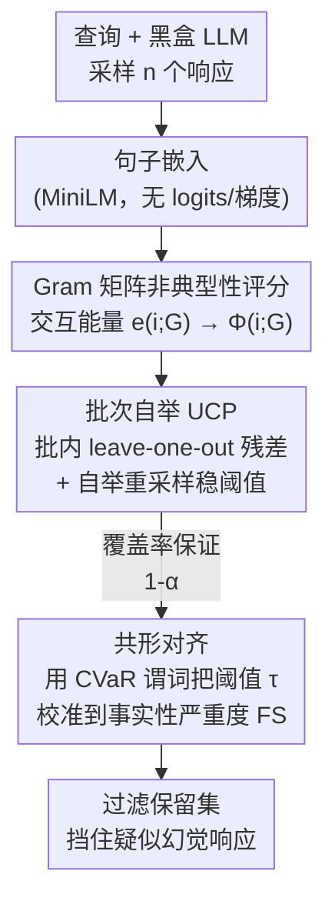

# Unsupervised Conformal Inference: Bootstrapping and Alignment to Control LLM Uncertainty

**会议**: ICLR 2026  
**arXiv**: [2509.23002](https://arxiv.org/abs/2509.23002)  
**代码**: 无  
**领域**: 图像生成  
**关键词**: 无监督共形推断, 自举法, LLM幻觉检测, Gram矩阵, 共形对齐

## 一句话总结
提出无监督共形推断框架（BB-UCP），通过Gram矩阵交互能量评分、批次自举校准和共形对齐，在无标签、API兼容条件下实现LLM生成的分布无关有限样本覆盖率保证，有效检测和过滤幻觉输出。

## 研究背景与动机

### 领域现状

**领域现状**：LLM不确定性量化（UQ）对可信AI至关重要。黑盒API场景下无法获取梯度、logits或隐藏状态，必须仅从采样输出进行决策。现有方法包括语义熵、自一致性和基于嵌入几何的方法。

**现有痛点**：(1) 共形预测（CP）提供分布无关的有限样本保证，但生成式任务打破了经典监督设定——文本提示不是可量化的协变量；(2) Full-UCP需要对每个候选重新计算（计算密集），Split-UCP数据效率低（分割成本高）；(3) 现有方法未能将低成本信号与高成本质量指标校准对齐。

**核心矛盾**：需要label-free、API兼容、有理论保证的测试时过滤机制，但现有CP方法不适用于无监督生成场景。

**本文目标**：如何在无标签、仅黑盒API的设定下，为LLM生成提供有理论保证的质量控制？

**切入角度**：利用响应嵌入的Gram矩阵几何信号作为一致性评分，设计批次化和自举增强的无监督共形预测，通过共形对齐将廉价信号与质量谓词校准。

**核心 idea**：用Gram矩阵交互能量量化响应典型性，通过自举校准稳定阈值，通过共形对齐将几何信号与事实性目标绑定。

## 方法详解

### 整体框架
BB-UCP 把"黑盒只能拿到采样输出"这一限制变成优势：对同一查询采一组响应，用它们彼此之间的嵌入几何算出每个响应有多"不典型"，再用自举校准把这个廉价信号转成有覆盖率保证的阈值，最后通过共形对齐把阈值绑定到用户真正关心的事实性谓词上。整条链路从**非典型性评分**到**批次自举校准**再到**共形对齐**层层递进，全程无需标签、logits 或梯度，最终输出一个带覆盖率保证的过滤器，把疑似幻觉的响应挡在外面。

### 关键设计

**1. Gram 矩阵非典型性评分：用一组响应的相互一致性当作免费的不确定性信号**

黑盒场景下没有 token 概率可用，本文转而从几何入手。把一个查询的 $n$ 个响应嵌入拼成矩阵 $V$，构造 Gram 矩阵 $G = V^\top V$ 后，每个响应 $i$ 的"交互能量"定义为 $e(i;G) = \|G_{:,i}\|_2 = \|Vv_i\|_2$；在单位范数嵌入下它等于 $e(i;G) = (\sum_j \cos^2\theta_{ij})^{1/2}$，也就是该响应与同组所有响应余弦相似度的二范数。Theorem 2.1 给出它的范围 $1 \leq e(i;G) \leq \sqrt{n}$：跟大家都不像的孤立响应能量趋近下界，处在共识簇里的响应能量趋近上界。据此把非典型性评分写成 $\Phi(i;G) = 1 - e(i;G)/B_E$（$B_E$ 为归一化上界），值越高代表该响应越新颖、越偏离群体共识——这正是幻觉响应的典型特征，于是无需任何质量标注就拿到了可排序的风险分数。

**2. 批次自举 UCP（BB-UCP）：把共形预测搬进无监督的批次设定并稳住阈值**

经典共形预测要求一个带标签的校准集，而这里既无标签也无可量化协变量。B-UCP 的做法是在每个批次内做 leave-one-out：对响应 $i$ 用其余响应作上下文算残差 $R_{j,i} = \phi(Y_{j,i}; \mathcal{B}_{j,-i})$，把各批残差汇聚后取调整分位数当阈值。但单批样本少、偶发的异常批会让经验分位数抖动，于是 BB-UCP 在此之上对每批残差再做自举重采样，用重采样后的分布估分位数，从而压低异常批次的影响、让阈值更稳。关键是这套操作不破坏批内可交换性，Theorem 3.1–3.2 证明在批次可交换假设下覆盖率保证 $\Pr\{Y_{n+1} \in C_n\} \geq 1-\alpha$ 仍然成立——既保留了分布无关的有限样本保证，又换来了更紧的区间。

**3. 共形对齐：把廉价的几何阈值校准到昂贵的事实性目标上**

几何评分便宜但不直接等于"答得对"，这一步负责把二者桥接。引入单一严格度参数 $\tau \in [0,1]$，过滤后的保留集为 $\hat{J}_j(\tau) = \{i: Q_{j,i} > \tau\}$。要衡量过滤是否真的留下了更好的答案，需要一个质量标尺：事实性严重度 $\text{FS}(a) = 1 - \max_{r \in \mathcal{R}_q} \text{BERTScoreF1}(\text{head}(a), r)$，只取答案头部（首句或 Final 字段、截断到 16 token）与参考答案算 BERTScore，越低越准。基于它构造谓词 $\mathcal{P}_j^{\text{CVAR}}(\tau)$，用 CVaR 差值比较保留集与丢弃集的尾部质量差距，只有保留集显著更好才算"通过"。校准时把 $\hat{\tau}$ 取为历史批次最小通过严格度的 $K = \lceil(1-\alpha)(J+1)\rceil$ 阶统计量，Theorem 3.3 据此给出对齐保证 $\Pr\{\mathcal{P}_{J+1}(\hat{\tau}) = 1\} \geq 1-\alpha$。由于谓词只需满足非递减右连续，这套对齐能套到任意质量指标上，通用性强。

## 实验关键数据

### 实验1：单查询校准（S-UCP vs BB-UCP）
- BB-UCP在所有数据集和所有 $\alpha$ 水平上产生更小的区间长度
- BB-UCP覆盖率更保守（高于目标），但阈值更紧

### 实验2：跨查询校准
- LOQO经验覆盖率在所有数据集上接近 $1-\alpha$ 目标
- $\Delta\text{FS} > 0$ 在所有数据集和所有 $\alpha$ 上成立（保留集事实性更好）
- NQ-Open上 $\Delta\text{FS} \approx 0.209$（最大提升）

### 实验3：共形对齐（CVaR-gap）
- 跨所有数据集和风险水平，事实性严重度降低值一致为正
- NQ-Open和NQ-Open-Vend上中位数改善最大

### 关键发现
- 自举机制有效稳定阈值估计，在保持保守覆盖率的同时产生更紧区间
- Gram矩阵几何信号与事实性高度相关，无需logits或梯度
- 小池/低多样性场景（NQ-Open）中覆盖率略低于目标，但事实性提升依然显著
- 共形对齐将廉价几何信号与昂贵事实性指标有效桥接

## 亮点与洞察
- **完全无标签、API兼容**：不需要token概率、梯度或标注数据，仅用采样输出和嵌入
- **理论与实用完美结合**：分布无关的有限样本保证（不依赖特定模型假设）+ 实际的幻觉检测效果
- **三层递进设计精巧**：从评分→校准→对齐，每层解决一个核心问题
- **共形对齐的通用性**：可适配任意非递减右连续谓词，应用范围广泛

## 局限与展望
- 批次可交换性假设在实际部署中可能被违反
- 轻量嵌入模型（MiniLM）可能丢失语义细微差异
- 对生成多样性低的场景（如简单事实问题），Gram矩阵区分度降低
- 可以探索将此框架应用于多模态LLM的幻觉检测

## 相关工作与启发
- **vs 语义熵**：语义熵需要定义等价类，本方法直接用嵌入几何
- **vs 共形风险控制**：本方法扩展到完全无监督的批次设定
- **vs QRM/URM**：这些方法需要偏好数据训练，本方法完全不需要标注

## 补充细节
- 数据集：ASQA（歧义）、NQ-Open（单跳事实）、HotpotQA（多跳组合）、AmbigQA（别名与答案集）
- 嵌入模型：all-MiniLM-L6-v2（轻量级句子编码器）
- BERTScore使用roberta-large + baseline rescaling
- 消融包括解码熵压力测试和供应商/模型切换
- 支持OpenAI、Together、Gemini等多供应商API
- 自举重采样计算开销低，保持可交换性，可直接部署

## 评分
- 新颖性: ⭐⭐⭐⭐⭐ 无监督共形预测+Gram几何+共形对齐的组合具有高度原创性
- 实验充分度: ⭐⭐⭐⭐ 四个QA数据集、三个实验维度、两个消融分析
- 写作质量: ⭐⭐⭐⭐ 理论严谨但符号较重，需要读者有CP背景
- 价值: ⭐⭐⭐⭐⭐ 提供了LLM部署中急需的实用质量控制工具

<!-- RELATED:START -->

## 相关论文

- [\[ICML 2026\] Conf-Gen: Conformal Uncertainty Quantification for Generative Models](../../ICML2026/image_generation/conf-gen_conformal_uncertainty_quantification_for_generative_models.md)
- [\[ICLR 2026\] RNE: plug-and-play diffusion inference-time control and energy-based training](rne_plug-and-play_diffusion_inference-time_control_and_energy-based_training.md)
- [\[ICLR 2026\] Diffusion Blend: Inference-Time Multi-Preference Alignment for Diffusion Models](diffusion_blend_inference-time_multi-preference_alignment_for_diffusion_models.md)
- [\[ICLR 2026\] From Parameters to Behaviors: Unsupervised Compression of the Policy Space](from_parameters_to_behaviors_unsupervised_compression_of_the_policy_space.md)
- [\[ICLR 2026\] GLASS Flows: Efficient Inference for Reward Alignment of Flow and Diffusion Models](glass_flows_reward_alignment_diffusion.md)

<!-- RELATED:END -->
