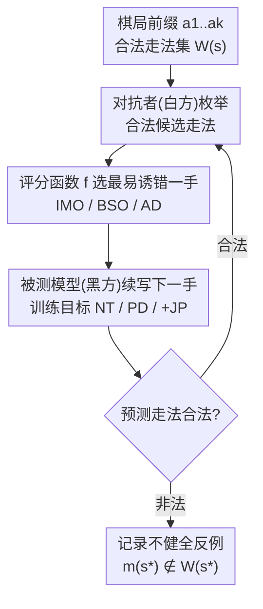

# Verification of the Implicit World Model in a Generative Model via Adversarial Sequences

**会议**: ICLR 2026  
**arXiv**: [2602.05903](https://arxiv.org/abs/2602.05903)  
**代码**: [https://github.com/szegedai/world-model-verification](https://github.com/szegedai/world-model-verification)  
**领域**: 世界模型/可解释AI  
**关键词**: 隐式世界模型, 对抗序列生成, 国际象棋, 健全性验证, 线性探针

## 一句话总结
提出对抗序列生成方法验证生成式序列模型的隐式世界模型健全性，在国际象棋领域通过多种对抗策略（IMO/BSO/AD）系统评估，发现所有模型均不健全，但训练方法和数据集选择对健全性有显著影响，且线性棋盘状态探针在大多数模型中无因果作用。

## 研究背景与动机

**领域现状**：生成式序列模型（如LLM）在训练中是否能学到底层"世界模型"是关键问题。先前工作（Li et al. 2023, Toshniwal et al. 2022）在Othello和国际象棋上训练模型，通过线性探针声称模型学到了世界状态。

**现有痛点**：(1) 简单指标如next-token准确率可能具有误导性——完全错误的模型也可能有高准确率；(2) Vafa et al.提出的序列级分析需要定义生成语言的概率阈值，引入ad hoc参数；(3) 线性探针解码的状态是否对预测有因果作用尚不清楚。

**核心矛盾**：从样本序列训练能学到健全（sound）的世界模型在理论上是可能的，但实际验证困难。简单测试不够，需要系统性的压力测试方法。

**本文目标**：如何有效验证生成模型的隐式世界模型是否健全？棋盘状态探针是否对预测有因果影响？

**切入角度**：对抗者生成合法序列迫使生成模型预测非法续述，提供健全性的存在性反证。

**核心 idea**：让对抗者下合法棋，迫使被测试的序列模型走出非法棋步，从而量化和分析隐式世界模型的失败模式。

## 方法详解

### 整体框架

把国际象棋的合法走法集合看作一门形式语言，验证一个生成式序列模型是否"健全"（任何合法局面下都只输出合法走法），关键就是构造一个对抗者专门去逼它犯规。整个验证是一个对弈回环：对抗者执白、被测模型执黑，对抗者每一步都从当前局面的合法走法 $W(a_1..a_k)$ 里挑出最容易诱导黑方出错的那一手——$a_{k+1}^{*} = \arg\max_{a_{k+1} \in W(a_1..a_k)} f(M, a_1..a_k\,a_{k+1})$，其中评分函数 $f$ 衡量这一手的"诱错潜力"；走完后让被测模型 $M$ 续写下一手并检查其合法性。一旦模型在某个合法局面 $s^{*}$ 上预测出非法走法 $m(s^{*}) \notin W(s^{*})$，就拿到一个"世界模型不健全"的存在性反例，否则续局再走。框架的两条改造轴线分别落在回环的两端：评分函数 $f$ 这一端有 IMO / BSO / AD 三种攻击策略，被测模型 $M$ 那一端有 NT / PD / +JP 三种训练目标，二者交叉就能把"攻击强不强"和"模型学得好不好"解耦开来归因。

### 关键设计

**1. Illegal Move Oracle（IMO）：直接把模型往它最想犯规的局面上引**

最锋利的攻击就是让对抗者直接最大化模型走出非法步的可能性。评分函数取 $f_{\text{IMO}}(M, a_1..a_k a_{k+1}) = \max_{a_{k+2} \notin W} M(a_{k+2}|a_1..a_k a_{k+1})$，即对每一个候选合法走法 $a_{k+1}$，向前看一步、看模型在那之后给"某个非法续述"分配的最高概率有多大，对抗者就挑这个值最大的合法手走。这等于显式地搜索"模型最薄弱、最容易输出违规动作"的局面，因此 IMO 的攻击成功率是对模型不健全程度最紧的下界——实验里它几乎总是最强的对抗者，且常常大幅领先其余策略。

**2. Board State Oracle（BSO）：用搅乱棋盘状态来反推线性探针是否真有因果作用**

先前工作声称模型内部的线性探针能解码出棋盘状态，并据此宣称模型"学到了世界状态"，但这个状态到底有没有参与 next-token 决策并不清楚。BSO 就是为检验这点而设计：它令 $f_{\text{BSO}}(M, s) = \mathcal{L}_B(M, s)$，挑选最大化棋盘状态探针预测误差 $\mathcal{L}_B$ 的走法。背后是一个可证伪的假设——如果探针解码的状态真的对预测有因果作用，那么把状态搅乱就应当顺带诱发非法走法。于是 BSO 与 IMO 的成功率差距本身就成了探针因果性的度量：实验中 BSO 远弱于 IMO（有时甚至弱于最温和的基线），说明"扰乱状态"和"诱发犯规"基本脱节，线性探针提取的状态在多数模型里对预测并无因果作用。

**3. Adversarial Detours（AD）：把对局拽进训练时罕见的分布外稀疏区**

这一策略沿用 Vafa et al. (2024) 的思路，取 $f_{\text{AD}}(M, a_1..a_k a_{k+1}) = -M(a_{k+1}|a_1..a_k)$，即专门挑模型自己认为条件概率最低的合法走法。一步步这样走，会把对局推向模型训练时极少见的 OOD 区域，那里模型缺乏可靠的状态表示、更容易露馅。它和 IMO 的赌注不同：IMO 盯着"非法输出概率"直接找弱点，AD 则赌"陌生局面"本身就是弱点，因此对训练数据覆盖不均匀的模型（如策略性对局数据）尤其有效。

**4. NT / PD / +JP 训练目标：从被攻击的模型一侧改造学习信号**

除了攻击策略，本文还在被测模型 $M$ 这一端换不同的训练目标，看更"贴近世界模型"的监督能否换来健全性。基线是标准的只预测下一个 token（NT）；概率分布目标（PD）改为让模型拟合当前局面下全部合法走法的均匀分布，逼它显式表征"哪些走法合法"而非只押注一手；联合探针目标（+JP）则在 next-token 头之外再加一个棋盘状态预测头，用双头损失同时监督序列续写和状态解码（探针损失约为 next-token 损失的五分之一，不额外加权），试图把转移规则直接灌进表示。四者交叉成 NT / PD / NT+JP / PD+JP，让框架能区分模型犯规到底是"攻击太强"还是"训练信号不到位"——而实验发现加联合探针对健全性几乎没有帮助。

### 损失函数 / 训练策略

实现层面统一采用 GPT-2 架构（约 86M 参数，12 层、768 维、12 注意力头），在 6 个数据集上训练：随机走子序列（500K / 2M / 10M 三种规模）以及三类策略性对局（Millionbase / Stockfish / Lichess）。把 6 个数据集与 4 种训练目标交叉，共得到 24 个模型，对它们分别施加 IMO / BSO / AD 三种攻击，从而把"数据质量""训练目标""攻击策略"三个变量解耦开来逐一归因。

## 实验关键数据

### 攻击成功率（随机数据集）

| 攻击策略 | Random-500K NT | Random-10M NT | Random-10M PD |
|----------|----------------|---------------|---------------|
| RM（随机基线） | 0.954 | 0.673 | 0.874 |
| SMM（友好基线） | 0.419 | 0.172 | 0.900 |
| **IMO** | **0.996** | **0.972** | **0.992** |
| BSO | 0.886 | 0.541 | 0.811 |
| AD | 0.946 | 0.516 | 0.902 |

### 关键发现

1. **所有模型均不健全**：IMO攻击几乎100%成功率（最高1.000），即使最好的模型（Random-10M + NT）也有97.2%的攻击成功率

2. **数据集选择影响巨大**：
    - 随机数据集 >> 策略数据集（Millionbase/Stockfish/Lichess）
    - 更多随机训练数据显著提升健全性（500K→10M，RM成功率从95.4%降至67.3%）

3. **PD训练目标双刃剑**：
    - PD的SMM攻击成功率极高（0.900+），说明在非对抗场景下PD反而更易出错
    - 但PD学习分布的能力使其在某些对抗场景中表现不同

4. **BSO vs IMO揭示探针因果性缺失**：
    - BSO攻击成功率显著低于IMO（如Random-10M NT: 0.541 vs 0.972）
    - 说明破坏棋盘状态探针预测并不等同于导致非法走法
    - 结论：线性探针提取的棋盘状态在大多数模型中对next-token预测无因果作用

5. **随机vs策略数据集的差异**：策略数据集训练的模型更容易受AD攻击（OOD区域大），而随机数据集提供更均匀的状态空间覆盖

## 亮点与洞察
- **对抗验证比统计测试更有效**：避免了定义概率阈值的ad hoc选择，直接提供健全性反例
- **探针因果性的重要否定结果**：挑战了"线性探针解码的世界状态→预测使用该状态"的假设
- **数据质量启示**：随机棋局（而非高质量棋局）更有利于学习规则，因为策略数据中合法但策略差的走法被低估
- **方法通用性**：框架可推广到任何世界模型可定义为形式语言的领域

## 局限与展望
- 仅在86M参数的GPT-2上测试，更大模型可能有不同表现
- 国际象棋虽然复杂但规则确定，自然语言的世界模型更模糊
- 对抗搜索是贪心的，理论上可能错过更有效的攻击序列
- 可以探索将此方法应用于代码生成等有形式规则的领域

## 相关工作与启发
- **vs Vafa et al.**：他们需要定义概率阈值来确定生成语言，本方法避免此问题
- **vs Li et al. (OthelloGPT)**：他们声称探针有因果作用，本文在国际象棋上的发现与之矛盾
- **vs Karvonen 2024**：声称国际象棋模型有一致的世界模型，本文的对抗测试表明其实不然

## 评分
- 新颖性: ⭐⭐⭐⭐ 对抗验证框架新颖，探针因果性的否定结果有价值
- 实验充分度: ⭐⭐⭐⭐⭐ 24个模型、5种攻击、6个数据集的大规模系统评估
- 写作质量: ⭐⭐⭐⭐⭐ 形式化定义清晰，实验设计严谨
- 价值: ⭐⭐⭐⭐ 对AI安全和可解释性有重要启示

<!-- RELATED:START -->

## 相关论文

- [\[ICLR 2026\] GGBall: Graph Generative Model on Poincaré Ball](ggball_graph_generative_model_on_poincaré_ball.md)
- [\[CVPR 2025\] Training Data Provenance Verification: Did Your Model Use Synthetic Data from My Generative Model for Training?](../../CVPR2025/image_generation/training_data_provenance_verification_did_your_model_use_synthetic_data_from_my_.md)
- [\[NeurIPS 2025\] Denoising Weak Lensing Mass Maps with Diffusion Model and Generative Adversarial Network](../../NeurIPS2025/image_generation/denoising_weak_lensing_mass_maps_with_diffusion_model_and_generative_adversarial.md)
- [\[ICLR 2026\] Latent Diffusion Model without Variational Autoencoder](latent_diffusion_model_without_variational_autoencoder.md)
- [\[ICLR 2026\] Evolutionary Caching to Accelerate Your Off-the-Shelf Diffusion Model](evolutionary_caching_to_accelerate_your_off-the-shelf_diffusion_model.md)

<!-- RELATED:END -->
