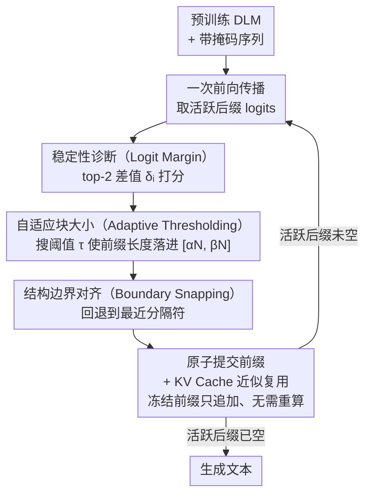

# Beyond Scattered Acceptance: Fast and Coherent Inference for DLMs via Longest Stable Prefixes

**会议**: ICLR 2026  
**arXiv**: [2603.05454](https://arxiv.org/abs/2603.05454)  
**代码**: 无  
**领域**: 图像复原  
**关键词**: 扩散语言模型, 推理加速, KV cache, 前缀提交, logit margin  

## 一句话总结
LSP 调度器通过在每个去噪步骤中原子性地提交最长连续稳定前缀（而非分散接受离散 token），将 DLM 推理加速 3.4 倍，同时保持或略微提升输出质量。

## 研究背景与动机
**领域现状**：扩散语言模型（DLM）如 LLaDA、Dream 提供了并行文本生成能力，但实际推理速度远未达到理论并行度

**现有痛点**：
   - **分散接受（Scattered Acceptance）**是主流策略：按局部置信度独立提交 token，导致序列中"冻结"和"活跃"token 交替分布
   - **算法层面**：冻结-活跃边界不稳定，模型需反复局部修复，减缓全局收敛
   - **系统层面**：KV cache 被碎片化为不连续的小段，破坏内存局部性，注意力计算在长碎片活跃序列上开销大

**核心矛盾**：为并行设计的模型，因提交策略的顺序性本质而受限——分散提交将并行优势消耗在碎片修复上

**本文目标**：设计新的提交拓扑（commitment topology），最大化 KV cache 复用，加速活跃序列收缩

**切入角度**：DLM 有一个经验性质——正确答案往往在中间步骤就出现，可以利用这种"提前收敛"进行前缀提交

**核心 idea**：用整体前缀吸收替代分散接受，每步提交最长连续稳定前缀，让冻结前缀单调增长、活跃后缀几何衰减

## 方法详解

### 整体框架
这篇论文要解决的是扩散语言模型（DLM）"理论并行、实际很慢"的落差：主流的分散接受策略让序列里冻结 token 和活跃 token 交错分布，既拖慢全局收敛，又把 KV cache 切成不连续的碎片。LSP 换了一个思路——不再东一个西一个地接受高置信 token，而是每步只从左往右提交一段最长的连续稳定前缀，让冻结前缀单调增长、活跃后缀几何收缩。

它是一个无需训练、模型无关的推理调度器，套在预训练 DLM 外面即可。每个去噪迭代走三步：先用一次前向传播为活跃后缀的每个位置算出稳定性分数，再自适应地定一个阈值挑出目标前缀长度，最后把前缀边界对齐到自然语言的结构分隔符上原子性地提交。这三步分别对应下面的稳定性诊断、自适应块大小和边界对齐，而 KV cache 复用则贯穿始终把前缀拓扑的好处兑现成实际加速。整个迭代不断重复，直到活跃后缀被几何收缩到空。

### 关键设计

**1. 稳定性诊断（Logit Margin）：用最便宜的信号判断哪些 token 不会再翻**

要决定前缀能伸到哪，先得知道每个位置的预测稳不稳。LSP 不用 entropy 这类需要遍历整个词表的指标，而是直接取 top-2 logit 的差值 $\delta_i = z_{(1)}(i) - z_{(2)}(i)$ 作为稳定性分数。margin 大说明模型在第一名和第二名候选之间拉开了明显差距，对该位置高置信、后续步骤里几乎不会反悔；margin 小则说明还在摇摆。这个信号只需一次前向传播就能拿到，计算代价几乎可忽略，比 entropy 更直接地刻画了"会不会翻转"这件事。

**2. 自适应块大小（Adaptive Thresholding）：让活跃序列每步按几何速率收缩**

光有稳定性分数还不够——固定一个阈值，要么太保守每步只提交一两个 token（慢），要么太激进把不稳的也提交进去（伤质量）。LSP 改成动态搜阈值：每步找一个 $\tau_k$，使得满足 $\delta_i \geq \tau_k$ 的候选前缀长度 $L'(\tau_k)$ 落进 $[\alpha N_k, \beta N_k]$ 这个区间（$N_k$ 是当前活跃长度，论文取 $\alpha=0.25, \beta=0.50$）。由于前缀长度随阈值单调，借助前缀最小值可以在 $O(N_k)$ 时间内高效完成这个搜索。这样每步都吃掉活跃序列 25%–50% 的长度，活跃后缀按 $(1-\alpha)^k$ 几何衰减，总计算量从分散接受的 $O(N^2 T)$ 降到近似 $O(N^2)$。$\alpha$ 是下限防止收缩太慢，$\beta$ 是上限防止一口吃太多把不稳 token 也提交了。

**3. 结构边界对齐（Boundary Snapping）：别在词中间一刀切断**

自适应阈值给出的候选长度 $L'$ 往往落在一个词或一句话的中间，硬截断会给后续生成留下一个不自然的上下文。LSP 因此把前缀边界回退到最近的自然分隔符（标点、换行、代码符号等，记为集合 $\mathcal{D}$）：在一个回看窗口 $W$ 内，取不超过 $L'$ 的最后一个落在分隔符上的位置，同时用 $L_{\min}$ 保证至少提交一段、避免停滞，即
$$L = \max\{L_{\min},\ \max\{j \leq L' : \hat{y}_j \in \mathcal{D} \ \wedge\ L' - j \leq W\}\}.$$
对齐到结构边界后，提交出去的总是一个完整的词或子句，连贯性明显更好——消融里去掉 snapping 后，创意写作和多语言任务的连贯性下降最明显。

**4. KV Cache 近似复用：把前缀拓扑的连续性兑换成实打实的加速**

前面三步保证了冻结前缀只增不减、且边界整齐，这正好让 KV cache 可以被复用：LSP 把已提交前缀的 KV 状态当作固定上下文，不再重算。严格来说双向 DLM 的前缀 KV 理论上还依赖活跃后缀，但近期研究观察到相邻去噪步骤的 KV 激活高度相似，复用引入的误差可忽略。这一步和 LSP 的前缀拓扑天然契合——前缀连续增长就等于 KV cache 连续追加，全程没有碎片化；而分散接受由于冻结位置散落各处，KV cache 被切成不连续的小段，既破坏内存局部性、又让注意力在长碎片序列上白白多算。

### 一个完整示例
设一段活跃后缀有 $N_0 = 100$ 个 token。第一步算完 logit margin，自适应阈值把候选长度卡进 $[25, 50]$，比如挑到 $L' = 42$；但第 42 个 token 正好在某个单词中间，boundary snapping 在回看窗口内退到第 38 个 token（那里是个句号），于是原子性提交前 38 个 token，活跃后缀缩到 62。第二步在这 62 个上重复，提交约 28 个，缩到 34；再下一步缩到约 19……活跃长度按 $(1-\alpha)^k$ 几何收缩，几步之内就压到底，而每提交一段前缀，KV cache 就追加一段、无需重算。对比分散接受——同样这 100 个位置可能这步接受第 3、7、12、40 个，冻结点散落各处，后续还要反复回去修补边界，KV cache 也被切得七零八落。

### 损失函数 / 训练策略
- **无需训练**：LSP 直接工作在预训练 DLM 上，不改模型参数
- 核心超参：$\alpha, \beta$（目标前缀比例范围），$L_{\min}$（最小提交长度），$W$（回看窗口）

## 实验关键数据

### 主实验 — 推理加速（LLaDA-8B & Dream-7B）

| 基准 | LSP 加速比 | 质量变化 |
|------|-----------|---------|
| 数学推理 | 最高 **3.4×** | 持平或略升 |
| 代码生成 | ~2.5× | 持平 |
| 多语言 (CJK) | ~2.0× | 持平 |
| 创意写作 | ~2.0× | 略升 |

### 消融实验

| LSP 组件 | 去除后影响 |
|---------|----------|
| 自适应阈值 → 固定阈值 | 加速比下降，在某些任务上质量也下降 |
| 边界 snapping → 直接截断 | 连贯性下降（特别是在创意写作和多语言） |
| 前缀拓扑 → 分散接受 | 加速比大幅下降，KV cache 碎片化 |
| 最小提交保证 → 无保证 | 在高不确定性情况下可能停滞 |

### 关键发现
- **前缀拓扑是关键**：vs 分散接受，前缀提交减少了 token 翻转率和去噪器调用次数
- **活跃序列几何衰减**：符合理论预测，总计算量近似 $O(N^2)$，远优于分散接受的 $O(N^2 T)$
- **双向 lookahead 被保留**：vs Block AR（无未来上下文），LSP 允许模型在提交前利用活跃后缀作为 lookahead buffer

## 亮点与洞察
- **提交拓扑的思维转变**：从"哪些 token 足够好就提交哪些"到"从左到右保持连续性地提交"——简单但有效的范式转换
- **系统优化与算法优化的统一**：前缀拓扑同时解决了 KV cache 碎片化（系统层）和边界不稳定（算法层）两个问题
- **几何衰减的优雅分析**：每步提交 $\alpha$ 到 $\beta$ 比例使得活跃长度按 $(1-\alpha)^k$ 衰减，这个分析直接给出了总工作量的上界

## 局限与展望
- 前缀策略有天然限制：如果序列开头不稳定但中间很稳定，LSP 无法利用中间的稳定性
- 结构分隔符 $\mathcal{D}$ 需要手动定义，不同语言/任务可能需要不同的分隔符集
- 近似 KV cache 复用的误差分析不够严格
- 仅在 LLaDA-8B 和 Dream-7B 上验证，对更大规模模型的效果未知

## 相关工作与启发
- **vs Prophet (Li et al., 2025b)**：也是 early-commit 范式但只用 top-2 confidence gap，LSP 增加了自适应阈值和边界 snapping
- **vs Block AR**：Block AR 没有双向 lookahead，LSP 保留了 DLM 的核心优势
- **vs MidTruth**：MidTruth 利用 early convergence 做步间集成以提升质量，LSP 利用它做 early commit 以提升速度——互补方向

## 评分
- 新颖性: ⭐⭐⭐⭐ 前缀吸收的提交拓扑是清晰的新范式，但核心技术（logit margin、自适应阈值）较常规
- 实验充分度: ⭐⭐⭐⭐ 多任务（数学/代码/多语言/写作）+ 消融，但缺少与更多 DLM 加速方法的对比
- 写作质量: ⭐⭐⭐⭐⭐ 问题阐述清晰，系统-算法双重分析很有说服力
- 价值: ⭐⭐⭐⭐⭐ DLM 推理加速 3.4 倍且质量不降——对 DLM 实际部署有直接价值

<!-- RELATED:START -->

## 相关论文

- [\[ICLR 2026\] Skip to the Good Part: Representation Structure & Inference-Time Layer Skipping in Diffusion vs. Autoregressive LLMs](skip_to_the_good_part_representation_structure_inference-time_layer_skipping_in_.md)
- [\[ICML 2026\] DyLLM: Efficient Diffusion LLM Inference via Saliency-based Token Selection and Partial Attention](../../ICML2026/image_restoration/dyllm_efficient_diffusion_llm_inference_via_saliency-based_token_selection_and_p.md)
- [\[ICLR 2026\] Breaking Scale Anchoring: Frequency Representation Learning for Accurate High-Resolution Inference from Low-Resolution Training](breaking_scale_anchoring_frequency_representation_learning_for_accurate_high-res.md)
- [\[CVPR 2025\] Detail-Preserving Latent Diffusion for Stable Shadow Removal](../../CVPR2025/image_restoration/detail-preserving_latent_diffusion_for_stable_shadow_removal.md)
- [\[CVPR 2026\] Beyond the Ground Truth: Enhanced Supervision for Image Restoration](../../CVPR2026/image_restoration/beyond_the_ground_truth_enhanced_supervision_for_image_restoration.md)

<!-- RELATED:END -->
