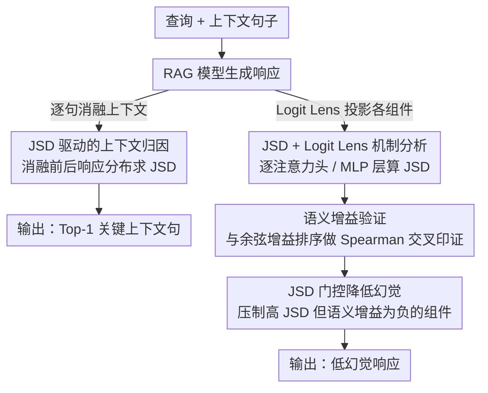

# Attributing Response to Context: A Jensen-Shannon Divergence Driven Mechanistic Study of Context Attribution in Retrieval-Augmented Generation

**会议**: ICLR 2026  
**arXiv**: [2505.16415](https://arxiv.org/abs/2505.16415)  
**代码**: [https://github.com/ruizheliUOA/ARC_JSD](https://github.com/ruizheliUOA/ARC_JSD)  
**领域**: RAG / 可解释性 / 机制分析  
**关键词**: 上下文归因, Jensen-Shannon散度, RAG, 机制可解释性, 注意力头, MLP层, 幻觉缓解  

## 一句话总结
提出ARC-JSD方法，通过计算完整上下文与逐句消融上下文下的响应分布的Jensen-Shannon散度，在无需微调、梯度计算或代理模型的情况下实现高效精准的RAG上下文归因，并结合Logit Lens进行机制分析，定位负责上下文归因的注意力头和MLP层，通过门控操作降低约39%的幻觉率。

## 研究背景与动机

**领域现状**：RAG通过结合外部上下文提升LLM生成准确性，但如何可靠地将生成内容归因到具体上下文片段（context attribution）仍是公开挑战。

**现有方法的痛点**：
   - 人工标注成本高昂（Zeng et al., 2021; Slobodkin et al., 2024）
   - 梯度方法（MIRAGE）需要反向传播，计算量大
   - ContextCite需数百次前向推理来训练线性代理模型
   - DPO微调方法（SelfCite）需要额外训练

**核心矛盾**：现有方法在归因准确率和计算效率之间难以兼顾——要么准确但昂贵，要么快速但不够精确。

**切入角度**：利用JSD的对称性、有界性（$[0, \log 2]$）、尺度无关等数学性质，直接衡量消融单个上下文句子后响应分布的变化，跳过代理模型训练。

**核心idea**：如果移除某个上下文句子后模型输出分布变化最大（JSD最高），则该句子对生成响应最关键。

## 方法详解

### 整体框架
ARC-JSD要解决的是「生成的某句话到底来自哪条上下文」这个归因问题，而且要在不训练任何辅助模型的前提下做到又快又准。它的做法可以拆成两层：先在模型整体层面，逐句把上下文挖掉、看响应分布变化最大的那句，定位出关键上下文（归因）；再把同样的「挖掉看变化」思路下沉到模型内部，逐个注意力头、逐个MLP层去算，找出真正负责这次归因的组件（机制分析）。两层共用一个核心度量——Jensen-Shannon散度（JSD）：先用它在输出层面挑出关键句，再用它配合 Logit Lens 在内部层面定位关键组件，接着用一条独立的语义增益证据交叉印证，最后把这把尺子顺势变成一个抑制幻觉的门控开关。

### 关键设计

**1. JSD 驱动的上下文归因：用消融句子前后的分布差直接量化贡献**

针对的痛点很直接——现有方法要么准但贵（ContextCite 要数百次前向训代理模型、MIRAGE 要反向传播），要么快但糊。ARC-JSD 绕过代理模型，对上下文里每个句子 $c_i$ 做一次「移除它再生成」，把移除后的响应分布与完整上下文下的响应分布逐 token 算 JSD 并累加：

$$\text{JSD}(c_i) = \sum_{j=1}^{|\mathcal{R}|} \text{JSD}\big(\mathcal{P}_{\text{LM}}(r_j|\mathcal{C},\mathcal{Q}) \,\|\, \mathcal{P}_{\text{LM}}(r_j|\mathcal{C}_{\text{ABLATE}}(c_i),\mathcal{Q})\big)$$

分数最高的句子就是最关键的上下文：$c_{\text{Top-1}} = \arg\max_{c_i} \text{JSD}(c_i)$。逐响应 token 累加是有讲究的——它既能放大实体名这类局部敏感 token 的变化，又不会被高熵 token 的噪声主导，从而比单点比较更稳。

这套「纯前向消融」也是效率优势的来源：ARC-JSD 的计算量约为 $2PT|\mathcal{C}|^2$（$P$ 是参数量、$T$ 是每句 token 数、$|\mathcal{C}|$ 是句子数），只跟句子数平方相关；相比之下 ContextCite 固定采样数百次（如 256 次）训代理模型，FLOPs 约 $2PT\times 256^2$，只要上下文句子数 $|\mathcal{C}|<256$ 就比它便宜，而 MIRAGE 还要算梯度（$4PT|\mathcal{C}|(2|\mathcal{C}|+1)$）。实测相对线性代理 / 梯度类基线可达约 3 倍加速。

**2. JSD + Logit Lens 机制分析：把同一把尺子伸进模型内部**

光知道哪句话重要还不够，作者想知道模型是用哪些组件完成这次归因的。于是把 JSD 从整体输出下沉到每个注意力头 $(\ell,h)$ 和每个 MLP 层 $\ell$：借助 Logit Lens 把这些组件的中间表示直接投影到词汇空间，得到各自的「伪输出分布」，再分别在全上下文与消融上下文两种条件下算 JSD。这样每个头/每层都拿到一个归因贡献分。结果显示，负责上下文归因的注意力头主要集中在**高层**，MLP 层则在中高层贡献最大，这与 Wu et al. (2025a) 在 NIAH 设置下的观察部分吻合。

**3. 语义增益验证：换一个互相独立的视角交叉印证**

只靠 JSD 一个指标定位组件，难免让人怀疑是不是度量自带的偏好。作者引入一条完全不同的证据链——语义增益，即衡量某个注意力/MLP 组件是否让表示更靠近正确答案（余弦相似度提升）。为此定义每层的 $\Delta^{\ell,\text{Attn}}$ 和 $\Delta^{\ell,\text{MLP}}$，再用 Spearman $\rho$ 检验「JSD 排序」与「语义增益排序」是否一致。Table 3 显示两者在各数据集、各模型上都显著正相关，说明 JSD 挑出来的组件确实在语义上做了正贡献，两条独立证据互相印证。

**4. JSD 门控降低幻觉：把诊断分数直接接成一个开关**

既然 JSD 能定位「负责生成」的组件，反过来也能用来压制「帮倒忙」的组件。作者把 JSD 分数当作置信度门控，对那些 JSD 高、但语义增益 $G$ 为负（即高度活跃却把答案带偏）的注意力头和 MLP 层做缩减：

$$\text{Mask} = 0.7 + 0.3 \times \text{sigmoid}(G)$$

当 $G<0$ 时 sigmoid 趋近 0，mask 退到约 0.7，把该组件的贡献压下来；$G$ 越正则越接近不干预。这套门控无需重新训练，在 Qwen2-7B-IT + HotpotQA 上把幻觉率从 13.4% 降到 8.2%（↓约 39%），而 Factual F1 几乎不动（76.1→75.9）。

## 实验关键数据

### 数据集与模型
- 三个QA数据集：TyDi QA（440, 单跳）、HotpotQA（1000, 多跳）、MuSiQue（1000, 多跳，平均93.6句上下文）
- 四个指令微调模型：Qwen2-1.5B/7B-IT, Gemma2-2B/9B-IT
- 额外泛化验证：LLaMA-3.1-8B-IT, Qwen3-Next-80B-A3B-IT

### 主实验（上下文归因Top-1准确率）
- ARC-JSD在MuSiQue上的compute-accuracy trade-off上一致优于所有基线（Fig.2a）
- 平均归因准确率提升约**10.7%**
- ContextCite-32虽然在 $|\mathcal{C}|>32$ 时计算更快，但归因准确率始终低于ARC-JSD
- ARC-JSD在Pareto optimal front上，兼顾准确率和效率

### 指标对比消融（§8, Fig.6）

| 指标 | 相对表现 |
|------|---------|
| JSD | **最优**，对称、有界、尺度无关 |
| KL | 当消融分布有零概率时爆炸，无法跨层比较 |
| TV | 有界但过粗糙，无法区分高熵尾部vs关键token的概率转移 |
| Wasserstein | 需要定义152K词汇上的距离度量，$O(V^3)$复杂度 |
| MMD | 需要核函数和token距离定义 |

### 机制分析验证
- Table 3：JSD排序与语义增益排序的Spearman $\rho$ 在所有数据集和模型上显著（$p<0.05$ 或 $p<0.01$）
- Table 5：消融JSD top-10注意力头的JSD变化（2.23±0.12）显著大于随机10个（1.53±0.76）

### 幻觉降低（Table 4）

| 设置 | 幻觉率 | Factual F1 |
|------|--------|-----------|
| Base RAG | 13.4% | 76.1 |
| Gate Top-5 Attn & MLP | **8.2%** | 75.9 |
| Gate Random 5 | 12.7% | 69.4 |

### 泛化性
- LLaMA-3.1-8B-IT和Qwen3-Next-80B-A3B-IT（MoE）上同样保持compute-accuracy优势（Fig.7）

## 亮点与洞察
- **简洁高效**：整个方法概念清晰——逐句消融+JSD比较，无需训练任何辅助模型，可即插即用到任意RAG系统
- **JSD的选择有理论基础**：对称性避免了方向问题，有界性使跨层比较合理，与KL/TV/Wasserstein的对比消融很convincing
- **机制分析闭环**：JSD定位→语义增益验证→因果消融验证→门控应用，形成了完整的验证与应用链条
- **可视化的MLP层语义演变**：通过Logit Lens展示Qwen2如何在高层从中文token逐步转换为英文（"一只→A", "翅膀→wings"），与语言锚定现象一致
- **实用价值**：门控机制无需重训练即可降低39%幻觉率

## 局限与展望
- **计算复杂度与上下文长度平方成正比**：$O(|\mathcal{C}|^2)$，当上下文超长（如数百句）时仍然昂贵，论文未讨论如何规模化
- **仅评估Top-1归因**：现有QA数据集只有句子级gold label，更细粒度（短语级/子句级）的归因能力未被充分验证
- **门控实验规模有限**：仅在200个HotpotQA样本上验证幻觉降低效果，缺乏大规模和多数据集的验证
- **缺少与SelfCite等微调方法的直接准确率对比**——仅在compute-accuracy tradeoff图上比较
- **"all JSD scores small"的阈值选择**（0.02 bits）缺乏系统分析

## 相关工作与比较
- **vs ContextCite (Cohen-Wang et al., 2024)**：ContextCite需数百次前向推理训练代理模型，线性假设可能错失非线性关系；ARC-JSD直接用JSD量化真实分布变化
- **vs MIRAGE (Qi et al., 2024)**：梯度方法计算昂贵且token-level聚合到sentence-level有信息损失
- **vs Wu et al. (2025a)**：其NIAH设置中模型做复制粘贴，本文评估的是更实际的改写+整合场景
- **vs Sun et al. (2025)**：Sun聚焦定位导致幻觉的源头，本文定位导致正确生成的源头，两者互补

## 评分
- 新颖性: ⭐⭐⭐⭐ JSD用于RAG上下文归因是新颖且合理的，理论与实践结合好
- 实验充分度: ⭐⭐⭐⭐ 3数据集4+2模型，多角度消融和验证，结果一致性好
- 写作质量: ⭐⭐⭐⭐ 框架图清晰，公式推导连贯，case study直观
- 价值: ⭐⭐⭐⭐ 即插即用的归因方法+机制分析洞见，对RAG透明化有实际推动

<!-- RELATED:START -->

## 相关论文

- [\[ACL 2026\] Context Attribution with Multi-Armed Bandit Optimization](../../ACL2026/information_retrieval/context_attribution_with_multi-armed_bandit_optimization.md)
- [\[ICLR 2026\] Embedding-Based Context-Aware Reranker](embedding-based_context-aware_reranker.md)
- [\[ICML 2026\] Less Is More: Elevating RAG via Performance-Driven Context Compression](../../ICML2026/information_retrieval/less_is_more_elevating_rag_via_performance-driven_context_compression.md)
- [\[ACL 2025\] A Reality Check on Context Utilisation for Retrieval-Augmented Generation](../../ACL2025/information_retrieval/a_reality_check_on_context_utilisation_for_retrieval-augmented_generation.md)
- [\[ICLR 2026\] Beyond RAG vs. Long-Context: Learning Distraction-Aware Retrieval for Efficient Knowledge Grounding](beyond_rag_vs_long-context_learning_distraction-aware_retrieval_for_efficient_kn.md)

<!-- RELATED:END -->
