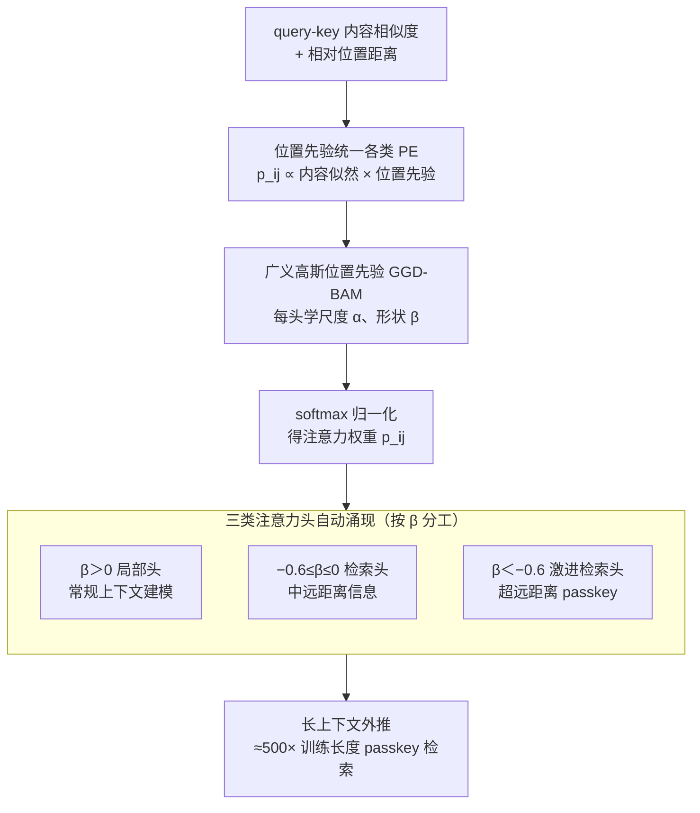

# Bayesian Attention Mechanism: A Probabilistic Framework for Positional Encoding and Context Length Extrapolation

**会议**: ICLR 2026  
**arXiv**: [2505.22842](https://arxiv.org/abs/2505.22842)  
**代码**: [https://github.com/ArthurSBianchessi/BAM](https://github.com/ArthurSBianchessi/BAM)  
**领域**: 信息检索  
**关键词**: 贝叶斯注意力, 位置编码, 上下文外推, 广义高斯分布, 长上下文  

## 一句话总结
将位置编码重新表述为贝叶斯注意力机制中的先验分布，统一了 NoPE（均匀先验）和 ALiBi（拉普拉斯先验），并提出广义高斯先验（GGD-BAM），仅增加 384 个参数即可在 500 倍训练长度上实现完美的 passkey 检索。

## 研究背景与动机

**领域现状**：Transformer 缺乏位置信息，需要位置编码。现有方法（Sinusoidal、RoPE、ALiBi、NoPE）在上下文长度外推上各有表现，但缺乏统一的理论理解。

**现有痛点**：(a) PE 方法多为经验驱动，理论基础薄弱；(b) 评估过度依赖困惑度，困惑度低不代表真正的外推能力——模型可通过滑动窗口注意力获得低困惑度但无法检索远距离信息。

**核心矛盾**：不同 PE 方法在不同场景下表现差异大，但缺乏统一框架来分析它们的行为差异和适用范围。

**本文目标**：(a) 提供 PE 的理论统一框架；(b) 基于理论推导新的 PE 策略；(c) 实现真正的长上下文外推（检索而非仅困惑度）。

**切入角度**：将注意力权重 $p_{ij}$ 解释为内容和位置的联合概率分布，PE 自然成为位置先验。

**核心 idea**：PE 是注意力的位置先验——通过选择广义高斯分布并允许 $\beta < 0$ 的"反局部"注意力头，实现超长上下文检索。

## 方法详解

### 整体框架
BAM 想解决的问题是：现有位置编码（PE）各自从不同直觉出发、彼此割裂，既无法横向比较，又难以推出真正能外推到训练长度数百倍之外的新方法。它的切入点是把每个注意力权重看成内容与位置两个事件的**联合概率**，写成 $p_{ij} \propto p(f_{\text{cont}}(\mathbf{q}_i, \mathbf{k}_j)) \cdot p(g_{\text{pos}}(i,j))$：前一项 $p(f_{\text{cont}})$ 是常规的 query-key 相似度（内容似然），后一项 $p(g_{\text{pos}}(i,j))$ 是只依赖相对位置 $i,j$ 的**位置先验**。于是位置编码不再是加到 logits 上的某个手工偏置，而是注意力分布里一个可以自由选形状的先验。整条 pipeline 就是：内容相似度与位置先验相乘、经 softmax 归一化得到 $p_{ij}$；而位置先验的形状由广义高斯分布的两个可学习参数决定，其中形状参数 $\beta$ 的正负让不同注意力头自发分化成局部头与检索头，最终撑起长上下文外推。

### 关键设计

**1. 位置先验统一各类 PE：把经验方法装进一个概率视角**

现有位置编码彼此割裂、难以横向比较，根因是它们各自从不同直觉出发。BAM 指出，一旦把 $p(g_{\text{pos}})$ 看成位置先验，常见方法都只是先验形状的特例：NoPE 对应均匀先验（所有位置等权重，相当于不施加位置偏好），ALiBi 对应拉普拉斯先验（随距离线性衰减，等价于广义高斯分布形状参数取 $\beta = 1$）。这样一来，不同 PE 的外推差异就转化为同一个先验家族里形状参数的差异，可以在连续的参数空间里比较和搜索，而不再是若干互不相通的经验技巧。

**2. 广义高斯位置先验（GGD-BAM）：让每个头自己学衰减形状**

统一框架的价值在于能顺势推出新方法。BAM 把位置先验换成广义高斯分布，对应到注意力偏置上是 $b_{ij} = -\left|\frac{j-i-\mu}{\alpha}\right|^{\beta}$，给每个注意力头配两个可学习参数：尺度 $\theta_\alpha$ 控制衰减快慢、形状 $\theta_\beta$ 控制衰减曲线的胖瘦（均值 $\mu$ 固定为 0，因为位置偏好以当前 token 为中心）。形状参数 $\beta$ 直接决定头的行为：$\beta > 1$ 时比 ALiBi 更聚焦局部、衰减更陡；$\beta \in (0,1)$ 时是长尾衰减，比 ALiBi 能照顾到更远的位置。论文进一步**放宽 $\beta > 0$ 的约束**（此时已不是严格意义上的概率分布），允许 $\beta < 0$ 让先验反转成**反局部注意力**——它压低近距离 token 的权重、把注意力推向远处。理论上可证明 $\beta < 0$ 时近距离权重 $\lim_{|i-j|\to 0} p_{ij}=0$、而远距离权重 $\lim_{|i-j|\to\infty} p_{ij}\neq 0$，等于一个专门盯远端信息的"检索头"。负 $\beta$ 之所以是外推的关键，是因为长距离 passkey 检索本质上需要某些头敢于忽略眼前的局部上下文、稳定地锁住远端信息，而传统单调衰减的 PE 永远做不到这一点。

**3. 三类注意力头自动涌现：检索能力来自分工而非全局调参**

训练并不显式指定哪个头负责局部、哪个负责检索，但收敛后这些头的形状参数会自动分成三组：$\beta > 0$ 的局部头负责常规上下文建模，$-0.6 \leq \beta \leq 0$ 的检索头负责中远距离信息，$\beta < -0.6$ 的激进检索头则专攻超远距离。这种分工在 120M 到更大的模型规模上都稳定出现，说明它不是某次训练的偶然，而是该先验家族下的自然结果——正是它让少数检索头承担外推、同时不破坏多数局部头的语言建模能力。论文实测中，外推距离最远的模型恰恰就是那些含有负 $\beta$ 头的模型。

> ⚠️ 三组 $\beta$ 的具体阈值（$-0.6$）以原文为准。

### 损失函数 / 训练策略
训练只用标准语言建模交叉熵损失，不引入额外的检索监督，三类头完全靠语言建模目标自发分化。模型在 512 token 上下文上训练（FineWeb 10B 数据、Mistral-7B 分词器），每个头每层引入 $\theta_\alpha,\theta_\beta,\theta_\mu$ 三个参数但实验中固定 $\theta_\mu=0$，在 120M 模型上仅新增 384 个位置参数。此外可叠加与 PE 正交的 Scalable Softmax（SSMax）——它按序列长度动态缩放 logits、缓解长序列下的"注意力衰减"，与 BAM 的先验形状改进互补，二者合用得到最优配置 BAM-SSMax。正是这点近乎可忽略的开销，换来了约 500 倍训练长度上的外推。

## 实验关键数据

### 主实验（Passkey Retrieval 准确率）

| 方法 | 训练长度 | 1K | 4K | 8K | 16K | 32K | 256K |
|------|---------|-----|-----|-----|------|------|-------|
| Sinusoidal | 512 | ~随机 | 0% | 0% | 0% | 0% | 0% |
| RoPE | 512 | ~随机 | 0% | 0% | 0% | 0% | 0% |
| ALiBi | 512 | 高 | 下降 | 低 | ~0% | ~0% | 0% |
| **BAM-GGD** | **512** | **100%** | **100%** | **100%** | **100%** | **100%** | **>80%** |

### 消融实验

| 配置 | Passkey 最大外推 | 困惑度 | 说明 |
|------|----------------|--------|------|
| BAM + SSMax | 500× 训练长度 | 与 ALiBi 相当 | 最优配置 |
| BAM ($\beta > 0$ only) | 有限 | 略优 | 无检索头 |
| BAM ($\beta < 0$ allowed) | 500× | 略高 | 有检索头但局部能力弱 |
| ALiBi baseline | ~10× | 好 | 无法外推太远 |

### 关键发现
- $\beta \leq 0$ 的注意力头是长距离检索的关键——它们反直觉地"忽略"近距离 token，专注于远处信息
- BAM 在 RULER 基准的所有任务上超越所有基线 PE 方法
- 困惑度与 ALiBi 相当，但检索能力远超——证明困惑度不是外推的充分评估指标
- 模型规模从 120M 到更大时，三种 $\beta$ 聚类模式稳定出现

## 亮点与洞察
- **PE 作为先验的理论框架**非常优雅，用一个统一视角解释了 NoPE、ALiBi 等方法，并自然推导出新方法。可迁移到任何需要位置敏感性的注意力设计。
- **负 $\beta$ 检索头**是最惊人的发现：允许部分头"反局部"关注远距离信息，类似于 Mixture of Experts 中不同头承担不同功能。
- 仅 384 个额外参数就实现了 500× 外推，极度参数高效。

## 局限与展望
- 仅在 120M 参数模型上验证，未在大规模（7B+）模型上测试
- Passkey 检索是合成任务，未验证真实长文档理解场景
- $\beta < 0$ 的头增加困惑度，需要在局部头和检索头之间平衡

## 相关工作与启发
- **vs ALiBi**: ALiBi 是 BAM 在 $\beta = 1$ 的特例，BAM 通过学习 $\beta$ 自动发现更优的位置偏好
- **vs RoPE**: RoPE 是乘法 PE，不在 BAM 的加法框架内覆盖，但实验中 RoPE 外推能力远不如 BAM
- **vs NoPE**: NoPE 是均匀先验的特例，外推能力有限

## 评分
- 新颖性: ⭐⭐⭐⭐⭐ 理论框架优雅，负 $\beta$ 检索头是真正的新发现
- 实验充分度: ⭐⭐⭐⭐ Passkey + RULER + 困惑度 + 可视化，但模型规模有限
- 写作质量: ⭐⭐⭐⭐⭐ 理论推导清晰，可视化直观
- 价值: ⭐⭐⭐⭐⭐ 对 PE 理论理解有根本性贡献

<!-- RELATED:START -->

## 相关论文

- [\[ICML 2026\] LazyAttention: Efficient Retrieval-Augmented Generation with Deferred Positional Encoding](../../ICML2026/information_retrieval/lazyattention_efficient_retrieval-augmented_generation_with_deferred_positional_.md)
- [\[ICLR 2026\] Beyond RAG vs. Long-Context: Learning Distraction-Aware Retrieval for Efficient Knowledge Grounding](beyond_rag_vs_long-context_learning_distraction-aware_retrieval_for_efficient_kn.md)
- [\[ICLR 2026\] Embedding-Based Context-Aware Reranker](embedding-based_context-aware_reranker.md)
- [\[ICLR 2026\] Attributing Response to Context: A Jensen-Shannon Divergence Driven Mechanistic Study of Context Attribution in Retrieval-Augmented Generation](attributing_response_to_context_a_jensen-shannon_divergence_driven_mechanistic_s.md)
- [\[ICLR 2026\] RAEE: A Robust Retrieval-Augmented Early Exit Framework for Efficient Inference](raee_a_robust_retrieval-augmented_early_exit_framework_for_efficient_inference.md)

<!-- RELATED:END -->
