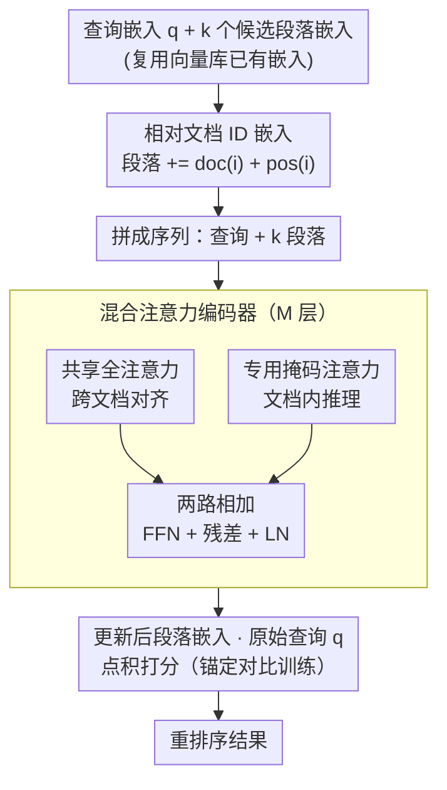

# Embedding-Based Context-Aware Reranker

**会议**: ICLR 2026  
**arXiv**: [2510.13329](https://arxiv.org/abs/2510.13329)  
**代码**: [GitHub](https://github.com/BorealisAI/EBCAR)  
**领域**: 信息检索 / RAG 效率  
**关键词**: 重排序, RAG, 嵌入检索, 跨段落推理, 混合注意力

## 一句话总结

提出 EBCAR，一个基于嵌入空间的轻量级重排序框架，通过文档 ID 嵌入和段落位置编码引入结构信息，结合共享全注意力 + 专用掩码注意力的混合机制实现跨段落推理，在 ConTEB 基准上以 126M 参数达到最优平均 nDCG@10，推理速度比 LLM 重排器快 150 倍以上。

## 研究背景与动机

RAG 系统通常将长文档切分为短段落进行检索和重排序。这种段落级索引虽然提高了检索粒度，但引入了需要跨段落推理的挑战：指代消解（"他"指谁？）、实体消歧（多个段落提到生日但哪个是目标人物的？）、分散证据聚合等。

现有重排序方法的两大痛点：(1) **效率低**：无论是 pointwise（monoBERT）、pairwise（duoT5）还是 listwise（RankGPT、ICR），都需要将原始文本送入大型 PLM 做推理，计算开销巨大；(2) **缺乏跨段落上下文建模**：大多数方法独立评分每个段落，不考虑来自同一文档的段落之间的关系。

核心 idea：直接在嵌入空间操作——利用向量数据库已有的段落嵌入，通过一个轻量 Transformer 编码器引入文档结构信息和跨段落交互，实现高效且上下文感知的重排序。

## 方法详解

### 整体框架

EBCAR 完全在嵌入空间内完成重排序，要解决的是 RAG 把长文档切成短段落后、重排器既看不到跨段落上下文又因为反复跑大模型而太慢的问题。整体只有一条前向链路：给定查询嵌入 $q$ 和同一编码器预计算的 $k$ 个候选段落嵌入 $\{p_1, ..., p_k\}$，先用**文档 ID 嵌入**和位置编码把文档结构注入每个段落，再把查询与段落拼成一个序列送进 $M$ 层带**混合注意力**的 Transformer 编码器做跨段落交互，最后以更新后的段落嵌入和**原始查询嵌入**的点积作为重排序分数。整个过程不触碰原始文本，因此能直接复用向量数据库里已有的嵌入。

### 关键设计

**1. 相对文档 ID 嵌入：让模型知道哪些段落同源**

RAG 把长文档切成短段落后，原本同属一篇文档的段落在检索结果里彼此孤立，模型无从判断"这段的'他'指的是上一段的人物"。EBCAR 给每个段落叠加一个文档 ID 嵌入 $\text{doc}(i)$ 和段落位置编码 $\text{pos}(i)$，即 $\tilde{p}_i = p_i + \text{doc}(i) + \text{pos}(i)$，把"同源关系"和"段落次序"显式编码进表示里。关键在于文档 ID 是**局部相对**的——它不是全局唯一标识，而是针对每个查询的候选集（$k$=20 个段落）动态分配，嵌入表最大只有 $k \times d$，训练和推理之间固定复用同一张表。这样既能让模型识别同文档段落、支持文档内推理，又保证了实用性：上线新文档时无需扩充 ID 空间或重新训练，即插即用。

**2. 共享全注意力 + 专用掩码注意力的混合机制：兼顾跨文档对齐与文档内推理**

单一注意力无法同时照顾两种需求——既要在不同文档之间对齐分散的证据，又要在同一文档内部做指代消解和实体消歧。EBCAR 在每个 Transformer 层里并联两个互补模块：共享全注意力是标准多头注意力，允许查询和所有段落彼此关注，负责捕捉全局的跨文档关系；专用掩码注意力则通过掩码把每个段落的可见范围限制在同文档段落和查询上——掩码矩阵 $(i,j)$ 位置当段落 $j$ 与段落 $i$ 同源或 $j$ 为查询时取 0，否则取 $-\infty$，从而强制模型只在文档内部聚合上下文。两个模块的输出相加，再过 FFN、残差连接和 LayerNorm。这种分工让全注意力做"广度"、掩码注意力做"深度"，正好对应跨文档证据聚合与文档内指代消解两类难题。

**3. 锚定原始查询嵌入的对比训练：避免查询语义漂移**

训练采用 InfoNCE 对比损失，但有一个反直觉的细节——相似度计算的锚点用的是**原始未修改的查询嵌入** $q$，而不是经过编码器更新后的查询表示。损失形式为 $\mathcal{L}_{\text{contrast}} = -\log \frac{\exp(\text{sim}(q, \hat{p}^+))}{\exp(\text{sim}(q, \hat{p}^+)) + \sum_j \exp(\text{sim}(q, \hat{p}_j^-))}$，正例段落 $\hat{p}^+$ 被拉近、负例 $\hat{p}_j^-$ 被推远，而 $q$ 保持稳定。如果让查询表示也随段落上下文一起更新，它会被候选段落"带偏"产生漂移，导致评分基准不再可靠；固定锚点则确保所有段落表示都对齐到同一个稳定的查询语义参照系。具体训练时，用 Contriever 检索 top-20 段落作为候选集，若正例不在其中就替换掉第 20 个段落保证监督信号存在，并随机打乱段落顺序以消除排名偏差；优化器为 Adam，学习率 $1 \times 10^{-3}$，最多训练 20 个 epoch 并以 patience=5 早停。

## 实验关键数据

### 主实验

**表1: ConTEB 基准上的 nDCG@10（8个数据集）**

| 方法 | 参数量 | MLDR | SQuAD | Football | Geog | Insurance | 平均 | 吞吐量 |
|------|--------|------|-------|----------|------|-----------|------|--------|
| Contriever | - | 60.23 | 54.63 | 5.95 | 46.39 | 2.75 | 35.45 | 29.67 |
| RankZephyr | 7B | 82.34 | 69.06 | 11.63 | 72.91 | 3.51 | 50.03 | 0.17 |
| ICR (Llama) | 8B | 83.93 | 69.09 | 10.91 | 73.10 | 4.16 | 50.35 | 0.19 |
| **EBCAR** | **126M** | 75.26 | **71.62** | **80.19** | **81.30** | **40.74** | **64.92** | **29.33** |

**关键对比**：EBCAR 在 Football（80.19 vs 11.63）、Geography（81.30 vs 73.10）、Insurance（40.74 vs 4.76）上大幅领先，这些都是需要跨段落推理的数据集。吞吐量 29.33 qps vs ICR 的 0.19 qps，快 154 倍。

### 消融实验

**表2: 组件消融（nDCG@10）**

| 方法 | SQuAD | Football | Geog | Insurance |
|------|-------|----------|------|-----------|
| w/o Pos | 60.87 | 42.88 | 62.44 | 34.16 |
| w/o Hybrid | 47.52 | 41.93 | 60.34 | 36.00 |
| w/o Both | 40.13 | 5.28 | 43.70 | 2.88 |
| **EBCAR** | **71.62** | **80.19** | **81.30** | **40.74** |

- 移除位置信息对 Insurance 影响最大（40.74→34.16），因为该数据集高度依赖文档结构
- 移除混合注意力对 SQuAD 影响最大（71.62→47.52），因为需要跨段落语义匹配
- 两者都移除后性能灾难性下降，验证了组件的互补性

### 关键发现

- 在嵌入空间操作可以兼顾效率和跨段落推理，无需处理原始文本
- 文档 ID 嵌入的局部相对设计使模型具有泛化性（换检索器也有效——E5 上验证）
- Pointwise 模型（monoBERT/monoT5）在 ConTEB 上比 Contriever 还差，因为它们无法利用跨段落信号
- EBCAR 推理效率（29.33 qps）甚至接近 Contriever 检索器本身（29.67 qps）

## 亮点与洞察

- "在嵌入空间做重排序"的思路在重排序领域是新颖的，绕开了 PLM 的昂贵推理
- 混合注意力设计精巧：全注意力做全局关联，掩码注意力做文档内推理，分工明确
- 文档 ID 的局部相对设计解决了实用性问题——无需全局唯一 ID，新文档即插即用
- 在跨段落推理任务上的优势极为显著（Football 80 vs 12），凸显了建模文档结构的重要性

## 局限与展望

- 在不需要跨段落推理的情况下（如 MLDR），性能略逊于 LLM 重排器（75 vs 84）
- 嵌入空间的信息瓶颈：段落被压缩为固定大小嵌入，丢失了细粒度文本信息
- 仅在 ConTEB 上验证，BEIR/TREC DL 等传统基准的评估缺失
- 候选段落数固定为 20，更大候选集的扩展性待验证

## 相关工作与启发

- **ICR** (Chen et al., 2025): 基于 LLM 注意力的推理时重排序，效果好但极慢
- **RankGPT** (Sun et al., 2023): Prompt LLM 直接生成排序列表，依赖 API
- **ConTEB** (Conti et al., 2025): 评估检索/重排序的跨段落推理能力的基准
- 启发：在嵌入空间注入结构先验的思路可推广到其他检索增强任务

## 评分

- 新颖性: ⭐⭐⭐⭐ 嵌入空间重排序 + 混合注意力的组合新颖，但此前已处理段落交互概念
- 实验充分度: ⭐⭐⭐⭐ ConTEB 上消融充分，但缺少传统 IR 基准和更大规模测试
- 写作质量: ⭐⭐⭐⭐ 动机清晰，方法图示直观，但部分内容稍显冗长
- 价值: ⭐⭐⭐⭐⭐ 效率和效果兼顾，对需要跨段落推理的 RAG 部署场景有很高实用价值

<!-- RELATED:START -->

## 相关论文

- [\[ICLR 2026\] Beyond RAG vs. Long-Context: Learning Distraction-Aware Retrieval for Efficient Knowledge Grounding](beyond_rag_vs_long-context_learning_distraction-aware_retrieval_for_efficient_kn.md)
- [\[ACL 2025\] EXIT: Context-Aware Extractive Compression for Enhancing Retrieval-Augmented Generation](../../ACL2025/information_retrieval/exit_context-aware_extractive_compression_for_enhancing_retrieval-augmented_gene.md)
- [\[ICLR 2026\] Attributing Response to Context: A Jensen-Shannon Divergence Driven Mechanistic Study of Context Attribution in Retrieval-Augmented Generation](attributing_response_to_context_a_jensen-shannon_divergence_driven_mechanistic_s.md)
- [\[ACL 2026\] Verbal-R3: Verbal Reranker as the Missing Bridge between Retrieval and Reasoning](../../ACL2026/information_retrieval/verbal-r3_verbal_reranker_as_the_missing_bridge_between_retrieval_and_reasoning.md)
- [\[ICLR 2026\] HUME: Measuring the Human-Model Performance Gap in Text Embedding Tasks](hume_measuring_the_human-model_performance_gap_in_text_embedding_tasks.md)

<!-- RELATED:END -->
