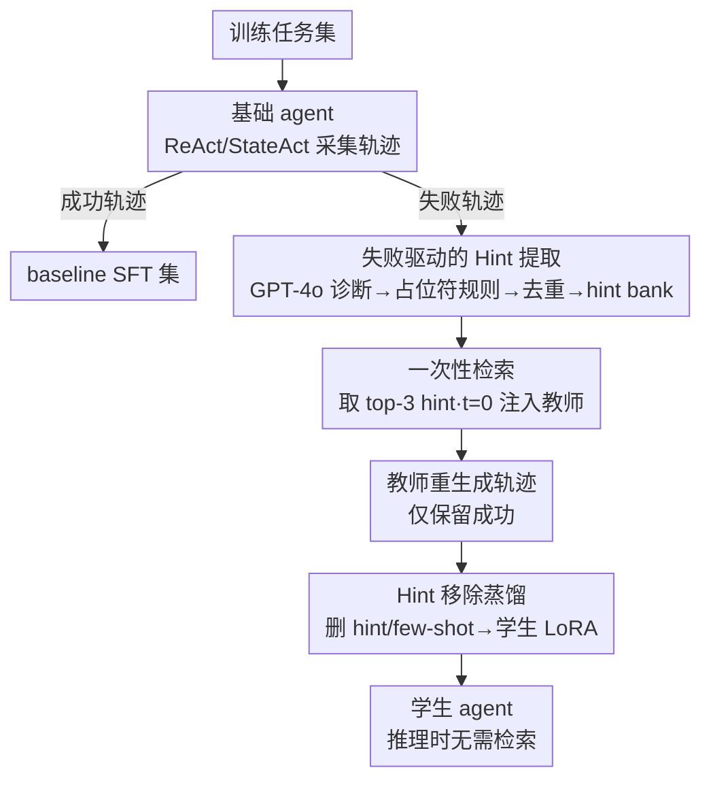

# Fine-tuning with RAG for Improving LLM Learning of New Skills

**会议**: ICLR 2026  
**arXiv**: [2510.01375](https://arxiv.org/abs/2510.01375)  
**代码**: [匿名仓库](https://anonymous.4open.science/r/anonymized-submission-iclr/README.md)  
**领域**: 信息检索  
**关键词**: RAG distillation, LLM agent, hint extraction, ALFWorld, WebShop

## 一句话总结

提出将 RAG 从推理时的永久依赖转化为训练时的教师信号：从 agent 失败中提取 hint、用 hint 增强的教师生成更优轨迹、然后移除 hint 蒸馏到学生模型，使学生内化检索增益而无需运行时 RAG，在 ALFWorld 达到 91% 成功率（基线 79%），WebShop 分数达 72（基线 61）。

## 研究背景与动机

LLM agent 在多步任务中经常以可预测的方式失败：执行前置条件未满足的动作、发出冗余指令、或错误处理环境约束。现有改进方法各有局限：

**结构化 prompting**（ReAct、StateAct）：提供推理脚手架但受限于参数化知识

**自我反思**（Reflexion）：需要多次尝试和真实反馈

**检索增强**（RAG）：注入外部知识但增加运行时开销和部署复杂度

**微调**：需要大量高质量数据，且可能过拟合

核心洞察：**RAG 不需要作为永久的运行时依赖存在**。它可以作为改进训练监督信号的来源，被内化到模型参数中。具体来说，如果我们能用 RAG 生成更好的演示轨迹，然后用这些轨迹训练学生模型（但不提供 hints），学生就能学会 RAG 带来的行为改进，同时在推理时不再需要检索。

## 方法详解

### 整体框架

方法把 RAG 当成训练期的"临时拐杖"而非推理期的永久依赖：先让基础 agent 跑出一批成功与失败轨迹，从失败里自动提炼可复用的 hint，用 hint 喂给教师生成更优的成功轨迹，最后在训练数据里把 hint 抹掉、只把"更优的行为"蒸馏进学生模型。整个流程是一条「采集轨迹 → 提取 hint → 教师带 hint 重生成 → 去 hint 蒸馏」的四阶段 pipeline，学生因此在推理时无需任何检索就拥有了 RAG 级别的表现。

### 关键设计

**1. 失败驱动的 Hint 提取：把 agent 自己的错误变成监督信号**

传统做法要么靠专家手写规则，要么靠真实奖励反复试错，都很贵。这里换了个思路：基础 agent（ReAct 或 StateAct）在训练集上跑完后，成功轨迹直接进 baseline SFT 集，失败轨迹则被打包成"任务指令 + 初始观察 + 完整动作序列 + 失败结果"的完整示例交给 GPT-4o 诊断。GPT-4o 针对每条失败输出 1-4 条祈使句式的修正规则，比如"确保在放置 {object} 之前先打开 {container}"或"使用系统化搜索模式避免遗漏 {object}"——刻意用 `{object}`、`{container}` 这类占位符替换具体实体，让规则能跨实例泛化，并按任务类别归档进 hint bank。生成出来的 hint 再用 Levenshtein 距离阈值 0.85 做模糊匹配去重，最终 ALFWorld 在 ReAct/StateAct 上各得到 760/650 条 hint，WebShop 得到 756/831 条。由于规则直接对准了真实犯过的错，它们携带的行为知识恰好是参数化知识里缺的那部分。

**2. 一次性检索：只在开局注入一次指导，贴合真实部署且压住 token 开销**

教师生成轨迹时，先根据指令和初始观察判定任务类别，再从对应类别的 hint bank 里取 top-$k$（$k=3$）条 hint，用量化的 Qwen-2.5 7B 做 LLM re-ranking 而非传统 embedding 检索，排序质量更高。关键在于这些 hint 只在 episode 开头 $t=0$ 一次性注入，而不是每一步都动态检索。这样既把检索的 token 成本钉死在开局，也更贴近真实场景下"任务开始时给一次指导、之后靠自己执行"的设定。教师带着 hint 跑完整个 episode，只有成功的轨迹才会被保留下来当作蒸馏素材。

**3. Hint 移除蒸馏：训练时有提示、推理时无提示，逼模型把规则内化成隐式技能**

蒸馏数据来自教师的成功轨迹，但构造训练样本时会从输入里**删掉 hint 字符串和 few-shot 示例**——few-shot 示例因为跨任务固定、不携带有效训练信号，留着只会让模型去拟合文本模式。学生只在量化到 4-bit 的 backbone 上训练一个 LoRA adapter，目标是全序列 next-token 交叉熵损失。由于看到的是"被 hint 改好过、但 hint 已经不在输入里"的轨迹，模型只能去学习导致这些更优动作的**行为**本身，而不是去记 hint 的文本，从而把显式规则真正内化为推理时无需检索就能调用的隐式知识。

### 损失函数 / 训练策略

训练目标为全序列 next-token 交叉熵，采用 QLoRA 风格：backbone 量化到 4-bit，LoRA adapter 以 bf16 精度训练，优化器用 8-bit AdamW 配 linear schedule，batch size 2 搭配 4 步梯度累积，单 epoch、10% warmup，单张 A100 80GB 即可完成。两个环境的超参按各自特性调整：ALFWorld 用 LR 2e-4、序列长度 1024、LoRA rank 64、$\alpha=128$、dropout 0.10、weight decay 0.01；WebShop 轨迹更短，改用更小的 LoRA rank 16、$\alpha=32$、更强的 dropout 0.20 和 weight decay 0.05，并额外加 token-level label smoothing（$\varepsilon=0.1$）缓解短轨迹上的过度自信。

## 实验关键数据

### 主实验

Qwen-2.5 14B Instruct，ReAct 和 StateAct 的平均结果：

| 方法 | ALFWorld 成功率 | WebShop 成功率 | WebShop 分数 |
|------|----------------|---------------|-------------|
| Base | 79.85% | 38.5% | 60.87 |
| Base+RAG | 82.09% | 43.5% | 67.08 |
| SFT | 85.45% | 43.0% | 72.09 |
| **Distilled (本文)** | **91.04%** | **43.5%** | **72.40** |

Qwen-2.5 7B Instruct：

| 方法 | ALFWorld 成功率 | WebShop 成功率 | WebShop 分数 |
|------|----------------|---------------|-------------|
| Base | 26.49% | 13.0% | 28.12 |
| Base+RAG | 71.27% | 8.5% | 18.46 |
| SFT | 62.69% | 22.0% | 54.38 |
| **Distilled (本文)** | **73.88%** | **22.5%** | **61.04** |

### 效率分析（14B）

| 环境 | 方法 | Token/episode | Steps | 性能 |
|------|------|-------------|-------|------|
| ALFWorld | Base | 50.13k | 18.94 | 79.85% |
| | RAG | 53.97k | 18.69 | 82.09% |
| | Distilled | **44.82k** | **16.68** | **91.04%** |
| WebShop | Base | 7.99k | 7.16 | 60.87 |
| | RAG | 11.05k | 6.34 | 67.08 |
| | Distilled | **4.27k** | **4.98** | **72.40** |

蒸馏模型在 ALFWorld 省 10% token，WebShop 省 47% token，同时性能最优。

### 消融实验

Retrieval depth k 消融（ALFWorld 14B）：

| k | 成功率 | Steps | Tokens |
|---|--------|-------|--------|
| 1 | 83.96% | 19.11 | 52.02k |
| 3 (本文) | 82.09% | 18.69 | 53.97k |
| 6 | 84.33% | 18.13 | 50.95k |
| 9 | 76.87% | 19.27 | 57.26k |

k=3 在两个环境中均衡最优；k=9 时 hint 过多反而有害。

### 关键发现

- 蒸馏模型完全占据了精度-效率 Pareto 前沿
- 7B 蒸馏后的 WebShop 分数（61.04）接近 14B Base（60.87），实现了跨规模压缩
- 小模型（7B）在 RAG 模式下 WebShop 反而变差（hint 会误导小模型做出错误属性选择），但蒸馏可以稳定利用复杂指导
- SFT 和蒸馏的差距验证了 hint 增强轨迹确实包含了额外的行为知识

## 亮点与洞察

1. **"将运行时增强转化为训练时监督"的范式**: 这个思路对 RAG 之外的很多增强方法（如 CoT、self-critique）都适用
2. **失败驱动的自动化**: 整个 pipeline 不需要人工专家知识，从自身失败中提炼可复用的指导规则
3. **Hint 移除是关键**: 训练时有 hint 而推理时无 hint，迫使模型将显式规则内化为隐式知识
4. **效率分析很全面**: 不只看准确率，还系统分析了 token 开销、步数等效率指标
5. **跨 agent 架构验证**: 在 ReAct 和 StateAct 两种不同架构上都有效，说明方法具有通用性

## 局限与展望

1. **Hint 生成依赖 GPT-4o**: 在大规模环境中 API 调用成本不可忽视
2. **仅 t=0 一次性检索**: 无法适应 episode 中途出现的意外情况
3. **单种子评估**: 所有结果为点估计，缺乏多种子的方差分析
4. **跨域迁移未验证**: 仅在 ALFWorld 和 WebShop 上测试，新环境的泛化性未知
5. **Hint 质量上界**: 如果 GPT-4o 生成的 hint 本身质量有限（如对复杂失败的诊断不准确），性能天花板会受限

## 相关工作与启发

- **ReAct / StateAct**: 基础 agent prompting 框架，本文在此基础上增加了 hint 增强和蒸馏
- **Reflexion**: 同为从失败中学习，但需要多次尝试；本文只需单次训练
- **ExpeL / AutoGuide**: 从经验中提取知识但作为永久运行时依赖，本文将其蒸馏到参数中
- **FireAct**: 类似的微调思路但依赖 GPT-4 专家轨迹；本文用自身失败+自提取 hint 生成教师数据
- **Prompt Distillation**: 压缩复杂 prompt 到模型权重中，本文扩展到 agent 场景的动态指导蒸馏

## 评分

- 新颖性: ⭐⭐⭐⭐
- 实验充分度: ⭐⭐⭐⭐⭐
- 写作质量: ⭐⭐⭐⭐
- 价值: ⭐⭐⭐⭐

<!-- RELATED:START -->

## 相关论文

- [\[ICML 2025\] FedRAG: A Framework for Fine-Tuning Retrieval-Augmented Generation Systems](../../ICML2025/information_retrieval/fedrag_a_framework_for_fine-tuning_retrieval-augmented_generation_systems.md)
- [\[ACL 2026\] GIFT: Guided Fine-Tuning and Transfer for Enhancing Instruction-Tuned Language Models](../../ACL2026/information_retrieval/gift_guided_fine-tuning_and_transfer_for_enhancing_instruction-tuned_language_mo.md)
- [\[ICLR 2026\] Beyond RAG vs. Long-Context: Learning Distraction-Aware Retrieval for Efficient Knowledge Grounding](beyond_rag_vs_long-context_learning_distraction-aware_retrieval_for_efficient_kn.md)
- [\[ACL 2026\] Bayesian Active Learning with Gaussian Processes Guided by LLM Relevance Scoring](../../ACL2026/information_retrieval/bayesian_active_learning_with_gaussian_processes_guided_by_llm_relevance_scoring.md)
- [\[ICLR 2026\] LightRetriever: A LLM-based Text Retrieval Architecture with Extremely Faster Query Inference](lightretriever_a_llm-based_text_retrieval_architecture_with_extremely_faster_que.md)

<!-- RELATED:END -->
