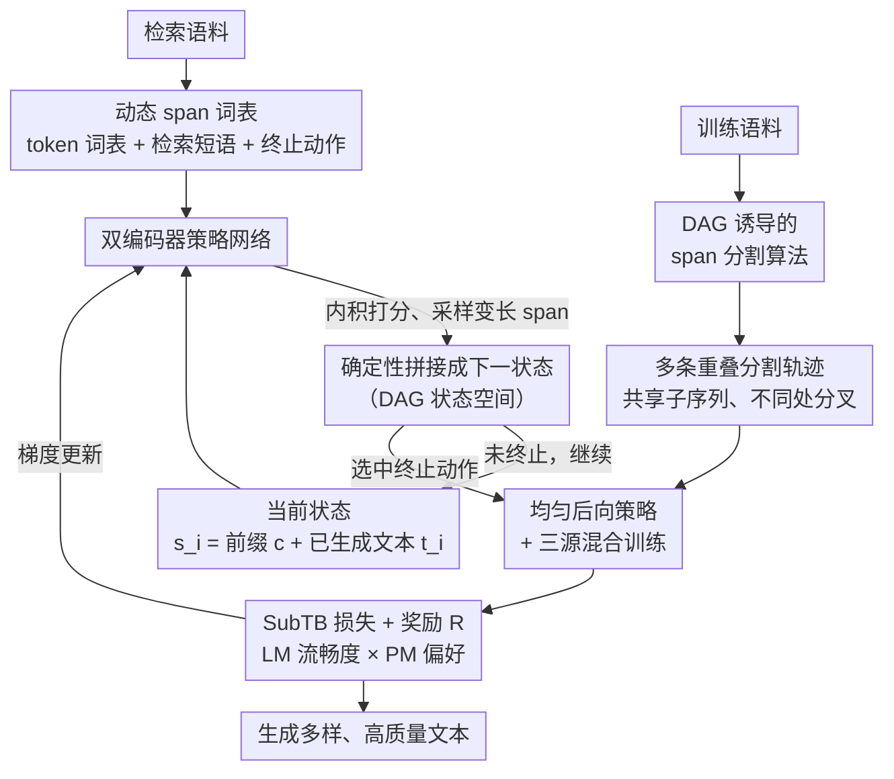

# Flow of Spans: Generalizing Language Models to Dynamic Span-Vocabulary via GFlowNets

**会议**: ICLR 2026  
**arXiv**: [2602.10583](https://arxiv.org/abs/2602.10583)  
**代码**: [GitHub](https://github.com/sappho-x/Flow-of-Spans)  
**领域**: 信息检索  
**关键词**: GFlowNets, 动态词表, span生成, DAG状态空间, 文本生成

## 一句话总结

提出 FoSS，首次将 GFlowNets 引入 span 级别语言模型，通过构建 DAG 结构的状态空间代替传统 token-by-token 的树形结构，实现更灵活多样的文本生成，MAUVE 分数最高提升 12.5%。

## 研究背景与动机

标准自回归语言模型逐 token 生成文本，使用固定有限词表。这种方式有两个本质局限：（1）固定词表限制了生成粒度；（2）token 级生成形成的是树状状态空间（每个状态只有唯一前驱），限制了模型探索替代生成路径的能力。

近年来有工作引入动态词表和变长生成单元（如 CoG、kNN-LM），允许模型采样检索到的 text span。但这些方法忽略了一个关键事实：同一个句子可以由不同长度的 span 组合而成（如 "ABCDEFGH" 可以分解为 "AB-CD-EFGH" 或 "AB-C-DE-FG-H"），本质上构成了有向无环图（DAG）结构，而非树结构。现有方法没有显式建模这一 DAG 空间，导致对组合路径的探索受限。

GFlowNets 是一种强大的生成模型，擅长在 DAG 结构的状态空间上高效探索和泛化。但此前将 GFlowNets 应用于语言模型的工作仍停留在 token 级别的树形空间，未能发挥 GFlowNets 的全部潜力。

## 方法详解

### 整体框架

FoSS 把文本生成重新定义为在一张有向无环图（DAG）上做 GFlowNets 采样：每个状态是前缀 $c$ 与已生成文本 $t_i$ 的拼接，每一步动作从一个动态 span 词表里挑一个变长片段（单词或多词短语）确定性地接到末尾，直到选中终止动作，再由奖励模型对终端文本打分。关键差别在于，span 级动作让同一个状态能被多条不同轨迹到达——比如状态 "ABCD" 既可经 "AB→ABCD" 也可经 "AB→ABC→ABCD" 抵达——状态空间因此从 token 级生成的树退化形态升级成真正的 DAG，GFlowNets 得以在多条等价组合路径上充分探索。

要让这套 DAG 采样真正训得起来，FoSS 补齐了三块拼图：用 **DAG 诱导的 span 分割算法**把训练文本切成多条重叠轨迹、给 DAG 灌入带分叉的监督信号；用 **双编码器策略网络**在每一步给动态词表里的候选 span 内积打分、决定状态往哪条边走；再用 **均匀后向策略 + 三源混合训练**把"一个状态有多条入边"这件事变成可学的目标，并在巨大的组合空间里稳定探索。三者最终配上 LM 流畅度与 PM 偏好的奖励，端到端用子轨迹平衡（SubTB）优化。

### 关键设计

**1. DAG 诱导的 span 分割算法：让一份训练文本展开成多条重叠轨迹**

DAG 探索能力要落地，前提是训练数据本身就带分叉。FoSS 在标准前向最大匹配的基础上加了一道受控的随机提前停止：扫描候选短语时，每个 span 以概率 $p_r$ 决定是否真的把它当作一个整体短语抽出，否则继续切短。给定一组阈值 $P = \{p_0{=}0, p_1, \dots, p_n\}$，同一篇文档就被切成多条长短不一的分割轨迹（如 "AB-CD-EFGH" 与 "AB-C-DE-FG-H"），它们共享公共子序列、却在不同位置分叉，于是自然诱导出 DAG 结构而非单一切法的树。这一步把"同一句子有多种 span 组合"这个被现有方法忽略的事实，显式写进了训练信号里。

**2. 双编码器策略网络：用内积匹配上下文与候选 span**

前向策略要在每一步给动态词表里的所有候选打分，FoSS 用两个编码器分工完成。前缀编码器是因果注意力的 Transformer（初始化自 GPT-2），把当前状态编码成上下文向量 $h_i$；span 编码器是双向 Transformer（初始化自 BERT），把候选短语编码成向量 $v_a$——对检索文档中位置 $s$ 到 $e$ 的短语，先用 MLP 变换起止位置嵌入再拼接得到完整短语表示。前向策略分布写成 $P_{\text{SLM}}(a \mid s_i; \theta) \propto \exp(h_i^\top v_a)$，即用上下文与候选的内积衡量匹配度。可选的候选来自三处拼成的动态词表：token 级固定词表 $V$、从外部语料检索来的长度 2–8 token 短语集合 $T$、以及终止动作。检索库一换，词表随之更新，这也是后文域适应只需替换检索库的根源。

**3. 均匀后向策略 + 三源混合训练：把 DAG 的多入边变成学习信号**

正因为 DAG 里一个状态有多条入边，后向策略不再像树那样退化成确定性的 $P_B{=}1$，而是对该状态在动态词表下的所有可能后缀赋予均匀概率——这正是模型能感知"多条路径通向同一文本"的地方。训练时一个 mini-batch 混合三种来源的轨迹：前向策略在线采样的轨迹、奖励优先 replay buffer 里的高奖励轨迹、以及训练集构造出的轨迹。第一个 epoch 完全用离线数据冷启动，之后按 0.2/0.8 的比例混合离线与在线轨迹，兼顾探索覆盖和高奖励区域的利用。

### 损失函数 / 训练策略

学习目标采用子轨迹平衡（SubTB）：对一条完整轨迹，损失在所有合法子轨迹对上求和，并用指示函数限定只在完整句子边界之间计算，从而把学习信号集中到有意义的句子过渡上、避免在半截 span 上空耗。奖励则由两个互补项的加权几何平均构成——语言模型项（LM）用给定前缀下序列的似然衡量流畅度，偏好模型项（PM）是用 Bradley-Terry 目标训练、并加 score-centering 正则化的判别器，负责区分人类文本与模型生成文本；权重 $\alpha$ 调节流畅度与偏好对齐之间的取舍。LM 与 PM 都基于 GPT-2 全参微调。后续消融显示去掉任一项 MAUVE 都会掉，印证了这两项确实在分别管"读起来顺"和"像人写"。

## 实验关键数据

### 主实验

**表1：开放域文本生成 MAUVE 分数**

| 方法 | In-Domain Greedy | In-Domain Nucleus | OOD Nucleus | Scaling Nucleus |
|------|:---:|:---:|:---:|:---:|
| Transformer w/ FT | 19.87 | 23.43 | 26.85 | 21.31 |
| kNN-LM | 19.92 | 22.50 | 24.75 | 23.39 |
| CoG | 26.01 | 26.14 | 28.14 | 26.97 |
| GFlowNets-FT | 26.58 | 29.61 | 28.62 | - |
| **FoSS** | **30.78** | **31.65** | **32.17** | **33.79** |

FoSS 全面领先，In-Domain Nucleus 下比 CoG 高 5.51%，比 GFlowNets-FT 高 2.04%。

**表2：GPT-4 成对评估（FoSS vs. baselines）**

| 对比方法 | FoSS更好 | 持平 | FoSS更差 |
|----------|:---:|:---:|:---:|
| Transformer | 53% | 19% | 28% |
| kNN-LM | 67% | 15% | 18% |
| CoG | 42% | 31% | 27% |
| GFlowNets-FT | 55% | 29% | 16% |

**表3：知识密集型任务准确率**

| 方法 | TruthfulQA | OpenBookQA | ARC-Challenge |
|------|:---:|:---:|:---:|
| Transformer w/ FT | 28.76 | 22.71 | 24.00 |
| CoG | 29.38 | 24.29 | 24.34 |
| **FoSS** | **30.45** | **26.20** | **24.63** |

### 消融实验

| 变体 | In-Domain MAUVE | Diversity | OOD MAUVE |
|------|:---:|:---:|:---:|
| FoSS w/o DAG（退化为树） | 29.61 | 65.72 | 28.62 |
| FoSS w/o PM | 28.25 | 89.91 | 30.49 |
| FoSS w/o LM | 29.09 | 92.77 | 29.79 |
| **FoSS（完整）** | **31.65** | 92.48 | **32.17** |

### 关键发现

1. **DAG 结构至关重要**：移除 span 使状态空间退化为树后，MAUVE 显著下降（31.65 到 29.61），Diversity 从 92.48 暴跌至 65.72
2. **LM 和 PM 奖励互补**：单独移除任一组件都导致 MAUVE 下降；PM-only 有最高 Diversity 但 MAUVE 明显下降
3. **优秀的扩展性**：在模型规模（GPT-2 base 到 XL）、训练数据量和检索库大小三个维度上保持稳定提升
4. **域适应能力**：仅更新检索库就能超越域内微调的 Transformer；0.47% 数据下就能超越完整训练的 CoG

## 亮点与洞察

- 首次将 span 级生成与 GFlowNets 结合，构建了真正的 DAG 状态空间
- 概率化 span 分割算法通过随机提前停止为同一文本产生多条重叠分割路径
- 推理效率与标准 Transformer 相当，因为 span 级生成减少了解码步数
- 在极少量训练数据（0.47%）下即可超越完整训练的基线方法

## 局限与展望

1. 实验主要基于 GPT-2 规模，尚不清楚在更大规模 LLM 上的表现
2. 依赖外部检索库，需要预编码源文本集合，增加部署复杂度
3. 训练涉及多个组件（策略网络、奖励模型、检索器），流程较为复杂
4. 仅在英文任务上评估，跨语言泛化能力未知

## 相关工作与启发

本文将 GFlowNets 的 DAG 探索能力与动态词表语言模型结合，是新颖的交叉方向。对于研究 LLM 生成多样性、检索增强生成的工作有参考价值。span 级生成的思路也可启发投机解码中的 draft 策略设计。

## 评分

- 新颖性: ⭐⭐⭐⭐⭐（首次在 span 级 LM 中构建 DAG + GFlowNets）
- 技术深度: ⭐⭐⭐⭐⭐（完整 MDP 形式化 + SubTB 训练 + 双组件奖励）
- 实验充分度: ⭐⭐⭐⭐（多维评估 + GPT-4 评判 + 消融 + 扩展性）
- 实用性: ⭐⭐⭐（依赖检索库，部署门槛较高）
- 写作质量: ⭐⭐⭐⭐（结构清晰，图示直观）

<!-- RELATED:START -->

## 相关论文

- [\[ICLR 2026\] TokMem: One-Token Procedural Memory for Large Language Models](tokmem_one-token_procedural_memory_for_large_language_models.md)
- [\[ICLR 2026\] Query-Level Uncertainty in Large Language Models](query-level_uncertainty_in_large_language_models.md)
- [\[ICLR 2026\] SynthWorlds: Controlled Parallel Worlds for Disentangling Reasoning and Knowledge in Language Models](synthworlds_controlled_parallel_worlds_for_disentangling_reasoning_and_knowledge.md)
- [\[ICLR 2026\] Hierarchical Concept-based Interpretable Models](hierarchical_concept-based_interpretable_models.md)
- [\[ECCV 2024\] Grounding Language Models for Visual Entity Recognition](../../ECCV2024/information_retrieval/grounding_language_models_for_visual_entity_recognition.md)

<!-- RELATED:END -->
