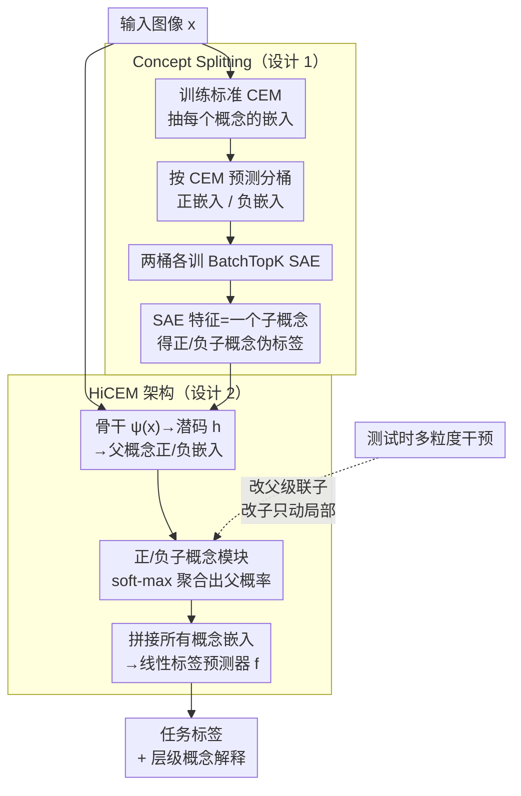

# Hierarchical Concept-based Interpretable Models

**会议**: ICLR 2026  
**arXiv**: [2602.23947](https://arxiv.org/abs/2602.23947)  
**代码**: 无  
**领域**: 可解释AI / 概念模型  
**关键词**: 概念嵌入模型, 层级概念, 概念分裂, 子概念发现, 概念干预

## 一句话总结
HiCEMs引入层级概念嵌入模型，通过Concept Splitting方法在预训练CEM的嵌入空间中自动发现细粒度子概念（无需额外标注），构建层级概念结构，使模型能在不同粒度层次进行测试时概念干预以提升任务性能。

## 研究背景与动机
现代深度神经网络因其潜在表征的不透明性而难以解释，阻碍了模型理解、调试和去偏。概念嵌入模型（CEM）通过将输入映射到人类可理解的概念表征来解决这个问题。然而，CEM存在两个根本性局限：(1) 无法表示概念间的关系——将所有概念视为扁平的、独立的，忽略了概念天然的层级结构（如"羽毛颜色"→"胸部红色"/"翅膀蓝色"）；(2) 需要不同粒度级别的概念标注来训练层级模型，标注成本极高。核心矛盾是：层级概念结构对深入理解和精准干预至关重要，但获取多层级标注数据不切实际。本文的核心idea是：通过Concept Splitting在已有CEM的嵌入空间中自动发现子概念，无需任何额外标注即可构建层级概念结构。

## 方法详解

### 整体框架
概念嵌入模型（CEM）把每个概念学成一个高维向量，但它把所有概念当作扁平、独立的，要训出"父概念→子概念"的层级模型就得另外标注多个粒度的概念，成本极高。本文的关键观察是：CEM 的嵌入空间里其实早已隐含了比标注更细的子概念结构（比如带"含蔬菜"标注训出来的嵌入，会自发编码出"含洋葱""含胡萝卜"这类没标过的子概念）。于是 HiCEMs 走两阶段：先训一个标准 CEM 拿到可靠的概念嵌入，再用 **Concept Splitting** 在这个嵌入空间里无监督地挖出子概念（不需要任何新标注），最后在挖出的层级上训一个 **HiCEM**——它的概念瓶颈层不再吐扁平向量，而是逐概念同时给出"父概念 + 正/负子概念"的层级化预测，标签层据此分类，并支持测试时在任意粒度做概念干预。为了在可控环境里验证这套层级机制，本文还合成了 **PseudoKitchens** 数据集作测试场。

### 关键设计

**1. Concept Splitting：用稀疏自编码器在嵌入空间里挖出没标过的子概念**

子概念发现能不靠额外标注，前提是概念表征里本就藏着比标注更细的信息，而这正是 CEM 相对 CBM 的差别——CBM 把每个概念压成一个 0/1 标量、丢光了细粒度语义，CEM 则把概念学成高维嵌入 $\hat{c}_i$，连续向量里保留了"翅膀是条纹还是纯色"这类标注里没有却视觉可分的差异。Concept Splitting 就在这个空间里动刀：先在标注训练集上跑训好的 CEM $M$，存下每个样本、每个待拆概念 $c_i$ 的嵌入 $\hat{c}_i$ 与预测概率 $\hat{p}_i$；再用 $M$ 自己的预测把 $c_i$ 的嵌入分成两桶——$\hat{p}_i>0.5$（概念在场）的正嵌入集 $E_i^{true}$ 与概念不在场的负嵌入集 $E_i^{false}$。关键一步是借鉴 SAE 能在神经网络表征里找出可解释特征的发现，在这两桶上**分别训一个 BatchTopK 稀疏自编码器**（保留批内 top 激活）：$E_i^{true}$ 上的 SAE 找出"$c_i$ 在场时才出现"的正子概念，$E_i^{false}$ 上的找出负子概念，每个 SAE 特征即一个被发现的子概念，按特征是否激活给样本打上子概念伪标签。整个过程没引入一条新标注，只是把 CEM 训练时已隐式学到、却从未被显式利用的子概念结构挖了出来；发现的子概念再用"强激活它的训练样本"（原型）让专家事后赋予语义名。

> ⚠️ 论文正文用 SAE（BatchTopK）做拆分；基于聚类找互斥子概念是附录 A 的替代方案，不是主方法。

**2. HiCEM 架构：把子概念接回预测，父概率由子概率聚合而来**

挖出层级后还得有个架构真正用上它，否则发现的子概念无处落地。HiCEM 沿用 CEM"每个概念学正、负两个嵌入"的设定：骨干 $\psi(x)$ 出潜码 $h$，父概念嵌入生成器据此产出中间嵌入 $\hat{c}_i^{+0}, \hat{c}_i^{-0}$，再分别送进**正、负子概念模块**。每个模块内部为该父概念的每个子概念学一个子嵌入 $\hat{c}_{kj}^{+}$，用共享打分函数 $s(\cdot)$ 算出各子概念概率 $\hat{p}_{kj}^{+}$，父概念的正嵌入 $\hat{c}_k^{+}$ 就是这些子嵌入按概率的加权混合。父概念是否在场不再单独预测，而是**从子概念概率聚合出来**：用一个可微"软最大"取最强的正子概念概率作 $\hat{p}_k^{+}$（实践中把概率从 $[0,1]$ 缩放到 $[-10,10]$ 再过 softmax，逼近真 max），最终 $\hat{p}_i = \tfrac{1}{2}(\hat{p}_i^{+} + (1-\hat{p}_i^{-}))$，概念嵌入 $\hat{c}_i = \hat{p}_i\hat{c}_i^{+} + (1-\hat{p}_i)\hat{c}_i^{-}$。这种"父概率由子概率推出"的设计天然保证了层级一致——父概念只有在某个正子概念在场时才可能在场。所有概念嵌入拼成瓶颈、过一个线性标签预测器 $f$ 出任务标签；预测同时给出父、子两级概念概率作解释。也正因为父子被显式连起来，测试时可在**任意粒度做干预**：改父概念会级联到子概念，改某个子概念只动局部，这是后面细粒度干预更高效的来源。

**3. PseudoKitchens 数据集：造一个层级天然可控的测试场**

真实数据里很难精确控制概念的层级组合，难以干净地检验模型是否真用上了子概念结构。本文用 3D 厨房渲染合成了 PseudoKitchens，里面的厨具与食品概念带天然层级，渲染时可逐项控制每个概念出现与否，从而为"层级概念是否被有效利用"提供一个可控实验场。

### 损失函数 / 训练策略
训练分两阶段：先把标准 CEM 训到收敛、跑 Concept Splitting 定下层级，再在该层级上训 HiCEM。HiCEM 的目标是**任务预测与概念预测交叉熵的加权和** $\mathcal{L} = \mathbb{E}_{(x,y,c)}\big[\mathcal{L}_{task}(y, f(g(x))) + \alpha\,\mathcal{L}_{CE}(c, \hat{p}(x))\big]$，超参 $\alpha$ 调节概念准确率与任务准确率的相对权重；其中 $\hat{p}(x)$ 已含父、子两级概率，层级一致性由上面"父概率从子概率聚合"的架构保证、无需额外正则项。为提升干预效果，训练时沿用 CEM 的 **RandInt** 策略：以概率 $p_{int}$ 随机对概念做独立干预。

## 实验关键数据

### 主实验

| 数据集 | 指标 | HiCEM | 标准CEM | CBM | 说明 |
|--------|------|------|----------|------|------|
| MNIST-ADD | Task Acc | ~高 | 基线 | 较低 | 数字加法任务 |
| SHAPES | Task Acc | ~高 | 基线 | 较低 | 形状属性识别 |
| CUB-200 | Task Acc | 竞争力 | 基线 | 较低 | 鸟类细粒度分类 |
| AwA2 | Task Acc | 竞争力 | 基线 | 较低 | 动物属性预测 |
| PseudoKitchens | Task Acc | 最优 | 基线 | 较低 | 新提出的3D厨房数据集 |

注：HiCEM在所有数据集上保持了与CEM相当或更好的准确率，同时提供了更细粒度的解释。

### 概念干预实验

| 数据集 | 干预方式 | 无干预 | 粗粒度干预 | 细粒度干预(HiCEM) | 说明 |
|--------|---------|------|---------|---------|------|
| CUB-200 | 随干预数增加 | 基线 | 提升 | 更大提升 | 细粒度干预效果更好 |
| AwA2 | 随干预数增加 | 基线 | 提升 | 更大提升 | 层级干预的累积效应 |
| SHAPES | 随干预数增加 | 基线 | 提升 | 更大提升 | 尤其在中等干预数量时优势明显 |

### 用户研究（User Study）

| 评估维度 | 结果 | 说明 |
|---------|------|------|
| 子概念可理解性 | 用户能为多数子概念赋予有意义的名称 | 验证了Concept Splitting发现的子概念具有人类可理解的语义 |
| 解释有用性 | HiCEM的层级解释比CEM的扁平解释更受青睐 | 层级结构提供了更直观的错误追踪路径 |
| 干预效率 | 细粒度干预需要更少的修正次数 | 精准定位出错的子概念比修正粗粒度概念更高效 |

### 关键发现
- Concept Splitting发现的子概念具有很高的人类可理解性——在CUB数据集上，"翅膀颜色"被分裂为"翅膀条纹"和"翅膀纯色"等子概念，用户可以直观理解
- 细粒度概念干预比粗粒度干预更有效：在CUB上，干预5个细粒度子概念的效果优于干预5个粗粒度父概念
- HiCEM在不牺牲任务准确率的前提下提供了更丰富的解释，打破了"可解释性 vs 准确率"的常见trade-off
- 在PseudoKitchens上的实验表明，具有天然层级概念的域中HiCEM的优势最为明显
- CEM嵌入空间中确实存在有意义的子概念结构——这验证了CEM在训练过程中隐式学习了超出标注粒度的信息
- 不同概念的最优分裂数量不同：有些概念自然地包含多个子概念，有些则是"原子"概念不需要进一步分裂

## 亮点与洞察
- **零额外标注的子概念发现**：这是本文最大的贡献——仅利用CEM训练过程中自然形成的嵌入空间结构，不需要任何新的标注就能发现细粒度子概念
- **可解释性的层级化**：从"模型使用了哪些概念"到"模型具体使用了概念的哪个方面"，这是可解释AI的重要进步
- **概念干预的精细化**：测试时干预从"修正一个概念"进化为"在正确的层级修正正确的子概念"，大幅提高了干预效率
- **新数据集PseudoKitchens**：为概念层级研究提供了一个可控的实验环境（3D渲染可精确控制概念组合），填补了领域空白
- **理论洞察**：CEM嵌入空间天然包含比标注更丰富的信息这一发现，启发了对其他representation learning方法的类似探索

## 局限与展望
- Concept Splitting的质量高度依赖初始CEM嵌入空间的质量——如果CEM学得不好，聚类出的子概念可能没有意义
- 目前仅支持一层分裂（父→子），未扩展到多层分裂（由同组Workshop论文"Digging Deeper"探索了多层扩展）
- SAE 的超参（稀疏度、特征激活阈值）与"哪些特征算有意义的子概念"仍需人工调优与验证
- 在大规模数据集（如ImageNet）上的可扩展性未验证
- 层级一致性约束可能过于严格——现实中子概念不一定严格从属于父概念
- 未与基于注意力的可解释方法（如GradCAM）或特征归因方法（如SHAP）进行系统比较

## 相关工作与启发
- **Concept Bottleneck Models (CBM)**: 可解释AI的基础框架，HiCEM在其上引入了层级结构
- **Concept Embedding Models (CEM)**: HiCEM的直接前身，通过连续嵌入而非二值标量表示概念
- **Digging Deeper (ICLR 2026 Workshop)**: 同组后续工作，将Concept Splitting扩展到多层次（MLCS），配合Deep-HiCEMs架构
- **Concept Activation Vectors (TCAV)**: 另一种概念发现方法，但不构建层级结构
- **启发**：概念层级的自动发现思路可以推广到：(1) 公平性分析——发现敏感属性的子群体；(2) 模型调试——定位模型错误的精确概念层级；(3) 数据增强——基于概念层级的结构化采样

## 评分
- 新颖性: ⭐⭐⭐⭐⭐
- 实验充分度: ⭐⭐⭐⭐
- 写作质量: ⭐⭐⭐⭐⭐
- 价值: ⭐⭐⭐⭐⭐

<!-- RELATED:START -->

## 相关论文

- [\[ICLR 2026\] Digging Deeper: Learning Multi-Level Concept Hierarchies](digging_deeper_learning_multi-level_concept_hierarchies.md)
- [\[ICLR 2026\] Summaries as Centroids for Interpretable and Scalable Text Clustering](summaries_as_centroids_for_interpretable_and_scalable_text_clustering.md)
- [\[ICML 2026\] Hierarchical Abstract Tree for Cross-Document Retrieval-Augmented Generation](../../ICML2026/information_retrieval/hierarchical_abstract_tree_for_cross-document_retrieval-augmented_generation.md)
- [\[ICLR 2026\] TokMem: One-Token Procedural Memory for Large Language Models](tokmem_one-token_procedural_memory_for_large_language_models.md)
- [\[ICLR 2026\] G-reasoner: Foundation Models for Unified Reasoning over Graph-structured Knowledge](g-reasoner_foundation_models_for_unified_reasoning_over_graph-structured_knowled.md)

<!-- RELATED:END -->
