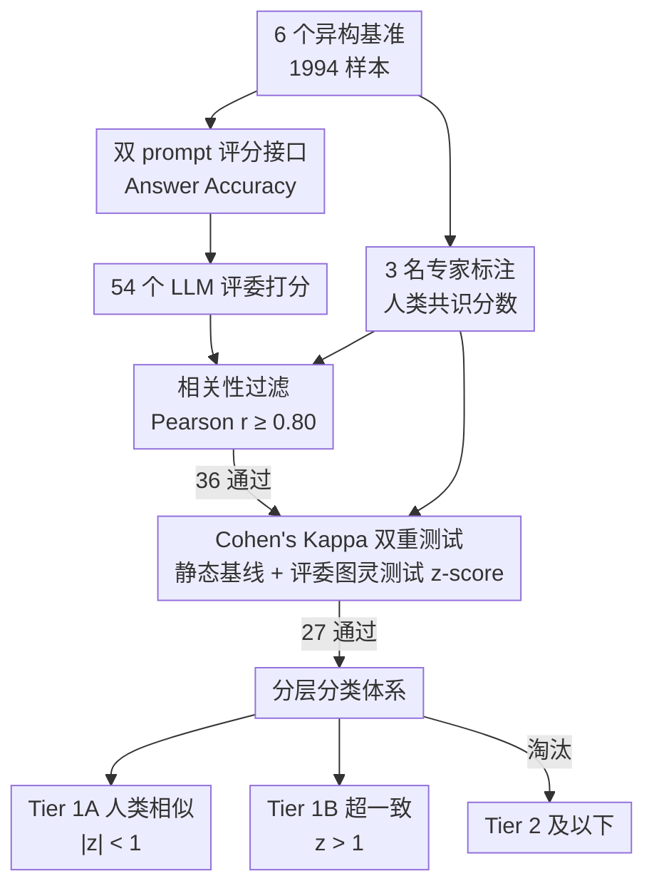

# Judge's Verdict: A Comprehensive Analysis of LLM Judge Capability Through Human Agreement

**会议**: ICLR 2026  
**arXiv**: [2510.09738](https://arxiv.org/abs/2510.09738)  
**代码**: [nvidia/judges-verdict](https://github.com/nvidia/judges-verdict)  
**领域**: 信息检索  
**关键词**: LLM-as-a-Judge, Cohen's Kappa, human agreement, benchmark, RAG evaluation, Turing Test for judges

## 一句话总结

提出 Judge's Verdict Benchmark——基于"相关性过滤 → Cohen's Kappa 人类相似性测试"的两步评估框架，对 54 个 LLM 评委进行系统评测，筛选出 27 个 Tier 1 评委（23 个人类相似型 + 4 个超一致型），核心发现是相关性高不等于一致性高，需要用 Kappa + z-score 才能真正衡量 LLM 评委质量。

## 研究背景与动机

LLM-as-a-Judge 已成为评估 RAG/Agent 管线输出质量的主流范式，但现有评估方法存在根本缺陷。**第一**，绝大多数工作仅依赖 Pearson 相关系数验证评委质量，但相关性衡量的是线性关系而非绝对一致性——一个系统性偏严（或偏松）的 LLM 评委可以达到 r=0.95 但 Cohen's Kappa 仅 0.45，说明它理解打分趋势但无法在绝对值层面与人类对齐。**第二**，不同研究使用不同数据集和不同数量的标注者，缺乏标准化基准。**第三**，已有方法完全忽略了一致性模式的区分——部分 LLM 评委展现出"像人类一样的自然变异"，另一部分则展现出"超越人类间一致性"的行为模式，这两种模式对不同应用场景有完全不同的含义。

本文试图回答一个核心问题：如何建立一套方法论，严格区分"真正达到人类水平"的 LLM 评委与"仅仅相关但不一致"的评委？

## 方法详解

### 整体框架

Judge's Verdict 要回答的问题是：一个 LLM 评委到底有多像人？它给出一条从打分到定级的完整流水线。先搭好基准底座——6 个异构数据集每个样本既交给 3 名专家标注得到人类共识分数，也交给 54 个 LLM 评委用统一的双 prompt 接口打分；然后两路分数进入两步评估：Step 1 用 Pearson 相关性做粗筛，把连打分趋势都对不上的模型挡在门外；Step 2 用 Cohen's Kappa 衡量绝对一致性，并把 LLM 混进人类标注组做一次"评委图灵测试"，看它能否在统计上与人类标注者不可区分。最后按 z-score 把通过的模型分入人类相似型（Tier 1A）、超一致型（Tier 1B）和不合格三档。

### 关键设计

**1. 基准底座：异构数据集 + 双 prompt 评分接口**

两步评估的可信度首先取决于打分输入的质量，本文在数据和评分接口两端同时托底。数据端汇集 6 个异构基准共 1994 个样本——SQuAD v2.0（346）、HotPotQA（342，多跳推理）、Coral（318，对话式 QA）、TechQA（295，技术问答）、DC767（347，含表格/图表的 PDF 文档）、EKRAG（346，含财报/SEC 文件的企业知识 RAG），覆盖从简单事实问答到企业级长文档的多种难度，避免结论被单一数据分布带偏。每个样本由 3 名北美专家独立标注（共 5982 条），标注者间一致性 Fleiss κ = 0.79、Krippendorff α = 0.79，人类共识分数取三人均值，这条人类基线足够可靠才能反过来校准 LLM。评分接口端沿用 RAGAS 的 Answer Accuracy 指标：两个独立评委 prompt 以不同顺序输入问题、生成答案与参考答案，各自给出离散分数 $S_i \in \{0, 2, 4\}$，归一化 $\phi(S_i)=S_i/4$ 后取均值得到最终分数 $\frac{1}{2}\sum_{i=1}^{2}\phi(S_i)$。跑两遍并换序是为了压住单 prompt 评委的位置偏差，让分数更稳定地反映答案质量本身。

**2. 相关性过滤：先挡掉连趋势都对不上的模型**

LLM 评委评估长期被 Pearson 相关系数主导，但相关性只能反映线性趋势，无法保证绝对值对齐——一个系统性偏严的评委可以拿到很高的 $r$ 却严重偏离人类打分。本文把相关性降级为"必要而非充分"的第一道门槛：计算每个 LLM 评委的 Answer Accuracy 分数与人类共识分数的 Pearson $r$，门槛设为 $r \geq 0.80$（Akoglu 量表里的"very strong"级别）。这一步不给最终结论，只是先把连线性趋势都对不上的模型剔除，避免它们污染后续更敏感的一致性分析；54 个模型里 36 个过关。

**3. Cohen's Kappa 双重一致性测试：从"趋势对齐"升级到"判断不可区分"**

通过粗筛的模型进入真正的核心环节。相关性的死穴是看不见系统性偏置和随机巧合，Cohen's Kappa $\kappa = (P_o - P_e)/(1 - P_e)$ 把观测一致 $P_o$ 扣掉期望巧合 $P_e$，直接惩罚"系统性偏严/偏松"。作者用两种互补视角衡量绝对一致性。其一是静态基线比较：分别算 LLM 与 3 位标注者各自的 Kappa 后取均值

$$\bar{\kappa}_{LLM} = \frac{1}{3}\sum_{i=1}^{3}\kappa(\text{LLM}, \text{Human}_i)$$

再与人类彼此之间的一致性基线 $\kappa = 0.801$ 对照，看"和人对齐程度"是否逼近"人和人对齐程度"。其二是动态组分析，也就是评委图灵测试：把 LLM 混入 3 位标注者组成 4 人组，计算人类两两配对 Kappa 的均值 $\mu_{human}$ 与标准差 $\sigma_{human}$，再用 z-score 判断这个 LLM 能否在人类组里"隐身"：

$$z = \frac{\kappa_{LLM} - \mu_{human}}{\sigma_{human}}$$

$|z|$ 越接近 0，说明 LLM 的判断模式越落在人类自然变异范围内；$z$ 显著大于 0 则意味着它比人类彼此还要一致。Kappa 惩罚偏置、z-score 把"是否与人类不可区分"量化成可检验的统计指标，二者结合才真正回答了相关性回答不了的问题。

**4. 分层分类体系：把一致性模式拆成三档而非一刀切**

两步结果被映射到一个三层分类上：Tier 1A 人类相似型要求 $r \geq 0.80$ 且 $|z| < 1$，判断模式与人类自然变异一致；Tier 1B 超一致型要求 $r \geq 0.80$ 且 $z > 1$，一致性反而超过人类彼此间水平；其余落入 Tier 2 及以下。本文特意把 $|z|<1$ 选得比传统显著性阈值 $|z|<1.96$ 更严，目的是找"像典型人类"的评委而非仅仅排除异常值。这套划分的价值在于它没有把"超一致"简单等同于"更好"——人类相似型适合需要保留判断多样性的场景，超一致型适合追求最大可复现性的场景，分层让选型对接实际需求，而不是只看一个总分。

## 实验关键数据

### 两步筛选结果

54 个 LLM 评委（43 开源 + 11 闭源，参数从 1B 到 405B）经两步筛选：Step 1 通过 36 个（r ≥ 0.80）；Step 2 进一步筛选出 27 个 Tier 1 评委。以下为 Tier 1 评委中排名前列的模型：

| 排名 | 模型 | Pearson r | Cohen's κ | z-score | 类别 |
|:---:|:---|:---:|:---:|:---:|:---:|
| 1 | Mixtral-8x22B-Instruct | 0.879 | 0.813 | 1.45 | 超一致 |
| 2 | Llama-3-70B-Instruct | 0.880 | 0.811 | 1.43 | 超一致 |
| 3 | Gemma-3-27B-IT | 0.879 | 0.812 | 1.34 | 超一致 |
| 4 | Bagel-34B-v0.2 | 0.872 | 0.804 | 1.01 | 超一致 |
| 5 | GPT-4.5 | 0.874 | 0.806 | 0.90 | 人类相似 |
| 6 | Llama-3.1-70B | 0.868 | 0.798 | 0.61 | 人类相似 |
| 7 | GPT-4.1 | 0.862 | 0.792 | 0.41 | 人类相似 |
| 12 | Qwen3-30B-A3B | 0.846 | 0.780 | -0.04 | 人类相似 |
| 17 | Claude Sonnet 4 | 0.847 | 0.768 | -0.44 | 人类相似 |
| 27 | Qwen2.5-32B | 0.831 | 0.753 | -0.96 | 人类相似 |

值得注意的是：所有 27 个 Tier 1 模型的 Kappa 集中在 0.753–0.813 区间，处于 Landis & Koch 量表的"substantial"到"almost perfect"边界。最接近人类自然判断的模型是 Qwen3-30B-A3B（|z| = 0.04），说明 30B 级别模型在恰当训练下即可达到人类级别的评委能力。

### 未通过筛选的典型案例

相当多高相关性模型在 Step 2 被淘汰，印证了"相关性 ≠ 一致性"的核心论点：

| 模型 | Pearson r | Cohen's κ | z-score | 通过 Tier 1？ |
|:---|:---:|:---:|:---:|:---:|
| GPT-4o | 0.818 | 0.728 | -1.55 | ✗ |
| GPT-4 | 0.811 | 0.723 | -1.73 | ✗ |
| GPT-5-chat | 0.809 | 0.720 | -1.85 | ✗ |
| GPT-4o-mini | 0.804 | 0.709 | -2.20 | ✗ |
| Llama-3.1-8B | 0.800 | 0.730 | -2.73 | ✗ |
| Llama-3.2-1B | 0.020 | 0.005 | -54.74 | ✗ |

GPT-4o 达到 r = 0.818（满足 Step 1）但 κ 仅 0.728、z = -1.55，说明它理解打分趋势但在绝对判断层面系统性偏松。GPT-5-chat 同样在 Step 1 通过但 Step 2 被淘汰。最极端的是 Llama-3.2-1B，r ≈ 0、κ ≈ 0，基本无评委能力。

### Z-Score 阈值灵敏度分析

作者分析了不同 |z| 阈值下分类结果的变化（r ≥ 0.80 保持不变）：|z| < 0.5 → 18 个 Tier 1（12 人类相似 + 6 超一致）；|z| < 1.0 → 27 个（23 + 4）；|z| < 1.5 → 29 个（29 + 0，超一致类别消失）；|z| < 1.96 → 33 个（33 + 0）。选用 |z| < 1 的理由是：它既能识别足够数量的人类相似模型，又保留了检测超一致行为的能力——放宽到 1.5 后超一致类别被吞并，失去了区分两种模式的核心价值。

### 模型大小与评委质量的关系

评委质量与参数规模并非简单线性关系。Mistral-Nemo-12B（12B）达到 Tier 1（κ = 0.774），Phi-3.5-MoE（MoE 架构）也通过（κ = 0.775），而 Llama-3.1-8B（8B）和 GPT-4o-mini 虽通过 Step 1 但在 Step 2 被淘汰。另一方面，Llama-3.1-405B（405B）处于 Tier 1 中游。这表明架构设计和训练策略（特别是对齐训练）对评委能力的影响远大于单纯的参数规模。

## 亮点与洞察

- **从相关性到一致性的范式转变**：论文最重要的贡献是用实证数据清楚地说明了为什么 Pearson r 不足以评估 LLM 评委——这解决了领域中一个被广泛忽视的方法论问题。一个 r = 0.95 但系统性偏严的模型完全不适合替代人类评委，但之前的文献会将其判定为优秀评委。
- **评委图灵测试**：将 LLM 混入人类组后用 z-score 检测差异的设计非常巧妙——它直接回答了"这个 LLM 的判断模式是否与人类标注者不可区分"这一实际需求。
- **超一致模型的双重解读**：4 个 z > 1 的模型比人类间一致性更高。论文诚实地指出这可能代表"更可靠的判断"也可能代表"过度简化了复杂判断"，并明确表示当前方法论无法区分两种解读，将选择权交给用户——这种严谨态度比直接宣称"超越人类"更有价值。
- **实用选型指南**：论文隐含地给出了实用建议——需要保留判断多样性的场景（内容审核、创意评估）应选人类相似型，需要最大可复现性的场景（合规检查、标准化测试）可选超一致型。

## 局限与展望

1. **评分粒度粗**：仅三级评分（0/0.5/1），无法评估细粒度判断能力；更连续的评分尺度可能揭示不同的一致性模式
2. **场景单一**：仅评估 RAG 回答准确性，未覆盖创意生成、代码评审、安全性判断等任务类型
3. **标注者多样性不足**：仅 3 名北美英语母语者，文化和语言背景单一可能引入系统性偏差
4. **缺乏时序稳定性分析**：未评估同一模型在不同时间点/不同 seed 下的评委一致性是否稳定
5. **超一致行为未深入归因**：未分析超一致模型与人类相似模型在具体样本层面的分歧模式（如是否在边界样本上表现不同）

## 相关工作与启发

| 工作 | 核心方法 | 与本文差异 |
|:---|:---|:---|
| MT-Bench (Zheng et al.) | 成对偏好判断 + Chatbot Arena | 未使用 Cohen's Kappa，以 Elo 评分为主 |
| G-Eval (Liu et al.) | CoT + 表单引导评分 | 仅用相关性验证，未考虑一致性 |
| Prometheus (Kim et al.) | 训练专用 13B 评委模型 | 聚焦 Pearson r = 0.897，未分析一致性模式 |
| JudgeBench (Lin et al.) | 困难样本配对区分力测试 | 以偏好准确率为主，未引入统计检验 |
| JUDGE-BENCH (Bavaresco et al.) | 20 数据集大规模评测 | 发现模型间方差大，但未提出分层框架 |

本文的核心推进是从"LLM 评委与人类的相关性够高吗"转向"LLM 评委的判断模式与人类不可区分吗"——一个更严格且更实用的问题。

## 评分

| 维度 | 分数 |
|:---:|:---:|
| 新颖性 | ⭐⭐⭐⭐ |
| 技术深度 | ⭐⭐⭐ |
| 实验充分性 | ⭐⭐⭐⭐⭐ |
| 写作质量 | ⭐⭐⭐⭐ |
| 实用价值 | ⭐⭐⭐⭐⭐ |
| 总评 | ⭐⭐⭐⭐ |

> 方法论驱动的实证研究，对 LLM-as-a-Judge 社区提供重要修正。实验规模大、结论清晰。技术相对简单但洞察力强，对 RAG 评估有直接参考价值。

<!-- RELATED:START -->

## 相关论文

- [\[ACL 2025\] Pandora's Box or Aladdin's Lamp: A Comprehensive Analysis Revealing the Role of RAG Noise in Large Language Models](../../ACL2025/information_retrieval/pandora_box_rag_noise.md)
- [\[ICLR 2026\] HUME: Measuring the Human-Model Performance Gap in Text Embedding Tasks](hume_measuring_the_human-model_performance_gap_in_text_embedding_tasks.md)
- [\[ICLR 2026\] Fine-tuning with RAG for Improving LLM Learning of New Skills](fine-tuning_with_rag_for_improving_llm_learning_of_new_skills.md)
- [\[ICLR 2026\] LightRetriever: A LLM-based Text Retrieval Architecture with Extremely Faster Query Inference](lightretriever_a_llm-based_text_retrieval_architecture_with_extremely_faster_que.md)
- [\[ICML 2026\] Understanding LoRA as Knowledge Memory: An Empirical Analysis](../../ICML2026/information_retrieval/understanding_lora_as_knowledge_memory_an_empirical_analysis.md)

<!-- RELATED:END -->
