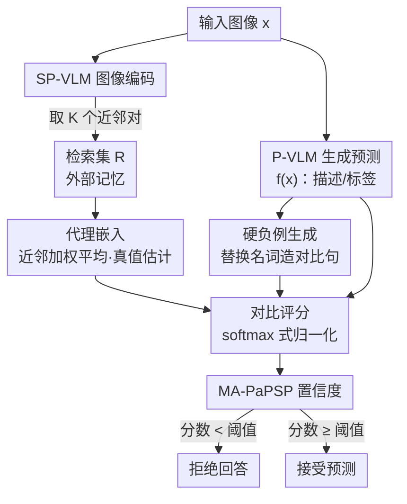

# Leveraging Data to Say No: Memory Augmented Plug-and-Play Selective Prediction

**会议**: ICLR 2026  
**arXiv**: [2601.22570](https://arxiv.org/abs/2601.22570)  
**代码**: [https://github.com/kingston-aditya/MA-PaPSP](https://github.com/kingston-aditya/MA-PaPSP)  
**领域**: 信息检索  
**关键词**: 选择性预测, VLM可靠性, 检索增强, 对比评分, CLIP

## 一句话总结
提出 MA-PaPSP 框架，通过外部检索数据集构建代理嵌入（k-NN 加权平均降低表示方差）+ 对比归一化评分（改善校准），无训练地为任意 VLM 提供可靠的"拒绝回答"能力，在图像描述、图文匹配、分类的选择性预测上全面优于 PaPSP 和 LLM-as-judge 基线。

## 研究背景与动机

**领域现状**: VLM（如 BLIP、InternVL、Qwen-VL）已广泛应用于图文匹配、图像描述、分类等任务，但模型预测不可避免地存在错误——不正确的模态对齐、尾部分布样本、图像/语言歧义等都会导致错误预测。选择性预测(Selective Prediction)通过赋予模型"拒绝回答"能力来缓解这一问题。

**现有痛点**:
   - **闭集局限**: 现有 SP 方法主要针对分类等闭集任务（有限标签集），无法处理图像描述等开放集任务（标签空间无界）
   - **训练依赖**: 大多数方法需要微调基础模型或训练额外的选择器，对黑盒/大规模模型不适用
   - **CLIP 评分不可靠**: 直接用 CLIP 余弦相似度评估预测置信度存在两个问题：(1) 表示不稳定——相同语义概念的图像/文本向量存在高方差；(2) 校准不良——嵌入空间不同区域的相似度分布不一致

**核心矛盾**: 理想的 SP 方案应同时满足：无训练、轻量级、支持开放集任务、可插入任意 VLM。但现有方案无法同时满足。

**本文目标** 设计一个无训练的、可即插即用的选择性预测模块(PaPSP)，能为从 CLIP 到大型 LVLM 的各种 VLM 提供跨任务层级（分类→图文匹配→图像描述）的置信度评估。

**切入角度**: 用外部检索数据集增强 CLIP 式评分模型，通过检索到的近邻进行嵌入平均（降低方差）和对比归一化（改善校准）。

**核心 idea**: 用外部检索数据的近邻嵌入平均作为更稳定的"代理嵌入"，并用硬负例做对比归一化替代原始余弦相似度，实现可靠的选择性预测。

## 方法详解

### 整体框架
MA-PaPSP 要解决的是：怎样在**不训练任何模型**的前提下，给一个 VLM 的预测打上可靠的置信度，让它在没把握时拒绝回答。系统里有三个角色——基础模型 P-VLM（如 BLIP、Qwen-VL）负责对输入图像生成预测 $f(x)$（一句描述或一个类别）；外部评分模型 SP-VLM（如 SigLIP）负责把图像和文本投到同一个嵌入空间算相似度；外挂的检索数据集 $R$ 则充当"外部记忆"。对每个待评估的预测，流程是：先用 SP-VLM 编码查询图像、去 $R$ 里检索近邻，把邻居嵌入加权平均得到一个更稳的**代理嵌入**作为"真值估计"；同时给该预测造一批**硬负例**当参照；最后把"预测 vs 代理嵌入"的相似度对硬负例做 softmax 式归一化，得到校准好的**对比评分**，分数低于阈值就拒绝回答。整条链路只用预训练权重、不碰任何参数，可即插即用地套在从 CLIP 到大型 LVLM 的任意模型上。

### 关键设计

**1. 代理嵌入：用近邻平均压住 CLIP 表示的高方差**

CLIP 式嵌入空间有个老毛病——同一个语义概念对应的向量方差很大，同类别的不同图像彼此相似度可能差得很远，直接拿单个查询向量算置信度会被这种噪声带偏。代理嵌入的做法是不信任查询本身的嵌入，而是用它在检索集里的邻居来代言。给定查询 $q$（图像或文本），先从检索集 $R$ 中取 $K$ 个最近邻 $N_K(q)$，再按相似度加权平均这些邻居的嵌入，得到一个更稳的代理嵌入 $\tilde{\varphi}(q) = \sum_i \frac{\gamma(q, z_i)}{\sum_j \gamma(q, z_j)} \varphi(y_i)$，它充当查询的"真值估计"。这本质上是用统计平均把多个邻居各自的噪声相互抵消，让结果落在更接近真实语义中心的位置。方法支持四种检索变体（i2tr / i2ir / t2tr / t2ir），既能跨模态检索（图像查文本邻居）也能单模态检索（图像查图像邻居），适配不同任务的对齐需求。

**2. 硬负例生成：给开放集描述任务补上缺失的参照集**

下一步的对比评分需要一组参照点来锚定置信度，分类和图文匹配任务天然带候选集，但图像描述这种开放集任务标签空间无界、没有现成负例可用，必须自己造。MA-PaPSP 用两种方式生成对比描述：规则方法（RB）或小型语言模型（SLM），核心操作都是替换原描述 $f(x)$ 里的名词，产出形式上很像、语义上却被改变的替代句子。这样既保证负例足够"硬"（句式接近，逼模型真正看图文对齐而非表面词面相似），又把对比评分这套机制从闭集任务推广到了描述这类开放集任务上。

**3. 对比评分：用硬负例做 softmax 式归一化改善校准**

原始余弦相似度的第二个问题是校准不良：嵌入空间不同区域的相似度分布尺度不一致，同样的 0.3 在一个区域算高、在另一个区域算低，没法当统一的置信度用——这类似 softmax 之前那些没归一化的 logits。对比评分借鉴 softmax 的思路，把"图像与预测描述"的相似度（其中文本侧用上一步的代理嵌入算）对前面造出的硬负例集 $E(f(x))$ 做归一化：$s_{tc} = \frac{\exp(s(x, f(x))/\tau)}{\sum_k \exp(s(x, y_k)/\tau)}$，温度 $\tau$ 控制分布锐度。经过这一步，分数被压到 $[0,1]$ 区间且在不同空间区域分布更均匀，可以直接作为校准后的置信度，低于阈值即触发拒绝。

### 损失函数 / 训练策略
完全无训练，SP-VLM 直接用预训练 SigLIP，不做任何微调。需要调的只有三个超参：近邻数 $K$、温度 $\tau$、以及检索集 $R$ 的选择（消融显示混合域外检索集效果最佳）。

## 实验关键数据

### 主实验 - AURC（越低越好）

| 方法 | MS-COCO (CiderN) | Flickr-30K (CiderN) | Flowers | Pets | UCF101 | SugarCrepe |
|------|-------------------|---------------------|---------|------|--------|------------|
| VQAScore | 0.146 | 0.241 | 0.211 | 0.207 | 0.217 | 0.146 |
| SeeTRUE | 0.158 | 0.251 | 0.214 | 0.213 | 0.171 | 0.153 |
| PaPSP (SigLIP-S) | 0.142 | 0.237 | 0.093 | 0.211 | 0.154 | 0.162 |
| **MA-PaPSP (SigLIP-S)** | **0.121** | **0.235** | **0.077** | **0.171** | **0.116** | **0.079** |
| PaPSP (SigLIP-L) | 0.136 | 0.229 | 0.074 | 0.169 | 0.113 | 0.078 |
| **MA-PaPSP (SigLIP-L)** | **0.109** | **0.219** | **0.063** | **0.114** | **0.088** | **0.062** |
| Gain (L) | 19.85% | 4.36% | 14.86% | 32.52% | 22.12% | 20.51% |

### 跨 P-VLM 验证（图像描述 AURC↓）

| P-VLM | PaPSP (COCO) | MA-PaPSP (COCO) | 提升 |
|-------|-------------|-----------------|------|
| BLIP-1 (0.1B) | 0.138 | 0.114 | 17.4% |
| BLIP-2 (2.7B) | 0.136 | 0.109 | 19.9% |
| InternVL-3.5 (4B) | 0.106 | 0.068 | 35.8% |
| Qwen-2.5-VL (7B) | 0.102 | 0.066 | 35.3% |

### 消融实验 - 检索集类型影响（AURC↓）

| 检索集 | MS-COCO (CiderN) | Flowers | SugarCrepe |
|--------|-------------------|---------|------------|
| Random | 0.126 | 0.062 | 0.064 |
| In-Domain | 0.126 | 0.062 | 0.066 |
| Out-of-Domain | 0.109 | 0.063 | 0.062 |
| Mixed | **0.107** | **0.062** | **0.068** |

### 关键发现
- MA-PaPSP 使用小 SP-VLM (SigLIP-B/16, 16M)即超越用大 SP-VLM (SigLIP-SO-400M, 1B) 的 PaPSP，说明检索增强效果 > 单纯增大模型
- MA-PaPSP 全面优于 VQAScore 和 SeeTRUE 等基于 LLM 推理的方法，且计算成本低得多
- 对分类任务提升最大（Pets 32.5%、UCF101 22.1%），对描述任务也有显著提升（COCO 19.9%）
- 通用的域外检索集(CC12M+SBU)在描述和图文匹配任务上可媲美甚至超越域内检索集
- 随着 P-VLM 规模增大（从 0.1B 到 7B），MA-PaPSP 的提升幅度反而增大（17.4%→35.3%），说明方法对强模型更有效

## 亮点与洞察
- **问题定义有价值**: 首次系统化定义跨任务层级（分类→图文匹配→描述）的即插即用选择性预测问题
- **方法设计精巧**: 代理嵌入和对比评分分别解决表示不稳定和校准不良两个核心问题，设计动机清晰
- **极强的通用性**: 无训练、可插入任意 VLM（从 CLIP 到 InternVL-3.5/Qwen-2.5-VL）、支持开闭集任务
- **有趣的发现**: 域外通用检索集可替代域内数据，降低了实际部署门槛

## 局限与展望
- 需要存储和检索外部数据集（CC12M 有 15M 条），对存储和检索延迟有要求
- 图像描述的硬负例生成依赖规则方法或 SLM，质量可能不稳定
- 对比评分的温度 τ 需要调优，不同任务可能需要不同值
- 目前仅验证了英文场景，多语言设置下表示空间的特性可能不同
- 开放集任务（如描述）的评测依赖 CIDEr-N 阈值 β，阈值选择影响结论

## 相关工作与启发
- 与 RAG（检索增强生成）思路一致但目标不同：RAG 增强生成质量，MA-PaPSP 增强置信度评估
- 为 VLM 部署提供"安全阀"：在高风险场景（如医学影像）下，MA-PaPSP 可以在模型不确定时拒绝回答
- 代理嵌入的思路可扩展到其他场景：如用于 few-shot 分类的原型增强、跨模态检索的查询增强

## 评分
- 新颖性: ⭐⭐⭐⭐ 首次系统解决开放集 VLM 的即插即用选择性预测，代理嵌入+对比评分组合新颖
- 实验充分度: ⭐⭐⭐⭐⭐ 跨任务层级、跨模型规模、跨检索集类型的全面验证
- 写作质量: ⭐⭐⭐⭐ 问题抽象层次高，任务分类体系(VLM task taxonomy)设计合理
- 价值: ⭐⭐⭐⭐ VLM 可靠性方向的重要工具，对实际部署有直接价值

<!-- RELATED:START -->

## 相关论文

- [\[ICLR 2026\] Multimodal Dataset Distillation Made Simple by Prototype-Guided Data Synthesis](multimodal_dataset_distillation_made_simple_by_prototype-guided_data_synthesis.md)
- [\[ICLR 2026\] TokMem: One-Token Procedural Memory for Large Language Models](tokmem_one-token_procedural_memory_for_large_language_models.md)
- [\[ICLR 2026\] AMemGym: Interactive Memory Benchmarking for Assistants in Long-Horizon Conversations](amemgym_interactive_memory_benchmarking_for_assistants_in_long-horizon_conversat.md)
- [\[ACL 2025\] Health-LLM: Personalized Retrieval-Augmented Disease Prediction System](../../ACL2025/information_retrieval/health-llm_personalized_retrieval-augmented_disease_prediction_system.md)
- [\[AAAI 2026\] PRIME: Planning and Retrieval-Integrated Memory for Enhanced Reasoning](../../AAAI2026/information_retrieval/prime_planning_and_retrieval-integrated_memory_for_enhanced_reasoning.md)

<!-- RELATED:END -->
