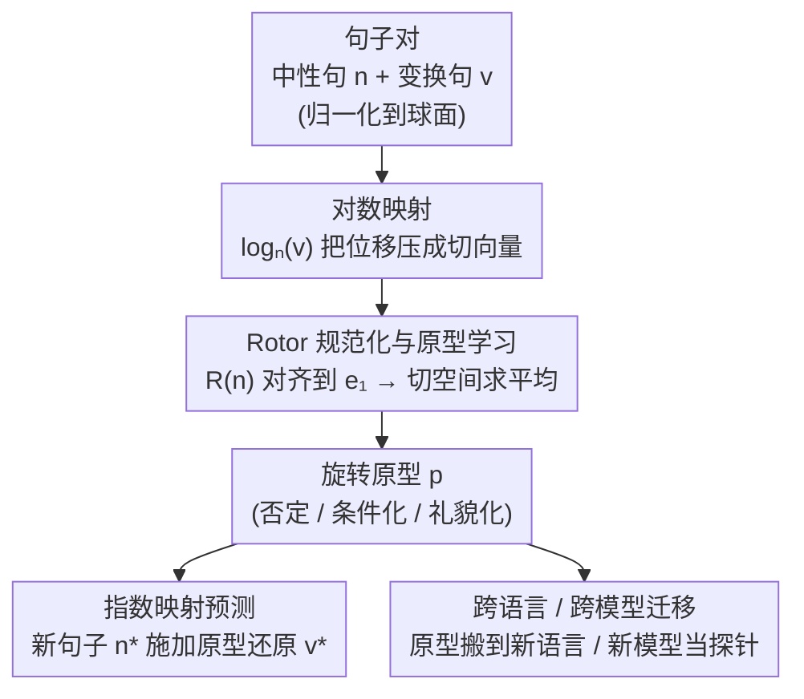

# Mapping Semantic & Syntactic Relationships with Geometric Rotation

**会议**: ICLR 2026  
**arXiv**: [2510.09790](https://arxiv.org/abs/2510.09790)  
**代码**: [https://github.com/fuelix/RISE-steering](https://github.com/fuelix/RISE-steering)  
**领域**: 表示学习 / 嵌入可解释性  
**关键词**: 嵌入几何, 超球面旋转, 跨语言泛化, 语义变换, 线性表示假说

## 一句话总结

提出RISE（Rotor-Invariant Shift Estimation）方法，利用Clifford代数的rotor将话语级语义-句法变换（否定、条件化、礼貌化）表示为单位超球面上的一致旋转操作，在7种语言×3种嵌入模型×3种变换的系统实验中证实这些旋转可跨语言和跨模型迁移（77%-95%保持率），首次将线性表示假说从词级扩展到跨语言话语级并推广到弯曲流形上的测地线结构。

## 研究背景与动机

**领域现状**：在word2vec时代，语义关系可以直观地用向量算术表达（"king - man + woman = queen"），语义空间具有良好的线性可解释性。线性表示假说（LRH）将这一观察形式化——认为语义概念在嵌入空间中被编码为线性结构。然而现代Transformer模型的高维表示失去了这种直观的几何对应关系，内部机制变得不透明。

**现有痛点**：(1) 现有可解释性方法（探针、引导向量）大多是任务特定的，缺乏系统化的几何框架来映射语义关系；(2) 引导向量在不同上下文中效果不一致，缺乏泛化性；(3) LRH主要在单语言词级别验证，跨语言和话语级别的验证几乎空白；(4) 关键的几何错配——现代嵌入实际存在于弯曲流形（超球面）上，而传统方法在欧氏空间中操作，这种错配可能是引导向量泛化差的根本原因。

**核心矛盾**：嵌入空间是弯曲的（球面），但操控和分析工具假设它是平坦的（欧氏）。需要一种尊重流形几何的语义变换表示方法。

**本文目标**：开发一个几何框架来识别话语级语义-句法变换，确定这些变换能否跨语言和跨模型架构一致地映射为几何操作。

**切入角度**：归一化的句子嵌入位于单位超球面上→语义变换=球面上的旋转位移→用Clifford代数的rotor来规范化和对齐不同句子的变换→学习一个通用的旋转原型（Prototype）代表特定语义变换→将其应用于新句子实现预测。

**核心 idea**：语义-句法变换=超球面上的一致旋转操作，用rotor规范化后可跨语言跨模型迁移。

## 方法详解

### 整体框架

RISE 想解决的问题是：现代嵌入模型把句子映到弯曲的单位超球面上，可"否定""条件化""礼貌化"这类话语级语义变换在球面上到底对应什么几何操作，至今没有系统化的刻画。它的回答是——**一类语义变换 = 球面上一个一致的旋转**，而且这个旋转可以被一个紧凑的"旋转原型"$\vec{p}$ 概括下来。

整条流水线分三步走，全程在黎曼几何框架里操作。输入是一批"中性句–变换句"对 $(n_i, v_i)$（都已归一化、落在球面上）：先用对数映射把每对句子的语义位移从球面"压平"成 $n_i$ 处切空间里的切向量；再用 rotor 把各句子的切空间统一旋转到同一参考方向后取平均，得到代表该类变换的旋转原型；最后对任意一个新中性句，用指数映射把原型"贴"回球面，预测它变换后的嵌入。学到的原型还能当探针，检验同一个旋转能否跨语言、跨模型复用。

### 关键设计

**1. Rotor 规范化与原型学习：把不同句子的语义变换对齐到同一坐标系再求平均**

归一化后的句子嵌入都落在单位超球面上，所以从中性句 $n_i$ 到变换句 $v_i$ 的语义位移并不是一个加法向量，而是球面上的一段测地线。RISE 用黎曼对数映射 $\log_{n_i}(v_i)$ 把这段位移"压平"成 $n_i$ 处切空间里的切向量。问题在于：每个 $n_i$ 处的切空间各不相同，不同句子的切向量躺在不同的局部坐标系里，没法直接相加比较。RISE 的关键一步是为每对句子计算一个正交变换（rotor）$R(n_i)$，把 $n_i$ 旋转到统一的参考方向 $e_1$，从而把所有切空间对齐到同一个公共参考系——这等于"扣掉了各句子基础语义内容的差异"，只把变换本身留下来。对齐后的切向量 $\xi_i = R(n_i)\log_{n_i}(v_i)$ 就可以直接做平均，得到代表该类语义变换（如"否定"）的通用旋转原型 $\vec{p} = \frac{1}{M}\sum_i \xi_i$。

有了原型，**预测**一步就是把这套操作反着走一遍：对任意未见过的中性句 $n^\ast$，先用其规范化 rotor 的转置 $R(n^\ast)^\top$ 把 $\vec{p}$ 旋回 $n^\ast$ 处的切空间，再用指数映射 $\exp_{n^\ast}(\cdot)$ 沿测地线把它推回球面，得到预测的变换句嵌入 $v^\ast$（切向量方向决定走哪条测地线、长度决定走多远）。这正是 RISE 与传统均值差向量（Mean Difference Vector）的分水岭：后者在欧氏空间里直接对句子向量做减法和平均，默认空间是平的，忽略了嵌入实际位于弯曲球面这一事实；RISE 全程用 log/exp map 加 rotor 对齐，在切空间里做线性代数、再用指数映射映回球面，尊重了流形的固有几何，因此理论上更契合球面上的语义结构。

**2. 跨语言与跨模型迁移：用同一个旋转原型测试语义变换的几何普遍性**

学到旋转原型后，RISE 直接把它当作探针来检验"语义变换是否具有跨语言、跨模型的几何普遍性"。跨语言迁移的做法是：在语言 A 上学到的旋转原型，原封不动地应用到语言 B 的嵌入上，看它还能不能预测对 B 的变换——如果否定这类变换在不同语言的嵌入空间里对应同一种旋转，那么一种语言学到的原型就该直接适用于另一种语言。这是对线性表示假说最严苛的一次检验：英语用"not"、日语用"ない"、泰米尔语用动词内部屈折来表达否定，语法机制完全不同；若它们在嵌入空间里都对应相近的旋转方向，就说明这种几何结构反映的是语义本身的属性，而非某种语言特有的语法实现。跨模型迁移则借助统计映射（Morris 等的 PCA + 分布对齐）把 text-embedding-3-large 上学到的原型连同参考方向 $e_1$ 一起搬到 bge-m3 空间，进一步检验原型是否独立于具体的嵌入模型架构。

**3. 交换律验证与理论支撑：证明 RISE 变换在一阶近似下可组合**

RISE 还从理论上论证了语义变换的"可组合性"。定理 A.1 证明：连续施加多个 RISE 变换时（例如"先否定再条件化"与"先条件化再否定"），两条路径结果之差为 $O(\|\vec{p}_A\| \cdot \|\vec{p}_B\|)$，是一个二阶小量。换言之，在原型幅度较小（小角度）的近似下这些旋转近似交换，切空间里的行为类似向量加法——"否定的条件句" ≈ "条件化的否定句"。这给线性表示假说从欧氏空间向弯曲流形的推广提供了代数层面的保证：传统 LRH 预言的线性可组合结构，在测地线框架下依然近似成立。

## 实验关键数据

### 实验设置

- **3种语义变换**：否定（"P"→"not-P"，精确的逻辑操作）、条件化（"P"→"if P"，引入模态语义）、礼貌化（增加社交正式度，高度上下文/文化依赖）
- **7种语言**：英语、西班牙语、日语、泰米尔语、泰语、阿拉伯语、祖鲁语（5个语系，覆盖分析型/粘着型/屈折型形态）
- **3种嵌入模型**：text-embedding-3-large（3072维）、bge-m3（1024维）、mBERT（768维）
- **2种基线**：Mean Difference Vectors（MDV，球面均值差向量）、Procrustes对齐（全局旋转拟合）
- **3个评测数据集**：合成多语言数据集（GPT-4.5生成，每语言×变换1000对）、BLiMP（英语句法基准）、SICK（英语语义相似度）

### 主实验（跨语言迁移，rotor alignment score = 余弦相似度）

| 变换 | 平均得分 | 性能区间 | 性能波动 | 特点 |
|------|---------|---------|---------|------|
| 否定 | **0.788** | 0.686-0.918 | 中等 | 跨语言最强 |
| 条件化 | 0.780 | 更稳定 | **最低(0.038)** | 一致性最高 |
| 礼貌化 | 0.762 | 更大变化 | 最高(0.060) | 文化依赖性明显 |

### 跨模型迁移（text-embedding-3-large → bge-m3）

| 语言 | 迁移性能 | 说明 |
|------|---------|------|
| 英语 | 0.80-0.82 | 最佳，可能反映训练数据偏差 |
| 其他语言 | 0.70-0.75 | 较好，但有约20%性能差距 |
| 祖鲁语 | 0.63-0.66 | 最低，低资源语言挑战 |

### 基线对比

| 方法 | 单语句法(BLiMP) | 单语语义(SICK) | 跨语言迁移 |
|------|---------------|---------------|-----------|
| RISE | Strong(0.97) | Strong(0.84) | Moderate-Strong(0.74-0.89) |
| MDV | Strong(0.97) | Strong(0.83) | Moderate-Strong(0.72-0.91) |
| Procrustes | Strong(0.99) | Moderate(0.67) | **Failing-Weak(0.25-0.62)** |

### 关键发现

- 否定在所有语言中旋转最一致——暗示否定可能是语义空间的"基础操作"，独立于具体的语法实现方式（粒子/词缀/助动词）
- 条件化一致性最高（波动最低0.038）——模态语义的编码方式跨语言高度稳定
- 礼貌化变化最大——文化和社会因素使其跨语言结构最不稳定，符合预期
- Procrustes在跨语言场景下严重失败——全局刚性旋转太粗糙，证实了流形方法的必要性
- 嵌入维度不直接决定跨语言性能——1024维的bge-m3在跨语言一致性上甚至优于3072维的text-embedding-3-large，训练方法和架构选择更重要
- 下游否定分类任务：RISE准确率93.0%，MDV 87.2%——RISE的几何表示确实捕获了更有用的语义信息

## 亮点与洞察

- "旋转而非平移"是核心哲学转变——在球面上平移（加法向量）不是自然操作，旋转才是。RISE尊重了嵌入空间的固有几何，这可能解释了为什么传统引导向量在不同上下文中效果不一致
- 否定的跨语言几何一致性暗示它可能是"语义基元"——不论英语用"not"、日语用"ない"、泰米尔语用动词内部否定，在嵌入空间中都对应类似的旋转方向
- LRH的球面推广——传统的"线性方向=语义"在弯曲空间中对应"测地线弧=语义"，RISE将LRH从欧氏空间推广到黎曼流形，是理论层面的重要贡献
- 交换律为语义组合提供了代数基础——多个RISE变换近似交换意味着语义变换具有类似向量空间的代数性质，这是可解释性的重要理论保证

## 局限与展望

- 仅考察了三种语义变换——需要扩展到更多语义和语用现象（如时态、因果、蕴涵等）来测试框架的普遍适用性
- 合成数据由GPT-4.5生成——可能引入英语中心偏差，需要母语者验证和自然语料验证
- 跨模型迁移存在明显的英语优势（比祖鲁语高20%）——反映了当前多语言模型的训练数据不均衡
- RISE在语义相似度任务(SICK)上表现中等(0.62-0.74)——旋转原型可能更好地捕获了语法/句法结构而非深层语义相似性
- 计算复杂度虽然是O(d)但实际实现中仍需测试在超大规模嵌入(>3072维)上的效率
- MDV在部分场景下性能接近RISE——需要更多任务来区分两种方法的优劣边界

## 相关工作与启发

- **Park等(2024, 2025)**：形式化了LRH的三种线性表示概念——RISE将其推广到弯曲空间的测地线结构
- **Householder Pseudo-Rotation (HPR)**：用Householder反射做LLM激活引导——RISE用rotor做嵌入空间分析，几何工具类似但应用层面完全不同
- **引导向量研究**（Turner, Zou, Li等）：在LLM激活层操作——RISE首次将引导原理扩展到嵌入模型和流形空间
- **Word2Vec类比推理**：RISE可视为word2vec向量类比在现代嵌入+弯曲几何下的自然推广

## 评分

- 新颖性: ⭐⭐⭐⭐⭐ 首次将语义变换建模为超球面旋转+跨语言验证+LRH球面推广
- 实验充分度: ⭐⭐⭐⭐⭐ 7语言×3模型×3变换×3数据集×2基线的全矩阵评估
- 写作质量: ⭐⭐⭐⭐⭐ 理论动机→方法设计→大规模实验→数学证明的完整叙事
- 价值: ⭐⭐⭐⭐ 对嵌入可解释性和多语言理解有基础贡献

<!-- RELATED:START -->

## 相关论文

- [\[ACL 2025\] Semantic Outlier Removal with Embedding Models and LLMs](../../ACL2025/information_retrieval/semantic_outlier_removal_with_embedding_models_and_llms.md)
- [\[AAAI 2026\] Magnitude Matters: A Superior Class of Similarity Metrics for Holistic Semantic Understanding](../../AAAI2026/information_retrieval/magnitude_matters_a_superior_class_of_similarity_metrics_for_holistic_semantic_u.md)
- [\[AAAI 2026\] HiMo-CLIP: Modeling Semantic Hierarchy and Monotonicity in Vision-Language Alignment](../../AAAI2026/information_retrieval/himo-clip_modeling_semantic_hierarchy_and_monotonicity_in_vi.md)
- [\[ACL 2025\] Uncovering Visual-Semantic Psycholinguistic Properties from the Distributional Structure of Text Embedding Space](../../ACL2025/information_retrieval/psycholinguistic_visual_semantic.md)
- [\[NeurIPS 2025\] SeCon-RAG: A Two-Stage Semantic Filtering and Conflict-Free Framework for Trustworthy RAG](../../NeurIPS2025/information_retrieval/secon-rag_a_two-stage_semantic_filtering_and_conflict-free_framework_for_trustwo.md)

<!-- RELATED:END -->
