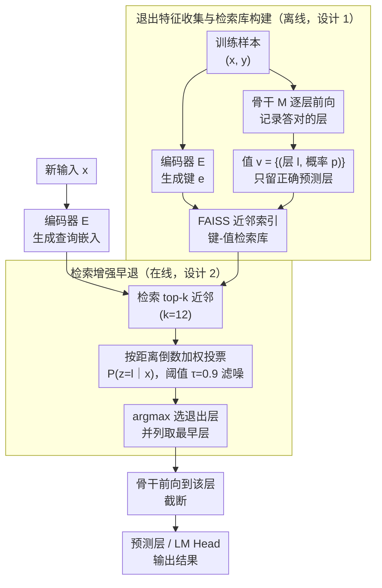

# RAEE: A Robust Retrieval-Augmented Early Exit Framework for Efficient Inference

**会议**: ICLR 2026  
**arXiv**: [2405.15198](https://arxiv.org/abs/2405.15198)  
**代码**: [GitHub](https://github.com/HugeRaabbit/RAEE)  
**领域**: 信息检索  
**关键词**: 早退机制, 检索增强, 分布预测, 推理加速, 纠错机制  

## 一句话总结

提出 RAEE，一种无需训练分类器的检索增强早退框架，通过检索语义相似样本的退出信息来动态确定最优退出层，不仅加速推理还能纠正模型错误预测，实现加速与性能提升的双赢。

## 研究背景与动机

大语言模型（LLM）推理效率是部署中的核心挑战。早退（Early Exit）通过在中间层提前终止推理来降低延迟和内存开销，是一种先进的模型剪枝方法。

现有早退框架分为三类：
- **训练型方法**（DeeBERT 等）：联合优化内部分类器和骨干模型，训练开销大
- **半训练型方法**（AdaInfer 等）：冻结骨干只训练轻量分类器，依赖人工特征工程
- **免训练方法**（HashEE 等）：使用启发式退出标准，缺乏适应性，性能下降明显

**关键观察**：现有方法普遍以精度换速度，忽视了早退的纠错潜力。作者发现：

**早退可作为纠错机制**：中间层有时比最终层做出更好的预测。当全模型预测错误时，平均 90.66% 的错误可通过中间层输出纠正

**语义相似数据的退出行为高度一致**：Top-8 近邻的正确预测概率模式几乎一致

## 方法详解

### 整体框架

RAEE 把"该在第几层退出"从一个需要训练分类器去判断的问题，转化为一个从历史经验里检索答案的问题。它分构建与推理两个阶段：构建阶段离线把每个训练样本的嵌入和它在各层的退出行为存进一个检索库，推理阶段对新输入先查库、再用近邻的退出信息投票出最优退出层，从而在不训练任何参数的情况下决定提前终止的位置。

### 关键设计

**1. 退出特征收集与检索库构建：把每个样本的"哪层能答对"离线沉淀下来**

早退的难点在于事先并不知道某个输入在哪一层就已经能给出正确答案，训练型方法靠分类器去学这个判断，代价高且容易过拟合。RAEE 改为直接观测并存储。给定训练数据 $\mathcal{D} = \{(x_i^{train}, y_i^{train})\}$ 和含 $m$ 层的骨干模型 $\mathcal{M}$，它用编码器 $\mathcal{E}$ 把每个输入编码成键 $\mathcal{K} = \{e_i\}_{i=1}^{|\mathcal{D}|} = \{\mathcal{E}(x_i^{train})\}_{i=1}^{|\mathcal{D}|}$，再把该样本所有能答对的层及其正确预测概率打包成值 $\mathcal{V} = \{v_i\}_{i=1}^{|D|} = \{\{(l_i^j, p_i^j)\}_{j=1}^{m_i}\}_{i=1}^{|D|}$。这里只保留预测正确的层信息，是性能提升的关键——它让检索库天然带有纠错倾向，近邻投票出的层更可能是"答对"而非"答错"的层。整个库用 FAISS 建近似最近邻索引，查询开销极低。

**2. 检索增强早退：用近邻的退出经验为新输入投票出退出层**

对一个新输入 $x$，RAEE 把退出层看成一个随机变量 $z \in \{1, \ldots, m\}$，并用检索到的 top-$k$ 近邻的退出信息来近似它的分布。每个近邻 $v_i$ 对各层概率的贡献按距离倒数加权，越近的样本话语权越大：$P(v_i|x) = \frac{\min(\{distance(v_j, x)\}_{j=1}^k)}{distance(v_i, x)}$。把所有近邻在层 $l$ 上的贡献累加，得到该层被选中的概率 $P(z=l|x) = \sum_{i=1}^{k} P(v_i|x) \cdot S_i$，最终退出在使概率最大的层 $f(x) = \arg\max_l P(z=l|x)$。这样做之所以有效，是因为论文观察到语义相似的数据退出行为高度一致（Top-8 近邻的正确预测模式几乎相同），所以近邻在哪层答对，新输入大概率也在那层答对。检索近邻数取 $k = 12$，并用阈值 $\tau = 0.9$ 过滤掉正确概率偏低的退出层信息以减少噪声；当多个层概率并列最大时选最早的那层，把加速收益拉满。

## 实验关键数据

### 主实验：8 个下游任务性能对比

| 方法 | 骨干 | SST-2 | SST-5 | MR | CR | MPQA | SUBJ | TREC | CoLA | Avg |
|------|------|-------|-------|-----|-----|------|------|------|------|-----|
| RoBERTa-Large | 全模型 | 83.60 | 34.98 | 80.80 | 79.55 | 67.60 | 51.45 | 32.40 | 2.03 | 54.05 |
| DeeBERT | RB-L | 52.29 | 18.05 | 50.60 | 50.00 | 75.95 | 80.85 | 16.20 | 0.00 | 42.99 |
| AdaInfer | RB-L | 50.92 | 24.48 | 50.00 | 50.00 | 60.90 | 50.85 | 22.60 | -1.62 | 38.52 |
| **RAEE** | **RB-L** | **84.63** | **33.57** | **81.55** | **68.05** | **78.55** | **84.05** | **62.40** | **14.48** | **63.41** |
| SLEB | Llama-3 | 54.01 | 21.09 | 51.10 | 49.45 | 55.65 | 49.95 | 14.00 | 0.92 | 37.02 |
| **RAEE** | **Llama-3** | **73.05** | **35.25** | **66.45** | **57.95** | **75.05** | **90.05** | **51.80** | **9.55** | **57.39** |

**关键发现**：RAEE 在所有骨干模型上不仅加速推理，还超越了全模型的平均性能（63.41 vs 54.05），打破了传统早退"以精度换速度"的范式。

### 消融实验：正确预测检索数据库的影响

| 模型 | SST-2 | SST-5 | TREC | CoLA | Avg |
|------|-------|-------|------|------|-----|
| Llama-3-8B 全模型 | 62.84 | 26.06 | 8.40 | 0.00 | 41.80 |
| RAEE w/o 正确过滤 | 60.55 | 24.52 | — | — | — |
| RAEE w/ 正确过滤 | 73.05 | 35.25 | 51.80 | 9.55 | 57.39 |

仅使用正确预测构建检索数据库是 RAEE 性能提升的关键。

## 亮点与洞察

1. **范式突破**：首次证明早退不仅是加速技术，更是动态纠错机制，打破了效率与精度的传统权衡
2. **免训练设计**：无需训练任何分类器或模型参数，仅需模型推理即可构建检索数据库
3. **跨模型通用性**：在 RoBERTa、T5、Llama-3、Gemma 等不同架构上均有效
4. **理论洞察**：将早退建模为分布预测问题，通过相似数据的退出信息近似退出分布

## 局限性

- 需要构建和维护外部检索数据库，增加存储开销
- 检索过程引入额外延迟（虽然只在推理开始时检索一次）
- 依赖预训练编码器的嵌入质量
- 对于分布外数据的泛化能力有待验证

## 相关工作

- **训练型早退**：DeeBERT, ElasticBERT, PABEE — 需要训练内部分类器
- **免训练早退**：HashEE, CALM — 使用启发式标准
- **半训练型**：AdaInfer — 基于 SVM 的方法
- **检索增强推理**：REALM, RAG — 检索增强生成的相关工作

## 评分

| 维度 | 分数 | 说明 |
|------|------|------|
| 创新性 | ⭐⭐⭐⭐ | 将检索增强与早退结合，提出纠错视角 |
| 实用性 | ⭐⭐⭐⭐ | 免训练，跨模型通用，可直接部署 |
| 实验充分性 | ⭐⭐⭐⭐ | 8 个任务，4 种骨干模型，全面对比 |
| 写作质量 | ⭐⭐⭐⭐ | 观察-方法-实验逻辑清晰 |

<!-- RELATED:START -->

## 相关论文

- [\[ACL 2025\] FlashBack: Efficient Retrieval-Augmented Language Modeling for Fast Inference](../../ACL2025/information_retrieval/flashbackefficient_retrieval-augmented_language_modeling_for_long_context_infere.md)
- [\[ICLR 2026\] LightRetriever: A LLM-based Text Retrieval Architecture with Extremely Faster Query Inference](lightretriever_a_llm-based_text_retrieval_architecture_with_extremely_faster_que.md)
- [\[ICLR 2026\] Beyond RAG vs. Long-Context: Learning Distraction-Aware Retrieval for Efficient Knowledge Grounding](beyond_rag_vs_long-context_learning_distraction-aware_retrieval_for_efficient_kn.md)
- [\[ICLR 2026\] Efficient Discriminative Joint Encoders for Large Scale Vision-Language Re-ranking](efficient_discriminative_joint_encoders_for_large_scale_vision-language_rerankin.md)
- [\[ACL 2025\] EXIT: Context-Aware Extractive Compression for Enhancing Retrieval-Augmented Generation](../../ACL2025/information_retrieval/exit_context-aware_extractive_compression_for_enhancing_retrieval-augmented_gene.md)

<!-- RELATED:END -->
