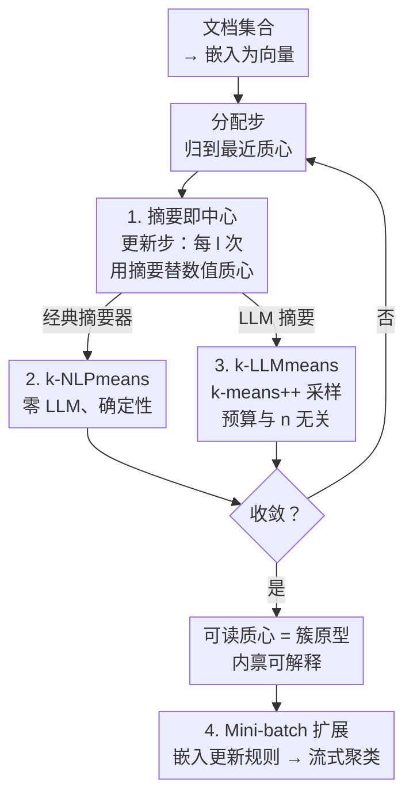

# Summaries as Centroids for Interpretable and Scalable Text Clustering

**会议**: ICLR 2026  
**arXiv**: [2502.09667](https://arxiv.org/abs/2502.09667)  
**代码**: 无  
**领域**: 信息检索  
**关键词**: 文本聚类, k-means, 摘要即中心, 可解释性, 流式聚类, LLM可选

## 一句话总结

提出 k-NLPmeans 和 k-LLMmeans，通过在 k-means 迭代中周期性地用文本摘要替换数值质心（summary-as-centroid），在保持 k-means 标准目标的同时实现可解释的聚类原型，且 LLM 调用量与数据集大小无关。

## 研究背景与动机

- 标准 k-means 在文本上的局限：数值平均模糊了文本语义，质心不可人类理解
- 现有 LLM 聚类方法的问题：
  1. **可扩展性差**：LLM 调用次数随数据集规模增长
  2. **优化不透明**：依赖提示、贪心合并和相似度阈值，无明确目标函数
- 需要一种既可解释又可扩展的聚类方法

## 方法详解

### 整体框架

这篇论文想同时拿到两样平时很难兼得的东西：k-means 的可扩展性，以及让聚类结果「人能看懂」的可解释性。它的做法是只动 k-means 的一个环节——分配步照旧把每个文档分到最近质心，更新步在大多数迭代里仍用标准数值均值，但每隔 $l$ 次迭代把某个簇的数值质心换成「先对该簇文本做摘要、再把摘要嵌回向量空间」的结果。这样质心既能继续参与欧氏距离计算，又同时是一段人类可读的原型描述，整个流程始终在优化标准 k-means 目标。摘要本身可以由零成本的经典 NLP 摘要器产生（k-NLPmeans），也可以由 LLM 产生（k-LLMmeans），还能把这一步嵌进 mini-batch 更新规则做流式聚类。

### 关键设计

**1. 摘要即中心：让质心同时是向量和可读文本**

文本上做数值平均会把语义抹平，得到的质心没人看得懂。作者的做法是周期性地用摘要替换均值：普通迭代仍是 $\boldsymbol{\mu}_j = \frac{1}{|C_j|}\sum_{i \in [C_j]} \mathbf{x}_i$，而每隔 $l$ 次迭代执行 $\boldsymbol{\mu}_j = \text{Embedding}(f_{\text{summarizer}}(C_j))$，即先对簇 $C_j$ 内文本做摘要、再把摘要嵌回向量。摘要本身就是这个簇的原型，可解释性是内禀的；而由于结果仍是一个嵌入向量，后续分配步无需任何改动。实验里即便只在 $l=60$ 处插一次摘要步，也足以把 k-means 拉出局部最优、显著提升精度。

**2. k-NLPmeans：用经典 NLP 摘要器做到零 LLM**

如果担心 LLM 的成本和不确定性，这一版完全不调 LLM，用经典抽取式摘要器 $f_{\text{NLP}}^{(q)}$ 选出 top-$q$ 句拼成摘要，提供三种选择：Centroid-based 算簇内句子嵌入的质心、挑最相似的 $q$ 句；TextRank 把句子建成相似度图、用 PageRank 打分取 top-$q$；LSA-style SVD 对句子嵌入做奇异值分解、按主成分贡献选句。三者都是快速、确定性、可离线运行的，没有任何外部依赖。值得注意的是，这个零 LLM 版本在多数基准上就已接近甚至追平 LLM 版本，说明大部分收益来自「摘要替质心」这个结构本身，而非 LLM 的生成能力。

**3. k-LLMmeans：把 LLM 预算钉死在与数据规模无关**

想要更强的摘要质量时换成 LLM 版，质心更新为 $\boldsymbol{\mu}_j = \text{Embedding}(f_{\text{LLM}}(p_j))$，提示 $p_j = \text{Prompt}(I, \{d_{z_i} \mid z_i \sim [C_j]\}_{i=1}^{m_j})$。关键在于 LLM 只读簇内用 k-means++ 采样出的少量代表性样本，而不是全簇文档——k-means++ 采样比随机采样能产出更好的摘要。每个摘要步固定做 $k$ 次 LLM 调用，所以总调用量是 $O(k \times \text{摘要步数})$，与数据集大小 $n$ 完全脱钩；相比之下 ClusterLLM、LLMEdgeRefine 等方法的调用量是 $O(n)$，会随数据增长而爆炸。

**4. Mini-batch 扩展：低内存的流式聚类**

为了处理数据流，作者把摘要步直接嵌进 mini-batch k-means 的更新规则：按顺序接收批次 $D_1, \ldots, D_b$，每批用 k-NLPmeans 或 k-LLMmeans 处理后增量更新质心，保持 mini-batch k-means 原有的低内存特性。这让「摘要即中心」从静态聚类自然延伸到在线场景，也是论文配套推出 StackExchange 流式聚类基准的原因。

### 损失函数 / 训练策略

无论是普通均值步还是摘要步，优化目标始终是标准 k-means 的簇内平方和

$$\min_{C_1, \ldots, C_k} \sum_{j=1}^k \sum_{i \in [C_j]} \|\mathbf{x}_i - \boldsymbol{\mu}_j\|^2$$

摘要只改变质心的取值方式、不改变目标，因此收敛性质继承自 k-means；一旦某次摘要失败或质量太差，流程会优雅退化为标准均值更新，保证结果不会比原始 k-means 更差。

## 实验关键数据

### 静态聚类（text-embedding-3-small）

| 方法 | Bank77 ACC | CLINC ACC | GoEmo ACC | MASSIVE(D) ACC | MASSIVE(I) ACC |
|------|-----------|----------|----------|---------------|---------------|
| k-means | ~65 | ~77 | ~20 | ~59 | ~52 |
| k-NLPmeans LSA-mult | **67.1** | **80.2** | **22.3** | **63.3** | **55.3** |
| k-LLMmeans single | 67.1 | 78.1 | **24.0** | — | — |
| k-LLMmeans mult | 更高 | 更高 | 更高 | 更高 | 更高 |

### LLM 调用效率对比

| 方法 | LLM 调用复杂度 | 数据依赖 |
|------|-------------|---------|
| ClusterLLM | O(n) | 随数据增长 |
| LLMEdgeRefine | O(n) | 随数据增长 |
| k-NLPmeans | **O(0)** | **零 LLM** |
| k-LLMmeans | **O(k·摘要步数)** | **与 n 无关** |

### 关键发现

1. 即使**单次摘要步**（$l=60$）也能显著提升 k-means 性能
2. k-NLPmeans（零 LLM）在多数基准上接近甚至匹配 k-LLMmeans
3. k-means++ 采样输入文档比随机采样产生更好的 LLM 摘要
4. 跨 4 种嵌入模型、5 种 LLM、3 种经典 NLP 方法的一致性改善
5. 在流式聚类场景中也优于标准 mini-batch k-means

## 亮点与洞察

- **极简改动，效果显著**：仅修改 k-means 的质心更新步骤，其余完全不变
- **LLM 可选设计**：k-NLPmeans 完全不依赖 LLM 即可获得大部分收益
- **可解释性是内禀的**：每个质心就是一段人类可读的文本摘要
- **优雅退化**：摘要质量差时自动退化为标准 k-means，不会比原始更差
- **固定 LLM 预算**：$k \times$ 摘要步数的 LLM 调用量，对大规模数据无压力
- **推出 StackExchange 流式聚类基准**

## 局限性

- 摘要质量受限于摘要器本身的能力
- 对于语义高度重叠的簇，摘要可能无法有效区分
- 需要预指定簇数 $k$（继承 k-means 的限制）
- 摘要步的频率 $l$ 需要调节，虽然实验显示对此不敏感

## 相关工作

- LLM 聚类：ClusterLLM, IDAS, LLMEdgeRefine 等
- 经典文本聚类：k-medoids, spectral clustering, BERTopic
- 流式聚类：mini-batch k-means, 基于 LLM 的在线方法

## 评分

- **新颖性**: ⭐⭐⭐⭐ — 摘要即中心的概念简洁新颖
- **技术深度**: ⭐⭐⭐ — 方法直觉清晰，理论分析较少
- **实验充分性**: ⭐⭐⭐⭐⭐ — 4 数据集 × 4 嵌入 × 5 LLM × 3 NLP 方法，极其全面
- **实用性**: ⭐⭐⭐⭐⭐ — 即插即用、可解释、可扩展，实用价值高

<!-- RELATED:START -->

## 相关论文

- [\[ICLR 2026\] Hierarchical Concept-based Interpretable Models](hierarchical_concept-based_interpretable_models.md)
- [\[ICLR 2026\] Hybrid Deep Searcher: Scalable Parallel and Sequential Search Reasoning](hybrid_deep_searcher_scalable_parallel_and_sequential_search_reasoning.md)
- [\[ACL 2025\] LDIR: Low-Dimensional Dense and Interpretable Text Embeddings with Relative Representations](../../ACL2025/information_retrieval/ldir_low-dimensional_dense_and_interpretable_text_embeddings_with_relative_repre.md)
- [\[AAAI 2026\] Beyond Perplexity: Let the Reader Select Retrieval Summaries via Spectrum Projection Score](../../AAAI2026/information_retrieval/beyond_perplexity_let_the_reader_select_retrieval_summaries_via_spectrum_project.md)
- [\[ICLR 2026\] LightRetriever: A LLM-based Text Retrieval Architecture with Extremely Faster Query Inference](lightretriever_a_llm-based_text_retrieval_architecture_with_extremely_faster_que.md)

<!-- RELATED:END -->
