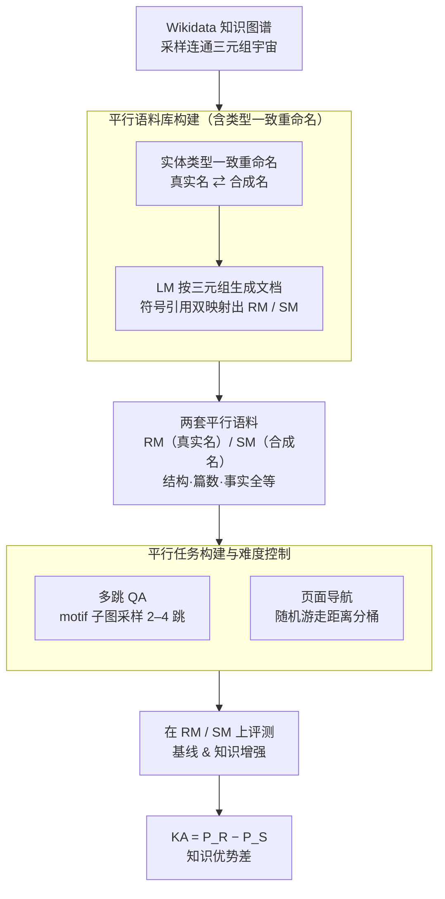

# SynthWorlds: Controlled Parallel Worlds for Disentangling Reasoning and Knowledge in Language Models

**会议**: ICLR 2026  
**arXiv**: [2510.24427](https://arxiv.org/abs/2510.24427)  
**代码**: [GitHub](https://github.com/behavioral-data/synthworlds)  
**领域**: 机器人  
**关键词**: Knowledge Advantage Gap, Reasoning vs Memorization, Parallel Corpora, Multi-hop QA, RAG Evaluation

## 一句话总结

构建结构完全相同但实体分别映射到真实/合成名称的平行语料库，通过对比两个"平行世界"上的任务表现来量化 LLM 的参数化知识优势差距（Knowledge Advantage Gap），发现即使有 RAG 和 CoT 增强，该差距依然持续存在。

## 研究背景与动机

**领域现状**：语言模型在多跳问答、网页导航等复杂任务上表现日益出色，但由于训练数据通常未公开，很难判断性能提升究竟来自推理能力还是对训练数据中事实知识的记忆。现有 benchmark 随训练数据扩大而逐渐失效——例如 MuSiQue（2021年发布）设计时模型无法在无文档条件下回答的问题，如今 Llama-3.3-70B 已能达到 26%+ 的 F1。

**现有痛点**：
1. **人工策展的评估集**：成本高、难扩展，需持续更新，且终会被模型训练数据覆盖
2. **合成数据方法**：要么直接使用现有内容（如小说）导致参数知识泄漏，要么使用过于简单的模板（如 "The job of David is a farmer"），无法测试复杂关联推理
3. **仅测合成任务的局限**：成功只证明模型能推理，失败则模棱两可——可能是推理链太难，也可能是缺少通常依赖的背景知识

**核心矛盾**：现有评估方法无法同时控制任务推理难度和参数化知识的贡献。如果不把推理和记忆在实验上解耦，就无法回答"模型到底在推理还是在回忆"这个根本问题。

**本文方案**：提出 SynthWorlds 框架，从知识图谱自动生成两个结构完全相同的平行语料库：
- **Real-Mapped (RM)**：实体使用真实名称（如 Geoffrey Hinton、University of Toronto），参数化知识可能有用
- **Synth-Mapped (SM)**：实体使用合成名称（如 Caleb Ardent、University of Metrovale），参数化知识完全无用

在两个语料库上构建难度相同的平行任务，通过性能差距 $\text{KA} = P_R - P_S$ 精确量化参数化知识的贡献。

## 方法详解

### 整体框架

SynthWorlds 要解决的问题是：模型在多跳问答、网页导航上变强，到底是真会推理，还是只是把训练时见过的事实背了下来？论文的思路是把"推理难度"和"参数化知识"在实验上彻底拆开。它从 Wikidata 知识图谱采样一组连通的三元组事实当作"宇宙"，再把同一套结构性事实分别实例化成两个平行世界——真实名称的 Real-Mapped (RM) 与合成名称的 Synth-Mapped (SM)。两套语料的文档篇数、token 数、事实数、超链接结构、推理链长度全部一一对应，**唯一变量**是实体名称模型在预训练里见没见过：RM 世界里参数化知识可能帮上忙，SM 世界里则完全无用。于是在同一道题上 RM 与 SM 的性能落差，就能被干净地归因到"记忆"。在这两套对齐语料上各自构建两个难度逐桶对齐的平行任务（多跳 QA、页面导航），最后用性能差 $\text{KA} = P_R - P_S$ 把记忆的贡献量化出来。最终每套语料含 6,290 篇文档、约 150 万 token、161K 条事实，覆盖 956 种实体类型和 354 种关系。

### 关键设计

**1. 平行语料库构建：用类型一致的重命名造出两个"平行世界"**

要拆开推理和记忆，难点在于造数据：直接用现成内容（小说、维基）会泄漏参数化知识，用 "The job of David is a farmer" 这种简单模板又测不出复杂关联推理。SynthWorlds 的语料生成分三步（对应框架图里 `平行语料库构建` 子图）：先从 Wikidata 采样一组**连通且自洽**的三元组事实作为宇宙；再对实体做**系统性重命名**；最后让 LM 依照三元组结构生成文档，文档里先放符号引用占位，再把同一份符号文档分别映射成真实名版（RM）和合成名版（SM），从而保证两套文档逐句结构全等、只差表面名字。

这里最关键的创新是重命名必须保持**本体论类型兼容**：人名换人名（Geoffrey Hinton → Caleb Ardent）、城市换城市（Toronto → Metrovale）、派生名同步替换（University of Toronto → University of Metrovale，而不是退化成 Grandvale Bank）、图书馆仍换成图书馆名（Central Library → Oakwood Public Library 而非 Central Stadium）。如果只是换成随机字符串，名称的长度、词频、是否像专有名词等表面特征就会在 RM 和 SM 之间制造系统差异，污染对参数化知识的归因。类型一致重命名消除的只是"实体特定的事实知识"，而"医院里有医生""物理定律"这类常识与领域通用知识在两个世界里同样可用——这样性能落差才真正来自记忆，而非语言或常识能力的差异。

**2. 平行任务构建与难度控制：在两个世界里造出难度逐桶对齐的任务**

解耦的前提是 RM 和 SM 上的题目"一样难"，否则性能差就无法只归因于知识。论文在共享的图结构上构建两类任务，**用同一个采样子图 $S$ 同时实例化到两套语料**，从结构上保证平行。多跳问答从事实图谱 $G_{facts}$ 采样匹配推理模式（motif）的子图，先为每个三元组 $(u,r,v)$ 用 LM 生成单跳问题（从合成名版起手、校验主语出现在题面），再组合成多跳问题，最后把题面与答案里的实体名重映射出 RM/SM 两版；难度由跳数和 motif 结构复杂度共同决定，6 种 motif 覆盖 2–4 跳、且强制每一跳来自不同文档以逼出真正的跨文档推理，共 1,200 个平行问答对。页面导航则把文档间的符号引用当作超链接构建文档图 $G_{doc}$，Agent 只能靠点击链接或回溯从源页走到目标页，用源-目标页之间的**期望随机游走距离**作为难度代理，按 50–1K、1K–10K、10K–100K、100K–1M、1M–10M 分成 5 个难度桶，共 1,000 个平行导航对。由于同一题在两个世界里结构全等，任何成功率差异都能直接对应到知识而非难度。

**3. Knowledge Advantage Gap 度量体系：把"记忆贡献"写成一个可减的差**

有了对齐的平行任务，记忆的贡献就能被定义为同一任务在两个世界上的性能差 $\text{KA} = P_R - P_S$。论文进一步区分基线与增强两种条件：基线 KA 为 $\text{KA}^{base} = P_R^{base} - P_S^{base}$，刻画纯参数化知识的贡献；增强 KA 为 $\text{KA}^{ext} = P_R^{ext} - P_S^{ext}$，刻画加入 RAG、CoT 等知识增强后残留的差距；差距缩减量 $\text{KA}^{base} - \text{KA}^{ext}$ 则衡量外部增强究竟弥补了多少记忆优势。关键在于基线设置下 $P_S^{base}$ 接近随机水平（合成世界里参数化知识完全无用，QA 约 0% 准确率、导航约等于随机游走），所以 $\text{KA}^{base}$ 几乎等价于"模型对记忆的依赖程度"这一可解释量，也让"增强到底是替代了还是放大了先验知识"变得可测。

## 实验结果

### 主实验

评估 6 个模型：GPT-5-mini、Gemini-2.0-Flash、gpt-oss-20B、gpt-oss-120B、Kimi-K2-Instruct、Kimi-K2-Thinking。

**多跳 QA (F1 Score)**：

| 设置 | GPT-5-mini RM | GPT-5-mini SM | KA |
|------|:---:|:---:|:---:|
| Closed-book | ~20 | ~0 | **~20** |
| One-step RAG | 提升 | 提升但少 | 扩大（-4.0） |
| IRCoT + RAG | 进一步提升 | 显著提升 | **缩小 (+5.2)** |
| Reading Comprehension | 高 | 持平或更高 | ~0 |

关键发现：
- Closed-book 下 SM 准确率几乎为零，验证了合成世界的有效性
- **One-step RAG 反而扩大了 KA 差距**——RAG 对 RM 的增益大于 SM，说明检索器本身也依赖参数化知识
- IRCoT + RAG 通过交替检索和推理能缩小差距，GPT-5-mini 缩小 5.2，Gemini-2.0-Flash 缩小 10.3

**页面导航 (Success Rate)**：

| 设置 | GPT-5-mini RM | GPT-5-mini SM | KA |
|------|:---:|:---:|:---:|
| Links Only | 高 | 低 | **~30** |
| Content + Links | 高 | 中等提升 | ~20.7 (缩小 9.3) |

- 提供页面内容使 SM 性能显著提升，但差距仍然存在
- 分析外部知识引用：Links Only 条件下 48%（GPT-5-mini）、60%（Gemini-2.0-Flash）的推理步骤提及了当前页面未出现的实体

### 消融实验

**推理难度对 KA 的影响**：

| 任务难度 | QA 2-hop KA | QA 4-hop KA | Nav Easy KA | Nav Hard KA |
|----------|:---:|:---:|:---:|:---:|
| Closed-book / Links Only | 较大 | 较小（RM 也下降） | 较小 | 较大 |
| With augmentation | 缩小 | 部分缩小 | 显著缩小 | 部分缩小 |

- 简单 QA 任务中 RM 优势更大（更容易直接回忆），困难任务中 RM 也下降
- Reading Comprehension 设置下 SM 性能持平甚至超过 RM，说明参数化知识可能**干扰**模型基于上下文的推理
- 导航任务中越难的路径，KA 越大——模型依赖参数化知识走"捷径"

## 论文评价

### 优点

1. **实验设计精妙**：平行世界的构建真正实现了推理与记忆的解耦，这在之前的工作中从未完整实现
2. **发现深刻且反直觉**：One-step RAG 扩大 KA 差距的发现揭示了 LM-based 检索器自身对参数化知识的依赖
3. **框架完全自动可扩展**：可任意生成新语料库防止评估集被训练数据覆盖
4. **多模型、多设置、多任务**：6 个模型 × 多种增强策略 × 2 个任务，覆盖全面
5. **Knowledge Advantage Gap 量化框架**清晰实用，可直接应用于其他评估场景

### 不足

1. 当前仅在 Wikidata 构建的语料库上验证，不同知识图谱或领域（如代码、数学）的推广性有待检验
2. 合成名称虽类型一致，但可能引入微妙的分布偏移（如名称统计特性不同），影响部分结果
3. 论文标题和分类为 robotics 但实际内容是 LLM 评估，分类有误

## 评分

⭐⭐⭐⭐⭐ — 实验设计极其精妙，首次真正实现了 LLM 推理与记忆的可控解耦。KA 框架、One-step RAG 扩大差距等发现对 RAG 和 agent 系统的评估有深远影响。

<!-- RELATED:START -->

## 相关论文

- [\[ICLR 2026\] Hybrid Deep Searcher: Scalable Parallel and Sequential Search Reasoning](hybrid_deep_searcher_scalable_parallel_and_sequential_search_reasoning.md)
- [\[ICLR 2026\] G-reasoner: Foundation Models for Unified Reasoning over Graph-structured Knowledge](g-reasoner_foundation_models_for_unified_reasoning_over_graph-structured_knowled.md)
- [\[ACL 2026\] RiTeK: A Dataset for Large Language Models Complex Reasoning over Textual Knowledge Graphs in Medicine](../../ACL2026/information_retrieval/ritek_a_dataset_for_large_language_models_complex_reasoning_over_textual_knowled.md)
- [\[ICLR 2026\] RefTool: Reference-Guided Tool Creation for Knowledge-Intensive Reasoning](reftool_reference-guided_tool_creation_for_knowledge-intensive_reasoning.md)
- [\[ICLR 2026\] TokMem: One-Token Procedural Memory for Large Language Models](tokmem_one-token_procedural_memory_for_large_language_models.md)

<!-- RELATED:END -->
