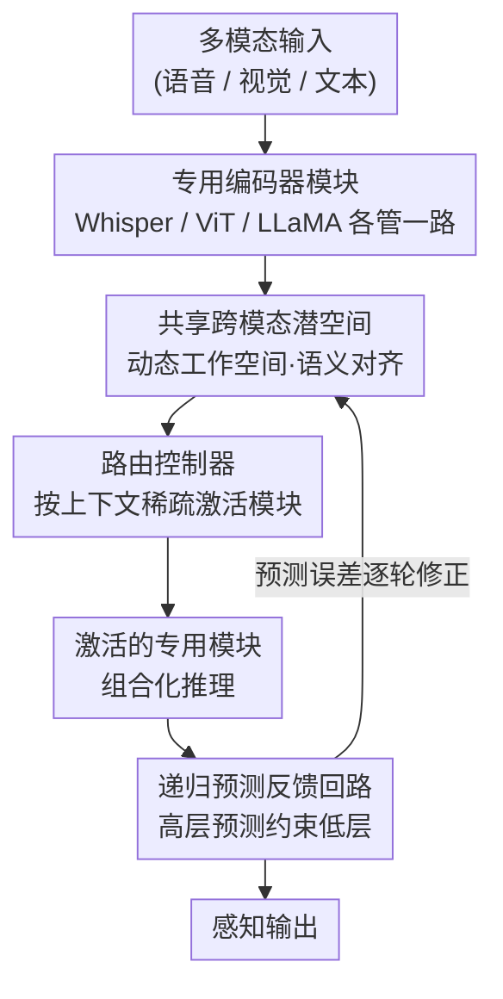

# A Cortically Inspired Architecture for Modular Perceptual AI

**会议**: ICLR 2026  
**arXiv**: [2603.07295](https://arxiv.org/abs/2603.07295)  
**代码**: 无  
**领域**: 认知架构 / 模块化AI  
**关键词**: 皮层启发架构, 模块化感知, 预测编码, 跨模态融合, 稀疏自编码器  

## 一句话总结
从神经科学出发提出皮层启发的模块化感知 AI 架构蓝图，包含专用编码器、共享跨模态潜空间、路由控制器和递归预测反馈回路四个组件，并通过稀疏自编码器实验验证模块化分解可提升域内特征稳定性 (+15.4pp Jaccard 重叠)。

## 研究背景与动机

**领域现状**：当前感知 AI 系统以大规模端到端单体模型 (如 GPT-4V, Gemini) 为主，在多种任务上表现出色。

**现有痛点**：单体模型作为不透明的"黑盒"运行，在分布外场景下表现脆弱，缺乏可解释性和模块化的内部推理能力。无法像人脑一样进行组合泛化和自适应鲁棒推理。

**核心矛盾**：单体架构将所有功能耦合在共享参数空间中，导致内部表征纠缠，难以定向优化，局部更新可能产生意外的下游影响。

**本文目标** 如何将神经科学中的皮层组织原则系统化地引入 AI 架构设计，实现模块化、可解释、鲁棒的感知系统。

**切入角度**：从大脑皮层的三个核心组织原则出发——模块化专业化、预测编码反馈、跨模态整合——提出可操作的架构蓝图。

**核心 idea**：用皮层启发的模块化 + 预测反馈 + 跨模态整合替代单体黑盒网络，让 AI 感知架构更接近人脑的分工协作模式。

## 方法详解

### 整体框架
论文想回答的问题是：怎么把大脑皮层的组织方式搬进感知 AI，让它不再是一个端到端的单体黑盒。给出的答案是一张由四个组件串成的蓝图，整体跑一个"编码 → 协调 → 假设 → 反馈"的迭代循环。输入先经各模态的专用编码器变成特征，汇入一个共享的跨模态潜空间做语义对齐；路由控制器根据当前输入和任务决定该激活哪些模块；高层模块再把自上而下的预测打回低层，用预测误差一轮轮修正感知结果。和单体模型把所有功能压进一套共享参数不同，这里每个组件职责分明、可单独替换，对应皮层"分工 + 反馈"的运作方式。

### 关键设计

**1. 专用编码器模块：为每种模态配独立前端，模拟皮层早期感觉区**

单体模型把视觉、语音、语言全塞进一套纠缠的参数里，导致定向优化困难、局部更新会牵连下游。这里改为给每种模态各配一个独立的专用编码器，直接复用预训练专家网络——Whisper 管语音、ViT 管视觉、LLaMA 管文本——每个模块独立训练和调试。这对应大脑皮层早期感觉区域的模态特异性处理：分工带来两个工程上的好处，一是不必重训整个系统就能加新能力，二是单个模块故障不会拖垮整体。

**2. 共享跨模态潜空间：把各编码器输出汇成一个动态工作空间，而非静态对齐层**

模块各自为政之后，需要一个地方让不同模态的信息对齐和交互。论文借鉴 CLIP / ImageBind 的对比学习对齐思路，把各编码器输出映射到一个共享语义空间，从而支持零样本跨模态迁移。关键区别在定位：它不是一层固定的对齐映射，而是一个**动态工作空间**，类比大脑 STS / PPC 等关联区域的多模态整合功能——在保持模块独立的前提下，按上下文灵活地把相关模态的信息拉到一起，而不是把对齐结果写死。

**3. 路由控制器：按上下文稀疏激活模块，把 MoE 从算力层面挪到推理层面**

有了多个模块，就需要一个机制决定每次该用谁。路由控制器根据输入模态、任务上下文和潜表征特性，动态选择激活哪些专用模块，形式上类似 MoE 的稀疏激活。差别在于运作的层面：MoE 的稀疏激活主要为省算力，而这里把它定位成**模块化推理**的先验，对应大脑按上下文和行为目标灵活分配皮层资源的能力——激活哪些模块本身就是一种结构化的推理决策，而非单纯的计算路由。

**4. 递归预测反馈回路：高层预测约束低层，把"幻觉"重释为可迭代修正的临时假设**

前三个组件都是前馈的，缺了皮层最核心的自上而下回路。论文据预测编码理论补上这一环：高层模块先生成预测假设，约束低层处理，再用预测误差迭代精炼感知。这个回路带来一个观念上的重释——把"幻觉"从一次性错误重新理解为生成式推理过程中的**临时假设**，既然是假设就可以通过反馈逐轮验证和修正，而不必靠事后过滤来补救。

### 损失函数 / 训练策略
架构蓝图层面未给出具体的端到端训练策略。PoC 实验使用标准 MSE 重建损失训练稀疏自编码器。

## 实验关键数据

### 主实验
PoC 实验：在 Mistral-7B 第 15 层激活 (4096 维) 上训练稀疏自编码器 (SAE)，比较单体 vs 模块化分解。

| 配置 | 域内 Jaccard 重叠↑ | 特征-域熵↓ | MSE | 域专属特征% |
|------|------------------|-----------|------|-----------|
| 单体 SAE (4096→1024→4096) | 55.7% | 3.52±0.01 (随机基线) | 0.0031 | 5.0±1.0% |
| 模块化 SAE (4×256) | 71.1% (+15.4pp) | 3.23 (p<0.01) | 0.0026 | 6.2% |

### 消融实验

| 配置 | 域内 Jaccard | 特征-域熵 | 说明 |
|------|------------|----------|------|
| 模块化 (4×256) | 71.1% | 3.23 | 模块化分解 |
| 容量匹配单体 (256) | — | 2.70 | 熵降低部分由容量约束解释 |
| 全单体 (1024) | 55.7% | 3.52 | 基线 |

### 关键发现
- 模块化分解的主要效果是域内一致性提升 (+15.4pp Jaccard)，而非硬性特征分区
- 所有四个域均观察到一致性提升：视觉 +15.0pp、语言 +3.8pp、跨模态 +17.4pp、推理 +25.4pp
- 熵减少部分可被容量约束解释（容量匹配control 熵=2.70 vs 模块化 3.23），但域内稳定性提升独立于容量
- 域专属特征比例很低 (6.2% vs 5.0% 基线)，特征仍以分布式表征为主

## 亮点与洞察
- **幻觉的预测编码重释**：将 AI 幻觉重新定义为预测推理下的临时假设，与生物感知中的梦境、期望驱动错觉等现象类比。这个视角为缓解幻觉提供了新思路——通过迭代验证而非事后过滤
- **模块化不等于硬分区**：PoC 实验表明，皮层式模块化更多体现为域内激活偏向的一致性提升，而非特征的严格互斥分配，这与神经科学观察一致

## 局限与展望
- 实验规模极小 (200 prompts, 4 域, 每域 50)，仅为诊断性验证而非完整架构实现
- 使用地面真值语义标签做路由，未涉及学习路由机制
- 完整架构 (专用编码器+路由控制+预测反馈) 未实现，仅验证了潜特征分解这一个组件
- 缺乏与现有模块化方法 (NMN, MoE, RIM) 的定量对比实验
- 论文更偏 position paper 性质，工程可行性和大规模验证有待后续工作

## 相关工作与启发
- **vs 神经模块网络 (NMN)**: NMN 依赖外部符号解析器确定模块结构，本文提出用学习到的路由控制器替代；但本文未实现这一点
- **vs MoE 模型**: MoE 的专家稀疏激活主要为计算效率，本文将模块化定位为表征和推理先验
- **vs JEPA**: LeCun 的预测架构强调通过预测学习抽象世界模型，与本文的预测反馈原则共鸣，但 JEPA 仍为单体结构

## 评分
- 新颖性: ⭐⭐⭐⭐ 神经科学启发的 AI 架构不算新概念，但系统化地将三个皮层原则整合为可操作蓝图有一定贡献
- 实验充分度: ⭐⭐⭐ 仅有极小规模的 PoC 实验，未实现完整架构
- 写作质量: ⭐⭐⭐⭐⭐ 神经科学和 AI 的综述部分写得清晰，跨学科叙述到位
- 价值: ⭐⭐⭐⭐ 提供了有意义的设计思路，但缺乏实际验证限制了直接价值

<!-- RELATED:START -->

## 相关论文

- [\[ICLR 2026\] Modal Logical Neural Networks for Financial AI](modal_logical_neural_networks_for_financial_ai.md)
- [\[ICML 2026\] Adaptive Querying with AI Persona Priors](../../ICML2026/interpretability/adaptive_querying_with_ai_persona_priors.md)
- [\[ICLR 2026\] AnveshanaAI: A Multimodal Platform for Adaptive AI/ML Education through Automated Question Generation and Interactive Assessment](anveshanaai_a_multimodal_platform_for_adaptive_aiml_education_through_automated_.md)
- [\[NeurIPS 2025\] Geometric Priors for Generalizable World Models via Vector Symbolic Architecture](../../NeurIPS2025/interpretability/geometric_priors_for_generalizable_world_models_via_vector_symbolic_architecture.md)
- [\[NeurIPS 2025\] AgentiQL: An Agent-Inspired Multi-Expert Framework for Text-to-SQL Generation](../../NeurIPS2025/interpretability/agentiql_an_agent-inspired_multi-expert_framework_for_text-to-sql_generation.md)

<!-- RELATED:END -->
