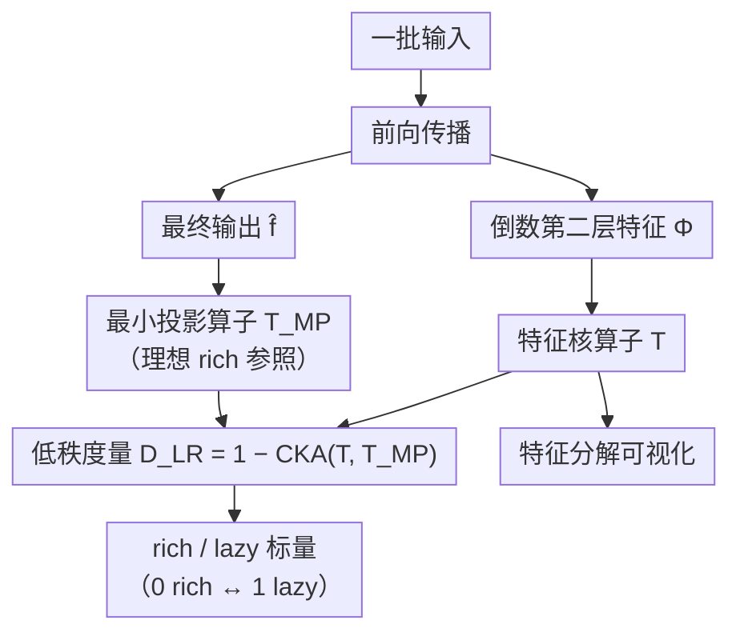

# Decoupling Dynamical Richness from Representation Learning: Towards Practical Measurement

**会议**: ICLR 2026  
**arXiv**: [2410.04264](https://arxiv.org/abs/2410.04264)  
**代码**: 有（附录提供）  
**领域**: 可解释性  
**关键词**: rich dynamics, lazy training, neural collapse, feature learning, CKA

## 一句话总结
提出一种计算高效、与性能无关的动态丰富度度量 $\mathcal{D}_{LR}$，通过比较最后一层前后的激活来衡量 rich/lazy 训练动态，并证明 neural collapse 是该度量的特殊情况。

## 研究背景与动机

**领域现状**：深度学习中的特征学习有两个视角——表征质量视角（特征对下游任务有多好）和动态视角（rich vs lazy 训练）。Rich 训练指的是特征发生非线性动态变换，而 lazy 训练则接近线性模型行为。

**现有痛点**：现有的 richness 度量方法各有缺陷——NTK 变化度量计算代价太大（与参数量的平方成正比）；初始核相似度 $\mathcal{S}_{init}$ 依赖初始核、有时会误判（如 weight decay 导致核变化但并非真正的 rich 训练）；参数范数 $\|\theta\|_F^2$ 只是相关性而非因果关系；neural collapse 的 NC1 指标无界且对输出缩放敏感。

**核心矛盾**：Rich dynamics（动态丰富度）和 better representation（更好表征）经常被混为一谈，用准确率作为 richness 的代理指标。但实际上 rich dynamics 并不总意味着更好的泛化——作者在 MNIST 上展示 rich 训练模型测试准确率仅 10%，而 lazy 模型却达 74.4%。

**本文目标** (1) 独立于性能的 richness 度量；(2) 计算效率高；(3) 能统一解释 neural collapse 等已知现象。

**切入角度**：从 rich 训练的低秩偏差出发——rich 动态下，最后一层之前的特征应该只学到表达学到函数所需的最少维度（低秩结构）。

**核心 idea**：定义最小投影算子 $\mathcal{T}_{MP}$，用 CKA 衡量实际特征核与理想低秩投影之间的距离，値越小说明训练越 rich。

## 方法详解

### 整体框架
本文要解决的是：怎样用一个**不看准确率、又算得动**的标量来判断一个网络训练得有多 rich。作者的切入点是 rich 训练的低秩偏差——动态越 rich，倒数第二层学到的特征就越应该只保留"表达学到的函数所必需的那几个维度"。整条流水线很短：拿一批输入做前向传播，取倒数第二层特征 $\Phi(x) \in \mathbb{R}^p$ 和最终输出 $\hat{f}(x) \in \mathbb{R}^C$；一路把特征组织成函数空间里的特征核算子 $\mathcal{T}$，另一路从输出构造代表"理想 rich 状态"的最小投影算子 $\mathcal{T}_{MP}$，两者用 CKA 量距离得到落在 $[0,1]$ 的低秩度量 $\mathcal{D}_{LR}$（越接近 0 越 rich、越接近 1 越 lazy）；同一组谱还能拆成特征分解可视化，提供标量之外的诊断视角。

### 关键设计

**1. 特征核算子 $\mathcal{T}$：把特征搬进函数空间，摆脱对具体样本的依赖**

richness 不该取决于你恰好用哪批样本来量。为此作者不在向量空间里直接看激活，而是把特征映射成函数空间的核算子 $\mathcal{T} = \sum_{k=1}^{p} |\Phi_k\rangle\langle\Phi_k|$，也就是对所有特征维度做外积求和。再通过 Mercer 定理把它分解出特征值 $\rho_k$ 和特征函数 $e_k$——这一步把"网络学到的特征结构"提炼成一组与具体训练样本无关的谱，后面所有度量都建立在这组谱上。

**2. 最小投影算子 $\mathcal{T}_{MP}$（Definition 1）：给"理想 rich 状态"一个可对照的参照系**

要量 richness，得先说清楚"最 rich 长什么样"。作者把理想状态定义为最小投影算子

$$\mathcal{T}_{MP}[u] = a_1\langle \mathbf{1}|u\rangle\mathbf{1} + a_2 P_{\hat{\mathcal{H}}}(u)$$

其中 $a_1, a_2 > 0$、$\mathbf{1}$ 是常值函数，$P_{\hat{\mathcal{H}}}$ 是到学到函数空间 $\hat{\mathcal{H}} = \text{span}\{\hat{f}_1, \ldots, \hat{f}_C\}$ 的正交投影。它的含义是：在最 rich 的动态下，模型只会学习和使用最少量的特征，最后一层不需要再做额外处理。如果实际的 $\mathcal{T}$ 恰好等于 $\mathcal{T}_{MP}$，就意味着倒数第二层特征只张成了 $C$ 维空间（与输出维度相同），正是 rich 训练低秩偏差的极致体现——这给后面的度量提供了一个明确的"满分参照"。

**3. 低秩度量 $\mathcal{D}_{LR}$：用一个算得动的标量量出离理想态有多远，并顺手解释 neural collapse**

有了参照系，richness 就是实际 $\mathcal{T}$ 与理想 $\mathcal{T}_{MP}$ 的相似度，作者用 CKA 来量并取补：

$$\mathcal{D}_{LR} = 1 - \text{CKA}(\mathcal{T}, \mathcal{T}_{MP})$$

值域天然落在 $[0,1]$，0 表示最 rich、1 表示最 lazy，整个计算不碰标签、不碰初始核、也不碰性能，正好满足"独立于性能"的目标。它"实用"的另一半在于开销极低：只需 $n$ 次前向传播取倒数第二层（$n \times p$）和输出层（$n \times C$）的激活，再做 $\mathcal{O}(npC)$ 的计算；对标准模型 $p \approx 10^3$、$n \approx \mathcal{O}(p)$，总开销 $\mathcal{O}(p^2 C)$，远低于 NTK 类度量那种与总参数量平方成正比的代价，这正是它能真正跑在大模型上的原因。一个值得强调的副产物是它和 neural collapse 的关系：当 $\mathcal{T}$ 退化到 $\mathcal{T}_{MP}$ 时，NC1（类内变异性坍缩）和 NC2（特征收敛到单纯形等角紧框架）会自动成立——也就是说 neural collapse 只是 $\mathcal{D}_{LR}=0$ 的一个特例，本质上是动态现象而非泛化指标。

**4. 特征分解可视化（Eq. 5）：单个标量之外，再给出可诊断的谱视图**

一个标量能排序但解释力有限，所以作者进一步把同一组谱拆开，给出三个互补视角：累积质量 $\Pi^*(k)$ 看前 $k$ 个特征能多好地表达目标函数，累积利用率 $\hat{\Pi}(k)$ 看前 $k$ 个特征被最后一层实际用了多少，相对特征值 $\rho_k/\rho_1$ 看各特征的相对重要性。三者放在一起，能区分"特征质量好但没被用上""被用上但质量差"等情形。特征函数本身通过 Nyström 方法从有限样本近似得到（需 $n > p$ 个样本），整套可视化的计算复杂度同样仅为 $\mathcal{O}(p^2 C)$。

## 实验关键数据

### 主实验：与现有 richness 度量对比

| 度量 | 依赖 | Weight Decay 误判 | Target Downscaling 对齐 | 复杂度 |
|------|------|------|------|------|
| $\mathcal{D}_{LR}$（本文） | 无（不依赖标签/初始核/性能） | ✓ 正确 | ✓ 随 $\alpha$ 一致变化 | $\mathcal{O}(p^2 C)$ |
| $\mathcal{S}_{init}$（初始核距离） | 初始核 | ✗ 误判 | ✗ 不随 $\alpha$ 变化 | $\mathcal{O}(n^2 p)$ |
| $\|\theta\|_F^2$（参数范数） | 参数初始值 | ✗ 误判 | ✗ 不随 $\alpha$ 变化 | $\mathcal{O}(D)$ |
| NC1（neural collapse） | 类标签 | ✗ 幅度不稳定 | ✗ 方向相反 | $\mathcal{O}(np^2)$ |

### 训练因素与 richness 的关系

| 任务 | 架构 | 条件 | 测试准确率↑ | $\mathcal{D}_{LR}$↓ |
|------|------|------|------|------|
| Mod 97 | 2-layer Transformer | Grokking前(step 200) | 5.2% | 0.51 |
| Mod 97 | 2-layer Transformer | Grokking后(step 3000) | 99.8% | 0.11 |
| CIFAR-100 | ResNet18 | lr=0.005 | 66.3% | 0.053 |
| CIFAR-100 | ResNet18 | lr=0.05（最优） | 78.3% | 0.025 |
| CIFAR-100 | ResNet18 | lr=0.2 | 74.5% | 0.039 |
| CIFAR-100 | VGG-16 | 无BN | 21.7% | 0.66 |
| CIFAR-100 | VGG-16 | 有BN | 72.0% | 0.073 |

### 消融实验

| 设置 | 测试准确率 | $\mathcal{D}_{LR}$ | 说明 |
|------|---------|------|------|
| MNIST rich(全反传) | 10.0% | 0.0087 | Rich≠好泛化 |
| MNIST lazy(仅末层) | 74.4% | 0.63 | Lazy但泛化更好 |
| CIFAR-10 无标签打乱 | 95.0% | 0.031 | Rich + 好泛化 |
| CIFAR-10 全部标签打乱 | 9.5% | 0.034 | Rich 但无泛化 |

### 关键发现
- Grokking 是 lazy→rich 的转变：$\mathcal{D}_{LR}$ 从 0.51 降到 0.11，首次独立于性能进行验证
- BN 的作用重新定义：VGG-16 无 BN 时是 lazy（0.66），有 BN 后变 rich（0.073），为理解 BN 机制提供新视角
- 最优学习率对应最 rich 训练：ResNet18 在 CIFAR-100 上 lr=0.05 时 $\mathcal{D}_{LR}$ 最小
- 特征质量与特征强度在训练过程中相关：大特征值对应的特征质量提升更快

## 亮点与洞察
- 将 neural collapse 统一为 richness 的特例——NC1 和 NC2 都可以从 $\mathcal{T} = \mathcal{T}_{MP}$ 推导出来，意味着 neural collapse 本质上是动态现象而非泛化指标
- "Rich ≠ Better"的实证清楚展示 rich 训练可以把特征集中在虚假编码上反而泛化失败，打破了"rich 训练必然更好"的常识
- BN 促进 rich dynamics 的发现可以迁移到研究其他 normalization 技术对训练动态的影响

## 局限与展望
- 仅关注最后一层特征，忽略中间层动态（作者在附录讨论了这一点）
- 要求目标函数正交且各向同性，不涵盖不平衡标签场景
- 可视化方法依赖 Nyström 近似，需要 $n > p$ 个样本
- 可以扩展到回归任务和生成模型中的 richness 分析

## 相关工作与启发
- **vs NTK-based metrics**: NTK 方法理论上更完整但计算不可行，本文用最后一层核做近似实用性大幅提升
- **vs Neural Collapse (Papyan et al., 2020)**: NC 是本文方法的特例，但 NC 依赖类标签且指标无界
- **vs Feature Learning Theory (Yang & Hu, 2021)**: μP 框架从理论预测 rich/lazy 转变，本文提供了实证度量工具

## 评分
- 新颖性: ⭐⭐⭐⭐ 将 richness 度量与 neural collapse 统一的理论框架很新颖
- 实验充分度: ⭐⭐⭐⭐ 多种架构、数据集和训练因素的全面实验
- 写作质量: ⭐⭐⭐⭐⭐ 论文结构清晰，图表高质量，直觉解释好
- 价值: ⭐⭐⭐⭐ 作为诊断工具有实际价值，理论上桥接了 rich dynamics 和表征学习

<!-- RELATED:START -->

## 相关论文

- [\[ICLR 2026\] Decomposing Representation Space into Interpretable Subspaces with Unsupervised Learning](decomposing_representation_space_into_interpretable_subspaces_with_unsupervised_.md)
- [\[ICLR 2026\] The Geometry of Reasoning: Flowing Logics in Representation Space](the_geometry_of_reasoning_flowing_logics_in_representation_space.md)
- [\[ICLR 2026\] AdAEM: An Adaptively and Automated Extensible Measurement of LLMs' Value Difference](adaem_an_adaptively_and_automated_extensible_measurement_of_llms_value_differenc.md)
- [\[NeurIPS 2025\] Time-Evolving Dynamical System for Learning Latent Representations of Mouse Visual Cortex](../../NeurIPS2025/interpretability/time-evolving_dynamical_system_for_learning_latent_representations_of_mouse_visu.md)
- [\[ICML 2026\] Cognitive Fatigue in Autoregressive Transformers: Formalization and Measurement](../../ICML2026/interpretability/cognitive_fatigue_in_autoregressive_transformers_formalization_and_measurement.md)

<!-- RELATED:END -->
