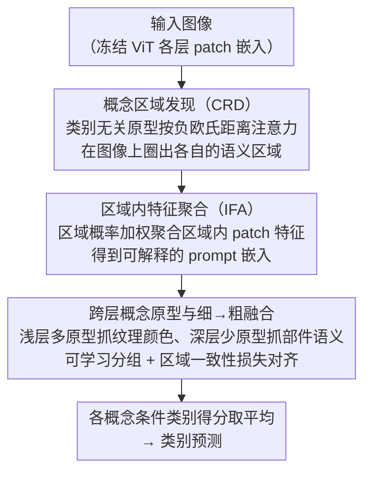

# Exploring Interpretability for Visual Prompt Tuning with Cross-layer Concepts

**会议**: ICLR 2026  
**arXiv**: [2503.06084](https://arxiv.org/abs/2503.06084)  
**代码**: [github.com/ThomasWangY/IVPT](https://github.com/ThomasWangY/IVPT)  
**领域**: 可解释性  
**关键词**: Visual Prompt Tuning, 可解释性, 概念原型, 跨层融合, 细粒度分类

## 一句话总结
提出IVPT（Interpretable Visual Prompt Tuning），通过跨层类别无关概念原型将抽象visual prompt关联到人类可理解的语义区域，在保持参数高效微调优势的同时，首次实现了visual prompt的可解释性，在CUB-200等细粒度分类基准上同时提升解释一致性（+8.4%）和准确率。

## 研究背景与动机

**领域现状**：Visual Prompt Tuning（VPT）已成为适配预训练视觉模型到下游任务的主流方法，通过在Transformer输入层插入少量可学习token实现参数高效微调。现有方法如VPT-Deep、E2VPT、Gated Prompt Tuning表现优异但prompt是黑盒向量。

**现有痛点**：这些prompt是不受约束的抽象嵌入，无法提供人类可理解的决策解释。在医疗诊断、自动驾驶等安全关键领域，缺乏可解释性严重限制了AI系统的可信赖性。现有可解释方法（如ProtoPNet、TesNet）只关注最后一层特征，无法解释多层prompt。

**核心矛盾**：VPT方法的prompt在多个Transformer层学习，但现有原型方法只能解释单层特征；已有方法学习类别特定原型，无法分析跨类别共享概念。

**本文目标**
   - 将抽象prompt嵌入关联到人类可理解的视觉概念
   - 在多个网络层实现prompt的跨层可解释性
   - 学习类别无关的共享概念原型

**切入角度**：将每个prompt定义为图像中某个语义区域的聚合特征（而非任意向量），该区域由概念原型通过注意力机制发现，在浅层用更多原型捕获细粒度特征，深层用更少原型捕获粗粒度语义。

**核心 idea**：用跨层类别无关概念原型替代黑盒prompt向量，每个prompt通过概念区域发现和区域内特征聚合机制，绑定到图像中的可解释语义区域。

## 方法详解

### 整体框架

IVPT 想解决的问题很具体：VPT 在 Transformer 各层插入的 prompt 是一堆不受约束的抽象向量，没法告诉人它到底"看"了图像的哪一块。IVPT 的思路是冻结预训练 ViT，在每一层用一组跨层概念原型把 prompt 重新"接地"——先由概念原型在图像上发现各自负责的语义区域（CRD），再把区域内的 patch 特征聚合成对应的 prompt 嵌入（IFA），并把浅层细粒度 prompt 逐步融合成深层粗粒度 prompt。最终每个概念给出一个条件类别得分，取平均作为预测，于是每条 prompt 都对应到一块可视化的语义区域，解释性内建在 prompt 的构造过程里而非事后补打。

### 关键设计

**1. 概念区域发现（Concept Region Discovery, CRD）：把抽象 prompt 锚定到图像里的一块语义区域**

VPT 原本的 prompt 是黑盒向量，无从解释。CRD 让每个概念原型 $\mathbf{q}_k$ 去图像上"圈地"：计算原型与各 patch 嵌入之间的负欧氏距离注意力，经 Softmax 归一化后再加一个可学习空间偏置 $b_{k,ij}$，得到该原型的概念注意力图 $\mathbf{A}$：

$$a_{k,ij} = \frac{\exp(-\|\mathbf{e}_{ij} - \mathbf{q}_k\|^2)}{\sum_l \exp(-\|\mathbf{e}_{ij} - \mathbf{q}_l\|^2)} + b_{k,ij}$$

每个 patch 被分配给注意力最高的那个概念，从而拼出区域图 $\mathbf{R}$。这里的原型是**类别无关**的，所以它捕获的是跨类别共享的语义概念（如不同鸟类的"翅膀"、不同车的"车轮"），比类别特定原型更能揭示模型对通用视觉概念的学习，也让同一个概念区域在不同图像间可比。

**2. 区域内特征聚合（Intra-region Feature Aggregation, IFA）：让 prompt 成为某块区域的"代表"而非任意向量**

有了区域图后，IFA 把落在该概念区域里的 patch 特征聚合起来，作为这个概念对应的 prompt 嵌入——用区域概率加权的 patch 特征均值：

$$\mathbf{p}_k = \frac{\sum_{i,j} \mathbf{z}_{k,ij}}{\sum_{i,j} r_{k,ij}}$$

这样得到的 prompt 不再是优化器自由学出的任意向量，而是图像中某块语义区域的特征汇总，天然可解释；后续实验也显示这种区域条件化的特征比全局特征更具判别力。

**3. 跨层概念原型与细→粗融合：模拟人类从局部到全局的视觉推理**

现有原型方法只解释最后一层，而 VPT 的 prompt 分布在多层。IVPT 在不同 Transformer 层放不同数量的原型——浅层多（如 17 个）、深层少（如 8 个），浅层用更多原型抓纹理、颜色这类低级、细粒度属性，深层用更少原型抓部件、整体这类高级语义。层与层之间通过一个可学习分组层（线性层 + Gumbel-Softmax）把细粒度 prompt 分组，组内取均值再过 MLP 得到深层 prompt。为保证"局部组合"确实对应"全局区域"，引入概念区域一致性损失 $\mathcal{L}_{con}$（KL 散度），约束细粒度区域的组合与粗粒度区域对齐。这条细→粗的路径正是消融里增益最大的部分。

### 损失函数 / 训练策略
- 总损失：$\mathcal{L} = \lambda_{cls}\mathcal{L}_{cls} + \lambda_{ps}\mathcal{L}_{ps} + \lambda_{con}\mathcal{L}_{con}$
- $\mathcal{L}_{cls}$：分类交叉熵（每个概念条件得分的平均）
- $\mathcal{L}_{ps}$：部件塑形损失（确保区域不重叠、前景覆盖、连通性等）
- $\mathcal{L}_{con}$：跨层区域一致性损失（KL散度）
- 所有 $\lambda$ 均设为1，Backbone冻结仅训练prompt相关参数

## 实验关键数据

### 主实验（CUB-200-2011，DinoV2-B backbone）

| 方法 | 一致性(Con.) | 稳定性(Sta.) | 准确率(Acc.) |
|------|------------|------------|------------|
| ProtoPNet | 27.6 | 57.0 | 85.8 |
| Huang et al. | 68.6 | 71.4 | 89.9 |
| VPT-Deep | 14.6 | 39.5 | 89.1 |
| VPT-Deep (w/ Proto.) | 70.2 | 72.5 | 90.3 |
| **IVPT** | **75.3** | **75.9** | **90.8** |

IVPT在所有三个维度（可解释性+准确率）上均为最优。

### 消融实验（DinoV2-B, CUB-200）

| 配置 | Con. | Sta. | Acc. |
|------|------|------|------|
| Baseline（仅最后一层，全局注意力） | 62.7 | 64.3 | 88.4 |
| + 空间偏置图 | 63.5 | 66.7 | 88.7 |
| + 区域内特征聚合（IFA） | 65.4 | 68.3 | 89.8 |
| + 跨层原型 | 70.4 | 70.9 | 90.5 |
| + 细到粗prompt融合 | **75.3** | **75.9** | **90.8** |

### 关键发现
- **跨层结构贡献最大**：加入跨层原型+融合后一致性从65.4→75.3（+9.9），是所有组件中增益最大的
- **IFA对准确率贡献最大**：只加IFA后准确率从88.7→89.8（+1.1%），说明区域条件化的特征比全局特征更有判别力
- **在PartImageNet和PASCAL-Part上泛化良好**：IVPT分别达63.2/72.6的一致性分，大幅超越ProtoPool和Huang et al.
- **人类评估**：20人评估，97.5%概念标注准确率，细节保留4.7/5，语义抽象4.8/5，过渡自然度4.8/5
- **医学影像适用性**：在Gleason-2019前列腺癌分级数据集上，IVPT能有效识别腺腔、病变腺泡等关键分级特征

## 亮点与洞察
- **首次为VPT建立可解释范式**：将prompt从"黑盒向量"转变为"图像区域的语义代表"，这个思路优雅且实用。以前VPT的可解释性只能靠后验分析（如attention map），IVPT将解释性内建到prompt构造过程中
- **类别无关原型的优势**：跨类别共享概念（如不同鸟类的"翅膀"、不同飞机的"尾翼"）不仅提升了解释一致性，还能发现跨域通用的视觉概念，这对AI辅助知识发现有重要价值
- **跨层细→粗融合模拟人类认知**：浅层捕获纹理/颜色，深层捕获部件/整体，通过可学习分组建立层间关系，这与人类从细节到整体的视觉推理过程一致

## 局限与展望
- 概念原型依赖领域内学习，迁移到差异较大的新领域时需要重新训练
- 在DinoV2-S这样的小backbone上，一致性略低于Huang et al.（-2.2%），说明小模型容量不足以同时维持可解释性和准确率
- 每层固定原型数（17/14/11/8）是手动设定的超参，自动确定最优原型数可能进一步提升效果
- **可改进方向**：将IVPT扩展到文本-视觉多模态prompt（如CLIP），利用文本语义辅助概念发现

## 相关工作与启发
- **vs VPT-Deep (Jia et al., 2022)**：VPT-Deep准确率高但一致性仅14.6，IVPT在可解释性上有5倍提升同时准确率还更高（90.8 vs 89.1）
- **vs Huang et al. (2023)**：最强的传统原型方法，IVPT在CUB-200的DinoV2-B上一致性超出+6.7%，且IVPT是参数高效的（冻结backbone），Huang et al.需要全模型微调
- **vs Prompt-CAM (Chowdhury et al., 2025)**：Prompt-CAM学习类别特定prompt，无法分析跨类别共享概念，且不具备跨层语义结构

## 评分
- 新颖性: ⭐⭐⭐⭐⭐ 首次将可解释性内建到VPT框架中，概念原型→prompt的设计思路全新
- 实验充分度: ⭐⭐⭐⭐ 多backbone、多数据集、消融、人类评估覆盖全面，但主要集中在细粒度分类，通用分类场景验证不足
- 写作质量: ⭐⭐⭐⭐ 方法描述清晰，公式推导完整，可视化丰富
- 价值: ⭐⭐⭐⭐ 为VPT可解释性开辟新方向，对安全关键领域的AI应用有实际意义

<!-- RELATED:START -->

## 相关论文

- [\[NeurIPS 2025\] Understanding Prompt Tuning and In-Context Learning via Meta-Learning](../../NeurIPS2025/interpretability/understanding_prompt_tuning_and_in-context_learning_via_meta-learning.md)
- [\[ICLR 2026\] Concepts' Information Bottleneck Models](concepts_information_bottleneck_models.md)
- [\[ACL 2026\] Evian: Towards Explainable Visual Instruction-tuning Data Auditing](../../ACL2026/interpretability/evian_towards_explainable_visual_instruction-tuning_data_auditing.md)
- [\[ICLR 2026\] Cross-Modal Redundancy and the Geometry of Vision-Language Embeddings](cross-modal_redundancy_and_the_geometry_of_vision-language_embeddings.md)
- [\[ICLR 2026\] Evolution of Concepts in Language Model Pre-Training](evolution_of_concepts_in_language_model_pre-training.md)

<!-- RELATED:END -->
