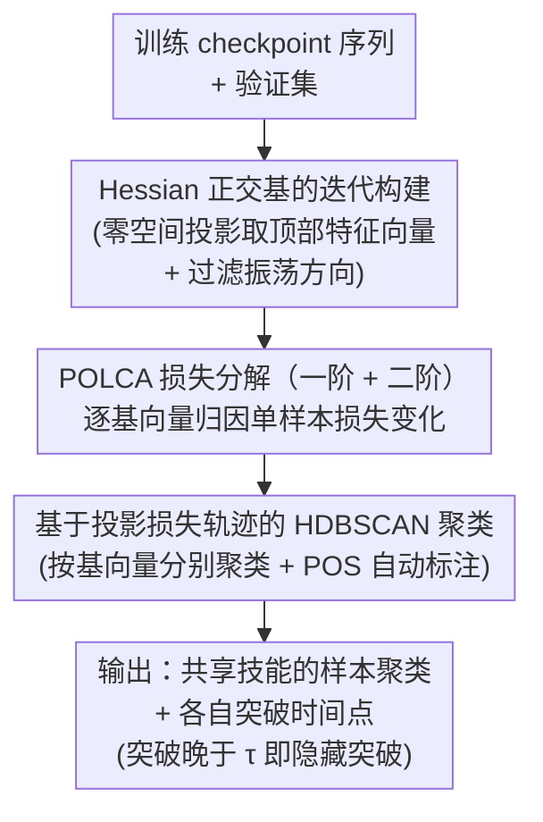

# Hidden Breakthroughs in Language Model Training

**会议**: ICLR 2026  
**arXiv**: [2506.15872](https://arxiv.org/abs/2506.15872)  
**代码**: [GitHub](https://github.com/skangasl/POLCA)  
**领域**: 可解释性  
**关键词**: 训练动力学, 隐藏相变, 损失分解, 无监督可解释性, Hessian特征向量

## 一句话总结

提出 POLCA（Projection Oriented Loss Change Allocation）——一种沿低秩训练子空间任意正交基分解单样本损失变化的方法，从看似平滑的训练损失曲线中揭示出大量隐藏的概念性突破（hidden breakthroughs），将训练可解释性从"先定义技能再观测"翻转为"先分解再自动发现技能"。

## 研究背景与动机

**领域现状**：语言模型训练过程中会经历各种突然的相变——上下文学习能力的涌现、语法结构的习得、层级泛化能力的出现等。这些相变在理解模型学习机制、指导训练策略（如数据选择、学习率调度）方面具有重要价值。然而实际训练中，聚合损失曲线极其平滑，大量相变被掩盖在单一标量指标之下。

**现有痛点**：已有识别相变的方法几乎全部采用**自顶向下**范式——研究者先预定义一个概念或技能（如"进位"、"主语-谓语一致"），再监测该技能在训练过程中的动态变化。这种方法既无法发现未被预定义的新技能，也无法处理单个样本同时依赖多个技能的情况（polygenic scaling effects）。

**核心矛盾**：平滑的聚合损失曲线 ≠ 没有突破发生。Saxe et al. (2019) 的理论早已预测：多个不同时间发生的 sigmoidal 相变叠加后会产生一条平滑曲线。问题在于缺少从平滑曲线中反向恢复这些隐藏相变的工具。

**本文目标** (1) 如何在不预定义技能的前提下自动发现训练中的概念突破？(2) 如何处理单个样本同时经历多个技能突破的纠缠问题？(3) 如何将损失分解到可解释的梯度方向上？

**切入角度**：作者观察到训练子空间是低秩的，且线性连接的 checkpoint 保留语义能力，暗示线性分解在概念层面是有意义的。如果将损失变化投射到 Hessian 高曲率方向上，每个方向可能对应一种"技能"的获取，由此可以将单个样本的损失变化解耦为多个独立方向上的变化。

**核心 idea**：沿 Hessian 特征向量构建的正交基分解每个样本的损失变化，再对投影损失轨迹聚类，即可无监督地发现隐藏在平滑训练曲线中的概念性突破。

## 方法详解

### 整体框架

POLCA 要解决的事情很直接：聚合损失曲线把无数个体相变压成了一条平滑曲线，它想把这条曲线反向拆开，看清每个样本在训练里到底什么时候、沿哪个方向发生了突破。整个 pipeline 接收一串训练 checkpoint 和一个验证集，输出的是"按共享学习事件分组的样本聚类 + 各自的突破时间点"。中间走三步：先从 Hessian 矩阵里构造一组可解释的正交基，把高维参数运动压到一个低秩子空间；再沿这组基把每个样本的损失变化逐方向分解（这一步就是 POLCA）；最后按各样本在每个方向上的投影损失轨迹做聚类，相似轨迹归到一起，就自动浮现出一类"共享同一技能"的数据。

这里"突破"有明确定义：把它刻画成损失加速度的极大点，$\text{break}(f, x, \Delta) = \arg\max_t \big([f(x, t+\Delta) - f(x,t)] - [f(x,t) - f(x,t-\Delta)]\big)$。而一个聚类如果平均突破起点晚于阈值 $\tau$（$\tau$ 标记聚合损失已进入平坦区的时间），它就是一次"隐藏突破"——精确损失早已看不出动静，投影损失上却还在剧烈变化。POLCA 全部价值就在于把这种被平滑曲线吞掉的突破重新捞出来。

### 关键设计

**1. Hessian 正交基的迭代构建：给损失分解找一组有语义的方向**

要把损失变化拆到"有意义"的方向上，第一步就得有一组好的基。POLCA 不用参数轴（高维空间里单个参数轴几乎没有语义），而是沿 Hessian 特征向量来建：在 $T$ 个 checkpoint 处依次取 Hessian。每到一个新 checkpoint，先把它的 Hessian 投影到已有基的零空间里（把之前已经捕获的方向排除掉），再从投影后的 Hessian 取前 $k$ 个特征向量加进基，最终得到一个 $Tk$ 维子空间。之所以盯着 Hessian 顶部特征向量，是因为它们对应最大曲率方向，往往就是模型关键决策边界所在；零空间投影则保证每个新 checkpoint 都贡献新信息、不和老方向重复。最后还有一道过滤：把"振荡方向"剔掉——那些平均投影损失在整段训练里是上升而非下降的基向量只代表局部抖动，不是长期学习，留下来只会污染后面的聚类。

**2. POLCA 损失分解（一阶 + 二阶）：把单个样本的损失变化逐方向归因**

有了基，就能把每个样本在每步的损失变化归因到各个方向上。POLCA 本质是在经典 LCA（Loss Change Allocation）上做了三处精确改动。其一，LCA 只沿单个参数轴分解，POLCA 允许任意正交基向量 $b$；其二，LCA 对整个数据集聚合，POLCA 下沉到单个样本 $x$，这样才可能发现"只影响某个数据子集"的突破；其三，因为基取自 Hessian 高曲率方向，一阶 Taylor 近似在这里误差会很大，于是补了一个二阶修正项。一阶 POLCA 写作

$$\text{POLCA}_1(x, b; \theta_t) = \langle b, \nabla_\theta L(x;\theta_t)\rangle \, \langle b, \theta_{t+1}-\theta_t\rangle,$$

二阶项则用一个省钱的近似：把全局 Hessian 的特征值按该样本的损失变化比例缩放，借此估计单样本 Hessian，从而绕开"逐样本算一遍 Hessian"那种灾难性开销。这套修改的回报很实在——在合成进位实验里，仅靠 Hessian 方向（而非参数轴）就把进位技能的同质性从 LCA 的 0.792 拉到 0.973，二阶修正还在理论上给出更紧的 Lagrange 误差上界。

**3. 基于投影损失轨迹的 HDBSCAN 聚类：让共享技能的样本自己聚到一起**

最后一步是把"经历了相似学习事件"的样本找出来。对每个基向量 $b$ 和样本 $x$，把每步的 POLCA 累加成一条累积投影损失轨迹

$$L_b(x, \theta_t) = \sum_{i=0}^{t-1} \text{POLCA}(x, b; \theta_i),$$

这就成了一条一维时间序列。然后对每个基向量分别用 HDBSCAN 去聚这些轨迹，聚类前先把投影损失上升的样本滤掉（它们在该方向上不是正向学习），聚完再用 POS 标签模板自动给每个聚类贴可解释标签。选 HDBSCAN 而不是 K-Means，是因为它能处理变密度聚类（曲线形状相似但绝对值不同）并识别离群点；而"按基向量分别聚类"这一点很关键——同一个 token 可以在不同方向上被分进不同聚类，正好对应一个样本同时依赖多个技能的纠缠情况。

## 实验关键数据

### 主实验一：合成算术加法任务

3 层 9M 参数 Transformer，训练 3 位数加法（如 "342+578=920"）。数据包含 4 种数字位技能和 1 种进位（carrying）技能。数字位技能的损失曲线差异大（容易直接聚类），但进位技能在精确损失中不可见。

| 分解策略 | 最大进位同质性↑ | 隐藏突破比例↑ | 能否恢复进位技能 |
|---------|:---:|:---:|:---:|
| 精确损失 | 0.514 | 0.0 | ✗ |
| 精确损失变化量 | 0.524 | 0.0 | ✗ |
| LCA (Lan et al., 2020) | 0.792 | 0.019 | 部分 |
| **POLCA（本文）** | **0.973** | **0.355** | **✓** |

POLCA 在前 2 个基向量上即可同时恢复数字位技能和进位技能，基向量 #2 的聚类中进位同质性达到 0.90。相比之下，精确损失聚类完全无法区分需要进位和不需要进位的样本。

### 主实验二：英语语言建模

3 层 40M 参数模型，在 Wikipedia 数据上训练。30 个基向量中过滤振荡方向后剩 26 个，其中 22 个有至少一个可简单标注的可解释聚类。

| 基向量 | 聚类标签 | 聚类内容示例 | 突破类型 |
|:---:|------|------|------|
| #13 聚类1 | 句子首从句后介词 | "from"、"and"、"after" | 隐藏突破 |
| #13 聚类2 | 连续换行符 | 段落结尾的 "\n\n" | 早期突破 |
| #13 聚类3 | 括号短语后逗号 | 逗号后的列举项 | 隐藏突破 |
| #23 聚类1 | 同位名词短语 | 如 "Air Force Instruction 36-2406: Officer and..." | 隐藏突破 |
| #23 聚类2 | 非同位逗号后短语 | 列表项、年份列举 | 反向隐藏突破 |

最有趣的发现是基向量 #23 的"镜像现象"：聚类 1（同位名词短语）和聚类 2（非同位逗号后短语）在投影损失上呈现完全相反的运动方向——同位语技能的获取伴随着模型对非同位逗号后 token 预测能力的短暂下降，说明这两种语法构造共享同一个梯度方向但竞争性学习。

### 消融与对比

| 消融配置 | 进位同质性 | 说明 |
|---------|:---:|------|
| POLCA 完整模型（二阶） | 0.973 | 最优 |
| POLCA 一阶 | ~0.96 | 差异很小，但理论上界更差 |
| 不过滤振荡方向 | 显著下降 | 振荡方向产生噪声聚类 |
| K-Means 替代 HDBSCAN | 较差 | K-Means 无法处理变密度和离群点 |
| LCA（参数轴分解） | 0.792 | 参数轴语义性远弱于 Hessian 方向 |

### 关键发现

- **相变无处不在**：验证了 Nanda et al. (2023) 的猜想。即便在聚合损失已完全平坦的训练后期，仍有 35.5% 的 POLCA 聚类展示出隐藏突破
- **技能分离在梯度空间中自然发生**：不同技能（如进位 vs 数字位）沿不同 Hessian 方向被学习，这为"技能"概念提供了梯度几何层面的操作化定义
- **竞争性学习模式**：某些语法构造（同位语 vs 列举项）沿同一基向量呈现对立学习动态，损失此消彼长
- **线性分解的有效性**：尽管只用了线性方法，恢复的聚类具有高度可解释性（22/26 基向量产生可标注聚类），支持训练子空间的线性可分性假设

## 亮点与洞察

- **范式翻转——从 top-down 到 bottom-up**：将训练动力学分析从"先假设技能再验证"翻转为"先分解再自动发现"。这与 SAEs 在表示空间做的事情平行：SAE 无监督发现表示中的特征，POLCA 无监督发现训练过程中的技能。这种对称性暗示两者可以互补
- **POLCA 分解的优雅性**：仅对 LCA 做了三个精确修改（任意基→单样本→二阶），每个修改都有清晰的理论动机，整体方法复杂度可控。二阶修正项通过全局 Hessian 特征值按样本比例缩放来近似，回避了逐样本计算 Hessian 的灾难性成本
- **"镜像聚类"现象**：同一基向量上两个聚类的投影损失呈反向运动，说明模型在学习某种语法区分时会暂时"牺牲"相近构造的预测能力。这一发现对理解训练中的能力权衡（capability trade-offs）有重要启发，可能指导更精细的数据课程设计

## 局限与展望

- **模型规模瓶颈**：仅在 9M 和 40M 参数模型上验证。现代 LLM 动辄数十亿参数，在每个 checkpoint 计算 Hessian 特征向量的成本极高，直接扩展不现实。可能的解法包括用随机投影近似 Hessian、仅对 LoRA 子空间做分解
- **基的多样性受限**：当前只用 Hessian 特征向量作为基。其他可能的基包括 PCA 主成分（训练轨迹的主方向）、SAE 解码器方向、任务梯度方向等。不同基可能揭示不同粒度的技能
- **线性假设的局限**：假设每种技能对应参数空间中的一个线性方向。复杂的组合性技能（如需要同时掌握语法 + 语义的能力）可能跨越多个方向，线性基无法直接捕获这种交互
- **聚类的自动标注覆盖率有限**：当前基于 POS 标签模板的自动标注仅覆盖有简单语法模式的聚类，更抽象的语义聚类需要人工审查。可考虑用 LLM 做自动标注
- **缺少直接的下游应用验证**：论文提到 POLCA 可指导数据选择和学习率调度，但未实际实验。验证 POLCA 发现的突破时间点是否能改善训练效率将大幅提升实用价值

## 相关工作与启发

- **vs LCA (Lan et al., 2020)**：LCA 沿单个参数轴分解聚合损失，语义性弱且不支持单样本分析。POLCA 在三个维度上推广（任意基、单样本、二阶），在进位技能恢复上同质性从 0.792 提升到 0.973
- **vs Skill-It (Chen et al., 2024b)**：Skill-It 分析不同预定义技能的损失曲线和技能间依赖关系。本文不需要预定义技能，是真正的无监督方法。Skill-It 的技能依赖图可以作为 POLCA 发现的验证工具
- **vs SAEs (Sparse Autoencoders)**：SAE 在模型表示空间中无监督发现特征，POLCA 在训练动力学空间中无监督发现技能。两者互补——SAE 回答"模型学到了什么表示"，POLCA 回答"模型何时学到了这些东西"
- **vs Singular Learning Theory (Watanabe, 2010)**：SLT 从理论上预测模型训练中存在相变（通过分析奇异点结构）。POLCA 提供了实证发现这些相变的实用工具。Ma et al. (2022) 的多尺度损失面理论为 POLCA 的分解 + 解聚合策略提供了直接的理论支撑

## 评分

- 新颖性: ⭐⭐⭐⭐⭐ 从 top-down 翻转为 bottom-up，POLCA 三重推广设计优雅，隐藏突破概念本身就很有启发性
- 实验充分度: ⭐⭐⭐⭐ 合成任务验证充分但自然语言实验仅 40M 规模，缺少更大模型和下游应用验证
- 写作质量: ⭐⭐⭐⭐⭐ 理论动机链清晰完整，从多个角度论证方法合理性，图表直观
- 价值: ⭐⭐⭐⭐ 开辟了训练时可解释性的新方向，但规模限制使其暂时停留在分析工具层面

<!-- RELATED:START -->

## 相关论文

- [\[ICLR 2026\] Evolution of Concepts in Language Model Pre-Training](evolution_of_concepts_in_language_model_pre-training.md)
- [\[ACL 2026\] Linear Probes Detect Task Format, Not Reasoning Mode in Language Model Hidden States](../../ACL2026/interpretability/linear_probes_detect_task_format_not_reasoning_mode_in_language_model_hidden_sta.md)
- [\[ICLR 2026\] Emergence of Superposition: Unveiling the Training Dynamics of Chain of Continuous Thought](emergence_of_superposition_unveiling_the_training_dynamics_of_chain_of_continuou.md)
- [\[ICLR 2026\] Towards Understanding Subliminal Learning: When and How Hidden Biases Transfer](towards_understanding_subliminal_learning_when_and_how_hidden_biases_transfer.md)
- [\[ICLR 2026\] ZeroTuning: Unlocking the Initial Token's Power to Enhance Large Language Models Without Training](zerotuning_unlocking_the_initial_tokens_power_to_enhance_large_language_models_w.md)

<!-- RELATED:END -->
