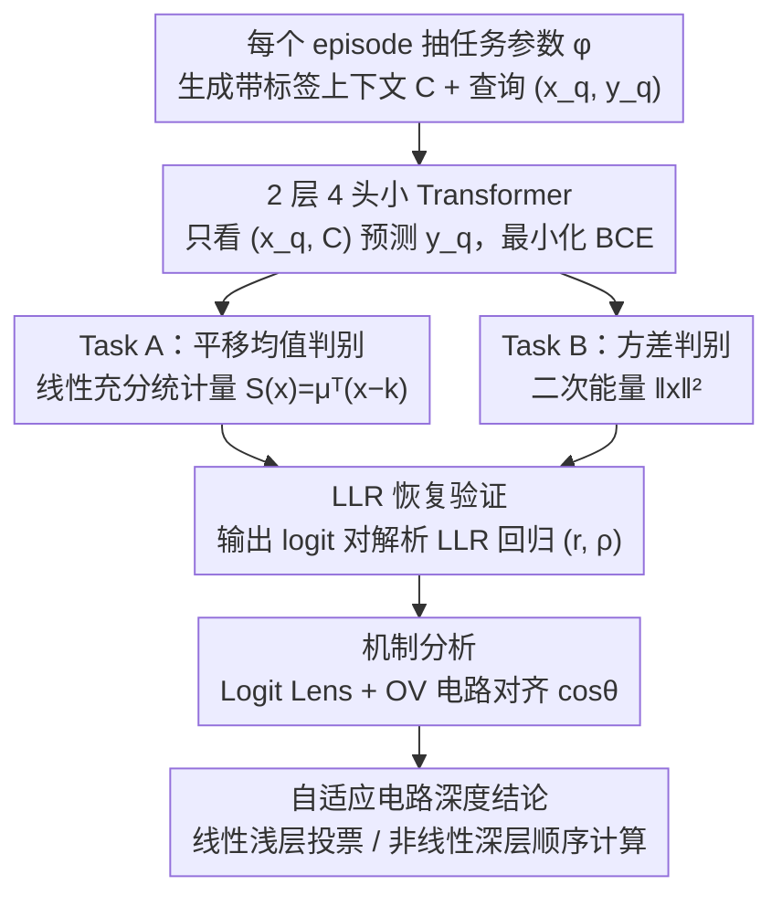

# Implicit Statistical Inference in Transformers: Approximating Likelihood-Ratio Tests In-Context

**会议**: ICLR 2026  
**arXiv**: [2603.10573](https://arxiv.org/abs/2603.10573)  

**代码**: 无  
**领域**: LLM NLP / 可解释性  

**关键词**: in-context learning, likelihood-ratio test, mechanistic interpretability, sufficient statistic, Neyman-Pearson

## 一句话总结

从统计决策论视角出发，证明Transformer在上下文学习中能近似Bayes最优的**似然比检验**充分统计量，并通过机制分析揭示模型对线性/非线性任务采用不同深度的自适应电路。

## 背景与动机

**领域现状**：ICL 使 Transformer 无需权重更新即可适应新任务，但底层算法机制仍有争议——它到底是简单的检索/平均，还是构建了一套原则性的学习算法？

**已有进展**：合成环境下 Transformer 已被证明可恢复线性回归、决策树等经典算法，但这些工作多聚焦回归问题的渐近收敛，未精确刻画每个 episode 的决策规则。

**核心矛盾**："ICL 即梯度下降"假说解释了模型为何随示例增多而改善，却没保证统计最优性。真正的问题是——ICL 究竟是相似度匹配（核平滑），还是在线构建了**任务自适应的统计估计器**？

**本文切入**：采用统计决策论视角，刻意选择**二元假设检验**这一框架，因为它的最优决策规则被 Neyman-Pearson 引理完全刻画。在此框架下，把对数似然比 (LLR) 恢复到单调变换的程度，就等价于是否做到最优预测——这给了可解释性研究中罕见的**已知 ground truth**。

**核心 idea**：构造两种需要不同几何结构的判别任务（线性 vs 非线性），检验模型是否会根据上下文推断并应用正确的充分统计量、而非套用固定启发式。结论是 ICL 通过构建任务自适应的统计估计器实现最优推断，并据任务几何自适应调整电路深度。

## 方法详解

### 整体框架

这篇论文要回答 ICL 到底是不是在做最优统计推断。做法是把一个 2 层 4 头的小 Transformer 当作"待审查的统计学家"：在每个 episode 随机抽一个任务参数 $\phi$，据此生成带标签的上下文数据集 $C=\{(x_i,y_i)\}_{i=1}^N$（$y_i \sim \text{Bernoulli}(1/2)$，$x_i \sim p_\phi(x\mid H_{y_i})$）和一个待判别的查询 $(x_q, y_q)$，模型只看 $(x_q, C)$ 去预测 $y_q$ 并最小化 BCE 损失。整条链路的巧思在于刻意选择二元假设检验作为任务——Neyman-Pearson 引理给出了唯一最优决策规则（对数似然比 LLR），于是"模型输出能否对齐 LLR"就成了一把有 ground truth 的尺子。在此之上，论文用线性、非线性两类任务逼出不同的充分统计量，再用回归和机制探针量化模型究竟在哪一层、用什么方式逼近这把尺子。

### 关键设计

**1. Task A 平移均值判别：逼模型做线性充分统计量**

要把"检索式相似度匹配"和"原则性推断"区分开，第一关是让判别面随 episode 漂移、堵死背固定决策面的捷径。每个 episode 采样一个单位方向 $\mu \sim \text{Unif}(\mathbb{S}^{d-1})$ 和一个随机偏移 $k \sim \mathcal{N}(0,\sigma_k^2 I)$，两类数据分别为 $H_0: x \sim \mathcal{N}(-\mu+k, I)$ 与 $H_1: x \sim \mathcal{N}(\mu+k, I)$。由于 $\mu$ 和 $k$ 每个 episode 都换，模型无法靠记忆，必须从上下文同时推断出局部重心 $k$ 和判别方向 $\mu$，再算最优充分统计量

$$S(x) = \mu^\top(x-k).$$

决策面虽是线性的，却不过原点，所以假设固定中心的静态模型会失败——能做对，就说明模型真的在动态估计任务几何并执行线性判别。

**2. Task B 方差判别：逼模型放弃点积、改用二次能量**

光会线性判别还不够，第二关换一种几何，看模型能否切换内部计算方式。两类的均值都固定为零、只有方差不同：采样 $\sigma_0, \sigma_1 \sim \text{Unif}[0.5, 3.0]$，$H_0: x \sim \mathcal{N}(0, \sigma_0^2 I)$、$H_1: x \sim \mathcal{N}(0, \sigma_1^2 I)$。因为两类同心，任何基于类均值的点积相似度都**完全无信息**，最优统计量只能落在二次能量 $\|x\|^2$ 上（符号由 $\sigma_0,\sigma_1$ 的大小关系决定）。如果模型在 Task A 学到的只是"找个方向投影"，到这里就会崩；唯有同时做好两者，才证明它在按任务几何调整充分统计量、而非套用固定启发式。

**3. LLR 恢复验证：用回归量化"像不像最优解"**

准确率高不代表机制对，所以需要一把直接对齐理论最优的尺子。论文把模型输出 logit 与每个查询的解析 LLR 做回归，并同时报两个相关系数：Pearson $r$ 衡量输出是否与 LLR **线性（仿射）等价**，Spearman $\rho$ 衡量两者诱导的**决策排序是否一致**。$\rho$ 接近 1 说明模型即便经过单调校准也保住了最优排序（Task B 即如此，$\rho=0.98$ 但 $r$ 只有 0.60）；$r$ 偏低则提示模型只是在训练支撑内做局部线性近似而非精确恢复——这正是后面 OOD 实验观察到的退化。与 Nadaraya-Watson 核回归估计量的相关性很弱，也由此排除了"ICL = 核平滑"假说。

**4. 机制分析：把"在哪一层、哪个头算"剖出来**

前三步只给出相关性，最后一步要走到机制。论文用两套探针打开黑箱：Logit Lens 把每个中间层的残差表示直接投影到输出空间，看 LLR 信号最早在第几层浮现；OV 电路对齐则计算各注意力头的 $W_{OV}$ 矩阵与最终决策方向的余弦 $\cos\theta$，判断某个头是直接"投票"还是只做中间搬运。两者合起来揭示出**自适应电路深度**：线性任务在 Layer 0–1 就有头与决策方向高度对齐（$\cos\theta>0.7$），靠头间投票集成提前出结果；非线性任务 Layer 0 的头几乎沉默（$<0.26$），要到深层才顺序算出范数统计量。

## 实验

### 主实验

| 实验 | 关键发现 |
|------|---------|
| Task B (非线性) | 准确率83.0%，逼近oracle的84.0%；Spearman $\rho$=0.98，几乎完美恢复LLR排序 |
| Task A (线性) | 准确率78.3%，低于oracle 6.3%；Pearson $r$=0.86，属于局部近似而非精确恢复 |
| OOD测试 ($\sigma_k$=9.0) | LLR相关性降至$r$=0.567，证实模型学到的是训练支撑上的局部近似 |
| 去位置编码 (NoPos) | 准确率不变(78.2%)，确认模型将上下文视为集合而非序列 |
| 冻结QK权重 | 性能崩溃至随机(49.6%)，证明需要学习任务相关的相似度度量 |
| Logit Lens | Task A在Layer 1即出现与LLR的相关性；Task B直到最终层才出现 |
| OV电路 | Task A: Layer 0头与决策方向高对齐(>0.7)→投票集成；Task B: Layer 0沉默→深层顺序计算 |

## 亮点与洞察

- 首次在**已知最优解**的框架下严格测试ICL的统计最优性，为可解释性研究提供理想测试床

- 揭示自适应电路深度机制：线性任务用浅层投票集成，非线性任务用深层顺序计算

- 排除了"ICL=核平滑"假说——与Nadaraya-Watson estimator的相关性很弱

- 实验设计极其干净，每个消融都有明确的理论对应

## 局限与展望

- 仅使用2层小型Transformer和低维高斯数据，机制是否在大模型/真实分布中保持未知

- Logit Lens和OV分析提供相关性证据而非因果证明，需要因果干预进一步验证

- 仅考虑简单假设检验（balanced prior，symmetric loss），未扩展到复合假设或多分类

## 相关工作

- Xie et al.(2022): ICL作为隐式贝叶斯推断 → 本文在LLR框架下量化验证

- Akyürek/von Oswald(2023): ICL作为梯度下降 → 本文关注算法目标（充分统计量）而非优化过程

- Olsson et al.(2022): induction heads → 本文发现更细致的任务自适应电路结构

## 评分

- 新颖性: ⭐⭐⭐⭐

- 实验充分度: ⭐⭐⭐⭐

- 写作质量: ⭐⭐⭐⭐⭐

- 价值: ⭐⭐⭐⭐

<!-- RELATED:START -->

## 相关论文

- [\[NeurIPS 2025\] How Do Transformers Learn Implicit Reasoning?](../../NeurIPS2025/interpretability/how_do_transformers_learn_implicit_reasoning.md)
- [\[ICML 2026\] Dissecting Multimodal In-Context Learning: Modality Asymmetries and Circuit Dynamics in modern Transformers](../../ICML2026/interpretability/dissecting_multimodal_in-context_learning_modality_asymmetries_and_circuit_dynam.md)
- [\[ICLR 2026\] PERSONA: Dynamic and Compositional Inference-Time Personality Control via Activation Vector Algebra](persona_dynamic_and_compositional_inference-time_personality_control_via_activat.md)
- [\[ICLR 2026\] How Do Transformers Learn to Associate Tokens: Gradient Leading Terms Bring Mechanistic Understanding](how_do_transformers_learn_to_associate_tokens_gradient_leading_terms_bring_mecha.md)
- [\[ICML 2026\] Discovering Implicit Large Language Model Alignment Objectives](../../ICML2026/interpretability/discovering_implicit_large_language_model_alignment_objectives.md)

<!-- RELATED:END -->
