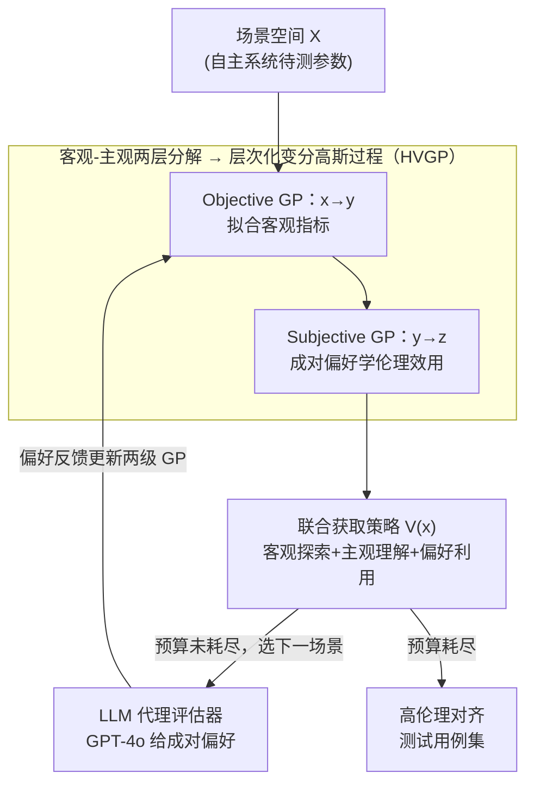

# SEED-SET: Scalable Evolving Experimental Design for System-level Ethical Testing

## 基本信息

- **会议**: ICLR 2026
- **arXiv**: [2603.01630](https://arxiv.org/abs/2603.01630)
- **代码**: [项目主页](https://anjaliparashar.github.io/seed-site/)
- **领域**: AI 安全 / 自主系统评估
- **关键词**: Ethical Testing, Bayesian Experimental Design, Gaussian Process, LLM Evaluator, Autonomous Systems

## 一句话总结

提出 SEED-SET 框架，将自主系统的伦理评估建模为层次化贝叶斯实验设计问题，同时整合客观指标和主观价值判断，在有限预算下高效生成高伦理对齐度的测试用例。

## 研究背景与动机

### 问题背景
自主系统（无人机、电网分配等）在高风险领域部署日益增多，其伦理对齐性评估变得至关重要。然而，伦理评估面临三大挑战：

**度量困难**：伦理行为（公平性、社会接受度）缺乏 ground-truth 标签；

**主观依赖**：价值对齐因利益相关者而异，且随时间演化，静态基准需不断修订；

**评估昂贵**：真实系统的评估受预算约束，无法大规模采集人类反馈。

### 现有方法的局限
- 规则式伦理基准依赖既定准则，不够具体；
- 基于 RL/RLHF 的方法假设充足的模拟或专家标注，样本需求大；
- 偏好式方法和大规模人类研究仅关注单一维度。

### 核心思路
同时建模**客观指标**（如火灾损失、电网成本）和**主观偏好**（利益相关者的伦理判断），通过层次化高斯过程和贝叶斯实验设计高效生成测试场景。

## 方法详解

### 整体框架

SEED-SET 要解决的是"如何在有限预算下，给一个没有伦理真值标签的自主系统（无人机、电网调度等）自动生成最能暴露其伦理对齐问题的测试场景"。它把这个模糊问题拆成一条闭环：先用层次化变分高斯过程（HVGP）把伦理合规函数分成"客观指标"和"主观偏好"两层并各自拟合代理模型，再用一个把探索与利用揉进同一个表达式的联合获取函数，从场景空间里挑出下一个最值得测试的场景，然后让 LLM 扮演利益相关者对该场景与当前最优场景做成对偏好判断，判断结果回流更新两级高斯过程。整个回路在评估预算耗尽前不断迭代，逐步演化出一批高伦理对齐度的测试用例。

### 关键设计

**1. 客观-主观两层分解：把没有真值的伦理判断锚定到可观察行为上**

伦理行为本身没有 ground-truth，直接学一个 $f(x)\to z$ 的端到端映射既不可解释也极度费样本。SEED-SET 把黑盒系统 $\mathcal{S}_\pi$ 在场景空间 $\mathcal{X}$ 上的伦理合规函数拆成两层：客观层 $f_{\text{obj}}:\mathcal{X}\to\mathcal{Y}$ 把场景参数映射到可度量指标（火灾损失、电网成本、韧性等），主观层 $f_{\text{subj}}:\mathcal{Y}\to\mathbb{R}$ 再从这些可观察指标给出伦理效用评分。这样一来，伦理偏好始终落在"系统实际做了什么"之上，既获得可解释性，又能借助主观对客观的依赖关系压缩所需评估次数。

**2. 层次化变分高斯过程（HVGP）：用两级 VGP 分别承接两层映射**

对应上面的分解，HVGP 串起两个变分高斯过程，把"分两层"这件事真正落成可学的模型。Objective GP 学代理模型 $g:x\to y$，预测客观指标，其后验形如 $p(f(x)\mid\mathcal{D})=\mathcal{N}(\mu(x),k(x,x'))$；Subjective GP 学偏好模型 $h:y\to z$，从客观指标映射到主观评分。由于主观评分拿不到绝对真值，这一级改用成对偏好引出来训练——oracle $\mathcal{T}:(y,y')\to\{1,2\}$ 只需比较两个场景孰优孰劣，把"无法打分"转化为"可以比较"，让 Subjective GP 在没有标签的情况下依然可学。

**3. 联合获取策略：一个表达式同时驱动客观探索、主观理解与偏好利用**

测试预算有限，必须每一步都选最有价值的场景。SEED-SET 设计的获取函数把三种诉求融进一个式子：

$$
V(x) = \underbrace{I(g_x; y\mid\mathcal{D})}_{\text{客观信息增益}} + \mathbb{E}_{q_\phi(y\mid x)}\left[\underbrace{I(h_y; z\mid\mathcal{D})}_{\text{主观信息增益}} + \underbrace{\mathbb{E}_{q_\psi(h_y)}[h_y]}_{\text{偏好利用}}\right]
$$

第一项是客观信息增益，降低客观指标空间的不确定性，鼓励去测没见过的场景；第二项是主观信息增益，改善主观效用函数的估计，让模型真正"读懂"偏好；第三项是偏好利用，把采样推向已知高伦理效用的区域，兑现已经学到的偏好。三项缺一不可——只探索会浪费预算在无关区域，只利用又会过早收敛，融在一起才能在覆盖空间的同时持续逼近最优测试用例。

**4. LLM 代理评估器：用 GPT-4o 顶替昂贵的人类偏好标注**

真实系统下大规模采集人类反馈成本高昂，SEED-SET 让 GPT-4o 充当利益相关者代理来完成成对偏好评估，闭合上面那条反馈回路。给它的 prompt 由三段构成：任务描述提供领域上下文，客观指标给出两个待比较场景的可度量结果，主观准则用自然语言编码该利益相关者的伦理偏好。只要替换 prompt 里的主观准则，就能快速切换到不同的伦理标准或不同的利益相关者，让整套评估在无须重训的前提下适配多种价值取向。

### 一个完整示例：消防无人机的一轮迭代

以消防救援无人机为例走一轮回路：当前已有少量测试场景的数据 $\mathcal{D}$，Objective GP 已能粗略预测每个候选场景的火灾损失、覆盖率等客观指标 $y$，Subjective GP 则据此给出伦理效用 $z$。这一轮里，联合获取函数 $V(x)$ 给场景空间中每个候选打分——既偏向 GP 后验方差大、还没测过的区域（探索），又偏向当前估计伦理效用高的区域（利用）——挑出得分最高的那个新场景。把这个新场景和当前最优场景一起交给 GPT-4o，让它依据主观准则判断哪个更符合伦理；这条成对偏好结果加进 $\mathcal{D}$，同时更新两级 GP。下一轮 $V(x)$ 因此偏移，挑出的场景随之演化。预算耗尽时，演化出的这批场景就是高伦理对齐度的测试用例集；消融显示其生成最优测试的比例约为随机采样的 2 倍。

## 实验

### 案例 1：电网资源分配（IEEE 5/30-Bus）

| 方法 | 5-Bus 偏好得分 (↑) | 30-Bus 偏好得分 (↑) |
|------|-------------------|-------------------|
| Random | 低 | 低 |
| Single GP | 中等 | 失败 |
| VS-AL-1 | 失败 | 失败 |
| VS-AL-2 | 失败 | 失败 |
| **HVGP (SEED-SET)** | **最高** | **最高** |

### 案例 2：消防救援（无人机导航）

| 方法 | 偏好得分 (↑) | 覆盖率 (↑) |
|------|-------------|-----------|
| Random | 低 | 低 |
| Single GP | 中等 | 中等 |
| HVGP (MI1+MI2 仅探索) | 中高 | 中高 |
| HVGP (Pref 仅利用) | 较高 | 中等 |
| **HVGP (完整获取)** | **最高** | **最高** |

### 消融实验：获取策略组件

| 获取策略 | 生成最优测试比例 (↑) | 空间覆盖 (↑) |
|---------|-------------------|------------|
| 随机采样 | 1× | 1× |
| 仅 MI1+MI2 | 1.4× | 1.1× |
| 仅 Pref | 1.6× | 0.9× |
| **完整 V(x)** | **2×** | **1.25×** |

### 关键发现

1. **SEED-SET 生成最优测试用例数量是基线的 2 倍**，搜索空间覆盖率提升 1.25 倍；
2. **高维场景优势显著**：在 30-Bus（40 维设计空间）中，Single GP 完全失败，而 HVGP 仍保持高效；
3. **层次化建模关键**：将 $f$ 分解为 $f_{\text{obj}} + f_{\text{subj}}$ 比直接建模 $f(x) \to z$ 更准确；
4. **三项获取缺一不可**：去除任何一项都导致性能下降；
5. **LLM 代理可靠**：TrueSkill 评分验证 GPT-4o 的偏好判断与手工偏好函数趋势一致；
6. **适应不同利益相关者**：切换 prompt 中的主观准则可快速适配不同伦理标准。

## 亮点

- 首个同时考虑客观指标和主观价值判断的自主系统伦理测试框架
- 层次化 HVGP 设计使主观偏好锚定在可观察行为上，提升可解释性
- 联合获取策略优雅平衡探索-利用，三项设计各有明确功能
- LLM 作为代理评估器降低了对人类专家的依赖
- 框架领域无关，可适用于电网、消防、交通等多种场景

## 局限性

- 假设利益相关者如实报告偏好（假设 A2），未处理策略性误报
- 假设客观指标集完全已知且固定（假设 A3），动态指标扩展未涉及
- LLM 代理可能继承 GPT-4o 的偏见，不同 LLM 的偏好一致性需进一步验证
- VGP 在极高维场景下的可扩展性仍受限于诱导点数量
- 手工偏好评分函数的设计依赖领域知识

## 相关工作

- **AI 伦理框架**: NIST AI RMF 1.0 (2023), IEEE 标准
- **贝叶斯实验设计**: Rainforth et al. (2024), Chaloner & Verdinelli (1995)
- **偏好学习**: RLHF (Christiano et al., 2017), 成对比较 GP (Chu & Ghahramani, 2005)
- **主动学习**: 偏好引出 (Keswani et al., 2024)
- **LLM 评估器**: Huang et al. (2025) 使用 LLM 进行偏好评估

## 评分

- 新颖性：⭐⭐⭐⭐⭐ — 首次将层次化贝叶斯实验设计应用于伦理测试
- 技术深度：⭐⭐⭐⭐ — HVGP + 联合获取 + LLM 评估器三位一体
- 实验充分度：⭐⭐⭐⭐ — 三个案例研究 + 多维消融 + 利益相关者分析
- 实用价值：⭐⭐⭐⭐ — 领域无关框架，但实际部署需与真实利益相关者验证

<!-- RELATED:START -->

## 相关论文

- [\[ICLR 2026\] ZeroTuning: Unlocking the Initial Token's Power to Enhance Large Language Models Without Training](zerotuning_unlocking_the_initial_tokens_power_to_enhance_large_language_models_w.md)
- [\[ACL 2025\] A Dual-Perspective NLG Meta-Evaluation Framework with Automatic Benchmark and Better Interpretability](../../ACL2025/interpretability/a_dual-perspective_nlg_meta-evaluation_framework_with_automatic_benchmark_and_be.md)
- [\[ACL 2025\] Enhancing Automated Interpretability with Output-Centric Feature Descriptions](../../ACL2025/interpretability/output_centric_interpretability.md)
- [\[ICML 2025\] DeltaSHAP: Explaining Prediction Evolutions in Online Patient Monitoring with Shapley Values](../../ICML2025/interpretability/deltashap_explaining_prediction_evolutions_in_online_patient_monitoring_with_sha.md)
- [\[ICLR 2026\] Stress-Testing Alignment Audits with Prompt-Level Strategic Deception](stress-testing_alignment_audits_with_prompt-level_strategic_deception.md)

<!-- RELATED:END -->
