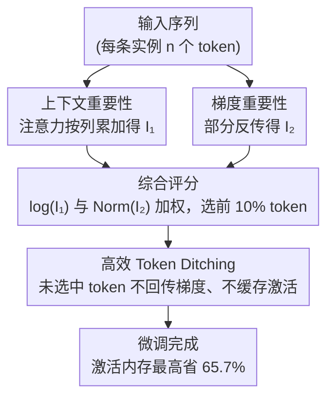

# TokenSeek: Memory Efficient Fine Tuning via Instance-Aware Token Ditching

**会议**: ICLR 2026  
**arXiv**: [2601.19739](https://arxiv.org/abs/2601.19739)  
**代码**: [https://runjia.tech/iclr_tokenseek（项目主页）](https://runjia.tech/iclr_tokenseek（项目主页）)  
**领域**: 可解释性  
**关键词**: 内存高效微调, Token剪枝, 实例感知, 激活内存优化, PEFT兼容

## 一句话总结
提出 TokenSeek，一个通用的 Transformer 微调内存优化插件，通过结合上下文注意力信息和梯度信息进行实例级 token 重要性评估，仅保留 10% 高价值 token 参与梯度更新，实现最高 65.7% 内存节省且性能持平甚至超越全 token 微调。

## 研究背景与动机
LLM 微调面临严峻的内存瓶颈。训练内存由三部分组成：(I) 模型参数、(II) 梯度和优化器状态、(III) 激活值。其中激活值是主要瓶颈——Llama3 8B 中激活占 87% 内存，GPT-2 1.5B 的激活达 60GB。

现有优化方法分三条路线：
- **PEFT**（LoRA 等）：减少可训练参数（I），但激活内存仍占 75%+
- **优化器高效化**（ZeRO 等）：优化梯度和优化器状态（II）
- **内存高效微调 MEFT**：直接攻克激活内存（III），包括重计算、压缩和可逆网络

现有 MEFT 的核心问题：**数据无关（data-agnostic）**——对所有训练样本采用统一策略，忽略不同实例中 token 的信息量差异。例如 TokenTune 随机选 token 丢弃梯度，导致效果不稳定。

核心矛盾：如何在实例级别识别真正重要的 token 并高效地只为它们保存激活？这需要解决两个子问题：(1) 如何评估每个 token 的重要性；(2) 如何利用重要性评估高效节省内存。

## 方法详解

### 整体框架
TokenSeek 把"省激活内存"拆成"先挑 token、再丢梯度"两个环节：先用上下文与梯度两路信息为每个实例的 token 打一个重要性分（综合评分），按分数选出约 10% 的高价值 token，反向传播时只对这部分 token 回传梯度、其余 token 的激活根本不必缓存。重要性评估对每条实例独立进行，因此选择是量身定制的实例感知（instance-aware）策略，而非对所有样本套同一套模板。

### 关键设计

**1. 上下文重要性：用被关注程度衡量 token 在序列里有多"被需要"**

第一路信号来自注意力本身。对一条长度为 $n$ 的序列，把注意力矩阵按列累加得到每个 token 的上下文得分 $I_1(t_j) = \sum_{i=1}^{n} \mathbf{A}_{ij}$，也就是 token $t_j$ 被序列中所有其他 token 关注的总权重。一个 token 若被越多位置反复查询，说明它承载的信息越关键，理应优先保留。但纯注意力分数并不干净：早期 token 因 attention sink 效应分数虚高，整体又呈重长尾分布，直接用会让选择偏向少数位置——这正是后面要做 log 变换的原因。

**2. 梯度重要性：用对损失的实际贡献补上注意力看不到的信号**

只看注意力会漏掉"被关注不多、但对学习很关键"的 token。第二路信号因此取最后一层前激活的梯度，定义 $I_2(t_j) = \sum_{k=1}^{d} \mathbf{G}_{jk}$，其中 $\mathbf{G} = \partial \mathcal{L} / \partial z^{(L-1)}$，直接度量每个 token 对损失函数的影响大小。这与注意力是互补的两套尺度（Jain & Wallace 2019 早就指出注意力权重和梯度重要性常常并不相关）：上下文分数偏向序列前段，梯度分数偏向 response 部分，合起来才覆盖全程。关键是这一路并不贵——冻结除输出头和最后一个 decoder block 外的所有层，只做一次部分反向传播就能拿到。

**3. 综合评分：把两路尺度对齐后再线性融合**

两路信号量纲不同、分布不同，不能直接相加。综合得分写作 $I(t_j) = \alpha \log[I_1(t_j)] + \beta \,\text{Norm}[I_2(t_j)]$：对上下文分数做 log 压掉长尾，对梯度分数做 min-max 归一化对齐到同一尺度，再按 $\alpha,\beta$ 加权。默认取 $\alpha = \beta = 1$，消融显示在较宽的权重范围内结果都很稳，说明方法对这两个超参并不敏感。

**4. 高效 Token Ditching：把"丢梯度"翻译成"不存激活"**

挑出 token 后真正省内存的动作在反向传播。对未选中的 token $\bar{t}$，直接令其激活的反传导数置零 $\sigma'(a_{\bar{t}}^{(l)}) = 0$；既然这些 token 不再回传梯度，前向时它们的中间激活 $a_{\bar{t}}^{(l)}$ 就无需缓存，而激活恰恰是训练内存的大头。只保留 10% 的 token，理论上激活内存可降到约 1%，这正是整体最高 65.7% 内存节省的来源。

### 训练策略
TokenSeek 是与架构无关的即插即用 plugin，可直接叠加在 LoRA、LoHa、QLoRA 等 PEFT 方法之上而不改动它们。token 重要性在每个 batch 上独立评估、独立选择，从而让稀疏化策略对每条样本都是实例感知的，而非一套固定模板套到所有数据。

## 实验关键数据

### 主实验（Few-shot 评估，Open-Platypus 微调）

| 方法 | 设置 | Ave. Mem. | ARC | HellaSwag | MMLU | TruthfulQA | WinoGrande | Avg |
|---|---|---|---|---|---|---|---|---|
| Full Token Tuning (Llama3.2 1B) | 100% | 100% | 23.72 | 26.11 | 57.53 | 48.68 | 48.07 | 40.82 |
| + TokenTune (Random 10%) | 64.6% | - | 24.32 | 25.80 | 58.14 | 47.90 | 47.59 | 40.75 |
| + **TokenSeek (10%)** | **64.6%** | - | 23.98 | 25.73 | 58.14 | 48.09 | 49.72 | **41.13** |
| QLoRA (Llama3.2 1B) | 45.6% | - | 38.82 | 65.26 | 56.39 | 38.85 | 61.33 | 52.13 |
| + TokenTune (Random 10%) | 14.8% | - | 39.33 | 62.97 | 41.76 | 41.36 | 60.69 | 49.22 |
| + **TokenSeek (10%)** | **14.8%** | - | 39.08 | 65.98 | 58.03 | 38.65 | 61.33 | **52.61** |

TokenSeek + QLoRA 仅用 14.8% 内存（2.8 GB）却超越全 token 微调（52.61 vs 40.82），也超越纯 QLoRA（52.61 vs 52.13）。

### 消融实验（权重敏感性 + Token 比例）

| 设置 | MMLU | ARC | HellaSwag | TruthfulQA | WinoGrande | Avg |
|---|---|---|---|---|---|---|
| α=1, β=0 (仅上下文) | 57.52 | 34.56 | 50.09 | 41.51 | 58.56 | 48.45 |
| α=0, β=1 (仅梯度) | 57.62 | 30.72 | 44.20 | 43.98 | 55.41 | 46.39 |
| α=5, β=5 (均衡) | 58.49 | 35.15 | 50.20 | 41.48 | 57.93 | 48.65 |
| α=7, β=3 | 58.59 | 35.58 | 50.10 | 41.13 | 57.22 | 48.53 |

Token 比例消融（Llama3.2 1B + QLoRA）：10%→52.61, 20%→51.80, 30%→52.75, 40%→52.66, 50%→52.26, 100%→40.82。10% 即可达到最优区间，内存仅 14.8%。

### 关键发现
- 上下文和梯度信息互补：上下文偏向早期 token（attention sink），梯度偏向后期 token（response 部分），结合后更全面
- TokenSeek 在 PEFT 场景下效果更好（全参数微调可能过拟合，PEFT 的正则化效应与 token 稀疏化协同）
- 随机选 token（TokenTune）方差大且可能性能崩溃，实例感知选择显著提升稳定性
- 跨模型泛化：Qwen 0.5B、Llama 1B、Llama 3B 上均有效，但小模型更敏感

## 亮点与洞察
- **极致内存压缩**：仅 2.8 GB 即可微调 Llama3.2 1B（QLoRA + TokenSeek），在消费级 GPU（如 RTX 4090 24GB）上甚至可以微调 3B 模型
- 实验发现 PEFT + TokenSeek 的组合比单独使用任一方法更优，原因在于 PEFT 的低秩约束提供正则化，配合 token 稀疏化避免过拟合
- 实例感知策略相比贯标方法的优势在稳定性上尤为明显（方差小得多）
- 可解释性好：注意力 sink 效应、梯度集中于 response 部分等现象可视化清晰
- 通用性：架构无关设计，可与多种 PEFT 方法叠加，是真正的 plugin

## 局限与展望
- 需要额外的前向和部分反向传播来评估 token 重要性，引入计算开销（虽然论文声称开销小）
- 在极小规模模型（Qwen 0.5B 单独使用）上性能有下降，表征能力不足时选择可能不准
- 仅在 instruction tuning 场景验证，对 continual pretraining 等其他微调范式的效果未探索
- 10% 的固定比例对所有样本一视同仁，可否自适应调整比例值得研究
- 未与最新的其他 MEFT 方法（如可逆网络、混合精度训练）做全面对比

## 相关工作与启发
- 与 TokenTune（Simoulin et al., 2024）：TokenTune 随机选 token，TokenSeek 基于信息量选，形成直接改进
- 与 gradient checkpointing：两者互补——checkpoint 减少重计算开销，TokenSeek 减少需缓存的 token 数
- 思路可推广到推理阶段：如果微调时某些 token 对学习无贡献，推理时这些 token 是否也可跳过？
- Token 重要性评估可能用于数据蒸馏和课程学习
- 可与 gradient checkpointing 组合：TokenSeek 减少需缓存的 token 数，checkpoint 减少重计算开销，二者互补
- 思路可推广到推理阶段：如果微调时某些 token 对学习无贡献，推理时这些 token 是否也可跳过？

## 评分
- 新颖性: ⭐⭐⭐⭐ 实例感知token选择+梯度+注意力组合有创意，但token剪枝思路本身不新
- 实验充分度: ⭐⭐⭐⭐ 多模型多PEFT组合+消融+可视化完整，但缺少更多任务类型验证
- 写作质量: ⭐⭐⭐⭐ 结构清晰，可视化丰富，但篇幅略冗长
- 价值: ⭐⭐⭐⭐⭐ 2.8GB微调1B模型极具工程价值，plugin设计易于落地

<!-- RELATED:START -->

## 相关论文

- [\[AAAI 2026\] GateRA: Token-Aware Modulation for Parameter-Efficient Fine-Tuning](../../AAAI2026/interpretability/gatera_token-aware_modulation_for_parameter-efficient_fine-tuning.md)
- [\[ICLR 2026\] Exploring Interpretability for Visual Prompt Tuning with Cross-layer Concepts](exploring_interpretability_for_visual_prompt_tuning_with_cross-layer_concepts.md)
- [\[ICLR 2026\] Bridging Explainability and Embeddings: BEE Aware of Spuriousness](bridging_explainability_and_embeddings_bee_aware_of_spuriousness.md)
- [\[ICLR 2026\] RADAR: Reasoning-Ability and Difficulty-Aware Routing for Reasoning LLMs](radar_reasoning-ability_and_difficulty-aware_routing_for_reasoning_llms.md)
- [\[ICLR 2026\] ZeroTuning: Unlocking the Initial Token's Power to Enhance Large Language Models Without Training](zerotuning_unlocking_the_initial_tokens_power_to_enhance_large_language_models_w.md)

<!-- RELATED:END -->
