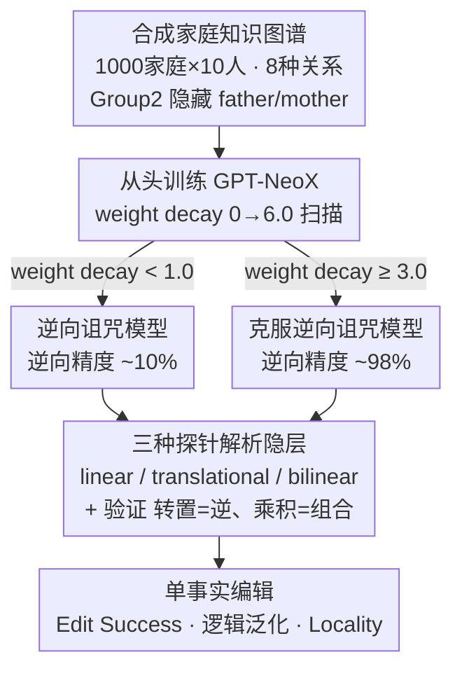

# Bilinear Representation Mitigates Reversal Curse and Enables Consistent Model Editing

**会议**: ICLR 2026  
**arXiv**: [2509.21993](https://arxiv.org/abs/2509.21993)  
**代码**: 有（GPT-NeoX 框架）  
**领域**: LLM推理 / 知识表示 / 模型编辑  
**关键词**: reversal curse, bilinear representation, model editing, relational structure, knowledge graph

## 一句话总结
通过在合成关系知识图谱上从头训练 Transformer，发现适当正则化会使模型隐层涌现出双线性关系结构（bilinear relational structure），该结构不仅能克服逆向诅咒（reversal curse），还能实现编辑单个事实后逻辑一致地传播到相关事实。

## 研究背景与动机

### 领域现状
语言模型在知识密集型任务中表现强大，但其推理能力往往缺乏逻辑一致性。一个典型例子是"逆向诅咒"（reversal curse）：模型学了"A 是 B 的父亲"却推不出"B 是 A 的孩子"。模型编辑（model editing）领域致力于在不重训模型的情况下更新知识，但现有编辑方法无法将更新传播到逻辑蕴含的事实。

### 现有痛点

**逆向诅咒被认为是根本局限**：主流观点将其归因于自回归训练目标的方向性，即模型只能建模 $P(B|A)$ 而非 $P(A|B)$

**模型编辑无法逻辑泛化**：编辑"A 的配偶是 C→D"后，模型不能自动推出"D 的配偶是 A"，需要显式双向编辑

**现有解决方案治标不治本**：数据增强（生成反向样本）或修改训练目标只是在表面修补

### 核心矛盾
这些逻辑失败到底是 Transformer 架构的固有缺陷，还是模型表示知识方式的产物？

### 本文目标
1. 逆向诅咒是否可以通过适当训练来克服？
2. 模型内部用什么数学结构编码关系知识？
3. 这种结构如何影响模型编辑的逻辑一致性？

### 切入角度
从知识表示的几何结构入手——研究者注意到知识图谱嵌入方法（如 RESCAL）中的双线性模型天然支持关系的逆（矩阵转置）和组合（矩阵乘法），因此提出假设：如果 Transformer 学到了双线性关系结构，就能克服逆向诅咒并实现编辑泛化。

### 核心 idea
逆向诅咒和模型编辑失败不是 Transformer 的固有缺陷，而是知识表示结构的缺失——当模型学到双线性关系结构时，这些问题自然解决。

## 方法详解

### 整体框架

这篇论文不提一个新算法，而是用一套**受控实验**来回答一个机理问题：逆向诅咒到底是 Transformer 的架构缺陷，还是知识表示结构的产物。整条流水线分四步走。先造一个干净的合成家庭关系知识图谱，把"逆向推理"和"多跳推理"压缩成一个可精确控制的最小系统；再在这个图谱上从头训练一批 GPT-NeoX（12 层、896 维隐层、16 头注意力、约 206M 参数），唯一变动的关键旋钮是 weight decay，从 0 扫到 6.0，于是同一架构会分裂出"逆向诅咒"和"克服逆向诅咒"两类模型；接着用三种数学形式的探针（linear / translational / bilinear）去解析这两类模型的隐层里关系到底是怎么被编码的，并进一步验证学到的矩阵是否真满足关系代数性质；最后在这些模型上做单事实编辑，看哪种表示结构能让一次改动逻辑一致地传播到蕴含事实。整套设计的用意，是把"是否克服逆向诅咒""隐层是否涌现双线性结构""编辑能否逻辑泛化"三件事钉在同一组模型上一起测，从而把它们之间的因果链揭出来。

### 关键设计

**1. 合成知识图谱：把关系推理压缩成一个最小闭合系统**

实验需要一个能干净测出"逆向推理"和"多跳推理"的环境，而真实语料里关系太杂、无法控制谁见过谁没见过。研究者构造了 1000 个家庭、每家 10 人，只用 husband、wife、father、mother、son、daughter、brother、sister 这 8 种关系。挑这 8 种是因为它们恰好闭合：既含逆关系（husband 的 wife 还是 husband），又含可组合的多跳关系（husband∘mother = father、sister∘son = daughter），是同时覆盖"逆"与"组合"两种代数性质的最小关系集。为了制造"模型从没见过的逆向/组合事实"，把 1000 个家庭对半分成两组——Group 1（500 家）保留全部 36 个事实，Group 2（500 家）故意抽掉 father/mother，只留 24 个；测试集就专门取 Group 2 被隐藏的 father/mother 关系。这样模型想答对，只能靠从 Group 1 学到的内部结构去推（如由 (A, husband, B) 和 (B, son, C) 推出 (C, father, B)），而不是靠记忆。

**2. Weight Decay 扫描：用一个正则化旋钮制造"克服/不克服逆向诅咒"的对照**

逆向诅咒长期被归因于自回归目标的方向性（只建模 $P(B|A)$ 不建模 $P(A|B)$），作者想检验这是不是真的固有缺陷。做法是在 AdamW 里把 weight decay 在 $\{0, 0.1, 0.5, 1.0, 2.0, \dots, 6.0\}$ 上扫，每档 3 个随机种子（共 27 个模型），其余设置完全不变，于是得到一批架构相同、只差正则化强度的模型。结果很说明问题：所有模型训练精度都是 100%，但 weight decay 低于约 1.0 的模型在被隐藏的逆向关系上几乎全错（精度 ~10%），而高 weight decay 的模型逆向推理精度逼近 100%；1.0 附近是个分叉点，同样设置不同种子会一个克服、一个不克服。这意味着逆向诅咒可以被同一架构在不同正则化下分别"复现"和"消除"——正则化逼着模型学一个更泛化的内部结构（即下一节验证的 bilinear 结构），而不是死记硬背训练样本。这一档同时为后续分析提供了天然对照：取一个低逆向精度（<40%）的"逆向诅咒"模型和一个高逆向精度（>98%）的"克服"模型并排剖析。

**3. 双线性探针与代数验证：用不同代数形式问"关系是怎么编码的"，再确认它真满足关系代数**

拿到两类模型后，核心问题变成"它们内部用什么数学结构编码关系，差别在哪"。作者并排上三种探针去拟合隐层表示。Linear Relational Embedding 把关系建成从 subject 到最后一层 object 表示的局部仿射变换，$o_L \approx W_r s_l + b_r$，其中 $W_r$ 直接由前向过程的雅可比 $J_r = \partial o_L / \partial s_l$ 估计、不另行训练；Translational 仿 Word2Vec 的向量平移，subject 与 object 取自同一层，$s_l + v_r \approx o_l$，$v_r$ 取该关系所有样本的平均位移；Bilinear 则把关系建成一个矩阵 $M_r$，用打分函数 $f_r(s_l, o_l) = s_l^\top M_r o_l$ 刻画 subject 与 object 的交互，目标是"事实成立打 1、不成立打 0"，用 RESCAL 的岭回归变体求解。三者不是随便挑：只有 bilinear 形式在代数上天然支持 $M_r^\top$ 表示逆关系、$M_{r_2} M_{r_1}$ 表示关系组合，linear 和 translational 做不到这两件事。所以这组对比本身就是判别实验——如果模型真能逆向推理，它的隐层就该被 bilinear 探针解释得更好。

但探针精度高还不够，可能只是碰巧拟合。作者再加一道代数验证：直接拿学到的矩阵做运算，测 $M_{\text{husband}}^\top$ 能不能当 wife 的关系矩阵用、$M_{\text{husband}} \cdot M_{\text{mother}}$ 能不能预测 father 关系。结果是，在克服了逆向诅咒的模型上，bilinear 探针在第 6-9 层精度 >95%、且转置与乘积的代数运算也在这些中间层达到 >95%；而逆向诅咒模型在所有探针、所有层都停在 ~33% 的随机基线。这把"双线性结构"从一个统计相关性坐实成**功能性的代数结构**——矩阵转置真的对应逆关系、矩阵乘法真的对应关系组合，而这正是能逆向、能组合的模型独有、逆向诅咒模型完全缺失的东西。

**4. 模型编辑实验：检验 bilinear 结构是否带来逻辑一致的编辑传播**

最后一步把表示结构和模型编辑挂钩。作者编辑单个 husband 事实 (A, husband, B→B')，用三个指标衡量：Edit Success 看直接编辑是否成功、Logical Generalization 看蕴含事实（如 (B', wife, A)）是否跟着更新、Locality 看无关事实是否被保留。两类模型直接编辑都能成功，但逻辑泛化差异巨大——bilinear 模型能把改动传播到 (B', wife, A) 这类蕴含事实，逆向诅咒模型几乎全失败；bilinear 探针精度与逻辑泛化成功率的相关性高达 $R^2 = 0.939$，直接把"有没有 bilinear 结构"和"编辑能不能逻辑一致"绑在一起。一个反直觉的细节是：编辑效果最好的层（1-4 层）和 bilinear 结构最强的层（6-9 层）并不重合——要在结构"正在形成"的早期层下手、而不是在结构"已经建立"的层，改动才能正确传播到下游表示。

## 实验关键数据

### 主实验
逆向推理精度与 weight decay 的关系（在 Group 2 被隐藏的 father/mother 关系上测试）：

| Weight Decay | 训练精度 | 测试精度（逆向推理） | 状态 |
|-------------|---------|-------------------|------|
| 0 | 100% | ~10% | 逆向诅咒 |
| 0.5 | 100% | ~30% | 逆向诅咒 |
| 1.0 | 100% | ~40-98%（种子依赖） | 分叉点 |
| 3.0+ | 100% | ~98% | 克服逆向诅咒 |

### 探针精度对比（中间层 6-9）

| 探针类型 | 非逆向诅咒模型 | 逆向诅咒模型 |
|---------|--------------|-------------|
| Linear | ~33%（基线） | ~33%（基线） |
| Translational | ~33%（基线） | ~33%（基线） |
| Bilinear | >95% | ~33%（基线） |

### 模型编辑结果

| 指标 | 有 Bilinear 结构 | 无 Bilinear 结构 |
|------|-----------------|-----------------|
| Edit Success | ~100% | ~100% |
| Logical Generalization | 高（最佳层 ~90%+） | 接近 0% |
| Locality | 高 | 低 |

### 关键发现
- **逆向诅咒是表示问题不是架构问题**：同一架构，不同正则化强度，截然不同的推理能力
- **Bilinear 结构集中在中间层**：第 6-9 层精度最高，这与注意力头编码关系操作的发现一致
- **代数结构是功能性的**：矩阵转置≈逆关系、矩阵乘法≈关系组合，不只是统计相关
- **编辑最佳层 ≠ 结构最强层**：需要在结构"形成中"的早期层编辑才能正确传播

## 亮点与洞察
- **视角转换最为深刻**：将逆向诅咒从"模型能力缺陷"重新定义为"表示结构缺失"，这改变了问题的解决范式——不再追求更好的训练目标或数据增强，而是关注知识的几何结构
- **合成数据的巧妙控制**：家庭关系图谱是测试关系推理的最小完备系统，8 种关系恰好覆盖逆和组合，极其优雅
- **探针设计的系统性**：linear/translational/bilinear 三种探针的对比设计清晰地排除了替代假设
- 可迁移思路：**"先检查模型是否具备推理所需的表示结构，再决定用什么算法"** 这一范式适用于更广泛的 AI 可靠性问题

## 局限与展望
- **合成数据 vs 真实数据**：全部实验在干净合成数据上进行，206M 参数模型——大规模预训练模型中是否存在类似 bilinear 结构尚未验证
- **关系类型有限**：仅 8 种家庭关系，真实世界知识涉及数千种异构关系，不同知识可能采用不同几何结构
- **编辑方法简单**：仅用了基础的逐层微调，未与 ROME/MEMIT 等先进编辑方法结合
- **因果性问题**：bilinear 探针精度高是否等同于模型"使用"该结构进行推理？相关性 vs 因果性

## 相关工作与启发
- **vs Berglund et al. (2024) 逆向诅咒论文**: 他们将逆向诅咒定义为 LM 的根本局限；本文证明这不是固有缺陷而是表示结构问题
- **vs Hernandez et al. (2024) Linear Relational Embedding**: 他们认为 LM 用线性关系编码知识；本文发现 bilinear 才是支持逆向推理的关键结构
- **vs ROME/MEMIT 编辑方法**: 它们关注算法设计；本文指出编辑成功与否更取决于模型是否具备合适的表示几何
- **vs Nishi et al. (2025)**: 他们发现编辑会"破碎"内部拓扑结构；本文进一步解释了什么结构（bilinear）需要被保护

## 评分
- 新颖性: ⭐⭐⭐⭐⭐ 将逆向诅咒归因于表示几何而非训练目标，提出全新视角
- 实验充分度: ⭐⭐⭐⭐ 四个层层递进的实验设计精巧，但局限于合成数据 + 小模型
- 写作质量: ⭐⭐⭐⭐⭐ 逻辑链条清晰，图表精美，公式简洁
- 价值: ⭐⭐⭐⭐ 对理解 LM 知识表示和编辑机制有重要启发，但实际应用需更多验证

<!-- RELATED:START -->

## 相关论文

- [\[ICLR 2026\] Fine-tuning Done Right in Model Editing](fine-tuning_done_right_in_model_editing.md)
- [\[ICLR 2026\] Energy-Regularized Sequential Model Editing on Hyperspheres](energy-regularized_sequential_model_editing_on_hyperspheres.md)
- [\[ACL 2026\] Representation Interventions Enable Lifelong Knowledge Memory Control in LLMs](../../ACL2026/knowledge_editing/representation_interventions_enable_lifelong_knowledge_memory_control_in_llms.md)
- [\[ICML 2025\] Representation Shattering in Transformers: A Synthetic Study with Knowledge Editing](../../ICML2025/knowledge_editing/representation_shattering_in_transformers_a_synthetic_study_with_knowledge_editi.md)
- [\[ICLR 2026\] EAMET: Robust Massive Model Editing via Embedding Alignment Optimization](eamet_robust_massive_model_editing_via_embedding_alignment_optimization.md)

<!-- RELATED:END -->
