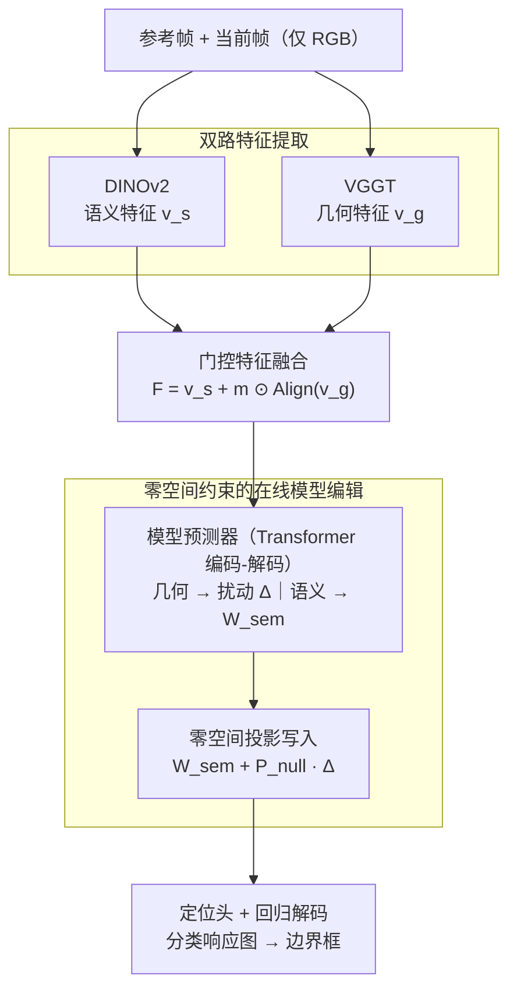

# GOT-Edit: Geometry-Aware Generic Object Tracking via Online Model Editing

**会议**: ICLR 2026  
**arXiv**: [2602.08550](https://arxiv.org/abs/2602.08550)  
**代码**: [https://github.com/chenshihfang/GOT](https://github.com/chenshihfang/GOT)  
**领域**: 知识编辑  
**关键词**: 目标跟踪, 3D几何, 零空间编辑, 在线模型更新, VGGT

## 一句话总结
通过零空间约束的在线模型编辑，将 VGGT 提供的 3D 几何信息融入 2D 通用目标跟踪器中，在保持语义判别力的同时增强几何感知能力，在遮挡和背景杂乱场景中显著提升跟踪性能。

## 研究背景与动机

**领域现状**：2D 通用目标跟踪（GOT）主要依赖外观特征（如 DINOv2），在标准场景下已取得很好效果，但缺乏 3D 空间理解能力。

**现有痛点**：面对遮挡、背景杂乱、外观变化等挑战性场景时，纯 2D 特征难以区分目标和干扰物。而现有的 3D 融合方法需要 RGB-D 输入或点云数据，限制了通用性。

**核心矛盾**：直接将几何特征朴素融合（如拼接或加权相加）到语义特征中，会破坏已学好的语义判别力——实验显示朴素融合在快速运动和光照变化场景下反而退化。

**本文目标** 如何在保持语义特征判别力的前提下，无损地注入 3D 几何信息？

**切入角度**：借鉴大语言模型的知识编辑（AlphaEdit），将几何信息扰动投影到语义特征的零空间，确保不干扰原有语义。

**核心 idea**：将几何感知模块的输出投影到语义模型权重的零空间中，实现 3D 几何知识的无损注入。

## 方法详解

### 整体框架
GOT-Edit 要解决的是：怎么把 3D 几何信息塞进一个已经训得很好的 2D 外观跟踪器里，又不破坏它原有的语义判别力。整条流水线沿用「先检测后跟踪」（track-by-detection）的骨架，自上而下这样转——参考帧和当前帧的 RGB 图像分两路进入冻结的 backbone，DINOv2 抽语义特征、VGGT 抽几何特征；两路特征经一个逐位置的门控机制融合成 $F$；融合特征送进一个 Transformer 编码-解码的「模型预测器」，由它一边用几何信息产生定位头的扰动权重 $\Delta$、一边只用语义信息产生语义权重 $W_{sem}$；接着进入全文核心的在线模型编辑——把 $\Delta$ 投影进语义特征的零空间再写入，得到 $W_{sem} + P_{null}\Delta$；最后用编辑后的定位头算出分类响应图，再由回归解码器输出边界框。关键在于「写入」这一步不是简单相加，而是借鉴 LLM 知识编辑（AlphaEdit）的做法把几何扰动约束在语义特征的零空间里，并且整套预测+编辑在跟踪过程中**在线**进行、随目标和背景动态更新，从而做到几何信息无损注入。

### 关键设计

**1. 双路特征提取：语义和几何各取一个冻结 backbone**

跟踪器要同时拥有外观判别力和 3D 空间感，但二者来自不同的上游模型，硬塞进同一个 backbone 既难训也会互相拖累。GOT-Edit 干脆并联两个**都冻结**的预训练模型：语义这一路用 DINOv2 抽外观特征 $v_s \in \mathbb{R}^{C \times H \times W}$，几何这一路用 VGGT 从 RGB 推断相机位姿、点图、深度等 3D 属性、得到几何特征 $v_g$。选 VGGT 是因为它作为最近的视觉几何 Transformer，只需单目 RGB 就能输出丰富的 3D 信息，于是整个跟踪器仍然只吃 2D 视频流、无需 RGB-D 或点云，保住了通用跟踪器的便利性。两个 backbone 都不参与训练，只训练它们之上的融合、预测与编辑模块，既省算力又避免破坏预训练知识。

**2. 门控特征融合：让模型自己决定哪里该用几何**

并非所有空间位置都需要几何信息，硬性全局融合反而可能在光照变化等场景帮倒忙。GOT-Edit 先用对齐层 $\mathrm{Align}(\cdot)$（一个卷积网络）把几何特征对齐到语义特征的维度和分辨率，再用一个轻量卷积加 sigmoid 从配对的语义/几何特征里预测出一张逐位置门控掩码 $m \in [0,1]^{C\times H\times W}$，对参考帧和当前帧分别融合：

$$F = v_s + m \odot \mathrm{Align}(v_g)$$

其中 $\odot$ 是逐点相乘。门控值逐空间位置不同，于是模型能自动学到在遮挡区域这类几何有帮助的地方加大几何权重、在光照变化这类几何可能有害的地方压低权重，而不必人为设定固定的融合策略。

**3. 零空间约束的在线模型编辑：让几何扰动不碰语义响应**

这是全文核心，专门针对「朴素融合会破坏语义判别力」这个痛点（消融里朴素融合在 NfS 上反而从 69.0% 退化到 67.5%）。GOT-Edit 把跟踪头看成 AlphaEdit 式的线性关联记忆——FFN 把作为键的输入特征 $K$ 映射到输出 $V = WK$。融合特征先送进一个 Transformer 编码-解码的**模型预测器**：解码器以前景嵌入为 query，用融合（含几何）特征产出定位头的扰动权重 $\Delta \in \mathbb{R}^{C}$，同一结构只喂语义特征则产出语义权重 $W_{sem}$。问题是直接把 $\Delta$ 加上去会改变模型对语义特征的响应，于是 GOT-Edit 把扰动先投影进语义特征的零空间再写入：

$$\Delta' = P_{null}\,\Delta, \qquad p = (W_{sem} + \Delta') * z_{cur}$$

零空间投影矩阵 $P_{null}$ 由语义特征经 SVD 求得——为应对 GOT 里常见的秩亏与病态，先对语义特征做白化（whitening）得到归一化特征 $Z$、再算带岭回归项的相关矩阵 $M = ZZ^\top + \lambda I$，取低能量特征向量 $U_{null}$ 构造 $\hat P = U_{null}U_{null}^\top$，最后对称化 $P_{null} = \tfrac12(\hat P + \hat P^\top)$ 抑制在线推理中的数值漂移（消融里「+正则化」这一档正是这套稳定化，带来最后约 1% 的提升）。这样构造保证扰动落在与语义特征正交的方向上、对语义响应一字不改，几何信息只做加法不做破坏。与离线一次性收集全部知识的 AlphaEdit 不同，GOT-Edit 的语义权重和扰动权重都**在线**逐帧预测，能随目标和背景的动态变化自适应注入几何知识。

### 损失函数
训练目标是分类损失（compound hinge loss）与边界框 GIoU 损失的加权和。

## 实验关键数据

### 主实验

| 数据集 | 指标 | GOT-Edit | ToMP-378 | PiVOT-378 | LoRAT-378 |
|--------|------|----------|----------|-----------|-----------|
| AVisT | SUC | 63.7% | 62.0% | 62.2% | 62.0% |
| NfS | SUC | 69.9% | 69.0% | 68.2% | 66.7% |
| GOT-10k | AO | 85.2% | 77.5% | 76.9% | 77.5% |
| LaSOT | SR75 | 83.2% | 75.8% | 75.5% | 78.1% |
| TrackingNet | Pr | 90.6% | 80.8% | 82.1% | 82.0% |

### 消融实验

| 配置 | AVisT | NfS | LaSOT |
|------|-------|-----|-------|
| Baseline (仅语义) | 59.2% | 68.5% | 70.7% |
| +几何 (朴素融合) | 59.9% | 67.5% | 70.9% |
| +零空间投影 | 61.5% | 69.3% | 72.7% |
| +正则化 (Full) | **62.0%** | **70.2%** | **73.8%** |

### 关键发现
- 朴素融合几何特征在 NfS 上反而退化（69.0% -> 67.5%），而零空间编辑则提升到 70.2%
- 遮挡场景提升最显著：部分遮挡 +7.28%（64.32% -> 71.60%）
- 零空间投影是性能提升的核心组件，贡献了 2-3% 的绝对提升
- 在 8 个跟踪基准上全面超越 SOTA

## 亮点与洞察
- **零空间编辑思路**：从 LLM 知识编辑迁移到视觉跟踪领域，非常巧妙。核心洞察是多源信息融合不应该是简单相加，而应该在正交空间中操作以避免干扰。这个思路可以迁移到任何多模态/多源特征融合场景。
- **无需 3D 输入**：利用 VGGT 从单目 RGB 推断几何信息，保持了通用跟踪器只需 RGB 输入的便利性。
- **自适应门控**：门控机制让模型自动学习在哪些情况下几何信息有帮助，避免了人为设定的融合策略。

## 局限与展望
- VGGT 较重（需要额外的前向推理），实时性可能受影响
- 零空间计算需要 SVD 分解，引入额外计算开销
- 仅在 DINOv2 + VGGT 组合上验证，对其他 backbone 组合的泛化性未知
- 几何特征的门控掩码目前是像素级的，更粗粒度（如目标级）的门控可能更鲁棒

## 相关工作与启发
- **vs ToMP (De Haan et al.)**: GOT-Edit 的语义基线，本文在其上增加了几何感知
- **vs AlphaEdit (知识编辑)**: 原用于 LLM 的零空间编辑，本文首次将其引入视觉跟踪
- **vs VGGT**: 提供几何特征的上游模型，证明了其对下游任务的通用性

## 评分
- 新颖性: ⭐⭐⭐⭐⭐ 零空间编辑迁移到视觉跟踪的思路非常新颖
- 实验充分度: ⭐⭐⭐⭐⭐ 8个跟踪基准 + 详细消融 + 属性分析
- 写作质量: ⭐⭐⭐⭐ 方法描述清晰，公式推导完整
- 价值: ⭐⭐⭐⭐ 为多源特征融合提供了通用的零空间方法论

<!-- RELATED:START -->

## 相关论文

- [\[NeurIPS 2025\] Rethinking Residual Distribution in Locate-then-Edit Model Editing](../../NeurIPS2025/knowledge_editing/rethinking_residual_distribution_in_locate-then-edit_model_editing.md)
- [\[ICLR 2026\] Fine-tuning Done Right in Model Editing](fine-tuning_done_right_in_model_editing.md)
- [\[ICLR 2026\] Energy-Regularized Sequential Model Editing on Hyperspheres](energy-regularized_sequential_model_editing_on_hyperspheres.md)
- [\[ICLR 2026\] EAMET: Robust Massive Model Editing via Embedding Alignment Optimization](eamet_robust_massive_model_editing_via_embedding_alignment_optimization.md)
- [\[ICLR 2026\] Bilinear Representation Mitigates Reversal Curse and Enables Consistent Model Editing](bilinear_representation_mitigates_reversal_curse_and_enables_consistent_model_ed.md)

<!-- RELATED:END -->
