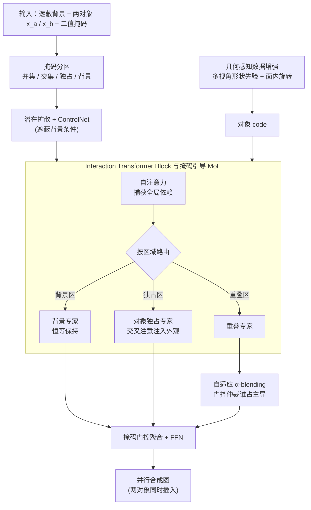

# PICS: Pairwise Image Compositing with Spatial Interactions

**会议**: ICLR 2026  
**arXiv**: [2603.06873](https://arxiv.org/abs/2603.06873)  
**代码**: [github.com/RyanHangZhou/PICS](https://github.com/RyanHangZhou/PICS)  
**领域**: 知识编辑  
**关键词**: image compositing, diffusion model, Mixture-of-Experts, spatial interaction, α-blending

## 一句话总结

提出 PICS——一种并行成对图像合成方法，通过 Interaction Transformer 中的掩码引导 MoE 和自适应 α-blending 策略，在单次推理中同时合成两个对象并显式建模遮挡、接触等空间交互关系，全面超越现有序列合成方法。

## 研究背景与动机

**扩散模型推动图像合成进展**：近年 diffusion-based 方法在单对象合成上表现优异，支持将对象作为视觉提示条件融入多样化背景。

**多轮合成的核心痛点**：现有方法本质是单轮的——每次只插入一个对象。当需要序列化插入多个对象时，后续操作会覆盖先前内容，破坏遮挡顺序和物理一致性。

**画家算法的缺陷**：按深度排序序列合成（先远后近）时，第一个插入的对象容易被误认为背景的一部分，导致部分删除、扭曲或过度融合。

**缺乏显式对象间交互建模**：现实场景中对象间存在支撑（support）、包含（containment）、遮挡（occlusion）、变形（deformation）等基本空间关系，但训练数据构建方式（前景-背景二分）忽略了这些关系。

**成对关系是组合推理的基本单元**：任何多对象场景的空间合理性都可以分解为成对对象间的关系，因此建模成对交互是解决多对象合成的关键一步。

**核心 idea**：将图像区域分为背景、两个对象各自的独占区域、以及重叠区域，用专用路由专家分别处理，并用注意力门控的 α-blending 解决重叠区域的融合问题。

## 方法详解

### 整体框架

PICS 要解决的是"往一张背景里同时塞进两个会相互遮挡、接触的对象"这件事——传统做法只能一个一个插，后插的会把先插的当成背景吃掉，导致遮挡顺序错乱、对象被部分擦除。PICS 的破局点是**并行合成**：它建立在潜在扩散模型 + ControlNet 之上，输入遮蔽背景 $\mathbf{x}_{bg}$、两个对象 $\{\mathbf{x}_a, \mathbf{x}_b\}$ 及其二值掩码 $\{\mathbf{m}_a, \mathbf{m}_b\}$，在**单次前向**里就把两个对象一起合成进背景，从根上绕开序列合成的覆盖与误差累积。

让这套并行方案成立的关键是先把画面**按区域切开**：由两个对象掩码算出并集掩码 $\mathbf{m}_u$、交集（重叠）掩码 $\mathbf{m}_{ab}$、各对象的独占掩码 $\mathbf{m}_a^{ex}$/$\mathbf{m}_b^{ex}$，以及背景掩码 $\mathbf{m}_{bg}=1-\mathbf{m}_u$。切开之后，画面的每个像素都明确归属于"背景 / 某对象独占 / 两对象重叠"之一，后续的 Interaction Transformer Block 就能按区域差异化处理：背景保持不动、独占区注入单一对象、最难的重叠区交给 α-blending 仲裁。训练数据则用自监督的 composition-by-decomposition 构造——从一张目标图擦除对象区域得到背景、再拆出两个对象，让模型学会从这些分解块重组回原图，因此完全不需要额外人工标注。

### 关键设计

**1. Interaction Transformer Block 与掩码引导 MoE：按空间区域分而治之**

如果让一个统一的注意力层同时操心背景保持、对象注入和重叠调解，结果往往哪个都做不好——这正是序列合成在遮挡处出伪影的根源。PICS 把"哪块区域该怎么处理"这条先验**写进结构**而非指望数据隐式学：每个 block 先用自注意力捕获全局依赖，再接一个掩码引导的 Mixture-of-Experts，把 token 按所在区域路由到专门的专家，最后各专家输出经掩码门控、残差聚合，再过 FFN 精炼。MoE 内部按区域各设一类专家：背景专家覆盖 $\bar{\mathbf{m}}_{bg}$，做恒等映射保持背景原样不被扰动；对象 a/b 的独占专家分别覆盖 $\bar{\mathbf{m}}_a^{ex}$、$\bar{\mathbf{m}}_b^{ex}$，用背景 query 去交叉注意对应对象的 code，把单个对象的外观注入到只属于它的位置；而真正的难点——两对象交叠的 $\bar{\mathbf{m}}_{ab}$ 区域——交给下面的重叠专家。掩码路由保证每个像素只被它该归属的逻辑触碰，从机制上避免对象外观渗到背景或两对象互相污染。

**2. 自适应 α-blending：让模型自己学谁该挡谁**

重叠区是全文最关键的设计，也是序列合成最容易翻车的地方。直接用 MLP 把两个对象 code 揉在一起会糊掉边界、谁占主导也不稳定；硬指定前后遮挡顺序又僵硬且要额外标注。PICS 改用注意力门控的重叠专家：从背景深层表示 $\mathbf{z}^{l-1}$ 生成一个 gating query $\mathbf{q}_g$，让它分别与两个对象 code 做交叉注意力得到聚合表示 $\tilde{\mathbf{c}}_a$、$\tilde{\mathbf{c}}_b$，再算兼容性得分并归一成混合权重：

$$s_p = \frac{\langle \mathbf{q}_g, \tilde{\mathbf{c}}_p \rangle}{\sqrt{d}}, \quad \alpha = \mathrm{softmax}_\tau(s_a, s_b), \quad \mathbf{c}_{ab} = \alpha\, \tilde{\mathbf{c}}_a + (1-\alpha)\, \tilde{\mathbf{c}}_b$$

其中 $d=\dim(\mathbf{q}_g)$、$\tau>0$ 是控制选择尖锐度的温度。这套设计之所以有效，关键在于 $\mathbf{q}_g$ 取自背景深层表示，携带的是**学到的遮挡语义而非外观线索**，所以两个得分经 softmax 联合归一后，$\alpha$ 能在每个空间位置自适应地反映"该让谁占主导"，等价于在两对象之间做隐式仲裁。实验进一步印证：得分差 $\Delta s = s_a - s_b$ 的符号与真实可见性一致（正favor对象 a、负favor对象 b、接近 0 则均衡混合），且交换对象 a/b 编号不改变结果，天然具备顺序不变性。

**3. 几何感知数据增强：补足对象的三维形状先验**

单张对象图只给一个视角，遇到杂乱遮挡时形状容易退化。PICS 在训练时叠两类几何增强：一是**多视角形状先验**，用单视图 3D 重建模型为对象渲染 $K$ 个辅助视角，编码后融成一个紧凑的多视角描述子喂给 shape encoder，补上视角变化下的形状信息；二是**面内旋转**，对对象图像及其掩码随机施加 $\theta \sim \mathcal{U}(-\pi/6, \pi/6)$ 的旋转再编码，提升对面内错位的鲁棒性。消融显示两者各自都带来稳定收益（多视角主治视角变化、旋转主治面内错位）。

### 损失函数 / 训练策略

训练以自监督重组损失为核心，要求模型从分解出的背景与两个对象重构回原始目标图像，并叠加潜在扩散的标准去噪损失共同优化。由于训练对完全由 composition-by-decomposition 从现有图像自动构造，整个流程无需任何额外标注数据。

## 实验关键数据

### 主实验

**对象重组（LVIS 验证集）**：

| 方法 | mPSNR ↑ | mSSIM ↑ | mLPIPS ↓ | PSNR ↑ | FID ↓ | LPIPS ↓ |
|------|---------|---------|----------|--------|-------|---------|
| PbE (CVPR'23) | 10.24 | 0.4241 | 0.4535 | 15.29 | 34.93 | 0.4138 |
| AnyDoor (CVPR'24) | 11.62 | 0.5283 | 0.4185 | 17.12 | 27.17 | 0.3302 |
| OmniPaint (ICCV'25) | 12.20 | 0.3096 | 0.4618 | 16.09 | 26.25 | 0.3542 |
| **PICS (ours)** | **13.88** | **0.5823** | **0.3221** | **18.27** | **24.99** | **0.2530** |

在交叉区域指标（mPSNR/mSSIM/mLPIPS）上提升尤为显著，体现了显式建模重叠区域的优势。

**对象合成（DreamBooth 测试集）**：

| 方法 | FID ↓ | CLIP-score ↑ | DINOv2-score ↑ | DreamSim ↓ |
|------|-------|-------------|----------------|------------|
| ObjectStitch | 260.4 | 51.35 | 0.3203 | 0.3374 |
| AnyDoor | 274.1 | 51.24 | 0.3401 | 0.2733 |
| InsertAnything (AAAI'26) | 266.0 | 50.54 | 0.3612 | 0.2934 |
| **PICS (ours)** | **255.5** | **54.02** | 0.3631 | 0.3054 |

### 消融实验

| 设置 | 关键变化 | FID ↓ | CLIP-score ↑ |
|------|---------|-------|-------------|
| #1 MLP + 单视图 | 基线 | 173.1 | 74.6 |
| #2 ITB + 单视图 | MLP→ITB | 165.2 | 76.3 |
| #3 ITB + 旋转增强 | +面内旋转 | 162.5 | 74.9 |
| #4 ITB + 多视角 | +多视角prior | 158.2 | 77.3 |
| #5 ITB + 组合数据 | +1M训练集 | **151.3** | **79.1** |

每个组件都带来一致的改进，其中训练数据规模扩展（LVIS→1M 组合数据集）收益最大。

### 关键发现

1. **并行合成 vs 序列合成**：并行方式有效避免了序列合成的误差累积，特别是在遮挡边界处
2. **α-blending 学到了真实可见性**：$\Delta s = s_a - s_b$ 的符号与对象实际可见性一致，且与输入顺序无关
3. **去噪过程中 α 的演化**：早期粗糙→中期决定性→晚期精细化，符合扩散模型的精炼动力学
4. **可扩展至3/4对象**：追加训练的 3/4 对象模型仍保持一致的遮挡顺序和接触关系
5. **用户研究**：在真实性（17.7%）和一致性（22.5%）上排名第一

## 亮点与洞察

- **MoE + 空间掩码路由的设计直觉优雅**：不同区域天然需要不同处理策略——背景保持不变、独占区域注入单一对象、重叠区域需要调解——这种先验知识通过架构设计硬编码
- **自适应 α-blending 比硬遮挡掩码更优**：允许模型自主学习遮挡语义，而非人为指定前后关系
- **自监督训练避免了标注成本**：composition-by-decomposition 从现有图像自动构造训练对
- **输入顺序不变性**：α-blending 机制确保交换对象 a/b 编号不影响结果，这是理想的对称性质

## 局限与展望

- **shape encoder 容量有限**：在极度杂乱环境中偶尔出现几何和纹理退化（论文 Figure 10 failure cases）
- **仅限成对合成**：虽然展示了 3/4 对象扩展，但 MoE 专家数量随对象数指数增长，更多对象的场景需重新设计路由
- **backbone 限制**：基于标准扩散模型，未采用更强 FLUX 等 flow-matching backbone（OmniPaint 在部分指标上因此有优势）
- **数据集多样性**：训练主要在 LVIS 上，虽然加入了组合数据，但对极端领域（如医学影像合成）的泛化性未验证
- **文本条件缺失**：纯 image-prompted，不支持文本描述指导合成位置或样式

## 相关工作与启发

- **AnyDoor (CVPR'24)**：使用额外边缘图保持语义，但缺乏对象间交互建模，在遮挡处产生伪影
- **FreeCompose (ECCV'24)**：零样本合成，但不显式处理空间交互
- **InsertAnything (AAAI'26)**：最新对比方法之一，PICS 在 FID 和 CLIP-score 上均超越
- **多轮编辑 (Zhou et al., 2025; Avrahami et al., 2025)**：与本文互补——多轮编辑面临类似的跨轮次一致性问题
- **启发**：MoE 的掩码引导路由思路可推广到其他需要区域特化处理的视觉生成任务（如视频编辑中前景/背景分离处理、3D 场景编辑中不同物体区域的独立操控）

## 评分

- ⭐ 新颖性: 4/5 — 并行合成 + 掩码引导 MoE + α-blending 的组合设计新颖，但各单独组件非首创
- ⭐ 实验充分度: 4.5/5 — 多数据集、多指标、用户研究、消融实验、多对象扩展均覆盖
- ⭐ 写作质量: 4/5 — 结构清晰，图示丰富，公式推导完整
- ⭐ 实用价值: 4/5 — 对虚拟试衣、场景编辑等应用有直接价值，代码已开源

<!-- RELATED:START -->

## 相关论文

- [\[ICLR 2026\] EAMET: Robust Massive Model Editing via Embedding Alignment Optimization](eamet_robust_massive_model_editing_via_embedding_alignment_optimization.md)
- [\[ICLR 2026\] Fine-tuning Done Right in Model Editing](fine-tuning_done_right_in_model_editing.md)
- [\[ICLR 2026\] Rote Learning Considered Useful: Generalizing over Memorized Training Examples](rote_learning_considered_useful_generalizing_over_memorized_training_examples.md)
- [\[ICLR 2026\] GOT-Edit: Geometry-Aware Generic Object Tracking via Online Model Editing](got-edit_geometry-aware_generic_object_tracking_via_online_model_editing.md)
- [\[ICLR 2026\] When Large Multimodal Models Confront Evolving Knowledge: Challenges and Explorations](when_large_multimodal_models_confront_evolving_knowledge_challenges_and_explorat.md)

<!-- RELATED:END -->
