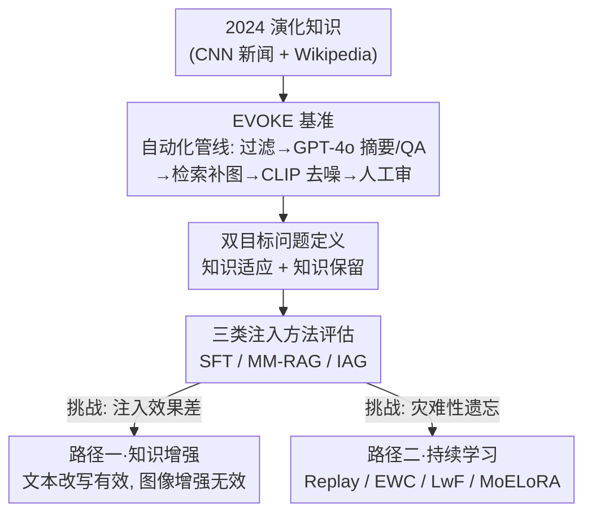

# When Large Multimodal Models Confront Evolving Knowledge: Challenges and Explorations

**会议**: ICLR 2026  
**arXiv**: [2505.24449](https://arxiv.org/abs/2505.24449)  
**代码**: 无  
**领域**: Multimodal / VLM  
**关键词**: 大型多模态模型, 知识注入, 演化知识, 灾难性遗忘, 持续学习

## 一句话总结

提出 EVOKE 基准测试，系统评估大型多模态模型 (LMM) 对演化知识的注入能力，揭示两大挑战（现有方法表现差、微调导致灾难性遗忘），并提出知识增强和持续学习两条应对路径。

## 研究背景与动机

大型语言/多模态模型 (LLM/LMM) 通过大规模预训练积累了丰富的世界知识，但面临一个根本性问题：**知识过时**。全球信息快速更新，新实体不断涌现，而训练后的模型是静态的。例如，LMM 可能无法识别小米 SU7 汽车，反而错误地回答是保时捷。

现有知识注入研究存在三个关键缺口：

**缺乏多模态演化知识数据集**：现有知识注入数据集（如 CC-RECENTNEWS）仅包含文本，缺少真实场景中的多模态数据

**缺少对 LMM 的系统研究**：大多数知识注入研究聚焦 LLM，对视觉-语言模型的系统探索明显不足

**对注入副作用认识不足**：知识注入（尤其是微调）对模型原有能力的影响缺乏全面评估

本文旨在构建首个多模态演化知识注入基准，系统揭示挑战并探索可行路径。

## 方法详解

### 整体框架

本文不提出某个具体的注入算法，而是搭起一条"造基准 → 系统评估 → 给改善路径"的研究主线，目标是把"LMM 该怎么吸收演化知识"这个模糊问题变成可量化、可对比的工程问题。第一步用一条自动化管线把 2024 年的真实演化知识做成 EVOKE 基准，并把"学会新知识"和"不忘旧能力"写成一个双目标，作为后续所有评估的统一标尺。第二步拿这把标尺去量 SFT、MM-RAG、IAG 三类主流注入路线，结果同时暴露出两个核心挑战：注入效果普遍很差，以及微调会引发灾难性遗忘。第三步针对这两个挑战分头开药——用知识增强缓解"注入差"，用持续学习缓解"遗忘"，两条路径分别对应双目标里的"知识适应"和"知识保留"。

### 关键设计

**1. EVOKE 基准：用自动化管线把演化知识做成可注入、可评估的数据**

现有数据集要么只有文本、要么知识不够"新"，无法考验 LMM 对真实演化知识的吸收能力。EVOKE 从 CNN 新闻网站（29 种新闻类型）和离线版 Wikipedia（130 种实体类型）采集，覆盖 159 种细粒度类型、共 9,422 条知识-图片对，且全部取自 2024 年——这保证了对 2023 年发布的 LLaVA、Qwen-VL 等模型而言它们是全新知识。每条知识被组织成两份数据：注入侧 $\mathcal{D}_\mathcal{K} = \{(i_k, x_k, y_k)\}$ 提供知识图片、启发式查询和知识摘要，评估侧 $\mathcal{D}_\mathcal{Q} = \{(i_q, x_q, y_q)\}$ 提供另一张查询图片、问题和 ground truth，注入图与查询图不同正是为了避免模型靠"记图片"而非"学知识"作弊。整条质量保证管线是"流行度过滤 → GPT-4o 生成摘要 → GPT-4o 生成 QA → Google 图片检索补图 → CLIP 聚类去噪 → 人工审核"，让基准既能持续产出新知识，又控制住了噪声。

**2. 双目标问题定义：注入新知识的同时别忘旧能力**

知识注入往往只盯着新知识学没学会，却忽略了对原有能力的破坏，而本文的两个核心挑战恰恰要靠这两个维度才能分别度量。作者把注入形式化为一个约束优化：知识适应 (Knowledge Adaptation) 要在演化知识评估数据上最大化准确率，知识保留 (Knowledge Retention) 则要求注入后模型在原任务上的性能尽量不退化，写成

$$\max_f \mathbb{E}[\mathbb{I}(\mathcal{M}^*(i_q, x_q) = y_q)] \text{ s.t. } \min_f \mathbb{E}[\mathbb{I}(\mathcal{M}(i_p, x_p) = y_p) - \mathbb{I}(\mathcal{M}^*(i_p, x_p) = y_p)]$$

其中 $\mathcal{M}^*$ 是注入后模型、$\mathcal{M}$ 是原模型，$\mathbb{I}(\cdot)$ 为指示函数。这个双目标定义把"注入差"映射到适应项偏低、把"灾难性遗忘"映射到保留项的退化，因此它既是评估标尺，也直接决定了后面两条改善路径各自该优化哪一项。

**3. 三类注入方法全覆盖：把主流路线放在同一标尺下对比**

要看清谁强谁弱，就得把知识注入的三条技术路线放进同一套基准和指标里。监督微调 (SFT) 走 Full Fine-Tuning 和 LoRA 两种参数内化策略，把知识写进权重；多模态检索增强 (MM-RAG) 不改权重，而设了 Text-Only、Image-Only、UniIR（多模态融合检索）和 Golden Context（直接喂正确上下文的理想上限）四档检索；互联网增强 (IAG) 则用 Gemini、Perplexity AI 这类联网搜索系统实时取证。三者恰好对应"内化 / 外部检索 / 联网搜索"，覆盖了当下几乎所有可行的注入范式，也让"注入效果差"这个结论不至于被某一条路线的实现缺陷带偏。

**4. 路径一·知识增强：在训练阶段帮模型"学对逻辑"而非死记硬背**

SFT 注入效果差，一个可能的原因是模型只是把训练摘要背了下来、却提取不出来。作者于是在训练阶段做数据增强：文本侧用 GPT-4 把知识摘要 paraphrase 成多个语义等价但表达不同的版本，图像侧则用翻转、随机阴影、颜色变换等传统手段。实验给出一个反直觉的结论——文本改写越多准确率越高（改写数量与准确率正相关），而传统图像增强反而拉低性能。作者的解释是，文本增强逼着模型学习"小米 SU7 是小米汽车公司的电动轿车"这种灵活可提取的属性关联，而不是机械背诵整段描述，这与 Allen-Zhu & Li (2024) "仅记忆训练数据不保证知识提取"的理论一致；而简单的几何/颜色扰动并不改变知识内容、只引入噪声，所以无助甚至有害。

**5. 路径二·持续学习：缓解微调带来的灾难性遗忘**

微调注入后旧能力崩溃，本质是一个持续学习问题，作者按"原始训练数据是否可得"分两种场景给对策。数据可得时用 Replay，随机抽取 10% 原始训练数据与新知识混合训练，让旧任务的梯度始终在场；数据不可得时则比较三条路线——参数正则化的 EWC（锁住重要权重）、知识蒸馏的 LwF（用旧模型输出约束新模型），以及用多个专家获取多样化知识的 MoELoRA。综合排名为 Replay+LoRA (Rank 1) > MoELoRA (Rank 2) > Replay+Full-FT (Rank 3)，说明"少量回放 + 低秩微调"是兼顾注入与保留的最稳方案；代价是所有持续学习方法都会牺牲一些注入效果（MoELoRA 的准确率从 15.23 掉到 6.82 最为明显），印证了双目标本身的内在张力。

### 损失函数 / 训练策略

SFT 用的是标准指令微调的交叉熵损失。持续学习各方法在此基础上各加各的约束：Replay 在原始数据子集上沿用标准损失；EWC 加参数正则项 $\mathcal{L}_{EWC} = \mathcal{L}_{task} + \lambda \sum_i F_i (\theta_i - \theta_i^*)^2$，用 Fisher 信息 $F_i$ 锁住重要参数；LwF 加蒸馏项 $\mathcal{L}_{LwF} = \mathcal{L}_{task} + \lambda \mathcal{L}_{KD}$，用旧模型输出约束新模型；MoELoRA 则靠多专家路由加对比学习来分散知识。

## 实验关键数据

### 主实验

| 方法 | Overall Acc | Overall F1 | News Acc | Entity Acc |
|------|------------|------------|----------|------------|
| LLaVA Vanilla | 4.89 | 9.34 | 7.37 | 2.18 |
| LLaVA Full-FT | 18.02 | 15.17 | 21.35 | 14.37 |
| LLaVA LoRA | 15.23 | 18.31 | 17.72 | 12.51 |
| LLaVA MM-RAG (UniIR) | 40.68 | 57.51 | 40.12 | 41.30 |
| LLaVA MM-RAG (Golden) | **56.13** | **75.77** | 56.78 | 55.43 |
| Perplexity AI† | 48.27 | 62.44 | 47.58 | 48.96 |

所有方法最高仅 56.13% 准确率，远未达到理想水平。

### 灾难性遗忘评估 (12 个 benchmark，7 个能力维度)

| 方法 | MME | MMBench | MIA-Bench | MMDU | Ranking |
|------|-----|---------|-----------|------|---------|
| Vanilla | 1865.56 | 64.60 | 66.33 | 26.37 | - |
| Full-FT | 956.8 (-49%) | 52.92 (-18%) | 25.25 (-62%) | 13.03 (-51%) | 7 |
| LoRA | 1233.54 (-34%) | 53.87 (-17%) | 29.66 (-55%) | 13.70 (-48%) | 6 |
| Replay+LoRA | **1650.75** (-12%) | **60.48** (-6%) | **62.33** (-6%) | **19.31** (-27%) | **1** |
| MoELoRA | 1732.47 (-7%) | 63.32 (-2%) | 64.97 (-2%) | 18.66 (-29%) | 2 |

### 关键发现

1. **挑战1：知识注入表现极差**
    - 最好方法 (Golden Context) 准确率仅 56.13%
    - SFT 方法更差 (15-18%)
    - MM-RAG 整体优于 SFT，但需要检索基础设施
    - IAG (Perplexity AI) 不依赖外部注入数据即达 48.27%

2. **挑战2：灾难性遗忘严重**
    - Full-FT 和 LoRA 在所有 12 个 benchmark 上都出现退化
    - **指令遵循能力损失最严重**：MIA-Bench 下降 62%/55%，因为 EVOKE 数据中不包含指令遵循场景
    - 指令遵循能力是其他能力的前提——其严重受损导致 MME (依赖 Yes/No 指令) 表现远差于 MMBench (选择题)
    - 多轮对话能力 (MMDU) 同样大幅下降

3. **文本增强有效、图片增强无效**
    - 训练阶段文本改写 (1→4 个改写版本) 持续提升性能
    - 传统图像增强导致性能下降，说明需要开发专门的图像知识增强方法

4. **持续学习方法有效但有代价**
    - Replay 和 MoELoRA 最有效缓解遗忘
    - 但所有持续学习方法都在知识注入效果上有所损失
    - MoELoRA 知识注入性能下降最大 (Acc: 15.23→6.82)

5. **顺序微调越做越差**
    - 将数据分 4/8/12 批顺序微调，性能随批次递减
    - 说明顺序微调不适合持续注入演化知识

## 亮点与洞察

1. **首个多模态演化知识基准**：EVOKE 填补了多模态知识注入评估的空白，数据收集管线可持续产出新的演化知识
2. **全面的系统性评估**：横跨 SFT/RAG/IAG 三类方法、2 个 LMM、12 个遗忘评估 benchmark，实验规模在同类工作中领先
3. **指令遵循 → 灾难性遗忘的因果链**：揭示知识注入导致指令遵循能力崩溃，进而引发其他能力大幅下降，这个因果机制的发现对后续研究有重要指导意义
4. **文本增强的"学对逻辑"解释**：模型需要学习灵活提取知识而非死记硬背，文本改写帮助模型存储实体属性的正确关联，这个洞察可指导数据准备策略
5. **知识类型适应差异**：新闻知识比实体知识更容易适应，因为新闻由旧实体的新事件组成，而新实体对 LMM 完全陌生

## 局限与展望

1. **数据规模受限**：9,422 条看似不少但相对 LMM 的参数规模仍很小，更大规模数据可能改变结论
2. **模型选择偏旧**：实验仅在 LLaVA-v1.5 和 Qwen-VL-Chat (均为 2023 年模型) 上进行，更新的模型（如 GPT-4V、InternVL-2）可能有不同表现
3. **仅评估知识 VQA**：EVOKE 的评估限于视觉问答格式，未涵盖更复杂的知识应用场景（如推理链、多跳推理）
4. **图像增强的探索不足**：虽然发现传统增强无效，但未探索更高级的图像增强策略（如基于扩散模型的风格变换）
5. **缺少与编辑方法的比较**：知识编辑 (knowledge editing) 方法（如 ROME、MEMIT 的多模态版本）未纳入比较

## 相关工作与启发

- **知识注入三范式**：SFT (参数内化)、RAG (外部检索)、IAG (互联网搜索) 各有优劣，未来可能需要混合方法
- **持续学习在 LMM 中的应用**：Replay 和 MoELoRA 的有效性表明，将持续学习与大模型微调结合是有前途的方向
- **知识增强启示**：Allen-Zhu & Li (2024) 的理论——仅记忆训练数据不保证知识提取——在多模态场景下得到验证
- **启发**：IAG (如 Perplexity AI) 的强表现暗示，对于演化知识，与其注入模型不如增强模型的联网搜索能力

## 评分

- 新颖性: ⭐⭐⭐⭐ — 首个多模态演化知识基准，问题定义清晰
- 实验充分度: ⭐⭐⭐⭐⭐ — 实验规模大、覆盖全面、分析深入
- 写作质量: ⭐⭐⭐⭐ — 结构良好，挑战-路径框架清晰
- 价值: ⭐⭐⭐⭐ — 基准和发现对社区有重要参考价值，但模型偏旧

<!-- RELATED:START -->

## 相关论文

- [\[ICML 2026\] KORE: Enhancing Knowledge Injection for Large Multimodal Models via Knowledge-Oriented Controls](../../ICML2026/knowledge_editing/kore_enhancing_knowledge_injection_for_large_multimodal_models_via_knowledge-ori.md)
- [\[ACL 2026\] EvoEdit: Evolving Null-space Alignment for Robust and Efficient Knowledge Editing](../../ACL2026/knowledge_editing/evoedit_evolving_null-space_alignment_for_robust_and_efficient_knowledge_editing.md)
- [\[AAAI 2026\] Hybrid-DMKG: A Hybrid Reasoning Framework over Dynamic Multimodal Knowledge Graphs for Multimodal Multihop QA with Knowledge Editing](../../AAAI2026/knowledge_editing/hybrid-dmkg_a_hybrid_reasoning_framework_over_dynamic_multimodal_knowledge_graph.md)
- [\[ICML 2026\] The Labyrinth and the Thread: Rethinking Regularizations in Sequential Knowledge Editing for Large Language Models](../../ICML2026/knowledge_editing/the_labyrinth_and_the_thread_rethinking_regularizations_in_sequential_knowledge_.md)
- [\[ICML 2026\] Revisiting Parameter-Based Knowledge Editing in Large Language Models: Theoretical Limits and Empirical Evidence](../../ICML2026/knowledge_editing/revisiting_parameter-based_knowledge_editing_in_large_language_models_theoretica.md)

<!-- RELATED:END -->
