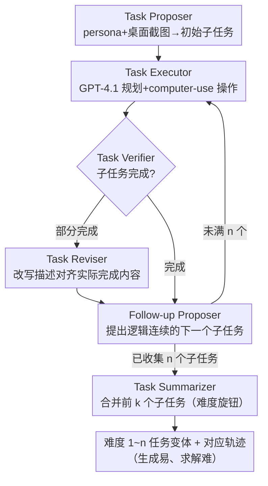

# AgentSynth: Scalable Task Generation for Generalist Computer-Use Agents

**会议**: ICLR 2026  
**arXiv**: [2506.14205](https://arxiv.org/abs/2506.14205)  
**代码**: [https://github.com/sunblaze-ucb/AgentSynth](https://github.com/sunblaze-ucb/AgentSynth)  
**领域**: LLM Agent  
**关键词**: 合成数据生成, 计算机使用代理, 信息不对称, 任务链式组合, 长程任务基准  

## 一句话总结
提出AgentSynth pipeline，利用信息不对称原理（正向逐步生成简单、反向整体求解困难）将简单子任务链式组合为复杂长程计算机使用任务，自动生成6000+多样化任务和轨迹，每条轨迹仅需$0.60，SOTA Agent在最高难度下成功率仅4%。

## 研究背景与动机

**领域现状**：LLM agent在计算机使用任务（web导航、桌面操作）领域快速发展，但高质量训练和评估数据严重依赖人工标注。

**现有痛点**：(a) 人工标注代价巨大（如TheAgentCompany每个任务需17小时/$34-425）；(b) 人工标注的多样性有限，难以覆盖真实计算机使用场景的全部复杂性；(c) 合成数据pipeline面临两个核心挑战——当前LLM agent无法可靠完成复杂任务的轨迹生成，以及简单生成策略的多样性不足。

**核心矛盾**：高质量的agent数据需要复杂+多样的任务，但LLM agent只能可靠完成简单任务——如何调和这一矛盾？

**本文目标**：设计一个低成本、高多样性的全自动pipeline，生成真实、可控难度的计算机使用任务和对应轨迹。

**切入角度**：利用**信息不对称**——正向逐步解决（每步只需完成一个简单子任务）远比从零推理整个解决方案容易。所以让agent正向生成子任务并收集轨迹，再用summarizer合并为一个高层级复合任务。

**核心 idea**：将复杂任务分解为简单子任务序列进行正向生成，再反向合并为看似一体的长程任务——生成容易、求解困难。

## 方法详解

### 整体框架
AgentSynth要解决的核心矛盾是：高质量的agent数据需要复杂任务，但当前LLM agent只能可靠完成简单任务。它的破局点是把"生成"和"求解"拆开——在OSWorld虚拟桌面环境里，由6个LLM-based agent接力，让agent正向地一步步搭出一条由简单子任务组成的轨迹，再把这些子任务对外合并成一个看似一体的长程任务。

整条流水线这样转：Task Proposer 基于随机persona和当前桌面截图抛出第一个子任务，Task Executor 执行并留下轨迹，Task Verifier 判定是否完成，失败则交给 Task Reviser 修正任务描述，成功则由 Follow-up Proposer 接着提出逻辑连续的下一个子任务，如此迭代生成 $n$ 个子任务。最后 Task Summarizer 把"前 1 个、前 2 个 …… 前 $n$ 个"子任务分别合并，自然产出难度 1 到 $n$ 的一组任务变体。为安全起见，所有任务都在虚拟机中执行，且禁止涉及登录凭据、邮件发送等敏感操作。

### 关键设计

**1. 信息不对称驱动的任务构建：用"正向易、反向难"的落差造出挑战性任务**

这一步直接针对"agent 完不成复杂任务，但数据又需要复杂任务"的矛盾。关键观察是：正向逐步求解和从零规划整条路径，是两种认知负荷截然不同的事。所以生成时，每个子任务都只是当前桌面状态下的简单操作（几个原子动作即可完成），agent 能可靠执行并收集到干净轨迹；而合并后对外暴露的高层任务描述里**不包含任何中间步骤信息**，测试时的 agent 必须从零推理整条解决路径。生成端靠简单任务保住轨迹质量，评估端靠合并后的复合任务保住挑战性，落差本身就是难度的来源。

**2. 六智能体协作 Pipeline：把"提出—执行—验证—修正—延伸—合并"全自动串起来**

六个 agent 各管一段，端到端无需人工。Task Proposer 基于随机 persona 和桌面截图生成初始任务，保证多样性；Task Executor 采用两阶段架构，GPT-4.1 负责高层规划、computer-use-preview 负责精确坐标操作，让推理和底层执行各取所长；Task Verifier 用 WebJudge-style 架构，先从任务描述提取关键需求，再从截图序列里选关键帧，最后判定成功/失败和完成百分比；当任务只部分完成时，Task Reviser 把任务描述改写成与实际完成内容相符的版本，避免脏轨迹；Follow-up Proposer 结合历史子任务和当前截图，提出逻辑连续的下一个子任务；Task Summarizer 则把子任务序列抽象成单一高层描述，并通过改变纳入的子任务数量来控制难度。

**3. 可控任务难度：用"合并几个子任务"这一个旋钮调出连续的难度梯度**

难度直接由 Summarizer 合并的子任务数量决定，Level $k$ 对应合并前 $k$ 个子任务。这让难度有了可量化的物理含义：Level 1 平均约 5 步、跨 1.2 个应用、记忆跨度 2 步；Level 6 平均约 45 步、跨 3.3 个应用、记忆跨度 18 步、还要切换 4.3 次应用。现有 benchmark 普遍缺这种系统性的难度控制，难以精确定位 agent 的能力边界，而这里只需调一个数字就能生成贴着能力边界的数据。

### 一个完整示例
以一个 Level 3 任务为例走一遍：Task Proposer 看到桌面上开着文件管理器，抛出子任务 1「在 Documents 里新建文件夹 report」；Executor 执行成功，Verifier 通过。Follow-up Proposer 接着提出子任务 2「把下载目录里的 data.csv 移进 report 文件夹」，再到子任务 3「用电子表格软件打开它并算出某列总和」。三条简单子任务各自被可靠完成、留下轨迹。最后 Summarizer 把它们合并成一句对外的高层任务——「整理下载的销售数据并汇总到 report 文件夹」，中间"新建—移动—打开—求和"这些步骤完全不出现在描述里。测试 agent 拿到这句话，得自己从零想出整条跨应用路径，于是同样一组轨迹在合并后的求解难度陡增。

## 实验关键数据

### 主实验
在生成的benchmark上评估多种SOTA agent（成功率%）：

| Agent模型 | Level 1 | Level 2 | Level 3 | Level 4 | Level 5 | Level 6 |
|----------|---------|---------|---------|---------|---------|---------|
| SOTA Range | ~18% | ~14% | ~10% | ~8% | ~6% | ~4% |

从Level 1到Level 6，成功率从18%骤降至4%，展示了benchmark的区分力和挑战性。

### 质量评估（人工100样本）

| 质量指标 | 通过率 |
|---------|-------|
| 可行性和现实性 | 91% |
| 子任务连贯性 | 90% |
| Persona相关性 | 94% |
| 验证器准确率 | 88% |

### 成本对比

| 框架 | 典型步骤数 | 每任务人工时 | 每任务成本 |
|-----|----------|-----------|----------|
| τ-bench | 20-30 | 2h | $4-50 |
| OSWorld | 10-15 | 4.4h | $8.8-110 |
| TheAgentCompany | 30-40 | 17h | $34-425 |
| **AgentSynth** | **40-60** | **N/A** | **$0.60** |

### 关键发现
- 信息不对称原理的有效性：同样的子任务序列，正向生成成功率高（子任务验证通过），但合并后反向求解成功率极低（Level 6仅4%）
- 60%+轨迹涉及2+个应用，40%+涉及3+个应用——真实反映了跨应用协调的复杂性
- Verifier的对抗测试表现良好：near-miss误接受率仅12%，benign正确接受率94%
- 任务多样性覆盖办公、信息检索、娱乐、编程、研究等多个领域

## 亮点与洞察
- **信息不对称**作为合成数据的核心设计原则非常巧妙：从认知心理学角度，"顺序执行"和"从零规划"确实是两种截然不同的认知负荷——本文将这一直觉系统化为数据生成方法论
- **$0.60 vs $34-425**的成本对比触目惊心，真正实现了agent数据的可规模化生产
- **难度可控**的设计使其不仅是benchmark，更是训练数据source——可以按需生成特定难度的数据进行curriculum learning
- GPT-4.1 planner + computer-use executor 的两阶段执行器设计值得借鉴

## 局限与展望
- 当前任务生成依赖GPT-4.1，不同模型可能产生系统性偏差（复杂度、现实性）——作者承认这是open question
- 验证器仍有12%的near-miss误接受率，对于训练数据这可能引入噪声
- 仅在OSWorld（Ubuntu桌面）验证，Windows/macOS场景的迁移性未知
- 子任务之间的逻辑连贯性由LLM保证，可能出现不自然的任务组合
- 缺乏用生成数据训练agent后的下游性能评估——pipeline的最终价值需要通过训练效果验证

## 相关工作与启发
- **vs OS-Genesis/Learn-by-interact**: 它们是"执行轨迹后追溯定义任务"，AgentSynth是"先定义子任务再组合为复合任务"，后者对任务质量控制更强
- **vs Evol-Instruct**: 只生成最终指令的轨迹，无子任务链组合机制
- **vs WorkArena compositional**: 用预定义的原子任务组合，AgentSynth的子任务由LLM动态生成，多样性更高
- **vs 人工benchmark（OSWorld/TheAgentCompany）**: 质量相当但成本低50-700倍

## 评分
- 新颖性: ⭐⭐⭐⭐ 信息不对称原理在agent数据合成中的应用是核心创新，六智能体pipeline设计思路清晰
- 实验充分度: ⭐⭐⭐⭐ 人工质量验证+对抗测试+成本对比+难度梯度分析都很扎实，但缺乏训练效果评估
- 写作质量: ⭐⭐⭐⭐⭐ 结构清晰，pipeline每个组件解释详尽，图表信息量大
- 价值: ⭐⭐⭐⭐⭐ 对agent社区有基础设施级贡献——真正可规模化的高质量数据生成方案

<!-- RELATED:START -->

## 相关论文

- [\[ICLR 2026\] Efficient Agent Training for Computer Use](efficient_agent_training_for_computer_use.md)
- [\[ICLR 2026\] ToolWeaver: Weaving Collaborative Semantics for Scalable Tool Use in Large Language Models](toolweaver_weaving_collaborative_semantics_for_scalable_tool_use_in_large_langua.md)
- [\[CVPR 2026\] CarePilot: A Multi-Agent Framework for Long-Horizon Computer Task Automation in Healthcare](../../CVPR2026/llm_agent/carepilot_a_multi-agent_framework_for_long-horizon_computer_task_automation_in_h.md)
- [\[ACL 2026\] Supplement Generation Training for Enhancing Agentic Task Performance](../../ACL2026/llm_agent/supplement_generation_training_for_enhancing_agentic_task_performance.md)
- [\[ICLR 2026\] Towards Scalable Oversight via Partitioned Human Supervision](towards_scalable_oversight_via_partitioned_human_supervision.md)

<!-- RELATED:END -->
