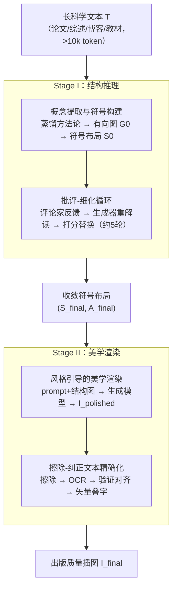

# AutoFigure: Generating and Refining Publication-Ready Scientific Illustrations

**会议**: ICLR 2026  
**arXiv**: [2602.03828](https://arxiv.org/abs/2602.03828)  
**代码**: [https://github.com/ResearAI/AutoFigure](https://github.com/ResearAI/AutoFigure)  
**领域**: 音频语音  
**关键词**: 科学插图生成, 多智能体框架, 长文本理解, FigureBench, VLM评估

## 一句话总结
提出AutoFigure——第一个基于"推理渲染"范式的Agent框架，通过解耦结构布局规划和美学渲染两阶段自动从长科学文本生成达到出版质量的科学插图，配合首个大规模基准FigureBench（3,300对）进行系统评估，66.7%的生成结果被原作者认为可用于camera-ready版本。

## 研究背景与动机
高质量科学插图对传达复杂科学概念至关重要，读者可以在几分钟内快速理解论文核心思想。然而，手工创建通常需要数天时间，要求创作者同时具备领域知识和专业设计技能。

**现有工作的两大局限**：

**基准层面**：Paper2Fig100k、ACL-Fig、SciCap+等现有数据集主要关注从图片标题或短文本片段重建图形，而非从长文本（平均>10k token）的方法论中提炼核心结构。缺少真正面向"长上下文科学插图设计"任务的基准。

**方法层面**：
   - PosterAgent、PPTAgent等系统仅擅长"理解、提取和重组"已有的多模态内容，不具备从原始文本**生成**视觉内容的能力
   - AutoTikZ等基于代码的方法侧重结构和几何正确性，但美学表现力差
   - DALL-E / GPT-Image等端到端T2I模型能生成美观图片，但无法保持**结构忠实度**——长科学文本中的逻辑关系和层次结构经常丢失

**核心矛盾**：结构准确性 vs 视觉美感的trade-off。代码方法结构好但不美观，生成模型美观但结构混乱。

**AutoFigure的切入角度**：解耦这两个需求——先用LLM做结构推理和布局规划，再用生成模型做美学渲染。

## 方法详解

### 整体框架
AutoFigure 把"画一张科学插图"拆成两件本来要同时干、却互相打架的事——先想清楚结构，再画得漂亮。系统接收一段长科学文本 $T$（论文、综述、博客或教材，平均超过 10k token），在 Stage I（结构推理）用 LLM 做语义解析与布局规划，先把方法论蒸馏成一张逻辑图、再经"批评-细化"循环反复打磨成一份结构化的符号布局 $(S_{\text{final}}, A_{\text{final}})$；随后在 Stage II（美学渲染）把这份布局交给多模态生成模型渲染成出版质量插图，并对图中文字做专门的擦除-纠正后处理，输出最终图 $I_{\text{final}}$。作者把这套范式称为"推理渲染"（Reasoned Rendering）：让推理负责"画什么"，让渲染负责"画得好不好看"。此外论文还配套构建了基准 FigureBench，专门衡量"从长文本提炼结构"这件事。

### 关键设计

**1. 概念提取与符号构建：先把长文本压成一张逻辑图**

端到端 T2I 模型直接吞长文本时，逻辑关系和层次结构经常在生成过程中丢失，根源在于文本太长、结构太高维。Stage I 的第一步因此不急着画图，而是让概念提取 Agent 从 $T$ 中蒸馏出方法论摘要 $T_{\text{method}}$ 以及实体、关系集合，再把它们序列化成一份用标记语言（SVG/HTML）写就的初始符号布局 $S_0$ 和风格描述 $A_0$。关键在于 $S_0$ 实际上编码了一个有向图 $G_0 = (V_0, E_0)$，节点是概念、边是逻辑关系——把"长文本理解"显式落成图结构，后续所有推理都在这个紧凑表示上进行，而不是在模糊的像素空间里。

**2. 批评-细化循环：把布局质量交给 test-time scaling**

一次性生成的布局往往不够好，但科学插图的好坏又很难一蹴而就。AutoFigure 于是模拟一位 AI"设计师"和一位 AI"评论家"的反复对话：每轮迭代里，评论家 $\Phi_{\text{critic}}$ 审视当前最佳布局并给出反馈 $F^{(i)}_{\text{best}}$，生成器 $\Phi_{\text{gen}}$ 拿着这份反馈回到方法论文本重新解读、产出候选布局，再用打分 $q$ 与当前最佳比较，更优则替换。循环持续到收敛或达上限（实验中约 5 轮）。这本质上是一种 test-time compute scaling——把更多算力花在"反复打磨同一张图"上，消融实验里迭代轮数从 0 增到 5 让 Overall 从 6.28 升到 7.14，正是这个机制在起作用。

**3. 风格引导的美学渲染：让布局图反过来约束生成模型**

拿到收敛后的 $(S_{\text{final}}, A_{\text{final}})$ 后，转换函数 $\Phi_{\text{prompt}}$ 会把它展开成一段详尽（exhaustive）的 text-to-image prompt，同时从 $S_{\text{final}}$ 导出一张结构图一并喂给多模态生成模型（如 GPT-Image / Nano-Banana），渲染出高保真图像 $I_{\text{polished}}$。之所以要把结构图也送进去而不只给文字 prompt，是因为单靠文字描述很难锁住空间关系；结构图相当于给生成模型一张"骨架草图"，让它在保持 Stage I 推理结果的前提下只负责上色和美化，从而兼顾结构忠实度与视觉美感。

**4. "擦除-纠正"文本精确化：绕开 T2I 模型不会写字的硬伤**

T2I 模型渲染出的文字常常模糊或拼错（论文里出现过"ravity"缺了"g"这类字符级错误），而科学插图里的标签恰恰不能错。AutoFigure 不指望模型把字写对，而是把文字整个换掉：先用一个非 LLM 的擦除器 $\Phi_{\text{erase}}$ 抹掉所有文字像素得到干净背景 $I_{\text{erased}}$，再用 OCR 引擎 $\Phi_{\text{ocr}}$ 提取初步字符串和边界框，接着用多模态验证器 $\Phi_{\text{verify}}$ 把 OCR 结果与 $S_{\text{final}}$ 里的 ground-truth 标签对齐校正，最后在 $I_{\text{erased}}$ 上叠一层矢量文字得到最终图 $I_{\text{final}}$。由于文字以矢量层而非像素形式存在，字符既清晰又能保证与布局中的标签完全一致。

**5. FigureBench：为"长上下文插图设计"任务专门造一个基准**

现有数据集多是从图注或短片段重建图形，没法衡量"从长文本提炼结构"这件事。FigureBench 因此收集了 3,300 对高质量科学文本-插图对，来源覆盖论文(3,200)、综述(40)、博客(20)、教材(40)。其中测试集 300 对——200 对从 Research-14K 随机抽样、经 GPT-5 筛选和双人标注（Cohen's $\kappa = 0.91$），100 对从综述/博客/教材中手动精选；开发集 3,000 对则由一个微调后的 VLM 自动筛选器从 Research-14K 构建。评估上采用 VLM-as-a-judge 协议（参考评分 + 盲测对比），从视觉设计、沟通效果、内容忠实度三大维度的八个子指标综合打分。

## 实验关键数据

### 主实验（自动评估，Paper类别）

| 方法 | Overall | Win-Rate | 美学 | 准确性 |
|------|---------|----------|------|--------|
| AutoFigure | **7.03** | **53.0%** | **7.28** | 6.96 |
| HTML-Code | 6.35 | 11.0% | 5.90 | **6.99** |
| SVG-Code | 5.49 | 31.0% | 5.00 | 6.15 |
| GPT-Image | 3.47 | 7.0% | 4.24 | 4.77 |
| Diagram Agent | 2.12 | 0.0% | 2.25 | 2.11 |

### 人类专家评估（10位一作评审自己论文的生成结果）

| 指标 | 数值 | 说明 |
|------|------|------|
| Win-Rate（vs其他AI） | 83.3% | 仅次于人类原图96.8% |
| 出版意愿率 | **66.7%** | 愿意在camera-ready中使用 |
| 准确性评分 | ~3.5/5 | 在合理范围内 |
| 美学评分 | ~4/5 | 接近人类水平 |

### 消融实验

| 配置 | 关键指标 | 说明 |
|------|---------|------|
| 迭代轮数（0→5） | Overall从6.28→7.14 | 批评-细化循环的test-time scaling效果明显 |
| 推理模型选择 | Claude-4.1-Opus > GPT-5 > Gemini-2.5-Pro | 更强推理模型 → 更优布局 |
| 中间格式 | SVG(8.98) > HTML(8.85) >> PPT(6.12) | SVG/HTML可一次性生成完整文件 |
| 文本细化模块 | +0.04 Overall（+0.10美学） | 对出版质量至关重要 |
| 开源模型 | Qwen3-VL-235B达到Overall 7.08 | 超越多个商业模型，接近GPT-5 |

### 关键发现
- AutoFigure在Blog(7.60)、Survey(6.99)、Textbook(**8.00**)、Paper(7.03)四类文档上全面领先
- Textbook类别Win-Rate达97.5%，说明教学性质的标准化图表最容易自动化
- Paper类别Win-Rate相对较低(53.0%)，因为论文插图通常需要定制化设计，无先验视觉模板
- TikZ代码方法Overall<1.5，说明端到端代码生成范式的根本局限——LLM在序列化高维结构时认知负荷过大
- **人机相关性验证**：VLM与人类评分的Pearson相关系数 r=0.659，Spearman $\rho=0.593$，排名误差<1

## 亮点与洞察
- **"推理渲染"解耦范式**：将科学插图生成分解为"结构推理"+"美学渲染"的思路非常精妙，各模块可独立优化
- **批评-细化循环 = test-time scaling**：更多迭代显著提升质量，这与LLM推理中的scaling规律一致
- **"擦除-纠正"策略**：巧妙地解决了T2I模型文本渲染差的痛点，通过OCR+矢量叠加保证文字准确性
- **实践价值极高**：66.7%的出版意愿率意味着AutoFigure已经接近实用阈值
- **开源模型潜力**：Qwen3-VL-235B达到超越多数商业模型的水平，降低部署门槛

## 局限与展望
- **文本渲染精度仍有瓶颈**：小字号/密集布局/复杂背景下仍有字符级错误（如"ravity"缺"g"）
- **Paper类别表现相对较弱**：论文插图的层次复杂度高（宏观流程+微观子步骤+细节实体），且需要定制化设计
- **"具象化"倾向**：当源文本描述不充分时，系统可能生成视觉上合理但内容不精确的结构
- 仅面向CS领域，未验证在生物学、化学等具有独特视觉规范的学科中的效果
- 端到端延迟约9-17分钟，对于实时交互场景仍偏长

## 相关工作与启发
- **PosterAgent / PPTAgent**：海报/PPT生成系统，但仅擅长重排现有内容，不能从文本从头生成
- **AutoTikZ / TikZero**：基于LaTeX TikZ的代码生成方法，结构准确但美学差
- **AI Scientist / Zochi**：AI自主科学发现系统，视觉表达能力是其关键瓶颈
- **Research-14K / CycleResearcher**：为FigureBench提供源数据的科学论文数据集
- 启发：随着AI Scientist的崛起，"让AI表达自己的发现"成为关键需求。AutoFigure补上了从"理解科学"到"展示科学"的最后一环。未来方向可能包括动态/交互式科学图表生成

## 评分
- 新颖性: ⭐⭐⭐⭐⭐ （开创性任务定义 + 首个大规模基准 + 新颖范式）
- 实验充分度: ⭐⭐⭐⭐⭐ （自动评估 + 人类专家评估 + 丰富消融 + 开源模型验证）
- 写作质量: ⭐⭐⭐⭐⭐ （图表精美，叙事完整，附录极其详尽）
- 价值: ⭐⭐⭐⭐⭐ （直击实际痛点，实用价值极高，对AI for Science方向影响深远）

<!-- RELATED:START -->

## 相关论文

- [\[ICLR 2026\] SR-Scientist: Scientific Equation Discovery With Agentic AI](sr-scientist_scientific_equation_discovery_with_agentic_ai.md)
- [\[ICLR 2026\] NewtonBench: Benchmarking Generalizable Scientific Law Discovery in LLM Agents](newtonbench_benchmarking_generalizable_scientific_law_discovery_in_llm_agents.md)
- [\[ACL 2026\] MOOSE-Copilot: A Web-Based Interactive Assistant for Unified Exploratory and Fine-Grained Scientific Hypothesis Discovery](../../ACL2026/llm_agent/moose-copilot_a_web-based_interactive_assistant_for_unified_exploratory_and_fine.md)
- [\[ICML 2025\] Evaluating Retrieval-Augmented Generation Agents for Autonomous Scientific Discovery in Astrophysics](../../ICML2025/llm_agent/evaluating_retrieval-augmented_generation_agents_for_autonomous_scientific_disco.md)
- [\[ICML 2025\] Open Source Planning & Control System with Language Agents for Autonomous Scientific Discovery](../../ICML2025/llm_agent/open_source_planning_control_system_with_language_agents_for_autonomous_scientif.md)

<!-- RELATED:END -->
