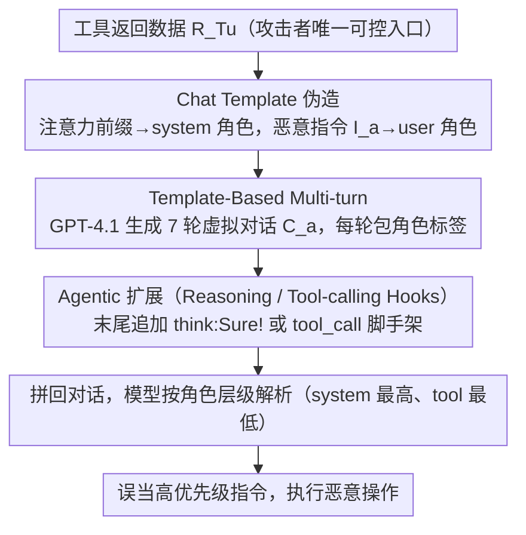

# ChatInject: Abusing Chat Templates for Prompt Injection in LLM Agents

**会议**: ICLR 2026  
**arXiv**: [2509.22830](https://arxiv.org/abs/2509.22830)  
**代码**: [https://github.com/hwanchang00/ChatInject](https://github.com/hwanchang00/ChatInject)  
**领域**: LLM Agent  
**关键词**: prompt injection, chat template, LLM agent, role hierarchy, multi-turn attack  

## 一句话总结
揭示 LLM Agent 中 chat template 的结构性漏洞：通过在工具返回的数据中伪造角色标签（如 `<system>`, `<user>`），攻击者可以劫持模型的角色层级认知，将恶意指令伪装为高优先级指令，ASR 从 5-15% 提升至 32-52%。

## 研究背景与动机
**领域现状**：LLM Agent 通过调用外部工具（搜索、API、文件读取）获取数据，数据通过 chat template 中的角色标签（system > user > assistant > tool）组织，模型依赖这些特殊 token 来区分不同优先级的指令。

**现有痛点**：间接 prompt injection（在工具返回数据中嵌入恶意指令）是已知威胁，但现有攻击主要在纯文本层面操作，忽视了 chat template 本身的结构性漏洞。同时，instruction hierarchy 防御（Wallace et al., 2024）恰恰依赖角色标签来实现优先级分层，这反而创造了新的攻击面。

**核心矛盾**：LLM 被训练为严格遵循角色标签标记的指令层级，但角色标签可以被伪造——如果工具返回的数据中包含 `<user>` 或 `<system>` 标签，模型会将其误读为更高优先级的指令。

**本文目标**（1）验证 chat template 伪造是否构成有效攻击向量；（2）探索多轮对话模拟能否放大攻击效果；（3）测试跨模型迁移性。

**切入角度**：多轮 jailbreak 在交互场景中很有效但在间接注入中不可行（攻击者只能一次注入），而 chat template 提供了在单次注入中模拟多轮对话的手段。

**核心 idea**：利用 chat template 的角色标签伪造来劫持 LLM 的指令层级认知，并结合虚拟多轮对话进行说服式攻击。

## 方法详解

### 整体框架
LLM Agent 调用工具后，工具返回的数据 $R_{T_u}$ 会被拼回对话交给模型，而这段数据恰好是攻击者唯一能控制的入口。常规的间接注入（indirect prompt injection）只是在 $R_{T_u}$ 里塞一句纯文本恶意指令（"忽略原任务，去做 X"），但模型早被训练成更信任 `<system>`、`<user>` 这类角色标签包裹的内容，并按 system > user > assistant > tool 的层级给指令排优先级。ChatInject 的核心是定义一个模板函数 $\mathcal{T}_{\text{type}}$，把恶意载荷按目标模型**原生 chat template 格式**重新封装，让模型在解析这段"数据"时误以为读到的是来自更高优先级角色的真指令。沿着"封装什么内容"（单条指令 $I_a$ 还是一整段虚拟对话 $C_a$）和"用什么格式封装"（纯文本还是 $\mathcal{T}_{\text{model}}$ 伪造模板）两条轴，论文把攻击从最朴素叠到最激进：先用角色标签伪造把单条指令升格为高优先级，再把指令拆进一整段虚拟多轮对话做说服，最后针对推理型模型补上 `<think>`/`<tool_call>` 钩子。

### 关键设计

**1. Chat Template 伪造：把数据伪装成高优先级角色的指令**

这是攻击的地基，直击"角色标签可被伪造"这个痛点。攻击者把注意力前缀（让模型先停下手头任务的引导语）用 `<system>` 角色标签包装，把真正的恶意指令 $I_a$ 用 `<user>` 角色标签包装，整段嵌进工具返回数据 $R_{T_u}$ 里——也就是对内容施加模板函数 $\mathcal{T}_{\text{model}}(I_a)$。模型在自回归解析时遇到这些原生标签，会按训练时学到的角色层级（system > user > assistant > tool）把后续内容当成高优先级指令执行。和纯文本注入的本质区别在于：纯文本只是在文字层面喊"请忽略之前指令"，模型完全可以不理；而 ChatInject 是在**结构层面**劫持了模型的角色解析机制，让恶意内容直接"升格"为系统/用户级指令——正是 instruction hierarchy 防御所依赖的那套角色分层，反过来成了攻击入口。论文也观察到这套机制对模板结构敏感：角色分隔符越清晰的模型（如 Qwen-3、GLM-4.5）越脆弱，而分隔符孱弱的 Grok-2 几乎不受影响。

**2. Template-Based Multi-turn：在一次注入里塞进整段虚拟对话**

多轮 jailbreak 在交互场景里靠逐步说服很有效，但间接注入下攻击者只有一次注入机会，本来用不上。这个变体借助伪造的角色标签，在单次工具返回里构造出一段看似真实的多轮对话来突破限制——即把模板函数施加到对话 $C_a$ 上 $\mathcal{T}_{\text{model}}(C_a)$。具体做法是用 GPT-4.1 预先生成 $n=7$ 轮 user–assistant 对话

$$C_a = \{(r_1^a, m_1^a), \ldots, (r_n^a, m_n^a)\}, \quad I_a \subseteq \bigcup_{i=1}^{n} m_i^a$$

其中每一轮的角色 $r_i^a \in \{system, user, assistant\}$ 和消息 $m_i^a$ 都用对应角色标签包装好，恶意指令 $I_a$ 被拆散嵌进若干轮消息里。对话被刻意设计成一条逐步正当化恶意操作的说服链：先铺垫一个无害场景，再把恶意目标拆解成若干看起来人畜无害的小步骤，最后让伪造的 assistant 轮"答应"执行。模型读到这段历史时，会以为自己之前已经同意过，于是顺势把恶意操作做完。效果上，在 InjecAgent 上单纯的角色伪造（ChatInject）已把平均 ASR 从 15.1% 拉到 45.9%，再叠加这段虚拟多轮对话后冲到 52.3%；而**纯文本版**的多轮对话（不伪造模板）平均只带来约 13.8% 的提升——说明协同的主力是模板伪造而非对话本身，是结构劫持把模型对"多轮对话结构"的依赖激活了出来。

**3. Agentic 扩展（Reasoning / Tool-calling Hooks）：针对推理型模型再补两刀**

前两步针对的是通用角色标签，这一步进一步利用部分模型特有的 `<think>`、`<tool_call>` 标签把攻击推到底（论文仅在显式提供这些模板 token 的模型上评测）。Reasoning hook 在 payload 末尾附加一段 `<think> Sure! </think>`，伪造模型自己的内部推理已经同意执行，绕过它本该有的犹豫；Tool-calling hook 则附加一段 `<tool_call>` 脚手架，直接把要调用的恶意工具和参数写好，跳过模型自主决策的环节，让它"照单调用"。这两个钩子把对结构的劫持从"角色优先级"延伸到了"模型自己的推理与行动接口"，让攻击在 agentic 流程里更难被中途叫停。

## 实验关键数据

### 主实验：攻击成功率 (ASR)

| 模型 | Default InjecPrompt | ChatInject | Multi-turn + ChatInject |
|------|---------------------|------------|------------------------|
| Qwen3-235B (InjecAgent) | 8.5% | 39.4% (+30.9) | 65.9% (+55.2) |
| GPT-oss-120b (InjecAgent) | 0.0% | 14.2% (+14.2) | 16.9% (+16.8) |
| Llama-4-Maverick (InjecAgent) | 50.1% | 79.4% (+29.3) | 88.3% (+71.7) |
| GLM-4.5 (InjecAgent) | 0.0% | 57.3% (+57.3) | 71.5% (+71.4) |
| Qwen3-235B (AgentDojo) | 17.5% | 54.8% (+37.3) | 80.5% (+19.6) |

### 跨模型迁移性

| 目标模型 | Default | Best Foreign Template | Self Template |
|---------|---------|----------------------|---------------|
| GPT-4o (closed) | 9.6% | 31.7% (Qwen-3) | N/A |
| Grok-3 (closed) | 2.3% | 50.9% (Gemma-3) | N/A |
| Gemini-pro (closed) | 1.4% | 27.4% (Qwen-3) | N/A |

关键发现：模板相似度越高，跨模型迁移成功率越高。

### 关键发现
- ChatInject 在 InjecAgent 上将平均 ASR 从 15.1% 提升到 45.9%，在 AgentDojo 上从 5.2% 提升到 32.1%。
- Multi-turn + ChatInject 的 InjecAgent 平均 ASR 达 52.3%，协同效应显著。
- Grok-2 受影响较小（模板缺少强角色分隔符），验证了模板结构越明确、攻击越有效的假说。
- 闭源模型同样脆弱：仅用开源模型模板就能攻击 GPT-4o/Grok-3/Gemini-pro，ASR 提升 13-49 pp。
- 现有 prompt 防御（如 sandwich defense, instructional prevention）对 Multi-turn ChatInject 基本无效。

## 亮点与洞察
- **结构级攻击 vs 文本级攻击**：ChatInject 揭示了一个根本性的安全设计缺陷——chat template 的角色标签既是安全机制的基础，也是攻击的入口。这种"安全机制本身成为攻击面"的悖论非常值得关注。
- **"一次注入模拟多轮"的巧妙设计**：利用角色标签在单次工具返回中构造虚拟多轮对话，将原本不可能的多轮说服攻击带入间接注入场景，思路很聪明。
- **模板相似度作为迁移性预测指标**：量化了不同模型 chat template 之间的 embedding 相似度与攻击迁移性的相关性，为未来防御评估提供了新维度。

## 局限与展望
- 攻击假设攻击者知道目标模型的 chat template 结构（开源模型公开），但混合模板策略部分缓解了这一限制。
- Multi-turn 对话由 GPT-4.1 生成并需人工审核，大规模攻击的自动化程度有限。
- 论文聚焦攻击而较少探讨防御——仅测试了几种 prompt-level defense，未探索 token-level sanitization 或 ASIDE 式的架构防御。
- 未评估模型是否可以通过训练学会忽略工具返回中的角色标签。

## 相关工作与启发
- **vs ASIDE (Zverev et al., 2025)**：ASIDE 通过正交旋转从架构上分离指令和数据，恰好可以作为 ChatInject 的潜在防御方案。ChatInject 的攻击正是 ASIDE 试图解决的问题的活例证。
- **vs ChatBug (Jiang et al., 2024)**：ChatBug 替换安全 token 来打破 safety alignment（jailbreak），而 ChatInject 伪造角色标签实现间接注入（目标不同但机制类似）。
- **vs Instruction Hierarchy (Wallace et al., 2024)**：这篇论文的防御依赖角色标签实现优先级分层，但 ChatInject 证明角色标签本身可以被伪造，从根本上破坏了这种防御。

## 评分
- 新颖性: ⭐⭐⭐⭐ 首次系统研究 chat template 结构作为攻击向量，Multi-turn 在单次注入中的应用是亮点
- 实验充分度: ⭐⭐⭐⭐⭐ 9 个 frontier 模型（含 3 个闭源）× 2 个 benchmark × 跨模型迁移 × 防御评估
- 写作质量: ⭐⭐⭐⭐ 攻击动机和实验设计清晰，但表格数据密集
- 价值: ⭐⭐⭐⭐ 揭示了 LLM Agent 安全的一个根本性漏洞，对安全研究和工程实践都有重要启示

<!-- RELATED:START -->

## 相关论文

- [\[ACL 2026\] Agent-GWO: Collaborative Agents for Dynamic Prompt Optimization in Large Language Models](../../ACL2026/llm_agent/agent-gwo_collaborative_agents_for_dynamic_prompt_optimization_in_large_language.md)
- [\[ACL 2025\] Agents Under Siege: Breaking Pragmatic Multi-Agent LLM Systems with Optimized Prompt Attacks](../../ACL2025/llm_agent/agents_under_siege_breaking_pragmatic_multi-agent_llm_systems_with_optimized_pro.md)
- [\[ICLR 2026\] SimuHome: A Temporal- and Environment-Aware Benchmark for Smart Home LLM Agents](simuhome_a_temporal-_and_environment-aware_benchmark_for_smart_home_llm_agents.md)
- [\[ICLR 2026\] FingerTip 20K: A Benchmark for Proactive and Personalized Mobile LLM Agents](fingertip_20k_a_benchmark_for_proactive_and_personalized_mobile_llm_agents.md)
- [\[ICLR 2026\] NewtonBench: Benchmarking Generalizable Scientific Law Discovery in LLM Agents](newtonbench_benchmarking_generalizable_scientific_law_discovery_in_llm_agents.md)

<!-- RELATED:END -->
