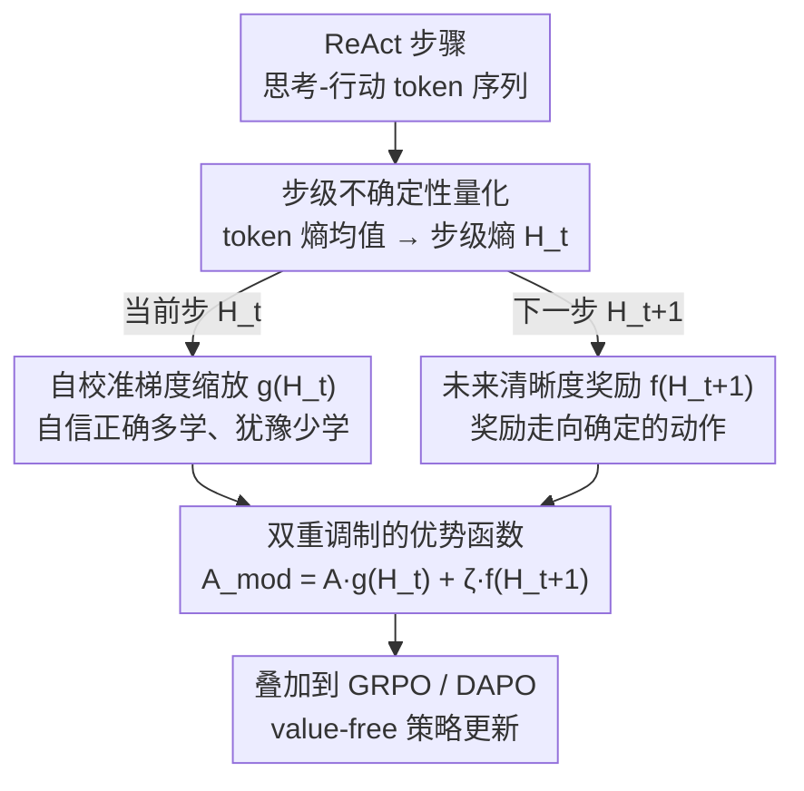

# Harnessing Uncertainty: Entropy-Modulated Policy Gradients for Long-Horizon LLM Agents

**会议**: ICLR 2026  
**arXiv**: [2509.09265](https://arxiv.org/abs/2509.09265)  
**代码**: [Project Page](https://empgseed-seed.github.io/)  
**领域**: LLM Agent  
**关键词**: 策略梯度, 熵调制, 长序列代理, 信用分配, 强化学习  

## 一句话总结

提出 EMPG 框架，通过步级熵（uncertainty）动态调制策略梯度的幅度，解决长序列 LLM Agent 任务中稀疏奖励下的信用分配问题，在 WebShop、ALFWorld 和 Deep Search 三个基准上显著超越 GRPO 和 DAPO。

## 研究背景与动机

在长序列任务（web 导航、软件工程、深度搜索等）中，LLM Agent 面临的根本挑战是**稀疏奖励下的信用分配**：反馈仅在整个生成结束后才可获得，难以识别哪些中间步骤是关键的。

现有方法主要有两条路线：

**隐式奖励引导**：奖励塑形、内在动机（好奇心/新颖性）、逆强化学习等——难以扩展到 LLM 的巨大状态-动作空间

**显式步级监督**：过程奖励模型（PRM）——标注成本高、合成数据噪声大、泛化性差，且在交互式 Agent 任务中定义"正确步骤"本身就极具挑战

本文的核心观察是：**标准策略梯度的梯度幅度与策略熵本质耦合**。具体来说，对 softmax 策略，score function 的期望范数是策略 Renyi-2 熵的单调函数（Proposition 1）。这带来双重问题：
- **自信且正确的步骤**本应被强烈强化，但其自然梯度很小，限制了学习速度
- **不确定的探索步骤**产生大梯度，引入噪声并破坏训练稳定性

## 方法详解

### 整体框架

EMPG（Entropy-Modulated Policy Gradients）要解决的是长序列 LLM Agent 在稀疏奖励下的信用分配：反馈只在整条轨迹末尾出现，看不出哪些中间步骤关键。它把每个 ReAct 周期（先思考再行动）视为一个决策步骤，先把这一步内若干 token 的熵聚合成步级熵，作为模型"自报"的不确定性信号；再用这个信号对原始优势做双重重校准——既按当前步的"该不该信"放大或衰减梯度，又用下一步的清晰度引导 Agent 走向可预测的解题路径。整个过程只读取策略自身的熵，不引入价值模型或过程奖励模型，因此可以原样叠在 GRPO、DAPO 这类 value-free 基线之上。

### 关键设计

**1. 步级不确定性量化：把 token 熵聚合成一步的"信心"读数**

长序列任务的信用分配难点在于反馈只在轨迹末尾出现，看不出哪一步关键。EMPG 不去额外标注步骤好坏，而是让策略自己报告——对一个"思考-行动"步骤内的 $m$ 个 token，取它们 token 级熵的平均作为步级熵 $H_t$。这个标量直接刻画了模型在这一步是"胸有成竹"还是"举棋不定"，成为后续所有调制的唯一输入。论文还指出：与逐 token 分析不同，即便整体低熵的步骤，步内仍会经历显著的熵变化，因此在步级而非 token 级上做聚合才是合适的粒度。

**2. 双重调制的优势函数：把"学多少"和"往哪探"分开处理**

标准策略梯度的幅度与策略熵天然耦合——论文的 Proposition 1 证明，对 softmax 策略，score function 的期望范数是策略 Renyi-2 熵的单调函数，于是自信且正确的步天然梯度太小、不确定的步天然梯度太大。EMPG 据此对步骤 $t$ 的优势做重写：

$$A_{\text{mod}}^{(i,t)} = A^{(i)} \cdot g(H_t^{(i)}) + \zeta \cdot f(H_{t+1}^{(i)})$$

第一项用当前步熵 $H_t$ 缩放原始优势 $A^{(i)}$，解决"这一步该学多少"；第二项用下一步熵 $H_{t+1}$ 给出探索激励，解决"该往哪个方向探"。两项各管一头，把原本纠缠的耦合问题拆成可独立调节的两个旋钮——下面两个设计分别落实这两项。

**3. 自校准梯度缩放 $g(H)$：让自信正确的步多学、犹豫的步少学**

缩放函数取指数形式并在 mini-batch 内归一化（均值约束为 1），使整体梯度规模不被改变、只在步与步之间重新分配。效果是：低熵（自信且正确）的步 $g>1$，放大本来偏小的梯度让它学得更狠；高熵（不确定、噪声大）的步 $g<1$，衰减梯度抑制训练抖动；而当优势为负且熵低（自信却做错）时，$g>1$ 反而放大了惩罚信号，让模型对"自信的错误"格外敏感。为稳定数值，步级熵在喂入 $g$ 前先做批次级 min-max 缩放，算出 $A_{\text{mod}}$ 后再做一次零均值归一化进一步压低方差。

**4. 未来清晰度奖励 $f(H)$：奖励那些把局面带向确定的动作**

第二项 $\zeta \cdot f(H_{t+1})$ 鼓励 Agent 选择能让下一步进入低熵状态的动作——直觉是好的解题路径会越走越清晰，而非越走越混乱，$\zeta$ 控制这股探索引导的强度。消融显示该项主要拉升域内成功率（偏 exploitation），而梯度缩放项主要改善域外泛化（偏 regularization），两者方向正交、叠加后同时受益。

## 实验关键数据

### 主实验

**ALFWorld 和 WebShop**（表1，平均成功率 %）：

| 方法 | 基座模型 | ALFWorld All | WebShop Succ. |
|------|---------|-------------|---------------|
| GRPO | Qwen2.5-1.5B | 65.6 | 58.2 |
| + EMPG | Qwen2.5-1.5B | **73.7 (+8.1)** | **60.8 (+2.6)** |
| DAPO | Qwen2.5-1.5B | 80.8 | 73.2 |
| + EMPG | Qwen2.5-1.5B | **88.1 (+7.3)** | **73.8 (+0.6)** |
| GRPO | Qwen2.5-7B | 74.8 | 65.6 |
| + EMPG | Qwen2.5-7B | **78.5 (+3.7)** | **69.3 (+3.7)** |
| DAPO | Qwen2.5-7B | 90.0 | 79.6 |
| + EMPG | Qwen2.5-7B | **91.6 (+1.6)** | **82.7 (+3.1)** |

**Deep Search**（表2，Qwen2.5-32B-Instruct）：

| 方法 | ID Avg. | OOD Avg. | Overall |
|------|---------|----------|---------|
| DAPO | 63.5 | 59.8 | 62.0 |
| + EMPG | **66.6 (+3.1)** | **63.7 (+3.9)** | **65.3 (+3.3)** |

注意 EMPG 在 OOD 上的提升（+3.9）大于 ID（+3.1），说明泛化能力增强。

### 消融实验

在 Deep Search（Qwen2.5-32B）上拆解两个组件：

| 变体 | ID Avg. | OOD Avg. | Overall |
|------|---------|----------|---------|
| DAPO 基线 | 63.5 | 59.8 | 62.0 |
| + Gradient Scaling only | 63.7 | 63.7 (+3.9) | 63.7 |
| + Future Bonus only | 66.1 (+2.6) | 61.4 | 64.2 |
| + EMPG (full) | **66.6** | **63.7** | **65.3** |

### 关键发现

1. **两个组件互补**：Future Clarity Bonus 主要提升域内性能（exploitation），Gradient Scaling 主要提升域外泛化（regularization）
2. **训练稳定性**：DAPO 基线在约 240 步后 KL Loss 剧烈波动（policy collapse），EMPG 全程保持稳定
3. **步级 vs token 级**：与 token 级分析不同，即使低熵步骤也会经历显著的熵变化，验证了步级分析的必要性
4. **突破性能瓶颈**：基线在 ALFWorld 和 WebShop 上到达性能平台后停滞，EMPG 能突破这个上限持续提升

## 亮点与洞察

1. **理论洞察深刻**：首次形式化证明策略梯度幅度与策略熵的固有耦合问题（Proposition 1），从梯度动力学角度揭示了长序列 RL 学习效率低下的根本原因
2. **即插即用**：作为优势调制模块，EMPG 可以直接叠加在 GRPO、DAPO 等任何策略梯度方法之上
3. **不需要额外模型**：利用 Agent 自身的策略熵作为内在信号，不需要额外的价值模型或过程奖励模型
4. **双重校准设计精妙**：梯度缩放处理"学多少"，未来清晰度处理"往哪探索"
5. **跨任务跨规模一致有效**：从 1.5B 到 32B 模型，从 web 导航到深度搜索均稳定提升

## 局限与展望

1. **熵估计的粗糙性**：使用平均 token 级熵作为步级不确定性的代理，可能忽略了步内不同 token 的重要性差异
2. **超参数敏感性**：缩放因子 k、k' 和 zeta 的选择需要调优，论文未充分讨论敏感性
3. **任务类型有限**：仅在 web 导航、文本环境交互和搜索任务上验证，缺少代码生成、数学推理等其他长序列任务
4. **与 PRM 的结合**：EMPG 和过程奖励模型是正交的，未来可以探索两者结合
5. **多智能体场景**：论文提到但未验证在多 Agent 协作中的效果

## 相关工作与启发

- **GRPO** [Shao et al.]：通过组内 Z-score 估计优势——EMPG 在此基础上进一步细化到步级
- **DAPO** [Yu et al.]：自适应数据策展——EMPG 提供正交的梯度层面改进
- **SEED-GRPO** [Chen et al.]：用语义不确定性调制响应级优势——限于单轮推理
- **EDGE-GRPO** [Wang et al.]：在数学推理中做熵调制——限于单轮，未解决多步信用分配
- **ReAct** [Yao et al.]：思考-行动范式——EMPG 将每个 ReAct 周期视为一个决策步骤

## 评分

| 维度 | 评分 |
|------|------|
| 理论深度 | ⭐⭐⭐⭐⭐ |
| 新颖性 | ⭐⭐⭐⭐ |
| 实验充分性 | ⭐⭐⭐⭐⭐ |
| 写作质量 | ⭐⭐⭐⭐⭐ |
| 实用价值 | ⭐⭐⭐⭐⭐ |
| 总体评价 | ⭐⭐⭐⭐⭐ |

<!-- RELATED:START -->

## 相关论文

- [\[ICLR 2026\] Solving the Granularity Mismatch: Hierarchical Preference Learning for Long-Horizon LLM Agents](solving_the_granularity_mismatch_hierarchical_preference_learning_for_long-horiz.md)
- [\[ICLR 2026\] Exploratory Memory-Augmented LLM Agent via Hybrid On- and Off-Policy Optimization](exploratory_memory-augmented_llm_agent_via_hybrid_on-_and_off-policy_optimizatio.md)
- [\[ICML 2026\] ACON: Optimizing Context Compression for Long-horizon LLM Agents](../../ICML2026/llm_agent/acon_optimizing_context_compression_for_long-horizon_llm_agents.md)
- [\[ICLR 2026\] The Tool Decathlon: Benchmarking Language Agents for Diverse, Realistic, and Long-Horizon Task Execution](the_tool_decathlon_benchmarking_language_agents_for_diverse_realistic_and_long-h.md)
- [\[ACL 2026\] SOLAR-RL: Semi-Online Long-horizon Assignment Reinforcement Learning](../../ACL2026/llm_agent/solar-rl_semi-online_long-horizon_assignment_reinforcement_learning.md)

<!-- RELATED:END -->
