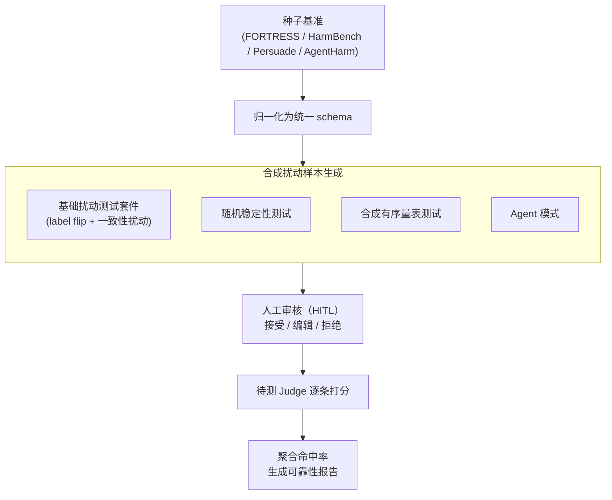

# Judge Reliability Harness: Stress Testing the Reliability of LLM Judges

**会议**: ICLR 2026  
**arXiv**: [2603.05399](https://arxiv.org/abs/2603.05399)  
**代码**: [https://github.com/RANDCorporation/judge-reliability-harness](https://github.com/RANDCorporation/judge-reliability-harness)  
**领域**: LLM Agent  
**关键词**: LLM-as-judge, reliability testing, perturbation robustness, agentic evaluation, benchmark

## 一句话总结
提出 Judge Reliability Harness（JRH），一个开源框架，通过 label flip、格式不变性、语义改写、冗余偏差、随机稳定性 等合成测试系统评估 LLM Judge 的可靠性，在四个基准（FORTRESS、HarmBench、Persuade、AgentHarm）上对四个 SOTA Judge 进行压力测试，发现没有任何一个 Judge 在所有场景下都可靠。

## 研究背景与动机

**领域现状**：LLM 被广泛用作评判者（autograder）来评分、排名或分类 AI 输出，替代昂贵的人工评估。MT-Bench、Chatbot Arena 等工作表明 GPT-4 级别的 Judge 可以接近专家水平。

**现有痛点**：Judge 的可靠性很少被系统评估和报告。小规模验证集上的点估计（与人工标注的一致率）无法保证 Judge 对输入变化（格式、措辞、长度）的鲁棒性。

**核心矛盾**：Judge 在评估生态中扮演核心角色，但缺乏标准化的可靠性测试工具。先前研究已揭示 LLM Judge 存在位置偏差、冗余偏差等问题，但缺乏实用的、可复现的测试框架。

**本文目标** 构建一个通用的、可配置的验证套件，让任何 LLM Judge 都能在部署前接受系统的可靠性压力测试。

**切入角度**：通过合成数据生成 pipeline + 人工审核，自动创建多维度测试用例。

**核心 idea**：用合成扰动驱动的标准化测试框架，系统暴露 LLM Judge 在不同维度的可靠性弱点。

## 方法详解

### 整体框架
JRH 要解决的问题是：LLM Judge 在小验证集上与人工标注一致率高，并不代表它面对格式、措辞、长度、采样随机性等输入变化时仍然稳定可靠，而这种鲁棒性此前缺乏标准化的测试工具。框架的做法是把"测 Judge"做成一条可配置的标准化流水线——先把任意种子基准归一化成统一 schema，再用一组合成数据 pipeline 围绕同一批样本造出多维度扰动测试用例（语义反转、布局/措辞/长度改写、重复采样、多级评分、多轮 transcript 编辑），经人工审核（HITL）兜底质控后逐条喂给待测 Judge，最后把各维度的命中率聚合成一份可靠性报告。整套流程对接任何 Judge + 任何基准，部署前跑一遍就能定位 Judge 在哪个维度最脆弱。

### 关键设计

**1. 基础扰动测试套件：用语义保持/语义反转两类扰动同时考 Judge 的辨别力和稳定性**

可靠性弱点不会只在一个维度暴露，所以 JRH 把基础测试拆成方向相反的两组。**判别性测试**（Label flip）专门考辨别力：把一条原本合规的响应重写成明确违反评分标准的版本，一个称职的 Judge 应当随之**翻转**判断——翻不动就说明它没真的在看质量。**一致性测试**则反过来考稳定性：施加三类不改变实质质量的扰动——Format invariance 只动空行/缩进/空格等纯布局，Semantic paraphrase 改措辞但保语义，Verbosity bias 把内容扩写或压缩但信息不变——理想的 Judge 在这些扰动下评分应当纹丝不动。一正一反两组合在一起，才能区分"Judge 评分变了是因为它发现了质量差异，还是只是被无关变化带偏"。

**2. 随机稳定性测试（Stochastic Stability）：把同一个输入喂多遍，看评分会不会自己抖**

前面的扰动都改了输入，这一项故意**不改**：对同一样本复制多份、逐份请求 Judge 打分，再比较这几次评分的离散程度（实验中用各次评分的**标准差** std 量化，越小越稳）。它针对的是 LLM 采样的固有随机性——温度采样会让完全相同的输入得到不同评分，而这种抖动会直接破坏评估结果的可复现性。一个评分波动很大的 Judge，即使平均准确率不低，也没法支撑可信的排名结论。

**3. 合成有序量表测试（Synthetic Ordinal）：为多级评分基准造出覆盖每一档分数的样本，专测校准**

二分类任务只需判对错，但像 Persuade 这种 1–6 分的有序量表，还要看 Judge 能不能把"3 分"和"4 分"分清，也就是校准能力。难点是合成样本容易扎堆在中间档。JRH 用一个**分数桶管理器**跟踪每个等级已经生成了多少，对还缺的档位采取**温度递增 + few-shot 示例**的引导策略去补，并用一个**验证 LLM** 确认生成样本确实落在目标分数。这样得到的测试集在各分数等级上分布均匀，才能把 Judge 在有序评分上的校准短板逼出来。

**4. Agent 模式：针对多轮对话记录设计的扰动链，处理单次文本评估处理不了的累积上下文**

评估一段多轮 agent transcript 和评估一段单次文本有本质区别——违规往往是多轮行为累积出来的，需要理解上下文。JRH 为此提供两类扰动：`agent_perturbation` 修改 transcript 注入违规行为（用来考漏检），`agent_positives` 反向修改使其满足标准（用来考误报）。由于改写多轮记录牵一发动全身，它用一条**多步编辑链**完成：规划 LLM 先定改哪里，编辑 LLM 落地修改，摘要 LLM 收敛上下文，验证 LLM 最后确认改动达到了预期效果。

**5. 人工审核环节（HITL）：给合成数据兜底质控，尤其是安全内容自动生成会失败的场景**

合成 pipeline 会产出不合理的扰动，安全相关内容尤其棘手——让模型去编辑有害文本时常被自身的 safety guardrail 挡住，生成失败或敷衍。JRH 因此提供一个 UI 界面，让标注者对每条扰动样本逐条**接受 / 编辑 / 拒绝**。这一环在 agent 模式里几乎是刚需：实验中 16 条 transcript 有 14 条需要人工介入修改，说明在涉及有害内容的编辑上完全自动化目前还不现实。

## 实验关键数据

### 主实验

| 基准 | 最可靠 Judge | 最不可靠 Judge | 关键发现 |
|------|-------------|---------------|----------|
| FORTRESS | Llama 4.1 Maverick | 各模型均较强 | 二分类任务整体可靠性高 |
| HarmBench | GPT-4o | Gemini 2.5 Pro (std=17.17%) | Claude std 最低(11.13%) |
| Persuade | Gemini 2.5 Pro (std=11.10%) | Claude Sonnet 4.5 (std=17.18%) | 多级评分显著降低可靠性 |
| AgentHarm | GPT-4o/Llama (0.906) | Gemini 2.5 Pro (75% positives) | Opus 4.5 在 perturbation 只有 68.75% |

### 消融分析

| 扰动类型 | 普遍表现 | 说明 |
|----------|----------|------|
| Semantic paraphrase | 鲁棒性最高（最低 40%） | 语义级扰动 Judge 相对稳定 |
| Format invariance | 可靠性最低 | 格式变化反而比语义变化更大影响 |
| Label flip | 中等 | 判别准确率因模型和任务而异 |
| Verbosity bias | 中等 | 长/短版本偏差存在但不极端 |
| Stochastic stability | 因模型而异 | 温度采样导致的不稳定性 |

### 关键发现
- **没有任何 Judge 在所有基准上都可靠**：Persuade 和 HarmBench 上观察到波动性的反向关系——Claude 在 Persuade 最不稳定但在 HarmBench 最稳定，Gemini 反之
- **格式扰动 > 语义扰动**：LLM Judge 对纯格式变化（空行、缩进）比语义改写更敏感，这令人担忧，因为不同 LLM 的输出格式本身就不同
- **二分类 vs 多级评分**：Persuade（1-6分）上所有 Judge 的可靠性显著低于二分类任务
- **Agent 评估有不对称失败模式**：某些 Judge 漏检 violation（高 false negative），某些过度标记（高 false positive）
- **Llama 4.1 Maverick 17B 性价比最高**：在多数基准上与顶级 Judge 匹敌，但成本低得多

## 亮点与洞察
- **框架设计的通用性**：JRH 可以对接任何 LLM Judge + 任何基准数据集，生成标准化的可靠性报告。这种"测试 Judge 的 Judge"作为元评估工具非常有价值。
- **HITL 在 Agent 模式中不可或缺**：agent_perturbation 中 14/16 条transcript 需要人工修改，说明当前生成模型在涉及有害内容编辑时受到 safety guardrail 限制，完全自动化还不现实。
- **格式敏感性的启示**：如果 Judge 在格式变化下不稳定，那么不同 LLM（各有不同的格式习惯）之间的排名对比可能被格式差异而非实质能力差异所主导。

## 局限与展望
- **样本量小**：每个基准只用 10-16 个样本做种子数据，统计功效有限
- **合成扰动的真实性**：自动生成的扰动是否真实反映生产中遇到的变化，需要进一步验证
- **Judge prompt 未标准化**：不同 Judge 配不同 prompt template，这本身引入了额外变量
- **未测试开源小模型**：只测了 4 个大型/中型模型，缺乏对更多开源评估模型的覆盖

## 相关工作与启发
- **vs FBI benchmark (Doddapaneni et al. 2024)**: FBI 通过定向扰动检测评估 LLM 能否发现质量下降，JRH 更通用且可配置
- **vs CALM (Ye et al.)**: CALM 量化位置偏差和冗余偏差的影响，JRH 将这类测试标准化为可复用框架
- **vs MT-Bench/Chatbot Arena**: 这些是 Judge 的"客户"，JRH 是对 Judge 本身的质量保证

## 评分
- 新颖性: ⭐⭐⭐ 思路直观但系统化做好了元评估框架的工程价值
- 实验充分度: ⭐⭐⭐ 基准覆盖面不错但样本量偏小
- 写作质量: ⭐⭐⭐⭐ 结构完整，方法描述清晰
- 价值: ⭐⭐⭐⭐ 作为实用工具对 LLM 评估社区很有价值

<!-- RELATED:START -->

## 相关论文

- [\[ICML 2026\] Towards a Science of AI Agent Reliability](../../ICML2026/llm_agent/towards_a_science_of_ai_agent_reliability.md)
- [\[NeurIPS 2025\] It's LIT! Reliability-Optimized LLMs with Inspectable Tools](../../NeurIPS2025/llm_agent/its_lit_reliability-optimized_llms_with_inspectable_tools.md)
- [\[ICLR 2026\] NewtonBench: Benchmarking Generalizable Scientific Law Discovery in LLM Agents](newtonbench_benchmarking_generalizable_scientific_law_discovery_in_llm_agents.md)
- [\[ICLR 2026\] FingerTip 20K: A Benchmark for Proactive and Personalized Mobile LLM Agents](fingertip_20k_a_benchmark_for_proactive_and_personalized_mobile_llm_agents.md)
- [\[ICLR 2026\] LiveNewsBench: Evaluating LLM Web Search Capabilities with Freshly Curated News](livenewsbench_evaluating_llm_web_search_capabilities_with_freshly_curated_news.md)

<!-- RELATED:END -->
