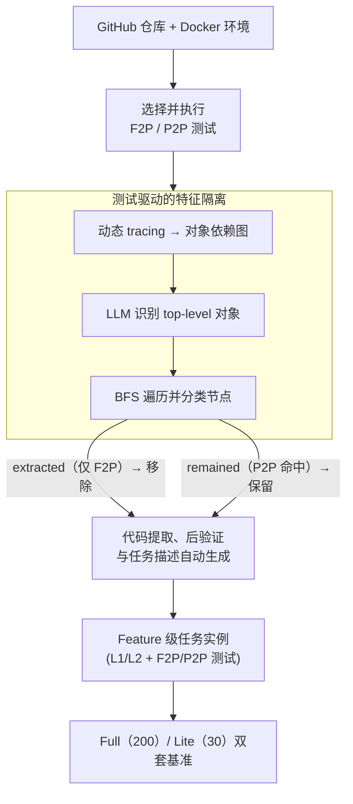

# FeatureBench: Benchmarking Agentic Coding for Complex Feature Development

**会议**: ICLR 2026  
**arXiv**: [2602.10975](https://arxiv.org/abs/2602.10975)  
**代码**: [github.com/LiberCoders/FeatureBench](https://github.com/LiberCoders/FeatureBench)  
**领域**: LLM Agent  
**关键词**: agentic coding, benchmark, feature development, test-driven, SWE-bench, code agent

## 一句话总结
提出 FeatureBench——面向特征级软件开发的代码智能体评测基准，通过测试驱动的自动化流水线从开源仓库中提取可验证的 feature 实现任务，最强 Claude Opus 4.5 仅解决 11.0%，揭示当前 Agent 在复杂特征开发上的巨大差距。

## 研究背景与动机
现有代码智能体评测基准（如 SWE-bench）主要聚焦于 bug 修复场景，feature request 类任务仅占 18–22%。随着 Claude Code、Qwen Code 等端到端编码系统的兴起，评估 Agent 在 **功能开发**（而非仅修 bug）上的能力变得至关重要。

SWE-bench 的 PR-based 方法存在结构性缺陷：一个完整 feature 往往横跨多个 PR、分散在时间线各处，单 PR 粒度无法捕获完整功能补丁。此外，许多 PR 缺乏标签，难以可靠区分 feature 贡献与 bug 修复。

现有基准的另一局限是评估方式。PaperBench 和 Paper2Coder 依赖人工审查或 LLM 判定，缺乏自动化的执行级验证。同时，手工策划的基准（如 GitTaskBench 仅 54 例、DevEval 仅 22 例）规模有限，难以全面衡量 Agent 能力。

数据泄露问题也日益严重——随着训练数据覆盖范围扩大，静态基准面临被"记住"的风险，亟需可持续更新的评测框架。

作者认为，一个理想的基准应同时满足四个条件：(1) 面向 feature 级真实开发；(2) 可执行验证；(3) 自动化可扩展收集；(4) 可持续更新，避免数据泄露。现有工作无一同时满足这四点。

## 方法详解

### 整体框架
FeatureBench 把"评测 Agent 能否开发完整功能"拆成两件事：一是用 **feature 级任务定义**取代 SWE-bench 的单 PR 粒度，让 Agent 根据高层描述和接口签名实现可直接调用的功能模块；二是用一套 **测试驱动的自动收集工具包**从真实开源仓库里反向"挖空"一个完整 feature。后者是核心管线：对一个仓库先选好并执行 F2P（fail-to-pass）/ P2P（pass-to-pass）测试、动态 tracing 出对象依赖图，再由 LLM 认出测试直接调用的 top-level 对象作为起点，沿依赖图做广度优先遍历，把整个 feature 牵连到的函数分成"该保留"与"该挖走"两类；挖走后得到一份功能缺失版代码库加一段 gold 补丁，经双向后验证与任务描述自动生成，就造出一个带 F2P/P2P 测试的可验证实例。

### 关键设计

**1. Feature 级任务定义与双难度设置：把"修 bug"换成"造功能"**

SWE-bench 用单段 PR diff 当任务，无法覆盖一个横跨多个 PR、散落在时间线各处的完整功能。FeatureBench 把每个实例换成面向真实开发的功能模块需求：给 Agent 的输入包括高层任务描述、函数签名（含输入输出类型）、import 路径、禁止访问的 URL 列表和一个 Dockerfile 执行环境，要求它产出**可直接调用**的解决方案。任务再按是否保留代码库结构分两档难度——$L_1$（增量开发，在现有代码库上新增功能）和 $L_2$（从头构建，完全从零实现同等功能），后者剥掉了代码库结构这根"拐杖"，专门考验长 horizon 规划。评估用两个互补指标：严格的 $\text{Resolved Rate} = \frac{\#\text{tasks fully solved}}{\#\text{total tasks}}$ 衡量真正被全部解决的比例，而更细粒度的 $\text{Passed Rate} = \frac{1}{N}\sum_{i=1}^{N}\frac{\#\text{F2P tests passed}_i}{\#\text{F2P tests total}_i}$ 按通过的 F2P 测试点占比打分，能捕捉"写对了一半"的部分进展。

**2. 测试驱动的特征隔离：挖功能时先认准它由哪些函数构成、又不能砸坏邻居**

要把一个 feature 从仓库里"挖"出来，先得知道它具体由哪些函数构成、且挖走后不破坏别的功能。工具包在执行 F2P 和 P2P 测试时，借 Python 内置的 tracing 设施捕获函数调用事件，串成一张对象依赖图（每个节点是一个函数，并标注它是否在 P2P 测试中出现过）。但测试覆盖的函数里混着"被直接测的目标功能"和一堆辅助工具函数，于是再用 LLM 在 F2P 测试文件中区分出 **top-level tested objects** 作为可靠起点——这一步分类的 F1 达 84.94%、准确率 91.74%。以这些 top-level 对象为根做广度优先遍历（BFS），沿依赖图逐层展开 feature 牵连到的函数，并按一条 P2P 保护规则分类：凡在 P2P 测试中出现过的节点标为 **remained**（属于其他已有功能，必须保留），只在 F2P 路径上出现的标为 **extracted**（属于待挖走的目标 feature），extracted 节点继续入队遍历，直到队列清空或挖出的代码量触达每例 3000–5000 行的上限。正是这条 P2P 保护让它区别于只看 F2P 的 SWE-Flow——保证挖走目标功能后不会误伤代码库里别的能力。

**3. 代码提取、后验证与任务描述自动生成：造出"功能缺失版"并自检质量**

把所有 extracted 节点对应的代码从仓库中移除，就得到一份"功能缺失版"代码库加一段实现该功能的 gold 补丁。为防止造出来的任务本身有 bug，工具包做双向后验证：(a) 缺失版代码库必须通过全部 P2P 测试、同时通不过任何 F2P 测试（说明目标功能确实被干净地挖掉了）；(b) 把补丁还原后所有测试都通过（说明 gold 方案确实可解）。最后从函数 docstring 抽取功能描述（缺失时由 LLM 补写），配上接口签名，自动拼成完整的 problem statement——整条流水线把人工干预压到每仓库约 3 分钟。

**4. Full / Lite 双套基准配置：兼顾覆盖度与评测成本**

最终数据来自 24 个开源 PyPI 仓库，时间跨度 2022.5–2025.9。**Full Set** 含 200 个高质量实例，每个实现代码 >100 行、F2P 测试点 ≥10、P2P 固定 5 个文件，保证任务足够复杂且可严格判分；**Lite Set** 是其中 30 个随机子集，用于低成本快速评估，实验也验证了它与 Full Set 的模型排名高度一致。

## 实验关键数据

### 主实验：各模型在 Full Set 上的表现

| Scaffold | Model | Passed Rate | Resolved Rate | Token I/O |
|----------|-------|-------------|---------------|-----------|
| Codex | GPT-5.1-Codex (medium) | 41.66% | **12.5%** | 6.3M / 39k |
| Claude Code | Claude Opus 4.5 | 43.29% | 11.0% | 7.5M / 34k |
| OpenHands | Claude Opus 4.5 | 45.53% | 10.5% | 8.1M / 29k |
| Gemini-CLI | Gemini-3-Pro (low) | 32.43% | 5.0% | 2.5M / 12k |
| OpenHands | DeepSeek-V3.2 | 26.30% | 5.5% | 3.1M / 23k |
| OpenHands | Qwen3-Coder-480B | 24.55% | 3.5% | 2.0M / 14k |
| OpenHands | Gemini-3-Pro (low) | 30.08% | 4.5% | 6.2M / 40k |

### 与 SWE-bench 对比（共享仓库子集）

| 模型 | SWE-bench Verified Resolved | FeatureBench Resolved | FeatureBench Passed |
|------|---------------------------|----------------------|---------------------|
| Claude Opus 4.5 | **74.40%** | 5.2% | 41.08% |
| Gemini-3-Pro | 74.20% | 0.0% | 30.05% |
| Qwen3-Coder-480B | 55.40% (OpenHands: 69.60%) | 0.0% | 23.46% |
| DeepSeek-V3.2 | 60.00% | 0.0% | 22.98% |

### 任务复杂度对比

| 属性 | SWE-bench | FeatureBench ($L_1$) |
|------|-----------|---------------------|
| 问题描述长度（词） | 195.1 | **4818.0** |
| Gold 方案行数 | 32.8 | **790.2** |
| 涉及文件数 | 1.7 | **15.7** |
| 涉及函数数 | 3 | **29.2** |
| F2P 测试点数 | 9.1 | **62.7** |
| 总测试点数 | 120.8 | **302.0** |

## 关键发现
- **最强 Agent 也仅解决约 11–12.5%**：Claude Opus 4.5 和 GPT-5.1-Codex 在 Full Set 上分别仅 11.0% 和 12.5%，而同一模型在 SWE-bench 上可达 74.4%——两个数量级的性能落差。
- **Passed Rate 远高于 Resolved Rate**（~45% vs ~12%）：Agent 能写出"看似合理"但全测试通不过的代码，反映实际开发中 AI 代码需大量调试的现实。
- **Token 消耗惊人**：所有模型消耗超 100 万输入 token，在如此低的成功率下效率极差，Agent 效率是重要研究方向。
- **失败模式分析**：NameError 最多，说明 LLM 在跨文件依赖解析上仍有根本困难；TypeError/AttributeError 源于 LLM 的"懒惰习惯"——猜测而非读取实际接口定义。
- **$L_2$ 显著更难**：从头构建版本的 Resolved Rate 普遍更低，各模型间差异缩小，暗示缺乏代码库结构是多步推理的共性瓶颈。
- **接口规范至关重要**：移除函数签名后性能大幅下降（GPT-5.1-Codex: 20.0% → 16.7%），而提供真实单元测试可使成功率飙升至 60%+。
- **步数增加的边际效益递减**：从 50 步增至 100 步有明显提升，但 100→500 步收益甚微。

## 亮点与洞察
- **填补评测空白**：首个同时满足 feature-oriented、execution-based、scalable、continually updatable 四个条件的编码基准，弥补了 SWE-bench 的 bug-fixing 偏向。
- **测试驱动的自动收集流水线**设计精巧：通过 BFS 遍历依赖图 + P2P 保护实现特征隔离，无需人工标注 feature 边界，人工干预仅需每仓库约 3 分钟。
- **揭示 Agent 的"结构性无能"**：不是模型不够大，而是跨文件推理、长 horizon 规划、高效利用上下文等架构级能力不足——这对下一代 Agent 架构设计有直接指导意义。
- **Lite Set 与 Full Set 排名高度一致**，验证了小规模快速评估的代表性。

## 局限与展望
- 仅覆盖 **Python** 仓库，对 Java/C++/Rust 等语言的代码 Agent 评估缺失。
- 24 个仓库主要集中在 AI/ML 工具链（如 Transformers、FlashAttention），对 Web、系统软件等领域覆盖不足。
- LLM 用于分类 top-level 对象（F1=84.94%），分类误差会传播到任务构建质量。
- $L_2$ 难度与 Commit0 等"从零造库"基准的关系未充分讨论。
- 尚未评估 Agent 使用浏览器工具或搜索引擎时的表现变化。

## 相关工作对比

### vs SWE-bench
SWE-bench 以 PR 为粒度、以 bug fix 为主，feature 任务仅 18–22%。FeatureBench 专注 feature 级任务，平均实现代码量 790 行 vs 33 行，复杂度高一个数量级。在共享仓库子集上，Claude Opus 4.5 的 Resolved Rate 从 74.4% 暴跌至 5.2%。

### vs SWE-Smith / SWE-Flow
SWE-Smith 通过启发式合成任务但质量难保证；SWE-Flow 基于 F2P 测试但忽略 P2P 验证，无法保证特征提取不破坏其他功能。FeatureBench 的 P2P 保护机制和后验证流程是关键区分点。

### vs PaperBench / DevEval
PaperBench（20 例）和 DevEval（22 例）规模过小且依赖专家策划；FeatureBench 提供 200 例 + 3825 可执行环境，且支持自动扩展。

## 评分
- 新颖性: ⭐⭐⭐⭐ 首个系统性 feature-level 编码基准，测试驱动提取方法新颖
- 实验充分度: ⭐⭐⭐⭐⭐ 7 个模型+scaffold 组合，多维度消融，与 SWE-bench 直接对比
- 写作质量: ⭐⭐⭐⭐ 结构清晰、分析深入，任务复杂度量化对比直观
- 价值: ⭐⭐⭐⭐⭐ 揭示当前 Agent 在 feature 开发上的巨大差距，为下一代架构指明方向

<!-- RELATED:START -->

## 相关论文

- [\[ACL 2026\] OctoTools: An Agentic Framework with Extensible Tools for Complex Reasoning](../../ACL2026/llm_agent/octotools_an_agentic_framework_with_extensible_tools_for_complex_reasoning.md)
- [\[ICLR 2026\] NewtonBench: Benchmarking Generalizable Scientific Law Discovery in LLM Agents](newtonbench_benchmarking_generalizable_scientific_law_discovery_in_llm_agents.md)
- [\[ICLR 2026\] PhyScensis: Physics-Augmented LLM Agents for Complex Physical Scene Arrangement](physcensis_physics-augmented_llm_agents_for_complex_physical_scene_arrangement.md)
- [\[ICLR 2026\] Gaia2: Benchmarking LLM Agents on Dynamic and Asynchronous Environments](gaia2_benchmarking_llm_agents_on_dynamic_and_asynchronous_environments.md)
- [\[ICLR 2026\] The Tool Decathlon: Benchmarking Language Agents for Diverse, Realistic, and Long-Horizon Task Execution](the_tool_decathlon_benchmarking_language_agents_for_diverse_realistic_and_long-h.md)

<!-- RELATED:END -->
