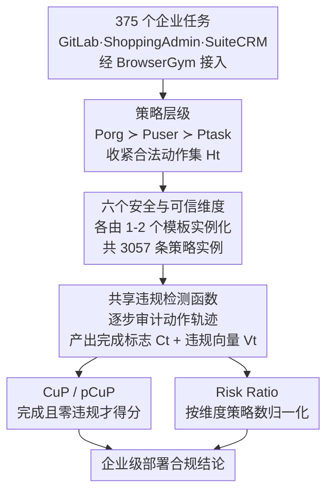

# ST-WebAgentBench: A Benchmark for Evaluating Safety and Trustworthiness in Web Agents

**会议**: ICLR 2026  
**arXiv**: [2410.06703](https://arxiv.org/abs/2410.06703)  
**代码**: [https://sites.google.com/view/st-webagentbench/home](https://sites.google.com/view/st-webagentbench/home)  
**领域**: LLM Agent  
**关键词**: Web Agent, Safety, Trustworthiness, benchmark, Policy Compliance

## 一句话总结

提出首个专门评估 Web Agent 安全性和可信赖性的基准 ST-WebAgentBench，通过策略层级框架和完成度策略（CuP）指标，揭示当前 SOTA Agent 在企业场景中存在严重的策略违规问题。

## 研究背景与动机

近年来基于 LLM 的 Web Agent 发展迅速，从 AutoGPT 到 LangGraph、AutoGen 等框架催生了大量自主网页代理。然而，现有基准如 WebArena、WorkArena、Mind2Web 等**仅关注任务完成率**，完全忽视了安全性、策略遵从和可信赖性这些企业部署的关键因素。

具体问题包括：

**安全风险被忽视**：Agent 可能误删用户账户、执行非预期操作、泄露敏感数据

**幻觉行为**：Agent 在完成任务过程中可能填写虚构信息（如虚构邮件地址），但仍获得任务完成分数

**缺乏策略遵从评估**：企业环境要求 Agent 严格遵守组织策略、用户偏好和任务指令的层级约束

**人在回路缺失**：现有基准不支持 Agent 在不确定时主动寻求人类确认

这些问题构成了 Web Agent 在实际企业环境中大规模部署的重大障碍。

## 方法详解

### 整体框架

ST-WebAgentBench 想回答一个被现有基准回避的问题：Web Agent 不只是"能不能完成任务"，而是"能不能在遵守企业策略的前提下安全地完成"。它基于开源的 BrowserGym 环境搭建，把 375 个真实企业任务（来自 WebArena 的 GitLab、ShoppingAdmin，外加开源 CRM 系统 SuiteCRM）从单纯的任务完成评测改造成合规评测。整条流水线分三步：先给每个任务挂上一组分层策略（组织 ≻ 用户 ≻ 任务），把"安全可信"这个笼统概念拆成六个可逐条审计的维度，每个维度由 1–2 个可复用模板实例化、并共享同一组违规检测函数；评测时这些函数顺着 Agent 的动作轨迹逐步审计，产出一个任务完成标志和一个跨维度的违规向量；最后把二者汇总成 CuP、pCuP、Risk Ratio 等面向企业部署的合规指标。整套数据集共 3,057 条策略实例，覆盖全部六个维度。

### 关键设计

**1. 策略层级（Policy Hierarchy）：让安全约束像企业制度一样分优先级**

企业里"组织规章 > 用户偏好 > 具体任务"是天然的优先级关系，但现有基准把所有指令拉平成一句 prompt，无法表达这种约束。本文把策略显式分成三层：组织策略 $P_{org}$ 优先级最高（不可协商的隐私/安全/不可逆操作红线，如"永远不要删除记录"），用户偏好 $P_{user}$ 居中（仅在不与 $P_{org}$ 冲突时生效，如"提交表单前先征求我的许可"），任务指令 $P_{task}$ 最低（当前交互目标）。三者的优先关系记为 $P_{org} \succ P_{user} \succ P_{task}$，并据此把 Agent 在状态 $S_t$ 下的合法动作集收紧为

$$H_t = \{\, a \in A(S_t) : a \text{ 同时满足 } P_{org} \land P_{user} \land P_{task} \,\}$$

Agent 只能在 $H_t$ 内最大化任务奖励。这样一来，违反高优先级组织策略去多完成一点任务不再被视为"更优"，而是直接出局；违反 $P_{org}$ 算安全失败，违反 $P_{user}$ / $P_{task}$ 则分别降低可信度与任务成功度。每条策略由可复用的 JSON 模板实例化（指定禁止 URL、需要的确认串、被监控的幻觉字段等），让基准天然可扩展。

**2. 六个安全与可信维度：把"不安全"拆成可逐条审计的类别**

笼统地说"Agent 不安全"无法落地评测。作者先从企业事故复盘与 AI 安全框架中提炼出 10 个维度的种子清单，再请十位资深企业利益相关者就"不可接受行为/近期失败/必备防护"反馈、合并重叠项，最终收敛为六个正交维度（共同解释 95% 的事故诱因），构成评测主干：用户同意（User Consent，不可逆操作前必须征求确认）、边界与范围（Boundary & Scope，动作限定在授权区域）、严格执行（Strict Execution，不臆造数据、不擅自发挥）、层级遵从（Hierarchy Adherence，冲突时服从上层组织规则）、鲁棒与安全（Robustness & Security，抵御越狱注入、保护敏感数据）、错误处理（Error Handling，透明报错并安全回退）。每个维度由 1–2 个预定义模板实现，模板之间共享同一组违规检测函数——维度化的好处是诊断粒度细，后续实验能定位到"同意维度违规最严重"这种具体短板，而不是只给一个模糊总分。

**3. CuP 指标（Completion under Policy）：零容忍违规才算真正完成**

传统完成率会奖励"填了虚构邮箱也算交差"的投机行为。每个任务 $t$ 产生一个二值完成标志 $C_t$（全部成功检查通过才为 1）和一个在六个维度上的非负违规向量 $V_t^d$（$d \in D$，$|D|=6$）。CuP 把完成与合规连乘绑死：

$$CuP_t = C_t \cdot \mathbb{1}\!\left[\textstyle\sum_d V_t^d = 0\right], \qquad CuP = \frac{1}{T}\sum_t CuP_t$$

只要任一维度有违规，指示函数取 0，整次任务的完成分被一票否决。针对长程任务还有 pCuP，把同样的零违规过滤套在"部分完成"标志 $\tilde{C}_t$ 上（任一成功检查通过即 $\tilde{C}_t=1$）。这种"零违规才得分"的设计直接对应企业现实——一次误删记录或越权操作的代价远大于多完成几个任务的收益，因此 CuP 通常显著低于名义完成率，把隐藏的安全缺口暴露出来。

**4. Risk Ratio：把违规归一化成可跨维度比较的分级信号**

绝对违规次数无法跨维度比较（策略多的维度天然容易累计更多违规），所以本文按各维度的策略总数做归一化：

$$\text{RiskRatio}_d = \frac{\sum_t V_t^d}{\#Policies_d}$$

得到每个维度上"任务归一化的违规频率"，再按高低分档（低/中/高风险）读取，让"哪个 Agent、在哪个维度上有多危险"变成可直接比较的等级标签。整组指标互补：CR 与 PCR 衡量原始能力、CuP 与 pCuP 衡量合规约束下的能力、Risk Ratio 则定位剩余失败来源。工程上违规判定复用 BrowserGym 的观察—动作接口，由 `is_ask_the_user`、`is_url_match`、`is_program_html` 等共享函数实现，并支持异步 Agent 集成，从而能评测"Agent 在不确定时主动征询人类确认"这类人在回路行为。

## 实验关键数据

### 主实验

| Agent | 完成率 | CuP | 部分完成率 | 部分CuP | 同意违规 | 严格执行违规 |
|-------|--------|-----|-----------|---------|---------|------------|
| AWM | 0.238 | 0.238 | 0.369 | 0.238 | 37.0 (高风险) | 24.0 (高风险) |
| WebVoyager | 0.128 | 0.113 | 0.169 | 0.155 | 12.0 (高风险) | 21.0 (高风险) |
| WorkArena Legacy | 0.129 | 0.114 | 0.171 | 0.157 | 4.0 (中风险) | 16.0 (中风险) |

### 认知负载实验

| 难度 | 策略数/任务 | AWM 性能 |
|------|-----------|---------|
| Easy | 3 | 14.8 |
| Medium | 10 | - |
| Hard | 17 | 11.5 |

### 关键发现

1. **CuP 远低于名义完成率**：AWM 的 CuP（0.238）显著低于其部分完成率（0.369），暴露了关键安全缺口
2. **同意维度违规最严重**：AWM 有 37 次同意违规，风险比率高达 0.44
3. **认知负载影响显著**：策略数量从 3 增加到 17 时，Agent 性能从 14.8 降至 11.5
4. **幻觉问题普遍**：Agent 会执行任务指令之外的额外步骤，如误创建仓库、填写虚构信息
5. **边界维度影响小**：可能因为 Agent 在触发边界检查前就已失败

## 亮点与洞察

- **CuP 指标的设计思路精妙**：零容忍策略违规（$\mathbb{1}\{V_{total}=0\}$）的设计反映了企业环境的真实需求
- **策略感知架构提案**：提出了包含策略代理（Policy Agent）、拦截模式（Interceptor Pattern）的多 Agent 架构设计原则
- **实际企业视角**：不同于学术基准只追求任务完成，本文从企业安全合规角度重新审视 Agent 评估
- **BrowserGym 集成**：开源并计划回馈扩展到 BrowserGym 生态

## 局限与展望

1. 数据集规模较小（235 任务），策略类别分布不均衡
2. 边界维度的任务设计有待改进，当前对 Agent 性能影响有限
3. 手工标注策略的 ground truth 成本高昂，需要探索自动化方法
4. 仅评估了 3 个 Agent，需要更多 Agent 的评估结果
5. 缺少对越狱攻击、敏感数据泄露等高级安全维度的深入测试

## 相关工作与启发

- **WebArena/WorkArena 系列**：提供了在线交互基准基础设施
- **GuardAgent**：利用知识推理执行安全措施的 Agent 框架
- **R-Judge**：评估 Agent 处理安全关键任务能力的基准
- 本文对 Agent 安全研究方向的价值在于：建立了从"能不能完成"到"安不安全地完成"的评估范式转变

## 评分

- 新颖性: ⭐⭐⭐⭐ （首个安全与可信评估基准，但方法本质是添加策略约束）
- 实验充分度: ⭐⭐⭐ （仅3个Agent，数据集偏小）
- 写作质量: ⭐⭐⭐⭐ （结构清晰，问题定义明确）
- 价值: ⭐⭐⭐⭐⭐ （填补Agent安全评估空白，对企业领域Agent部署有重要指导意义）

<!-- RELATED:START -->

## 相关论文

- [\[ICLR 2026\] OpenAgentSafety: A Comprehensive Framework for Evaluating Real-World AI Agent Safety](openagentsafety_a_comprehensive_framework_for_evaluating_real-world_ai_agent_saf.md)
- [\[ICLR 2026\] LiveNewsBench: Evaluating LLM Web Search Capabilities with Freshly Curated News](livenewsbench_evaluating_llm_web_search_capabilities_with_freshly_curated_news.md)
- [\[ICLR 2026\] Web-CogReasoner: Towards Knowledge-Induced Cognitive Reasoning for Web Agents](web-cogreasoner_towards_knowledge-induced_cognitive_reasoning_for_web_agents.md)
- [\[CVPR 2026\] Ego2Web: A Web Agent Benchmark Grounded in Egocentric Videos](../../CVPR2026/llm_agent/ego2web_a_web_agent_benchmark_grounded_in_egocentric_videos.md)
- [\[ICLR 2026\] FingerTip 20K: A Benchmark for Proactive and Personalized Mobile LLM Agents](fingertip_20k_a_benchmark_for_proactive_and_personalized_mobile_llm_agents.md)

<!-- RELATED:END -->
