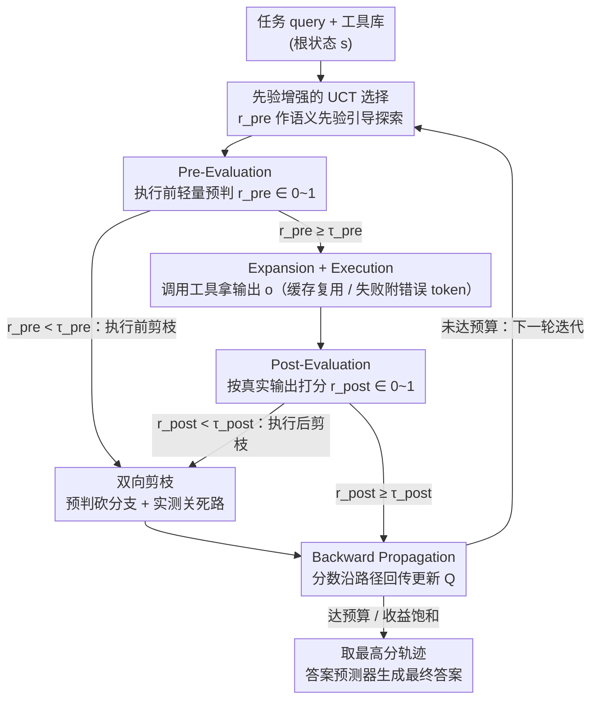

# ToolTree: Efficient LLM Agent Tool Planning via Dual-Feedback Monte Carlo Tree Search and Bidirectional Pruning

**会议**: ICLR 2026  
**arXiv**: [2603.12740](https://arxiv.org/abs/2603.12740)  
**代码**: [https://github.com/SYang2000/ICLR_2026_ToolTree](https://github.com/SYang2000/ICLR_2026_ToolTree)  
**领域**: Agent  
**关键词**: Tool Planning, MCTS, LLM Agent, 搜索规划, 剪枝

## 一句话总结
提出 ToolTree，一种基于 MCTS 的 LLM Agent 工具规划框架，通过执行前/后双阶段评估和双向剪枝机制，在固定计算预算下实现前瞻性工具选择，在 4 个 benchmark 上平均提升约 10%。

## 研究背景与动机

**领域现状**：LLM Agent 在多步骤复杂任务中需要调用外部工具链（API、搜索、计算器等），核心挑战是工具规划——决定用什么工具、什么顺序、什么参数。

**现有痛点**：(a) 贪心方法（ReAct、CoT）逐步选择"当前最优"工具，缺乏前瞻，早期错误不可逆地向后传播；(b) 搜索方法（ToT、A*）展开多候选分支但分支因子随工具数指数增长，计算成本高且评估基于假设性思维而非实际执行结果。

**核心矛盾**：搜索方法虽然有前瞻性但计算代价大且评估不接地（evaluate hypothetical thoughts）；贪心方法高效但缺乏纠错能力。需要一种既有前瞻能力又基于实际执行反馈的方法。

**本文目标** 在固定计算预算下，如何让 Agent 进行前瞻性工具规划，同时保证效率？

**切入角度**：将 MCTS 的 selection-expansion-simulation-backpropagation 循环改造为适合工具调用的框架，执行前用 LLM 快速预评估筛选分支，执行后用实际输出评分修正策略。

**核心 idea**：双阶段评估（pre-execution 预判 + post-execution 实测）+ 双向剪枝（执行前砍低分支 + 执行后砍失败分支），让 MCTS 在工具规划场景下既高效又准确。

## 方法详解

### 整体框架
ToolTree 把工具规划当作序列决策来搜索：状态 $s$ 编码当前对话上下文与已经拿到的中间结果，动作 $a$ 是调用某个工具，搜索树里每条从根到叶的路径都对应一个完整的工具调用序列。它沿用 MCTS 的循环，但针对工具调用做了关键改造——把"评估"拆到执行的前后两端。每一轮迭代里，搜索先按一个先验增强的 UCT 分数从树根往下选出一个动作，在真正花掉 API 调用之前先用 LLM 做一次执行前预判，通过阈值才展开并实际调用工具拿到输出，再依据真实输出做执行后打分，最后把分数沿路径回传更新各节点的累计回报；执行前后这两个分数同时各驱动一道剪枝，把预算收口到有前途的轨迹上。跑满预算（或收益不再提升）后，取累计得分最高的那条轨迹交给答案预测器生成最终答案。关键在于：贪心方法没有前瞻、纯搜索方法又是在"假想的思维"上打分而不接地，ToolTree 让搜索既有前瞻、又把评估锚在真实的执行反馈上。

### 关键设计

**1. 先验增强的 UCT 选择：让探索从一开始就偏向合理的工具**

标准 MCTS 的探索项只看访问次数，谁被访问得少就优先去试，这在动作空间是大量工具的场景下太盲目。ToolTree 把执行前的预评估分数 $r_{\text{pre}}$ 直接乘进探索项，作为语义先验来引导：

$$\text{UCT}(s,a) = Q(s,a) + \lambda \cdot r_{\text{pre}}(s,a) \cdot \sqrt{\frac{\ln N(s)}{N(s,a)}}$$

其中 $Q(s,a)$ 是历史回报负责 exploitation，后一项负责 exploration，而 $r_{\text{pre}}$ 让"看起来就合理"的工具组合在搜索一开始就获得更高的探索权重。这样搜索不必把预算均匀撒在所有分支上，而是从有前途的方向切入。

**2. Pre-Evaluation：在花掉一次 API 调用之前先判断该不该调**

工具调用是有成本的，把预算浪费在明显不合适的工具上很不划算。ToolTree 在真正执行某个工具前，先让 LLM 基于当前对话上下文、工具卡片（I/O 模式、描述、示例）和参数草案做一次轻量打分，输出适用性分数 $r_{\text{pre}}(s,a) \in [0,1]$。这个分数有双重身份：它既喂回设计 1 的 UCT 探索项引导选择，又在展开阶段当作剪枝阈值——只有 $r_{\text{pre}}(s,a) \ge \tau_{\text{pre}}$ 的动作才会被实例化成新子节点。本质上是在展开前先压缩分支因子，让后续昂贵的实际执行只发生在值得一试的候选上。

**3. Post-Evaluation：用真实执行结果而不是假想推理来打分**

纯搜索方法（如 ToT）评估的是"假设性思维"，结果未必接地。ToolTree 改成在工具真正执行、拿到输出 $o_{t+1}$ 之后再评分：

$$r_{\text{post}} = J(C_t, a, o_{t+1}) \in [0,1]$$

LLM judge $J$ 从任务一致性、正确性、约束满足度等维度评估这次调用的实际质量。这个分数会作为 rollout 回报沿路径回传、修正设计 1 里的 $Q(s,a)$，同时低于阈值 $\tau_{\text{post}}$ 的分支会被标记为不可扩展。因为评分锚在真实证据上，credit assignment 比基于推测的方式更可靠——一个分支是不是死胡同，是用它实际跑出来的结果说话的。

**4. 双向剪枝：执行前砍掉不靠谱的，执行后关闭跑死的**

前面两个评估分数各自驱动一道剪枝，二者互补。执行前剪枝（pre-pruning）依据 $r_{\text{pre}}$ 移除低分候选、只把有希望的分支展开，靠预判减少要花钱的分支；执行后剪枝（post-pruning）依据 $r_{\text{post}}$ 关闭实际输出质量差的分支，靠证据消除已经走死的路径。一个在花钱前收口、一个在花钱后止损，共同把有限的计算预算集中到最有前途的轨迹上，这也是 ToolTree 在固定预算下还能保持效率的核心原因。执行阶段还有两个工程兜底配合剪枝省预算：同一次 rollout 内若出现完全相同的 $(a, \text{args})$ 调用，直接复用缓存过的输出、不重复花 API；调用失败时给输出附上错误 token 显式保留，让失败信息也能进入 Post-Evaluation 和剪枝判断——失败不是被忽略，而是成为"这条路走不通"的证据。

### 损失函数 / 训练策略
ToolTree 是**无训练**（training-free）的规划框架，不需要微调模型。所有评估都由 LLM judge 在线完成，整个搜索在推理时进行。

## 实验关键数据

### 主实验

**Closed-set: GTA（GPT-4o）**:

| 方法 | AVG F1 | vs Zero-shot |
|------|--------|-------------|
| Zero-shot | 57.78 | baseline |
| ReAct | 58.46 | +0.7 |
| LATS (MCTS) | 64.78 | +7.0 |
| **ToolTree** | **66.95** | **+9.2** |

**Open-set: ToolBench（GPT-4o）**:

| 方法 | Pass Rate | Win Rate | AVG |
|------|-----------|----------|-----|
| ReAct | 62.24 | 56.02 | 59.13 |
| LATS | 66.61 | 64.77 | 65.69 |
| **ToolTree** | **69.04** | **67.52** | **68.28** |

### 消融实验

| 配置 | GTA F1 | ToolBench Pass |
|------|--------|---------------|
| Full ToolTree | 66.95 | 69.04 |
| w/o pre-evaluation | -2~3% | 下降 |
| w/o post-evaluation | -1~2% | 下降 |
| w/o bidirectional pruning | 效率明显下降 | 计算浪费增加 |

### 关键发现
- 效率分析：在 32-64 步预算区间 ToolTree 的 accuracy-per-second 最高，说明双向剪枝有效集中了计算预算
- Pre-evaluation 在低预算（16 步）时贡献最大，因为早期剪枝效果最显著
- Post-evaluation 在长链任务中更关键，因为需要基于实际执行结果纠错
- 从 GPT-4o-mini 到 GPT-4o，ToolTree 的提升幅度一致，说明方法不依赖特定模型能力

## 亮点与洞察
- **双阶段评估的互补性设计**：pre-evaluation 提供快速的"应不应该做"判断，post-evaluation 提供慎重的"做得好不好"反馈。这种 foresight+hindsight 循环是一种通用范式，可迁移到任何涉及可执行动作的搜索规划问题。
- **Training-free 实用性**：无需微调，即插即用适配任意 LLM + 工具库组合，部署成本极低。
- **效率-准确度帕累托最优**：虽然比贪心方法慢，但 accuracy-per-second 最高。这表明"聪明地搜索"比"更多地搜索"更重要。

## 局限与展望
- LLM judge 的评估本身有 cost（每步两次 LLM 调用），在 API 价格敏感场景可能不划算
- 预评估依赖 LLM 对工具的理解质量，如果工具描述不清晰，$r_{\text{pre}}$ 可能不准
- 未探索学习型的评估函数（如微调一个小型 reward model 替代 LLM judge）
- 仅在 GPT-4o/4o-mini 上验证，未测试开源模型

## 相关工作与启发
- **vs ReAct**: ReAct 是逐步贪心，ToolTree 通过树搜索实现全局规划，但 ReAct 的简洁性在简单任务中仍有优势
- **vs LATS (Language Agent Tree Search)**: LATS 使用标准 MCTS，ToolTree 在其基础上加入 pre-evaluation 先验和双向剪枝，效果稳定更好
- **vs ToolChain* (A\*)**: A* 需要准确的启发式函数，ToolTree 用 LLM judge 作为自适应启发式，更灵活

## 评分
- 新颖性: ⭐⭐⭐⭐ 将 MCTS 与双阶段评估和双向剪枝结合是自然但有效的创新
- 实验充分度: ⭐⭐⭐⭐⭐ 4 个 benchmark、2 种模型、效率分析、消融全面
- 写作质量: ⭐⭐⭐⭐ 结构清晰，图表丰富
- 价值: ⭐⭐⭐⭐ Training-free 方案实用性强，但 LLM judge 成本可能限制实际部署

<!-- RELATED:START -->

## 相关论文

- [\[ICML 2025\] KBQA-o1: Agentic Knowledge Base Question Answering with Monte Carlo Tree Search](../../ICML2025/llm_agent/kbqa-o1_agentic_knowledge_base_question_answering_with_monte_carlo_tree_search.md)
- [\[ACL 2026\] LiTS: A Modular Framework for LLM Tree Search](../../ACL2026/llm_agent/lits_a_modular_framework_for_llm_tree_search.md)
- [\[AAAI 2026\] AgentSwift: Efficient LLM Agent Design via Value-guided Hierarchical Search](../../AAAI2026/llm_agent/agentswift_efficient_llm_agent_design_via_value-guided_hierarchical_search.md)
- [\[AAAI 2026\] Prune4Web: DOM Tree Pruning Programming for Web Agent](../../AAAI2026/llm_agent/prune4web_dom_tree_pruning_programming_for_web_agent.md)
- [\[ICLR 2026\] Efficient Agent Training for Computer Use](efficient_agent_training_for_computer_use.md)

<!-- RELATED:END -->
