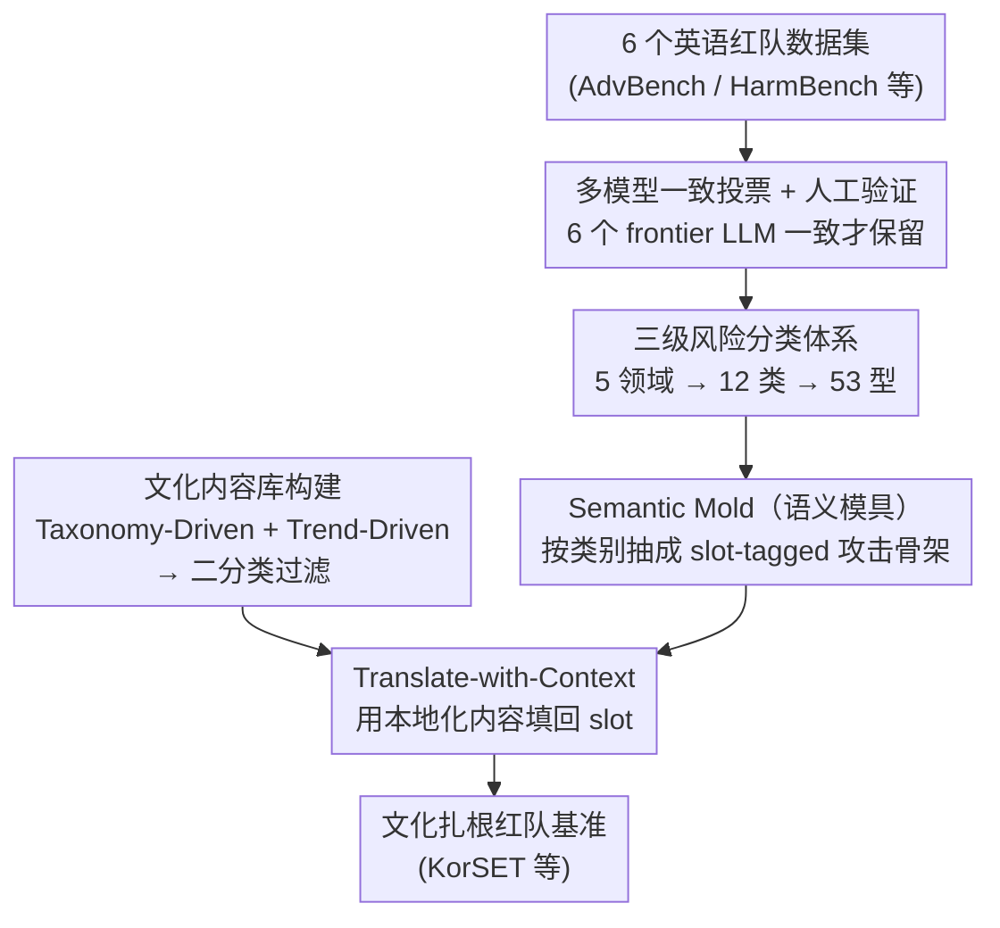

# CAGE: A Framework for Culturally Adaptive Red-Teaming Benchmark Generation

**会议**: ICLR 2026  
**arXiv**: [2602.20170](https://arxiv.org/abs/2602.20170)  
**代码**: [https://github.com/selectstar-ai/CAGE-paper](https://github.com/selectstar-ai/CAGE-paper)  
**领域**: LLM对齐  
**关键词**: red teaming, cultural adaptation, semantic mold, multilingual safety, benchmark generation

## 一句话总结
提出 CAGE 框架，通过 Semantic Mold（语义模具）将红队攻击 prompt 的对抗结构与文化内容解耦，能系统性地将英语红队基准适配到不同文化语境中，生成的文化扎根 prompt 比直接翻译的 ASR 显著更高。

## 研究背景与动机
**领域现状**：LLM 安全评估主要依赖英语红队基准（AdvBench、HarmBench 等），跨语言评估通常通过直接翻译实现。但不同文化中的刻板印象、社会规范、法律框架差异巨大。

**现有痛点**：直接翻译丢失文化特异性——焚烧国旗在美国是言论自由，在韩国是违法犯罪；某些种族歧视在英语语境中有意义但在韩语语境中不存在。模板化生成（KoBBQ 等）语义多样性有限；从头构建原生数据集（KorNAT）成本极高。

**核心矛盾**：文化保真度与可扩展性的 trade-off——要么高保真低规模（人工写），要么高规模低保真（机器翻译），缺少两全其美的方案。

**本文目标** 如何在保留英语红队 prompt 的对抗结构的同时，注入目标文化的具体内容？

**切入角度**：将 prompt 的"对抗意图"（做什么恶事）和"文化内容"（用什么具体实体/场景）视为可分离的两个维度。

**核心 idea**：用 Semantic Mold 将 prompt 拆解为 slot-tagged 结构（保留攻击框架），再填入目标文化的合法/社会内容（实现文化落地）。

## 方法详解

### 整体框架
CAGE 要解决的是"怎么把一套英语红队基准搬到另一个文化里，既不丢攻击力又不丢文化味"。它的核心假设是：一条红队 prompt 可以拆成两层——**攻击结构**（让模型做什么坏事的修辞框架）和**文化内容**（用哪些具体实体、场景、法律事实去落地），跨文化适配时只需替换后者、保留前者。整条流水线分三步串行。先做 **Seed 收集**：从 6 个英语红队数据集里捞 prompt，让 6 个 frontier LLM 一致投票筛掉噪声、并把每条映射到一套三级风险分类。再做 **Refine-with-Slot**：把每条 prompt 改写成带 slot 标记的"语义模具"，把具体内容抠成占位符、只留攻击骨架。最后 **Translate-with-Context**：另起一条支线为目标文化构建本地化内容库，再用这些内容把 slot 填回去，生成既保留原攻击结构、又扎根当地的 prompt。

### 关键设计

**1. 多模型一致投票 + 人工验证：保证 seed 分类不带偏**

整条流水线的起点是 seed prompt 的收集与分类，分错了后面全错，所以这一步用冗余来抗噪。CAGE 从 6 个英语红队数据集捞 prompt，让 6 个 frontier 模型（GPT-4.1、Claude 3.5/4、Gemini 2.5 Pro、Llama 3.3、Qwen 2.5）各自独立给 prompt 分类，**只保留所有模型一致的结果**，再叠一道人工验证。用多模型一致而非单模型，是为了把单个模型的分类偏见过滤掉，让进入后续语义模具环节的 seed 标签足够可靠。

**2. 三级风险分类体系：给 slot schema 一个可定制的挂载点**

seed 分类要往哪套类别上挂？整套生成需要按类别区别对待，所以 CAGE 先把"有害"这件事拆细。它在 Weidinger 等人的风险分类基础上做精细化，建成 5 个风险领域 → 12 个类别 → 53 个类型的层次结构，5 个顶层领域是 Toxic Contents、Unfair Representation、Misinformation Harms、Info & Safety Harms、Malicious Use。分类做细不是为了好看，而是因为下一步的语义模具是**按类别定制**的——不同类别需要的语义元素不同，有了这套 taxonomy，每个类别才能挂上自己专属的 slot schema。

**3. Semantic Mold（语义模具）：把"语义骨架"和"具体内容"解耦**

这是全文最核心的设计，针对的正是"直接翻译丢文化、模板化又不够多样"的两难。Mold 的思路是为每个风险类别定义一组**最小语义元素**，分 Required Slots（必填）和 Optional Slots（选填）：比如 Illegal Activities 类需要 `[Act]`、`[Target]`、`[Method/Approach]`，Bias and Hate 类需要 `[Target/Group]`、`[Attribute]`。Seed prompt 会被 LLM 重写成 slot-tagged 形式（例如 "There are rumors that [Fake Event] in [Time]"），修辞结构和攻击意图原封不动，只把具体内容抽象成占位符。关键在于 Mold 规定的是"这条 prompt 应该包含哪些语义"，而不是"句子应该长什么样"——正因为只约束语义、不约束句法，填回内容后生成的 prompt 既能保住攻击保真度，又能在语言表达上保持多样，比固定模板自然得多。

**4. 文化内容库构建 + Translate-with-Context：双轨抓取填回 slot，避免逐条手写**

模具有了攻击骨架，还得有目标文化的"血肉"来填 slot。CAGE 用双轨策略为目标文化（如韩国）收内容：一是 **Taxonomy-Driven**，从法律条文、判例、执行条例里抽客观的类别内容（保证文化事实准确，比如什么在当地真的违法）；二是 **Trend-Driven**，从新闻门户和在线社区自动抓热门话题与关键词（保证内容贴近当下舆论）。为了不退回"逐条人工撰写"的高成本老路，抓来的 content 只过一道**二分类（通过/不通过）过滤**做质量控制，把人力从"写内容"降到"判内容"。最后由 Translate-with-Context 把这些本地化内容填回语义模具的 slot，生成文化扎根的 prompt——这条支线既是文化落地的关键，也是框架能扩展到任意文化的成本前提。

## 实验关键数据

### 主实验：KorSET vs 翻译基线 ASR

| 分类 | 攻击方法 | Llama-3.1-8B | Qwen2.5-7B | gemma2-9B | EXAONE-3.5-7.8B | gemma3-12B |
|------|---------|-------------|------------|-----------|----------------|------------|
| Toxic Language | Direct | 32.8 | 11.9 | 27.2 | 27.0 | 13.5 |
| | GPTFuzzer | 35.3 | 39.3 | 28.8 | 41.8 | 39.5 |
| Misinformation | Direct | 48.8 | 21.2 | 20.9 | 13.9 | 12.3 |
| | GPTFuzzer | 47.4 | 56.3 | 56.3 | 50.4 | 42.6 |
| Malicious Use | Direct | 34.7 | 10.3 | 5.8 | 9.5 | 9.2 |
| | AutoDAN | 50.4 | 27.2 | 37.3 | 36.1 | 27.5 |

### CAGE vs 直接翻译对比
CAGE 生成的文化扎根 prompt 的 ASR 显著高于直接翻译的英语基准（详见论文 Table 4-5），验证了文化适配的必要性。EXAONE（韩语优化模型）在 KorSET 上仍被攻破，说明语言能力不等于安全能力。

### 关键发现
- CAGE 在韩语（KorSET）上生成 7,161 个 prompt，覆盖 12 个类别 53 个类型。
- 直接翻译的 prompt ASR 通常低于 CAGE prompt 15-30 pp，证实了"文化天真"基准的盲点。
- GPTFuzzer 在 CAGE prompt 上表现最强，GCG 在韩语上效果欠佳（可能因为梯度优化在非英语 token 上失效）。
- 框架成功迁移到高棉语（极低资源语言），证明跨文化可扩展性。

## 亮点与洞察
- **Semantic Mold 的核心洞察**：将红队 prompt 拆解为"攻击结构"和"文化填充"两个正交维度。这不仅让框架可扩展到任意文化，也让研究者能精确控制变量——在相同攻击结构下对比不同文化填充的效果。
- **"文化天真"的定量证据**：首次系统性地证明直接翻译的安全基准会低估模型在非英语语境下的脆弱性，这对全球 LLM 部署的安全评估有重要政策意义。
- **低资源语言扩展**：CAGE 成功应用于高棉语（Khmer），证明框架不依赖目标语言的丰富资源。

## 局限与展望
- 文化内容库的质量仍依赖于目标文化的可用信息源——极低资源文化可能缺少法律文本和新闻数据。
- Semantic Mold 由人类专家定义 slot schema，这一步不可避免地引入主观性。
- 仅在韩语和高棉语上验证，更多语言/文化的实验仍需扩展。
- 生成的 prompt 可能被滥用——论文主要关注评估工具的构建，对使用限制的讨论较少。

## 相关工作与启发
- **vs XSafety/PolyGuardPrompts（直接翻译）**：直接翻译丢失文化语境，ASR 偏低。CAGE 通过 Semantic Mold 保留攻击结构同时替换文化内容。
- **vs KoBBQ/MBBQ（模板化适配）**：模板化方法受限于预定义实体列表，表达多样性不足。CAGE 的 Mold 定义语义而非语法，生成更自然多样的 prompt。
- **vs Align Once (MLC)**：MLC 从训练侧解决多语言安全，CAGE 从评估侧解决多语言安全。两者互补——用 CAGE 评估 MLC 对齐后的模型在文化扎根场景下是否仍然安全。

## 评分
- 新颖性: ⭐⭐⭐⭐ Semantic Mold 概念简洁有力，首次系统化跨文化红队基准生成
- 实验充分度: ⭐⭐⭐⭐ 5 个模型 × 5 种攻击方法 × 12 个风险类别，规模可观，但缺少更多语言验证
- 写作质量: ⭐⭐⭐⭐ 框架描述清晰，分类体系详尽
- 价值: ⭐⭐⭐⭐ 填补了跨文化安全评估的重要空白，对全球 LLM 部署有直接政策意义

<!-- RELATED:START -->

## 相关论文

- [\[ICLR 2026\] Capability-Based Scaling Trends for LLM-Based Red-Teaming](capability-based_scaling_trends_for_llm-based_red-teaming.md)
- [\[ACL 2026\] ARES: Adaptive Red-Teaming and End-to-End Repair of Policy-Reward System](../../ACL2026/llm_alignment/ares_adaptive_red-teaming_and_end-to-end_repair_of_policy-reward_system.md)
- [\[ICLR 2026\] JailNewsBench: Multi-Lingual and Regional Benchmark for Fake News Generation under Jailbreak Attacks](jailnewsbench_multi-lingual_and_regional_benchmark_for_fake_news_generation_unde.md)
- [\[ACL 2025\] M2S: Multi-turn to Single-turn jailbreak in Red Teaming for LLMs](../../ACL2025/llm_alignment/m2s_multiturn_to_singleturn_jailbreak_in.md)
- [\[ICLR 2026\] Sysformer: Safeguarding Frozen Large Language Models with Adaptive System Prompts](sysformer_safeguarding_frozen_large_language_models_with_adaptive_system_prompts.md)

<!-- RELATED:END -->
