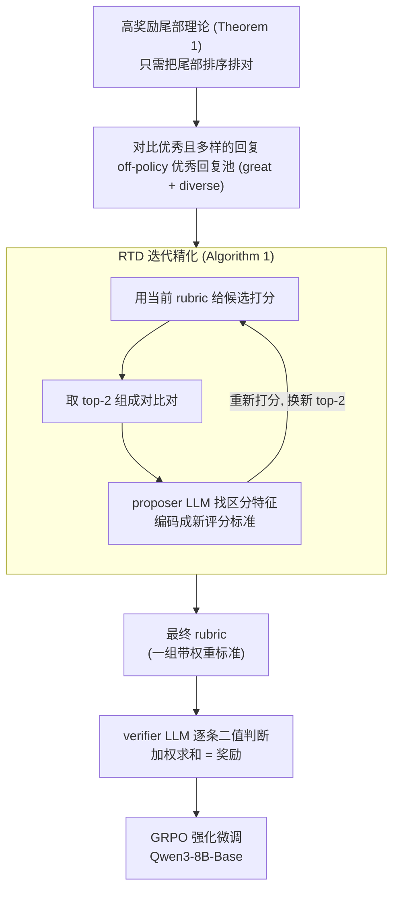

# Chasing the Tail: Effective Rubric-based Reward Modeling for Large Language Model Post-Training

**会议**: ICLR 2026  
**arXiv**: [2509.21500](https://arxiv.org/abs/2509.21500)  
**代码**: [https://github.com/Jun-Kai-Zhang/rubrics](https://github.com/Jun-Kai-Zhang/rubrics)  
**领域**: 对齐RLHF  
**关键词**: reward over-optimization, rubric-based reward, reinforcement fine-tuning, high-reward tail, off-policy data

## 一句话总结
理论证明奖励过优化主要源于高奖励尾部区域的奖励模型错误规范，提出基于 rubric 的奖励建模方法：利用 off-policy 数据（强模型生成的优秀回复）构造评分细则，通过渐进式区分"优秀 vs 更优秀"来精细化 rubric，有效缓解奖励过优化。

## 研究背景与动机

**领域现状**：强化微调（RFT）是 LLM 后训练的核心范式，通过奖励模型指导策略优化。但实践中奖励模型不可避免是真实奖励的近似代理（proxy），导致奖励过优化——策略学会利用代理奖励的漏洞获得高分但实际质量低。

**现有痛点**：(a) Bradley-Terry 偏好奖励模型在高奖励区域容易被 hack；(b) 在线 RLHF 可以缓解但需要持续人工反馈，成本高昂且缓慢；(c) 现有 RLRR（基于 rubric 的奖励）方法虽然更可解释，但 rubric 如何构造以解决过优化问题尚不清楚。

**核心矛盾**：要精确建模高奖励尾部，需要高质量样本——但这些样本在基础 LLM 的分布下极为稀少。Off-policy 数据（强模型生成）容易获得高质量样本，但直接训练奖励模型会学到 off-policy 数据的表面特征而非真实质量。

**本文目标** (a) 理论上：奖励过优化的根源到底在哪？(b) 实践上：如何构造对高奖励尾部精确的 rubric？

**切入角度**：从理论分析入手，证明在 Pareto 最优后训练中，效用-KL 权衡完全由高奖励区域的代理奖励准确度决定（指数权重放大了高奖励区域的错误）。由此推导出：只要高奖励区域排序正确（哪怕其余区域全错），性能就接近最优。

**核心 idea**：构造 rubric 时应聚焦于区分"优秀 vs 更优秀"的回复，而非"好 vs 坏"——因为过优化的根源在高奖励尾部的错误规范。

## 方法详解

### 整体框架
这篇论文想回答两个问题：奖励过优化的根源在哪，以及怎么构造一个不会被 hack 的奖励。它先用一条理论（Theorem 1）把根源精确定位到"高奖励尾部"——证明只要奖励模型在最高分那一小撮回复上排序正确，整体性能就接近最优；反之尾部排错，训练后期必然崩。这直接决定了方法目标：不要花力气区分"好 vs 坏"，要专门把"优秀 vs 更优秀"分清楚。据此设计了一条以 off-policy 优秀回复为原料的 rubric 构造工作流，核心是一个叫 **RTD（Refinement-through-Differentiation，差异化精化）** 的步骤——让 proposer LLM 对比两条高分回复、找出区分特征、编码成新的评分标准；再把这一步放进 Algorithm 1 的迭代循环反复跑，每轮用当前 rubric 重新打分、取新的 top-2 继续精化。最终得到的 rubric 是一组带权重的标准，交给 verifier LLM 逐条二值打分、加权求和，作为 GRPO 强化微调阶段的奖励。

### 关键设计

**1. 高奖励尾部理论：把过优化的根源精确定位到尾部**

奖励模型终归是真实奖励 $r^*$ 的一个有偏代理 $r$，问题是"偏在哪里最致命"。本文把这层偏差形式化为一个错误规范映射 $f: r^* \to r$，推导出在 Pareto 最优后训练下，策略能拿到的期望真实奖励为

$$\frac{\int_0^1 f^{-1}(u)\, e^{u/\beta}\, \mathrm{d}u}{\beta\,(e^{1/\beta}-1)}$$

关键在指数权重 $e^{u/\beta}$：当 $u \to 1$（高奖励区域）时它指数级放大，意味着尾部的排序错误会被成倍计入最终性能，而低奖励区域错了几乎无所谓。更妙的是 KL 散度对 $f$ 不变——无论奖励怎么错，相对参考策略的"偏离预算"是一样的，所以同样的 KL 下，把预算花在尾部排错上就会让 win rate 崩盘。这条公式也顺带解释了为什么过优化总在训练后期出现：随着 $\beta$ 减小（策略越压越偏向高分区），指数项对尾部的放大越狠。结论很 actionable——构造 rubric 时只需保证高奖励区域排对，其余可以全错。它把后面所有设计的目标钉死成一句话：去陪尾部（chase the tail）。

**2. RTD 迭代精化：用少量对比把标准磨向尾部**

理论说了"只要尾部排对就行"，但怎么让 rubric 真的在尾部变准？难点在于 rubric 天生是把双刃剑——它只关心与质量相关的维度，这压住了 off-policy 数据的表面特征，却也让它容易把两条都很优秀的回复判成平手，对尾部毫无分辨力。RTD（Refinement-through-Differentiation）就是来打破平手的：把一对候选回复连同当前 rubric 一起喂给 proposer LLM，让它分析"这条到底比那条好在哪"，再把发现的区分特征编码成一条新标准、或对已有标准的细化。单次 RTD 只锐化一个维度，于是 Algorithm 1 把它套进迭代循环——从某 prompt 的全部 off-policy 回复出发，每轮用当前 rubric 给所有候选打分、取 top-2 做一次 RTD、再用更新后的 rubric 重新打分筛出新的 top-2，如此往复。因为排名随 rubric 演化而变，被选中对比的回复也在不断换人，整个过程只用很少几次对比就把 rubric 的"发现力"持续集中在质量前沿（performance frontier），正好补在 Theorem 1 指出的薄弱区。

**3. 喂"优秀且多样"的回复：让精化对准尾部又不过拟合单一风格**

RTD 循环好不好，取决于喂给它的是什么回复——这正是两条原则（Principle 1、Principle 2）要管的事。Principle 1 要求对比对取自"优秀 vs 更优秀"而非"好 vs 差"：拿明显有高下的回复做对比，学到的标准只能惩罚低级错误，对尾部没用；只有两条都已经很好、proposer 被迫去抠那些细微却决定优劣的维度，新增标准才会落在高奖励尾部（实验里 great pair 用 Gemini 2.5 Pro 生成、good pair 用 Gemini 2.5 Flash-Lite，前者精化出的标准明显更"高级"，多是"拆分复杂标准""增强验证标准"这类）。Principle 2 进一步要求这些优秀回复要多样：只盯同质回复，rubric 会在有限几个维度上越磨越窄、过拟合某种文体；把候选池扩到更多优秀模型采样的 16 条回复，rubric 才能覆盖更广的质量维度。两条原则合起来正好发挥 rubric 适配 off-policy 数据的长处——它刻画的是"回复该具备什么特征"，对"谁生成的"不敏感，绕开了 BT 偏好模型会去学文体偏好的坑。

### 损失函数 / 训练策略
最终的 rubric 奖励是各条标准的加权二值平均：

$$r(x,y) = \frac{\sum_i w_i\, V(x,y,c_i)}{\sum_i w_i}$$

其中 $V$ 是 verifier LLM（实验用 GPT-4.1-mini）对第 $i$ 条标准 $c_i$ 的二值判断（满足/不满足），$w_i$ 是该标准的权重；作者特意只用最简单的加权平均聚合，以隔离 rubric 质量本身的影响（非线性聚合留作 future work）。RL 阶段沿用标准 GRPO 框架，只是把传统偏好奖励换成上面的 rubric 奖励，基础策略模型为 Qwen3-8B-Base。rubric 由 GPT-4.1 作为 proposer 生成与迭代精化，off-policy 优秀回复来自更强的外部模型（如 Gemini 2.5 Pro）以及多样化优秀模型的采样。

## 实验关键数据

### 主实验

跨 Generalist / Health / Finance 三个域，基础策略 Qwen3-8B-Base，win rate 对比 Qwen3-8B（数字越大越好）：

| 方法 | Generalist Filtered / LMArena Win% | Health Medical-o1 Win% | Finance Win% |
|------|----------------------------------------|----------------------------|------------------|
| Base Policy | 5.2 / 4.1 | 10.8 | 5.8 |
| SFT | 35.9 / 29.6 | 25.8 | 26.0 |
| 初始 rubric（仅 prompt） | 31.3 / 29.7 | 21.7 | 37.2 |
| 1 good pair 精化 | 33.5 / 32.8 | 22.4 | 39.1 |
| 1 great pair 精化 | 36.8 / 33.1 | 26.5 | 42.2 |
| 4 great pairs 精化 | 38.7 / 34.7 | 31.4 | 48.9 |
| **4 great & diverse pairs** | **39.7 / 35.1** | **34.4** | **49.6** |

两条趋势清晰：对比 great pair 比对比 good pair 好（验证 Principle 1）；用多样的 great pair 迭代精化再进一步（验证 Principle 2）。

### 消融实验

| 配置 | 关键发现 |
|------|---------|
| 对比 good vs good | 常产生基础修正（惩罚明显错误、放宽过严标准） |
| 对比 great vs great | 产生精细化修正（分解复杂标准、增强验证标准） |
| Top 10% 高奖励正确 | win rate 接近 optimal curve |
| Top 10% 高奖励错误 | win rate 在中等 KL 后崩溃（过优化） |

### 关键发现
- **理论验证**：仅高奖励区域 10% 排序正确就足以接近最优性能；仅高奖励区域 10% 排序错误就会导致过优化崩溃
- **对比 great 回复的精化类型**：最常见的是"提升验证标准"（enhancing verification standards）和"拆分为更精细的子标准"（breaking down complex criteria），这些精化提升了高奖励尾部的分辨力
- **Rubric vs BT 奖励模型**：中等规模 off-policy 数据（5000 条）下，BT 奖励模型未能有效指导 RL，但 rubric 方法能从中提取可泛化原则
- **Rubric 的可解释性**：每个标准对应明确的质量维度，且精化过程有据可查

## 亮点与洞察
- **"Chase the tail" 的理论洞见**：Theorem 1 的公式简练地揭示了为什么奖励过优化总在训练后期出现——随着 KL 增大（β 减小），指数项对高奖励区域的放大效应变得更强。这给 reward modeling 研究指出了明确的优化方向
- **Rubric 天然适配 off-policy 数据**：rubric 定义的是"应该具备什么特征"，对"谁生成的回复"不敏感（与 BT 模型学到文体偏好形成对比）。这解决了"需要高质量样本但只能从强模型获取"的鸡生蛋问题
- **迭代式精化的渐进聚焦**：每轮对比筛选 top 候选后重新精化，使 rubric 自然聚焦到尾部——无需人工设计"什么是高奖励区域"

## 局限与展望
- **Rubric 评分聚合方式**：目前用加权平均，作者承认非最优，标准间可能存在非线性依赖
- **Verifier 质量依赖**：二值判断的 verifier LLM 本身可能有偏差，尤其在边界情况
- **仅在 Qwen3-8B 上验证**：实验跨 Generalist/Health/Finance 三个域，但都基于 Qwen3-8B-Base，更大规模模型或不同 RL 算法（如 DPO/KTO）下效果待确认
- **Proposer LLM 的质量上限**：rubric 精化的质量受限于 proposer 的辨别能力

## 相关工作与启发
- **vs Gao et al. 2023 (Reward Over-optimization Scaling Laws)**: 那篇关注全局统计量描述过优化，本文精确到高奖励区域——更 actionable
- **vs Rubrics as Rewards (Gunjal et al.)**: 那篇首次提出 RLRR 但未解释 why rubric helps，本文理论上解释了——因为 rubric 对高奖励尾部更精确
- **vs Generative Reward Models (RM-R1)**: GRM 在推理时动态生成 rubric，计算成本高；本文预先构造 rubric 更适合大规模训练

## 评分
- 新颖性: ⭐⭐⭐⭐⭐ 理论分析精准指出过优化根源在尾部，rubric精化工作流自然优雅
- 实验充分度: ⭐⭐⭐⭐ 理论验证充分，但实际 RL 实验仅两个域，且模型规模较小
- 写作质量: ⭐⭐⭐⭐⭐ 理论推导严谨，故事线从理论到方法到实验一气呵成
- 价值: ⭐⭐⭐⭐⭐ 对 RLHF/RFT 社区极有价值——理论 + 实用工作流的完美结合

<!-- RELATED:START -->

## 相关论文

- [\[ICLR 2026\] Spectrum Tuning: Post-Training for Distributional Coverage and In-Context Steerability](spectrum_tuning_post-training_for_distributional_coverage_and_in-context_steerab.md)
- [\[NeurIPS 2025\] GVPO: Group Variance Policy Optimization for Large Language Model Post-Training](../../NeurIPS2025/llm_alignment/gvpo_group_variance_policy_optimization_for_large_language_model_post-training.md)
- [\[ICLR 2026\] Towards Understanding Valuable Preference Data for Large Language Model Alignment](towards_understanding_valuable_preference_data_for_large_language_model_alignmen.md)
- [\[ICLR 2026\] Semantic-aware Wasserstein Policy Regularization for Large Language Model Alignment](semantic-aware_wasserstein_policy_regularization_for_large_language_model_alignm.md)
- [\[ICLR 2026\] SEMA: Simple yet Effective Learning for Multi-Turn Jailbreak Attacks](sema_simple_yet_effective_learning_for_multi-turn_jailbreak_attacks.md)

<!-- RELATED:END -->
