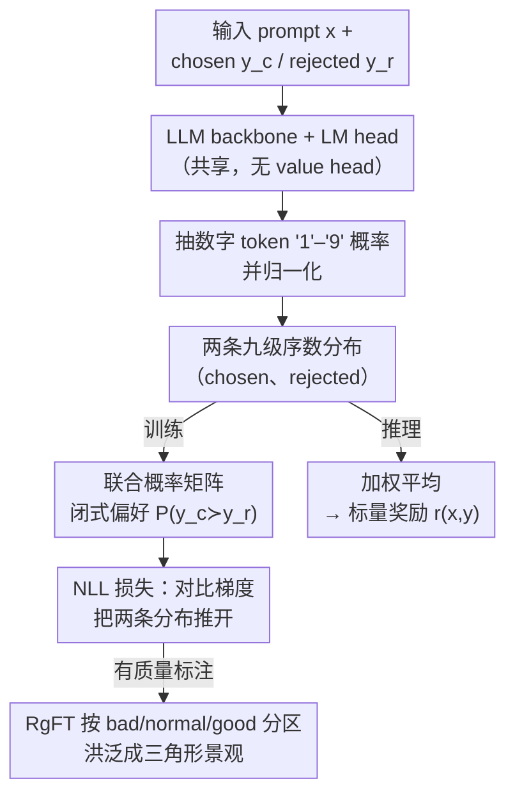

# Learning Ordinal Probabilistic Reward from Preferences (OPRM)

**会议**: ICLR 2026  
**arXiv**: [2602.12660](https://arxiv.org/abs/2602.12660)  

**代码**: [https://github.com/ritzz-ai/OPRM](https://github.com/ritzz-ai/OPRM)  

**领域**: LLM Alignment / 奖励建模  
**关键词**: 序数奖励, 概率分布, 区域洪泛调优, 奖励模型, 不确定性估计

## 一句话总结

提出序数概率奖励模型(OPRM)，将响应质量离散化为1-9序数等级并学习完整概率分布，结合区域洪泛调优(RgFT)实现数据高效训练。在RewardBench达89.3%，比现有RM提升2.9%-7.4%，同时提供不确定性估计和标注分歧检测。

## 研究背景与动机

**领域现状**：奖励模型分为生成式(GRM，需点对式监督成本高)和判别式(DRM，只用成对偏好但分数未标定)。

**现有痛点**：DRM的相对分数缺乏概率解释，无法评估不确定性；GRM需要精确的质量标签。

**核心 idea**：序数离散化+完整分布 = DRM的效率 + GRM的可解释性

## 方法详解

### 整体框架

OPRM 把奖励建模从"回归一个标量"改成"预测一条概率分布"。给定 prompt 和一段 response，模型走一遍 LLM backbone，复用现成的 LM head（不引入任何 value head）读出最后一个 token 位置 softmax 后的词表概率，再把数字 token '1' 到 '9' 这九个概率抽出来归一化，就得到一条覆盖九个序数质量等级的分布 $p_\psi(s|x,y)$。

训练时成对喂入 chosen 与 rejected，两条九级分布做笛卡尔积得到一个联合概率矩阵，由此闭式算出"chosen 比 rejected 好"的偏好概率，再用负对数似然优化；当偏好对还附带 good / normal / bad 质量等级标注时，区域洪泛调优（RgFT）会把分布进一步约束到对应区间。推理时只需喂入单条 response，对它的分布做加权平均即可还原成一个标量奖励。整套流程没有新增任何参数，分布的方差天然成了置信度指标。

### 关键设计

**1. 概率奖励建模：把质量分数从点估计变成随机变量**

判别式奖励模型给出的是一个孤零零的相对分数，没有概率含义，也无从判断模型对这次打分有多大把握。OPRM 把质量分数 $S$ 看作随机变量，学习条件密度 $p_\psi(s|x,y)$，于是一对响应谁更好就自然写成两个分布的比较：$P(y_c \succ y_r|x) = \int\int \mathbb{1}(s_c > s_r)\, p_\psi(s_c|x,y_c)\, p_\psi(s_r|x,y_r)\, ds_r\, ds_c$。连续密度上这个积分没有解析解，OPRM 把质量轴离散成 1-9 共九个等级，积分就退化为一个闭式求和，既能直接用偏好对训练，又把"分数"升级成"带宽度的分布"，分布的方差天然成了置信度指标——宽分布意味着偏好模糊，尖峰分布意味着判别明确。

**2. 与 Bradley-Terry 的等价关系：证明经典偏好模型只是一个特例**

为了说明这套分布视角不是另起炉灶，作者证明了广泛使用的 Bradley-Terry 模型其实是 OPRM 的退化情形——当质量分布被钉死成固定形状的 Gumbel 分布时，OPRM 的偏好概率就还原成 BT 的 logistic 形式。这意味着 OPRM 没有丢掉 BT 的任何表达力，只是松开了"分布形状固定"这条隐含假设，因而能刻画多峰偏好：当一对样本的标注本身有分歧时，学到的分布会呈现双峰，这正好可以拿来做数据质量筛选。

**3. 梯度动力学：用对比梯度持续把两条分布推开**

离散化之后的目标函数有一个干净的梯度形式，chosen 在等级 $k$ 上的梯度是 $\partial J / \partial p_c(k) = P(s_r < k)$，rejected 的是 $\partial J / \partial p_r(k) = P(s_c > k)$。直观上，这股梯度把 chosen 的概率质量往高分区搬、把 rejected 的往低分区压，只要两条分布还没拉开就一直施加对比压力，因此在"chosen 仅略优于 rejected"的困难样本上格外敏感，margin 的细微差异也能被有效利用。

**4. 区域洪泛调优 RgFT：让粗粒度标签也能产生有用梯度**

偏好对只能告诉模型"谁更好"，却不能告诉它"好到哪个绝对区间"。当手头还有 good/normal/bad 这类质量等级标注时，最朴素的做法是把分布硬约束到对应子区间，但硬区间约束在区间内部梯度为零，训练会立刻停滞。RgFT（Region Flooding Tuning）的做法是把硬约束"灌水"成一个三角形概率景观：在目标区域中心给最高激励、向两侧线性衰减，于是分布既被引导到正确区间，又保留了向区间中心和高 margin 方向移动的梯度。RgFT 天然支持半监督——有质量标注的样本和只有偏好的样本可以混在一起训练，实验中只需约 20% 数据带标注就能把分布校准好，数据效率很高。

## 实验关键数据

### 主实验（4 个基准，10+ 任务）

| 模型 | RewardBench | RMB-Chat | RMB-Safety | RMB-Code | Overall* |
|------|-------------|----------|------------|----------|----------|
| Skywork-Reward-V2 (8B) | 92.0 | 70.7 | 76.2 | 67.8 | 71.6 |
| ArmoRM (8B) | 89.5 | 72.1 | 74.8 | 65.3 | 70.7 |
| **OPRM-Qwen2.5-14B** | **89.3** | **76.4** | **78.5** | **70.1** | **73.8** |

### RgFT 消融

| 配置 | RMB Overall | 说明 |
|------|-------------|------|
| OPRM（无 RgFT） | 71.2 | 基线概率奖励 |
| + RgFT（仅 good/bad） | 72.8 | 二分类标注 |
| + RgFT（good/normal/bad） | **73.8** | 三级标注最优 |
| + 全量质量标注 | 73.5 | 更多标注反而轻微下降 |

### 关键发现

- OPRM 在 RewardBench 外的三个基准上一致优于 BT 和 GRM 基线，平均提升 2.9%-7.4%

- RgFT 用少量质量标注（20% 数据有标注）即可有效校准分布，数据效率极高
- 多峰分布可检测标注分歧：不一致的偏好对导致双峰分布，可用于数据质量筛选
- OPRM 对 margin 微妙差异更敏感——在"chosen 略优于 rejected"的困难样本上优势最大

## 亮点与洞察

- **统一 DRM 和 GRM 的优势**：无需额外 value head（vs DRM），无需 CoT critique（vs GRM），直接从 LM head 获取分布

- 序数离散化保留质量的有序性同时避免了精确点对式标注的成本
- RgFT 的"洪泛"思想巧妙——将硬区间约束软化为梯度友好的三角形景观
- 不确定性估计可用于 BoN 采样时的风险感知选择——选择高均值+低方差的响应

## 局限与展望

- 1-9 等级的粒度选择缺乏理论指导，过粗或过细可能影响性能
- 未探索与 RLHF/DPO 训练的实际集成——OPRM 的分布奖励如何用于 PPO 需要额外设计
- 依赖 LLM 对数字 token 的内在序数理解，小模型可能理解不足
- RgFT 的半监督设置中，有标注数据的比例对性能影响的敏感度未充分分析

## 相关工作与启发

- **vs Skywork-Reward-V2**：Skywork 侧重数据策展，OPRM 侧重模型架构创新——两者可组合

- **vs Bradley-Terry**：BT 是 OPRM 在 Gumbel 分布假设下的特例，OPRM 通过学习自由度更高的分布摆脱此限制

- **vs CLoud/Critic-RM**：GRM 需要 CoT critique 生成耗时，OPRM 单次前向传播即得分布

- **vs 序数回归文献（SORD/ALDL）**：将深度序数回归思想引入偏好学习，是跨领域知识迁移

## 评分

- 新颖性: ⭐⭐⭐⭐ 序数概率奖励的统一视角新颖，BT 作为特例的证明优雅
- 实验充分度: ⭐⭐⭐⭐ 4 个基准 + 丰富消融 + 分布可视化
- 写作质量: ⭐⭐⭐⭐ 理论推导完整，动机清晰
- 价值: ⭐⭐⭐⭐ 为奖励模型提供了新范式，分布输出开辟新应用场景

<!-- RELATED:START -->

## 相关论文

- [\[NeurIPS 2025\] Capturing Individual Human Preferences with Reward Features](../../NeurIPS2025/llm_alignment/capturing_individual_human_preferences_with_reward_features.md)
- [\[ICLR 2026\] Skywork-Reward-V2: Scaling Preference Data Curation via Human-AI Synergy](skywork-reward-v2_scaling_preference_data_curation_via_human-ai_synergy.md)
- [\[ICML 2026\] Implicit Safety Alignment from Crowd Preferences](../../ICML2026/llm_alignment/implicit_safety_alignment_from_crowd_preferences.md)
- [\[ICLR 2026\] Swap-guided Preference Learning for Personalized RLHF (SPL)](swap-guided_preference_learning_for_personalized_reinforcement_learning_from_hum.md)
- [\[ICLR 2026\] AlphaSteer: Learning Refusal Steering with Principled Null-Space Constraint](alphasteer_learning_refusal_steering_with_principled_null-space_constraint.md)

<!-- RELATED:END -->
