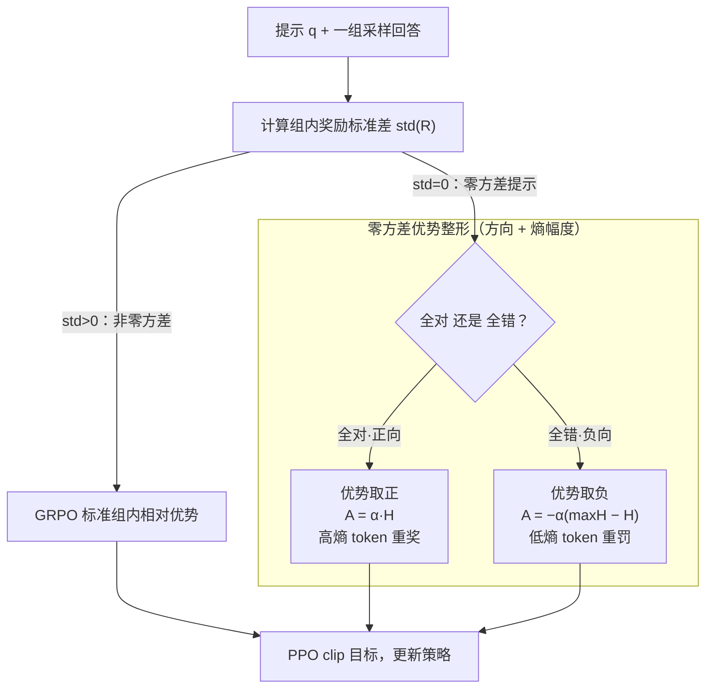

# No Prompt Left Behind: Exploiting Zero-Variance Prompts in LLM Reinforcement Learning via Entropy-Guided Advantage Shaping

**会议**: ICLR 2026  
**arXiv**: [2509.21880](https://arxiv.org/abs/2509.21880)  
**代码**: [https://bltnynk.github.io/publications/rl-zvp/](https://bltnynk.github.io/publications/rl-zvp/) (项目页)  
**领域**: 对齐RLHF  
**关键词**: GRPO, 零方差提示, 强化学习, 熵引导优势整形, 数学推理

## 一句话总结
发现 GRPO 训练中大量"零方差提示"（所有回答全对或全错）被白白丢弃，提出 RL-ZVP 算法通过熵引导的优势整形从中提取学习信号，在六个数学推理基准上相比 GRPO 提升最高 8.61 个精度点和 7.77 个通过率点。

## 研究背景与动机
带可验证奖励的强化学习（RLVR）已成为提升 LLM 推理能力的主流方法。GRPO 是其中最具代表性的算法：它对每个提示采样一组回答，根据正确性计算奖励，然后通过组内相对优势来更新策略。

然而，GRPO 有一个被普遍忽视的效率瓶颈：**零方差提示**（zero-variance prompts）。当某个提示的所有采样回答全部正确或全部错误时，组内奖励标准差为零，归一化后所有回答的优势值都变为零——这意味着模型从这些提示获得的训练信号完全为零。

**问题有多严重？** 实验显示，训练过程中零方差提示占比从 30% 到 99% 不等。在训练初期，模型太弱无法解决任何问题，产生大量全错提示；在训练后期，模型变强后许多问题全部答对，同样产生零方差。而 rollout 生成占训练总时间约 50%，这些"浪费"的采样成本非常高昂。

**现有应对方案的局限**：DAPO 的动态采样（GRPO-DS）和 GRESO 都选择在训练前或训练后过滤掉零方差提示，将其视为无信息的噪声。但这种做法需要额外 3-5 倍的 rollout 来填满训练 batch。

**核心idea**：零方差提示并非无用，它们实际上蕴含有价值的学习信号——全对的提示应当被强化，全错的应当被惩罚，而具体强化/惩罚的幅度应该由token级别的特征（如熵）来调节。

## 方法详解

### 整体框架
RL-ZVP 要解决的是 GRPO 训练里"零方差提示白白浪费"的问题：当一组采样回答全对或全错时，组内奖励标准差为零，归一化后所有优势塌成零，这些提示虽然花了采样成本却贡献不了任何梯度。RL-ZVP 的思路是把 GRPO 改造成一个分流器——先看每个提示这一组回答的奖励标准差，标准差大于零的非零方差提示走原来的 GRPO 优势完全不变；标准差等于零的零方差提示则被接管，按"全对"还是"全错"分成**正向提示**和**负向提示**，再为它们的每个 token 补上一个非零的优势。这个 token 级优势由两件事刻画：往哪个方向推（direction，由回答对错决定符号），以及推多大力气（magnitude，由该 token 的熵决定）。两条分支最后汇进同一个 PPO clip 目标更新策略，所以 RL-ZVP 是 GRPO 的严格推广，能无缝插进既有训练管线。

### 关键设计

**1. 优势方向：给全对/全错的提示一个非零的更新符号**

GRPO 的痛点很直接：一旦组内奖励标准差为零，归一化后所有优势都塌成零，于是模型对"这一组明明全答对了"或"明明全答错了"这件事毫无反应，整组提示连同采样成本一起被丢掉。RL-ZVP 注意到（论文 Remark 2）：在 PPO 的梯度里重要性采样比恒为正，所以优势的**符号**就等于每个 token 梯度更新的**方向**。据此它给零方差提示直接派符号——正向提示（全对）优势取正，把这些已经做对的行为概率往上抬、强化确定性；负向提示（全错）优势取负，把这些全错的行为概率往下压、抑制重复犯错并促使模型去探索别的采样路径。光是恢复这个符号，就把训练里占比高达 30%–99% 的零方差提示重新拉回了梯度。

**2. 熵引导的优势幅度：用 token 熵决定推多大力气，且对错回答非对称**

只给符号还不够——如果对一条回答里每个 token 都施加同样大的更新，等于把"关键推理步骤"和"普通文本补全"一视同仁。这是全文最核心的设计：RL-ZVP 用每个 token 的熵 $H_{i,t}$（在词表 $V$ 上对下一个 token 分布求的熵，$H_{i,t} = -\sum_{j=1}^{|V|} \pi_\theta(v_j \mid q, o_{i,<t}) \log \pi_\theta(v_j \mid q, o_{i,<t})$）来调节幅度，且对正确/错误回答采取相反的处理。合并方向与幅度后，零方差提示的 token 级优势写成

$$\hat{A}^{ZVP}(o_{i,t}) = \begin{cases} \alpha\, H_{i,t}, & \text{全对（正向提示）}\\[4pt] -\alpha\left(\max_{k} H_{i,k} - H_{i,t}\right), & \text{全错（负向提示）}\end{cases}$$

其中 $\alpha$ 是统一的缩放因子，控制零方差提示整体注入梯度的强度。对正确回答，熵越高优势越大——高熵 token 往往是推理的分支点、连接词这类模型本来犹豫却最终选对的关键节点，重点奖励它们能鼓励出反思、验证等推理行为，同时避免过度强化无意义的套话补全。对错误回答，公式用 $\max_k H_{i,k} - H_{i,t}$ 反转了熵的作用：离这条回答熵峰值越近（即越高熵）的 token 罚得越轻、越低熵的罚得越重。直觉是高熵处代表"模型自己拿不准的要害"，做错时手下留情、给它日后重新探索这条推理路径留余地，而那些低熵、模型很笃定却仍答错的 token 才该重罚。消融显示，去掉这个熵缩放、退回简单的 +1/−1 优势，是掉点最严重的一刀，证明幅度设计才是 RL-ZVP 起效的关键。

### 损失函数 / 训练策略
训练时每个 mini-batch 按提示分流（论文 Algorithm 1）：标准差大于零的提示用 GRPO 原优势，等于零的提示用上面的 $\hat{A}^{ZVP}$ 替换掉原本的零优势，两者都套进同一个 PPO clip 目标，因此最终目标函数与 GRPO 完全同构、可无缝接入既有管线。实现基于 verl 框架，batch size 512、mini-batch size 32；缩放因子 $\alpha$ 取 0.10 或 0.20 效果最佳——太小（0.05）信号太弱起不到作用，太大（0.30）又会让训练失稳。

## 实验关键数据

### 主实验（Qwen3-1.7B-Base + MATH）

| 数据集 | 指标 | RL-ZVP | GRPO | GRPO-DS-g* | 提升(vs GRPO) |
|--------|------|--------|------|------------|---------------|
| Minerva | Acc@8 | 29.96 | 29.09 | 29.96 | +0.87 |
| AMC23 | Acc@8 | 48.75 | 42.19 | 46.25 | +6.56 |
| MATH500 | Acc@8 | 70.98 | 69.09 | 70.72 | +1.89 |
| AIME24 | Acc@8 | 12.50 | 8.75 | 7.50 | +3.75 |
| AIME25 | Acc@8 | 6.25 | 4.17 | 7.50 | +2.08 |
| OlympiadBench | Acc@8 | 35.11 | 33.20 | 35.68 | +1.91 |

### 主实验（Qwen3-8B-Base + DAPO-Math-17k）

| 数据集 | 指标 | RL-ZVP | GRPO | 提升 |
|--------|------|--------|------|------|
| MATH500 | Acc@8 | 89.73 | 83.00 | +6.73 |
| OlympiadBench | Acc@8 | 58.20 | 49.59 | +8.61 |
| AIME25 | Pass@8 | 39.36 | 31.59 | +7.77 |
| 平均 | Acc@8 | - | - | +5.15 |

### 消融实验

| 配置 | 平均 Acc@8 | 平均 Pass@8 | 说明 |
|------|-----------|------------|------|
| 完整 RL-ZVP | 49.90 | 69.77 | 最佳 |
| 去掉负向提示 | 47.75 | 66.26 | 下降 |
| 去掉正向提示 | 47.25 | 66.70 | 下降 |
| 去掉熵缩放 | 46.88 | 66.05 | 下降最大 |
| GRPO 基线 | 46.79 | 66.41 | 基线 |

### 关键发现
- RL-ZVP 在相同 rollout 预算下大幅超越过滤策略（GRPO-DS、GRESO），即使后者使用 3-5 倍 rollout 仍不敌
- 熵缩放（即优势幅度设计）是最关键的组件——简单的 +1/-1 优势不够
- RL-ZVP 训练过程更稳定，在8B规模避免了 GRPO 的早期性能崩溃
- 1.7B 模型在 RL-ZVP 训练下展现出更长的推理链和更系统的解题策略（如反思、验证）
- $\alpha$ 需要careful调节：0.05 太小信号弱，0.30 太大训练不稳定

## 亮点与洞察
- 挑战了"零方差提示无用"的普遍假设，证明它们是未被利用的学习信号源
- 方法极其简洁：仅修改优势函数的一个分支，无需额外模型或模块
- 熵引导的token级优势整形是reward shaping的一个优雅方案
- 在小模型（1.7B）上也能激发出反思和验证等高级推理行为

## 局限与展望
- 仅在数学推理的二元奖励场景下验证，开放式QA、安全对齐等场景有待探索
- $\alpha$ 是固定超参数，自适应调度策略可能更稳健
- 实验限制在8B以下模型，更大模型（14B/32B）的缩放行为未知
- 对于非数学任务中的零方差提示特性可能不同

## 相关工作与启发
- **vs GRPO**: GRPO丢弃零方差提示；RL-ZVP利用它们，是GRPO的严格泛化
- **vs DAPO/GRESO**: 这些方法过滤零方差提示以避免浪费rollout；RL-ZVP直接利用证明效果更好
- **vs Token-level reward shaping**: PRIME等工作也探索token级奖励，但RL-ZVP专注于零方差这一特殊但常见的场景

## 评分
- 新颖性: ⭐⭐⭐⭐ 切入点精准，"挖掘被丢弃的学习信号"这个视角很有启发
- 实验充分度: ⭐⭐⭐⭐⭐ 两个模型规模×多个数据集×多种基线×完整消融，非常扎实
- 写作质量: ⭐⭐⭐⭐ 动机清晰，公式简洁，结果分析详实
- 价值: ⭐⭐⭐⭐ 对RLVR社区有直接的方法改进价值

<!-- RELATED:START -->

## 相关论文

- [\[ICLR 2026\] Swap-guided Preference Learning for Personalized RLHF (SPL)](swap-guided_preference_learning_for_personalized_reinforcement_learning_from_hum.md)
- [\[ACL 2025\] SynthesizeMe! Inducing Persona-Guided Prompts for Personalized Reward Models in LLMs](../../ACL2025/llm_alignment/synthesizeme_persona_prompts.md)
- [\[ACL 2026\] Taming Extreme Tokens: Covariance-Aware GRPO with Gaussian-Kernel Advantage Reweighting](../../ACL2026/llm_alignment/taming_extreme_tokens_covariance-aware_grpo_with_gaussian-kernel_advantage_rewei.md)
- [\[ACL 2026\] Too Correct to Learn: Reinforcement Learning on Saturated Reasoning Data](../../ACL2026/llm_alignment/too_correct_to_learn_reinforcement_learning_on_saturated_reasoning_data.md)
- [\[ICLR 2026\] Sysformer: Safeguarding Frozen Large Language Models with Adaptive System Prompts](sysformer_safeguarding_frozen_large_language_models_with_adaptive_system_prompts.md)

<!-- RELATED:END -->
