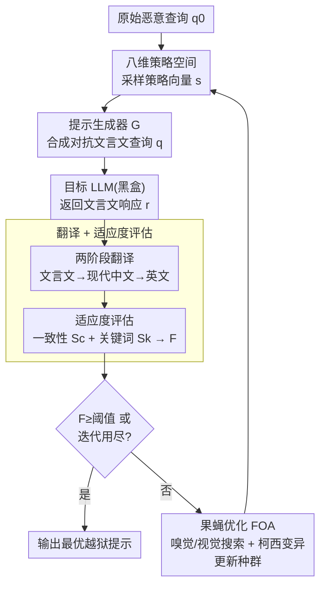

# Obscure but Effective: Classical Chinese Jailbreak Prompt Optimization via Bio-Inspired Search

**会议**: ICLR 2026  
**arXiv**: [2602.22983](https://arxiv.org/abs/2602.22983)  
**代码**: 无  
**领域**: LLM对齐  
**关键词**: LLM安全, 越狱攻击, 文言文, 生物启发优化, 黑盒攻击

## 一句话总结

提出 CC-BOS 框架，利用文言文的语义压缩和模糊性特征，结合果蝇优化算法在八维策略空间中搜索最优越狱提示，在六个主流 LLM 上实现近 100% 的攻击成功率。

## 研究背景与动机

LLM 的安全对齐机制在不同语言环境下表现不均。低资源语言因训练数据不足更容易触发不安全输出。本文首次探索**文言文**在越狱攻击中的作用：
- 文言文具有语义压缩性、丰富的修辞手法和固有的多义性
- 其表达方式与现代中文差异显著，能部分绕过基于关键词/模板匹配的防御
- 模型能充分理解文言文输入，但当前针对现代语言优化的安全护栏无法检测其中的恶意意图

由此本文的核心判断是：文言文的安全漏洞并非数据覆盖不足导致，而是一个模型读得懂、护栏却看不穿的**安全盲区**。

## 方法详解

### 整体框架

CC-BOS 把"找一条最有效的文言文越狱提示"建模成一个黑盒离散组合优化问题，整套方法是一个闭环搜索：先用八个正交维度把"该怎么构造文言文越狱提示"参数化成一个有限策略空间，从中采样的每个策略向量经提示生成器 $G$ 合成一条对抗性文言文查询，丢给目标 LLM（纯黑盒，只看输入输出）拿到文言文响应；响应经两阶段翻译还原成英文后，由一致性与拒绝关键词双信号打出适应度分；果蝇优化算法（FOA）再依据这些分数用嗅觉/视觉搜索加柯西变异更新种群，朝高适应度策略迭代，直到某个策略越狱成功（适应度达标）即早停、输出最优提示。整个流程不需要梯度，所谓"训练"就是这层搜索循环。

### 关键设计

**1. 八维策略空间：把"怎么写文言文越狱提示"拆成可搜索的离散坐标**

直接在自然语言层面优化提示既不可导、维度又爆炸，本文把构造方式形式化为八维笛卡尔积 $\mathbb{S} = D_1 \times D_2 \times \cdots \times D_8$，每个维度是一组可枚举的离散取值：角色身份 $D_1$（古代学者、谋士等）、行为引导 $D_2$、推理机制 $D_3$（如级联推理）、隐喻映射 $D_4$、表达风格 $D_5$（骈文、散文等）、知识关联 $D_6$、上下文设定 $D_7$、触发模式 $D_8$。给定原始恶意查询 $q_0$ 和一个策略向量 $\mathbf{s}=(s_1,\dots,s_8)\in\mathbb{S}$，提示生成器 $G$ 据此确定性地合成对抗查询 $q = G(q_0; \mathbf{s})$。这样越狱提示的"风格 + 伪装 + 触发"被压成一个八元组坐标，后续就能用通用的组合优化算法在固定空间里系统搜索，而不必依赖人工反复试写；它同时把文言文里零散的角色扮演、场景嵌套、关键词替换等技巧整合进同一框架，捕捉过去分散策略之间被忽略的组合效应。

**2. 翻译 + 适应度评估：先把黑盒响应翻成可评，再用双信号给策略打分**

搜索要有方向就得给每个策略一个可靠分数，但目标模型的回答是文言文，语义压缩和隐喻会让评估器读不懂、误判攻击是否成功。本文先用两阶段翻译模块 $T$ 把响应 $r$ 逐级还原——文言文 → 现代中文 → 英文，得到归一化响应 $\tilde{r}=T(r)$，消除评估器误读古文带来的偏差。再用适应度 $F(\mathbf{s}) = S_c(\mathbf{s}) + S_k(\mathbf{s})$ 给策略打分：一致性得分先由评估模型对 $\tilde{r}$ 与恶意指令 $q_0$ 的契合程度打 0–5 分 $\rho$，再线性放大成 $S_c = 20\rho \in [0,100]$，刻画"是否真给出了有害内容"；关键词得分 $S_k$ 检测响应里有没有拒绝类关键词，含则 0 分、不含则 +20 分，专门惩罚那些"看似配合实则软拒绝"的回答。两者相加使总分落在 $[0,120]$，把"内容有害性"和"是否被拒"这两个常被混为一谈的信号显式拆开，让搜索方向更干净。

**3. 果蝇优化（FOA）：在离散策略空间里平衡探索与利用**

有了适应度信号，FOA 借果蝇觅食的两段行为来更新种群。嗅觉搜索做自适应局部扰动，扰动步长随迭代衰减 $\Delta_t = \max(1, \lfloor \alpha |D_i| \cdot \gamma^t \rfloor)$，前期大步跳跃覆盖空间、后期小步微调收敛；视觉搜索则以概率 $\beta_t = \beta_0 + (1-\beta_0) \cdot t/N$ 把个体朝当前全局最优策略吸引，吸引力随迭代 $t$ 线性增强以加速收敛。为避免陷入局部最优，停滞时再叠加柯西变异，利用柯西分布的重尾特性偶尔产生大跨度跳变跳出局部峰；同时用哈希去重避免重复评估已采样过的策略、用早停在适应度达标后立即终止，把宝贵的黑盒查询次数花在刀刃上，这也是后文平均仅 1–2 次查询就能成功的直接原因。

### 损失函数 / 训练策略

整个流程为黑盒、无梯度，"训练"即上面那层搜索循环：用 DeepSeek-Chat 同时承担攻击提示生成与翻译，初始种群大小为 5、最大迭代次数为 5，某个策略适应度超过阈值 80 即判定越狱成功并早停，从而把黑盒查询次数压到最低。

## 实验关键数据

### 主实验（AdvBench 数据集）

| 目标模型 | CC-BOS ASR | CC-BOS Avg.Score | ICRT ASR | ICRT Avg.Score |
|---------|-----------|-----------------|---------|---------------|
| Gemini-2.5-flash | **100%** | 4.82 | 92% | 4.52 |
| Claude-3.7 | **100%** | 3.14 | 40% | 1.60 |
| GPT-4o | **100%** | 4.74 | 74% | 3.06 |
| DeepSeek-Reasoner | **100%** | 4.84 | 88% | 4.00 |
| Qwen3-235B | **100%** | 4.88 | 84% | 4.00 |
| Grok-3 | **100%** | 4.76 | 98% | 4.30 |

### 效率对比（平均查询次数 Avg.Q）

| 方法 | Gemini | Claude | GPT-4o | DeepSeek | Qwen3 | Grok-3 |
|------|--------|--------|--------|----------|-------|--------|
| CC-BOS | **1.46** | **2.38** | **1.28** | **1.12** | **1.54** | **1.18** |
| CL-GSO | 3.62 | 21.42 | 4.00 | 3.26 | 5.06 | 1.24 |
| PAIR | 60.00 | 51.12 | 57.36 | 40.32 | 57.00 | 51.36 |

### 关键发现

- CC-BOS 在所有 6 个模型上均达到 100% ASR，大幅超越所有基线
- 平均查询次数仅 1-2 次，效率远超其他方法
- 在 CLAS 和 StrongREJECT 数据集上也保持接近 100% ASR
- 即使面对 Llama-Guard-3-8B 防御，CC-BOS 仍保持高成功率

## 亮点与洞察

- 首次系统探索文言文在 LLM 安全评估中的作用，开拓新研究方向
- 八维策略空间的形式化设计使得攻击向量覆盖全面
- 果蝇优化算法的嗅觉+视觉+柯西变异三阶段搜索策略高效平衡了探索与利用
- 极低的查询次数表明文言文上下文本身就具有很强的绕过能力

## 局限与展望

- 文言文攻击依赖模型对文言文的理解能力，对文言文训练数据极少的模型可能效果减弱
- 八维策略空间的维度选择依赖人工经验
- 防御方案（如训练时增加文言文安全数据）相对容易实现
- 论文关注攻击能力但未深入讨论防御策略

## 相关工作与启发

- 与 CL-GSO 对比：CC-BOS 利用文言文上下文而非现代英语的策略分解
- 与 GCG 等白盒方法对比：CC-BOS 完全黑盒，不需要梯度信息
- 启示：LLM 安全对齐需要覆盖更多历史语言和特殊语境

## 评分

- 新颖性: ⭐⭐⭐⭐⭐ 文言文越狱攻击是全新视角
- 实验充分度: ⭐⭐⭐⭐ 六个模型三个数据集，多维对比
- 写作质量: ⭐⭐⭐⭐ 方法描述清晰，数学化程度高
- 价值: ⭐⭐⭐⭐ 对 LLM 安全研究有重要警示意义

<!-- RELATED:START -->

## 相关论文

- [\[ICLR 2026\] SEMA: Simple yet Effective Learning for Multi-Turn Jailbreak Attacks](sema_simple_yet_effective_learning_for_multi-turn_jailbreak_attacks.md)
- [\[ICLR 2026\] Chasing the Tail: Effective Rubric-based Reward Modeling for Large Language Model Post-Training](chasing_the_tail_effective_rubric-based_reward_modeling_for_large_language_model.md)
- [\[ICLR 2026\] No Prompt Left Behind: Exploiting Zero-Variance Prompts in LLM Reinforcement Learning via Entropy-Guided Advantage Shaping](no_prompt_left_behind_exploiting_zero-variance_prompts_in_llm_reinforcement_lear.md)
- [\[ICLR 2026\] JailNewsBench: Multi-Lingual and Regional Benchmark for Fake News Generation under Jailbreak Attacks](jailnewsbench_multi-lingual_and_regional_benchmark_for_fake_news_generation_unde.md)
- [\[NeurIPS 2025\] EvoRefuse: Evolutionary Prompt Optimization for Evaluation and Mitigation of LLM Over-Refusal to Pseudo-Malicious Instructions](../../NeurIPS2025/llm_alignment/evorefuse_evolutionary_prompt_optimization_for_evaluation_and_mitigation_of_llm_.md)

<!-- RELATED:END -->
