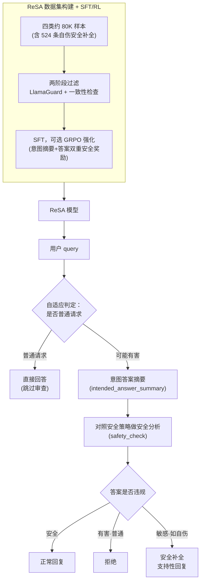

# Reasoned Safety Alignment: Ensuring Jailbreak Defense via Answer-Then-Check

**会议**: ICLR 2026  
**arXiv**: [2509.11629](https://arxiv.org/abs/2509.11629)  
**代码**: [https://huggingface.co/datasets/ByteDance-Seed/ReSA](https://huggingface.co/datasets/ByteDance-Seed/ReSA)  
**领域**: AI安全 / LLM对齐  
**关键词**: 越狱防御, Answer-Then-Check, 安全推理, 长链思维, 数据高效对齐

## 一句话总结
提出"先回答后检查"(Answer-Then-Check)策略：模型先在思维链中生成意图答案摘要，再依据安全策略进行安全分析，最后决定输出或拒绝。构建80K ReSA数据集训练后，在7种越狱攻击上防御率达到99.3%(RL版本)，仅500样本即可达全数据集效果。

## 研究背景与动机

**领域现状**：LLM安全对齐通过SFT/RLHF等方法让模型拒绝有害请求。然而越狱攻击不断进化，通过角色扮演(PAP)、模板变异(GPTFuzzer)、迭代优化(PAIR/TAP)等手段绕过安全机制。

**现有痛点**：
   - 当前对齐方法是"先判断后回答"——模型在看到query时就决定拒绝还是回答，但恶意意图可能被深度伪装
   - 后置检测方法(如LlamaGuard)只能直接拒绝，无法对敏感查询(如自伤)提供有温度的安全响应
   - 推理时防御策略(如prompt engineering)效果有限，因为模型对安全策略不够熟悉

**核心矛盾**：恶意意图在query层面可能被深度伪装难以识别，但一旦模型尝试生成回答，有害内容就会暴露出来——这是一个关键不对称性

**本文目标** 利用这个不对称性设计防御：让模型先回答（暴露意图），再检查（识别风险）

**切入角度**：结合LongCoT思维链，在`<think>`阶段先生成答案摘要并分析安全性，只有通过检查的内容才呈现给用户

**核心 idea**：先尝试回答让恶意意图显形，再对照安全策略审查 = 对越狱攻击的逻辑免疫

## 方法详解

### 整体框架

这篇论文要解决的是越狱攻击在 query 层面伪装恶意意图、绕过安全对齐的难题。它抓住的是一个攻防不对称性：恶意意图可以藏在精心构造的提问里，但一旦模型真正动笔去写答案，有害内容就藏不住了。ReSA 的核心做法就是把安全判断从「看到问题就决定拒不拒」推后到「先把答案试着写出来再审查」。

整条 pipeline 分训练和推理两段。训练侧先构建 ReSA 数据集——用通用 LLM 批量造出约 80K 条「意图答案摘要→安全分析→最终回答」格式的样本（含一小撮自伤安全补全子集），经两阶段过滤后做 SFT，可选再用 GRPO 强化得到 ReSA 模型。推理时，模型收到 query 后先进入 `<safety_check>` 阶段：在 `<intended_answer_summary>` 里写出意图答案摘要，再对照安全策略做一段安全分析，然后用 `</safety_check>` 收尾——只有这之后的内容才呈现给用户。审查通过就正常回复，识别出有害就拒绝，遇到自伤这类敏感话题则给出有温度的安全补全；而自适应变体会让明显正常的 query 直接跳过整个审查，把延迟拉回基座模型级别。

### 关键设计

**1. Answer-Then-Check 推理模板：把安全判断从问题层推迟到答案层**

传统对齐是「先判断后回答」，模型看到 query 时就决定拒还是答，而越狱攻击正是靠伪装 query 来骗过这一步。这个模板把顺序反过来——意图答案摘要→安全分析→最终回答，强制模型先把答案（哪怕是有害问题的答案）摘要出来，让恶意意图在答案里显形，再对照安全策略评估这段答案是否违规，此时内容已经摊在桌面上、无处隐藏。结构上意图摘要和安全分析被包进 `<safety_check>...</safety_check>`，其中摘要单独裹在 `<intended_answer_summary>` 里，最终回答紧跟在 `</safety_check>` 之后，而用户只看得到 `</safety_check>` 之后的内容。它和 OpenAI 的 Deliberative Alignment 恰成对照：后者先分析再回答，ReSA 先回答再分析，恶意内容在答案中暴露得更彻底，因此对伪装型 query 更有抵抗力。

**2. ReSA 数据集构建：用通用模型批量造出四类约 80K 训练样本**

模板要靠数据教会模型，关键是数据得同时覆盖 vanilla 有害/良性和 adversarial 有害/良性四类，让模型在干净问题和越狱问题上都学会先答后查。构造流程是：用未审查的 Dolphin-2.9.2-Qwen2-72B 对有害 query 生成意图答案、Qwen2.5-72B 处理良性 query，再压成摘要；安全分析交给 Llama3.3-70B 对照安全策略来写；对抗样本则用 PAIR、GPTFuzzer、PAP 三种越狱技术生成。最终分布为 vanilla 有害 12K、vanilla 良性 16K、adversarial 有害 23K、adversarial 良性 29K，合计约 80K。为保证质量还做两阶段过滤：第一阶段用 LlamaGuard 分类、只保留「良性被判安全 + 有害被判不安全」的样本，第二阶段做一致性检查，剔除安全分析结论与答案内容自相矛盾的样本。值得一提的是整套数据只靠通用 LLM（Dolphin/Qwen2.5/Llama3.3）就能造出来，不依赖 o1 级推理模型，门槛因此低了一截。

**3. 安全补全（Safe Completion）：给敏感话题一条「拒绝」之外的出路**

后置检测式防御只会一刀切拒绝，但对自伤这类高风险敏感 query，直接拒绝反而可能造成伤害。安全补全针对的正是这种情况：用 LlamaGuard 从训练集里抽出 524 个自伤样本（167 个 vanilla 有害 + 357 个 adversarial 有害），对 vanilla 自伤 query 直接用通用 LLM 的关怀性回复作为模板里的最终答案，对 adversarial 自伤 query 则配上对应的 vanilla query、让模型先识别恶意意图再生成有温度的支持性回复。这让模型在「拒绝」和「照答」之外多了一种处理方式，对敏感话题既不失守也不冷漠；实验也显示只需少量精心构造的数据，模型就能在对抗提示下识别意图并给出安全对齐的回复。

**4. 两个变体：Adaptive 抹平正常请求开销 + RL 把思维链内部也管起来**

基础模板对每个 query 都要多生成一段意图摘要和安全分析，于是论文给出两个变体来补短板。Adaptive Answer-Then-Check 解决效率问题：在训练数据里额外混入一批不走 Answer-Then-Check 的 instruction-tuning 样本，让模型学会对明显正常的 query 跳过审查直接作答，正常请求的延迟因此回到基座模型级别、安全性能基本不打折。ReSA-RL 解决稳健性问题：在 SFT 之上用 GRPO 强化，奖励由三部分组成——安全奖励用 LlamaGuard **同时**评估意图答案摘要 $o_{\text{intended}}$ 和最终答案 $o_{\text{ans}}$ 是否安全，拒绝奖励（用 Qwen2.5-7B 判定）抑制对良性 query 的过度拒绝，格式奖励强制保持 Answer-Then-Check 结构。这里最关键的是安全奖励不只盯最终答案，连思维链里的意图摘要也要打分——这保证整个生成过程（包括 `<think>` 内部）都产生安全内容，堵住了「思维链泄露有害内容」的风险。

### 损失函数 / 训练策略
- SFT：标准交叉熵，AdamW + cosine schedule，lr=5e-6，2 epochs
- RL：GRPO，奖励 = $\lambda_{\text{safety}} \cdot (R_{\text{safety}}(o_{\text{intended}}) + R_{\text{safety}}(o_{\text{ans}})) + \lambda_{\text{format}} \cdot R_{\text{format}}(o) + \lambda_{\text{refusal}} \cdot R_{\text{refusal}}(o_{\text{ans}})$

## 实验关键数据

### 主实验：越狱防御率（LlamaGuard评估，Llama3.1-8B-Instruct）

| 方法 | None | PAIR-GPT | PAIR | PAP | GPTFuzzer | ReNeLLM | TAP | DeepInception | Avg |
|------|------|----------|------|-----|-----------|---------|-----|--------------|-----|
| Base | 99.7 | 35.1 | 26.2 | 64.9 | 13.7 | 66.1 | 42.5 | 52.4 | 50.1 |
| Post-hoc LlamaGuard | 100 | 46.3 | 50.8 | 71.6 | 99.7 | 93.0 | 65.8 | 97.8 | 78.1 |
| STAIR-DPO | 100 | 68.4 | 42.2 | 94.3 | 100 | 83.4 | 69.3 | 98.7 | 82.0 |
| WJ-SFT | 99.4 | 44.7 | 32.9 | 76.0 | 94.3 | 67.7 | 60.4 | 98.4 | 71.7 |
| **ReSA-SFT** | 99.4 | 89.8 | 69.7 | 96.8 | 95.5 | 88.2 | 85.0 | 99.4 | **90.5** |
| **ReSA-RL** | 100 | 98.7 | 96.8 | 99.7 | 100 | 99.7 | 99.7 | 100 | **99.3** |

### 消融实验：数据量影响

| 训练样本数 | 500 | 1K | 5K | 80K |
|-----------|-----|----|----|-----|
| 平均防御率(LlamaGuard) | ~89% | ~89% | ~90% | 90.5% |
| 说明 | 已接近全数据集效果 | 边际收益递减 | 接近饱和 | 完整数据集 |

### 关键发现
- **ReSA-RL近乎完美**：平均防御率99.3%，在大部分攻击上接近100%，远超所有baseline
- **500样本即足够**：仅500样本即可达到接近全数据集的效果，验证了安全对齐的数据高效性
- **RL对意图摘要施加安全奖励至关重要**：确保思维链内部也是安全的
- **SFT已大幅超越STAIR/WJ等方法**：从82%→90.5%，说明Answer-Then-Check推理模板本身就很有效
- **自适应版本效率高**：正常query不触发额外推理，达到基座模型级延迟

## 亮点与洞察
- **利用攻防不对称性**：越狱攻击的核心是在query层面伪装恶意意图，但一旦模型尝试生成答案，恶意内容就无法隐藏。Answer-Then-Check正是利用了这个不对称性——这是一个非常精妙的洞察
- **安全补全而非一刀切拒绝**：对自伤等敏感话题提供支持性回复，这是防御方法中罕见但极重要的能力
- **不依赖推理模型做数据**：与OpenAI Deliberative Alignment不同，ReSA只用通用LLM(Qwen2.5/Llama3.3)构建训练数据，降低了门槛
- **RL双重安全奖励**：不仅对最终答案施加安全奖励，还对意图摘要也施加，确保思维链内部也安全——这防止了"思维链泄露"的风险

## 局限与展望
- **效率开销**：虽然有自适应版本，Answer-Then-Check仍需额外生成意图摘要和安全分析，增加了计算量
- **依赖LlamaGuard**：数据构建和RL奖励都依赖LlamaGuard的分类准确性
- **对"安全政策"的覆盖**：训练数据中的安全策略需要预先定义，可能无法覆盖新兴风险类型
- **改进思路**：可结合SSAH的安全单元冻结策略，在微调ReSA模型时保护安全关键神经元不被下游任务破坏

## 相关工作与启发
- **vs STAIR-DPO**：STAIR用DPO做安全推理对齐，效果(82%)远低于ReSA(90.5%/99.3%)，因为DPO缺乏显式的Answer-Then-Check结构
- **vs OpenAI Deliberative Alignment**：OpenAI的方法先审查再回答，ReSA先回答再审查，后者在伪装query上更有效；且ReSA不需要o1级推理模型
- **vs Post-hoc检测(LlamaGuard)**：后置检测(78.1%)远低于ReSA(90.5%)，且无法做安全补全

## 评分
- 新颖性: ⭐⭐⭐⭐⭐ Answer-Then-Check的核心洞察（利用攻防不对称性）非常精妙
- 实验充分度: ⭐⭐⭐⭐⭐ 7种攻击×3种评估器×2个模型，13个baseline对比，非常全面
- 写作质量: ⭐⭐⭐⭐ 条理清晰，方法描述详实
- 价值: ⭐⭐⭐⭐⭐ 实用且高效，500样本门槛极低，RL版本防御率接近完美

<!-- RELATED:START -->

## 相关论文

- [\[NeurIPS 2025\] SafePTR: Token-Level Jailbreak Defense in Multimodal LLMs via Prune-then-Restore Mechanism](../../NeurIPS2025/llm_alignment/safeptr_token-level_jailbreak_defense_in_multimodal_llms_via_prune-then-restore_.md)
- [\[ICLR 2026\] Superficial Safety Alignment Hypothesis](superficial_safety_alignment_hypothesis.md)
- [\[CVPR 2026\] Principled Steering via Null-space Projection for Jailbreak Defense in Vision-Language Models](../../CVPR2026/llm_alignment/principled_steering_via_null-space_projection_for_jailbreak_defense_in_vision-la.md)
- [\[AAAI 2026\] AlignTree: Efficient Defense Against LLM Jailbreak Attacks](../../AAAI2026/llm_alignment/aligntree_efficient_defense_against_llm_jailbreak_attacks.md)
- [\[ICLR 2026\] A2D: Any-Order, Any-Step Safety Alignment for Diffusion Language Models](a2d_any-order_any-step_safety_alignment_for_diffusion_language_models.md)

<!-- RELATED:END -->
