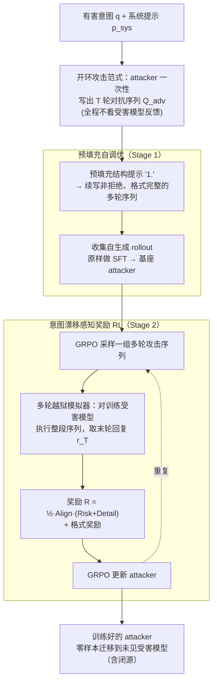

# SEMA: Simple yet Effective Learning for Multi-Turn Jailbreak Attacks

**会议**: ICLR 2026  
**arXiv**: [2602.06854](https://arxiv.org/abs/2602.06854)  
**代码**: [https://github.com/fmmarkmq/SEMA](https://github.com/fmmarkmq/SEMA)  
**领域**: 对齐RLHF  
**关键词**: 多轮越狱攻击, 强化学习红队, 意图漂移, 开环攻击, LLM安全

## 一句话总结
提出 SEMA 框架，通过预填充自调优和带意图漂移感知奖励的 RL 两阶段训练，在无需任何现有攻击策略或外部数据的条件下，训练出能自动生成多轮越狱攻击的 attacker，在 AdvBench 上跨三个受害模型平均 ASR@1 达 80.1%，超越 SOTA 33.9%。

## 研究背景与动机
多轮越狱比单轮越狱更贴近真实威胁模型——真实世界中用户与 chatbot 的交互是持续对话，攻击者可以逐步引导模型放松防御。然而，现有多轮攻击方法面临严重挑战：

**挑战一：探索复杂度爆炸**。多轮设置下，动作空间随轮次指数增长，RL 智能体很难高效探索有效的攻击路径。

**挑战二：意图漂移（Intent Drift）**。多轮对话中，攻击者容易在逐步引导过程中偏离原始的有害目标——前几轮为了"铺垫"而引入的无害话题可能让后续对话永远回不到有害意图。

**现有方法的局限**：人工设计的多轮攻击策略（如 Crescendo、PAIR）依赖固定模板，缺乏适应性；基于 RL 的方法需要闭环与受害模型交互（closed-loop），训练成本高且易受反馈不稳定影响。

**核心idea**：采用开环（open-loop）攻击范式——生成完整的多轮攻击序列而不需要受害模型的中间反馈，统一单轮和多轮设置，大幅降低探索复杂度；同时设计意图漂移感知奖励来锚定有害目标。

## 方法详解

### 整体框架
SEMA 要解决的是「怎么从零训练一个会自动写多轮越狱对话的攻击者」，全程不碰任何现成攻击模板或外部攻击语料。它把攻击者建模成一个 LLM（论文用 Llama-3.1-8B-Instruct 等开源模型），输入只有一条有害意图 $q$ 和一段固定系统提示 $p_{sys}$，要它**一次性**吐出一条长度为 $T$ 的多轮对抗 prompt 序列 $Q_{adv}=\{q^{adv}_t\}_{t=1}^{T}$——这就是「开环」：不看受害模型的中间回复就把整段对话规划好。围绕这个开环规程，训练分两阶段串起来：先用**预填充自调优**让一个根本不会写攻击序列的基座模型自举出格式正确、不自我拒绝的多轮 rollout，给强化学习一个能跑起来的起点；再用带**意图漂移感知奖励**的 GRPO，把攻击序列在「咬住原始有害目标」的前提下推到真能攻破受害模型。两阶段跑完，得到的攻击者可以零样本迁移到训练时没见过的受害模型（含闭源）。

### 关键设计

**1. 开环攻击范式：把多轮规划从闭环搜索压成单步生成**

多轮越狱最致命的问题是探索复杂度爆炸。传统做法是闭环（closed-loop）：发一轮、等受害模型回复 $r_{<t}$、再据此生成下一轮 $q^{adv}_t\sim\pi_A(\cdot\mid q,q^{adv}_{<t},r_{<t},s_{<t})$，搜索空间是 prompt 与 response 的笛卡尔积，随轮次组合式膨胀，还把攻击死死绑在某个受害模型逐轮的回复上。SEMA 直接砍掉这条依赖——让攻击者一口气把完整序列 $Q_{adv}\sim\pi_A(\cdot\mid p_{sys},q)$ 写完再整体发出去（公式 4）。这一刀把搜索从联合空间收缩到纯 prompt 空间，分支因子骤降、还能批量采样；更妙的是单轮只是 $T=1$ 的退化情形，单轮与多轮被同一套公式统一；又因为训练时不绑定任何受害模型的即时反馈，学出来的攻击者能零样本迁移到没见过的受害模型，包括闭源 API。

**2. 预填充自调优：用模型自举破解 RL 的冷启动死局**

开环 RL 有个前提——得先有「能用的」一次性 rollout，可这恰恰是基座模型给不了的：安全对齐的强模型一上来就拒绝（"Sorry, I can't fulfill that request."），奖励几乎全零；弱对齐的模型虽不拒绝却写不出能被解析的规整多轮格式，训练全耗在修格式上。SEMA 的破法是把「预填充」这个原本的越狱技巧（Qi et al., 2024）改造成训练基建：给定系统提示后，在攻击者输出开头**预填一个最小且无语义的结构线索**——就是列表序号 "1."，模型便顺势续写 "2." "3." 把整段多轮序列往下接，$Q^{adv}_{cont}\sim\pi_A(\cdot\mid p_{sys},q,Q^{adv}_{prefill})$（公式 6）。这样批量生成的非拒绝、格式正确的 rollout **不做任何过滤或改写**，直接收集起来做 SFT（公式 7，除了那几个预填 token，每个 token 都采自模型自己，故称「自调优」）。它一举两得：既让开环多轮攻击真能跑起来、稳住可解析的 rollout、提升样本效率，又因为没注入任何人工策略或外部数据，把模型原有知识和开放式探索能力完整留给了下一阶段的 RL。消融显示缺了这步 RL 根本无法收敛——它是硬前提而非锦上添花。

**3. 意图漂移感知奖励：用乘性门把整条攻击轨迹锚回有害目标**

多轮攻击的通病是意图漂移（intent drift）：为了铺垫引入的无害话题会让对话越走越偏，哪怕受害模型没拒绝，最后也已滑到「黑客行为的伦理探讨」这类无害结论上，攻击实际失败。SEMA 不直接在攻击 rollout 上算奖励，而是把它**重构成一次越狱仿真**——把生成的整段序列丢进一个训练时的受害模型跑出末轮回复 $r_T$，再让评估模型按三维打分合成奖励：意图对齐 $\text{Alignment}(r_T,q)$（末轮答案是否仍对准原始有害意图）、合规风险 $\text{Risk}(r_T)$（回复本身的有害程度）、详细程度 $\text{Detail}(r_T)$（是否给出具体可操作的内容），三者均归一化到 $[0,1]$，按下式合成：

$$R_{IDA}(r_T,q)=\tfrac{1}{2}\,\text{Alignment}(r_T,q)\cdot\big(\text{Risk}(r_T)+\text{Detail}(r_T)\big)$$

关键在于结构是**乘性**而非简单加权：意图对齐项作为乘性门——一旦发生显著漂移、$\text{Alignment}$ 趋零，无论受害模型回得多有害、多详细，整个奖励都被压垮，于是漂移轨迹被系统性地下权、攻击被牢牢拉回有害目标。最终再叠一个二值格式奖励 $R_{format}\in\{0,1\}$ 强制输出可解析，总奖励 $R=R_{IDA}+R_{format}$（公式 9）。消融中去掉意图对齐项后攻击明显偏航、ASR 下降，印证了这个锚的作用。

### 损失函数 / 训练策略
Stage 1 是标准 SFT 交叉熵（公式 7），在攻击者自生成的预填充 rollout 上微调。Stage 2 用 GRPO（Group Relative Policy Optimization）：对每条有害意图采一组序列、按组内相对优势 $\hat{A}_i$ 更新（公式 5、9），这种「一组里比相对好坏」的机制恰好契合开环「一次生成整段序列」的设定。Stage 2 的训练受害模型可与最终评测的受害模型不同，等于把「跨模型迁移」直接写进训练目标；攻击序列轮数上限为 $T_{max}$。

## 实验关键数据

### 主实验

| 受害模型 | 数据集 | SEMA ASR@1 | 之前SOTA | 提升 |
|---------|--------|-----------|---------|------|
| 3个模型平均 | AdvBench | 80.1% | 46.2% | +33.9% |
| 闭源模型 | AdvBench | 高 | 低 | 显著提升 |
| 开源模型 | AdvBench | 高 | 中等 | 显著提升 |

### 消融实验

| 配置 | ASR | 说明 |
|------|-----|------|
| SEMA (完整) | 最高 | 两阶段+意图漂移奖励 |
| SFT-only | 低 | 仅Stage 1，无RL |
| DPO变体 | 中等 | 偏好优化不如RL |
| 无意图漂移奖励 | 下降 | 攻击容易偏离目标 |
| 单轮设置 | 有效但低于多轮 | 验证统一性 |

### 关键发现
- SEMA 超越所有单轮基线、人工脚本多轮基线和模板驱动多轮基线
- 同时超越 SFT 和 DPO 变体，证明 RL 在多轮攻击学习中的优势
- 开环攻击可以直接迁移到未见过的受害模型，包括闭源模型
- 预填充自调优是 RL 阶段成功的关键前提——缺少它 RL 无法收敛
- 方法紧凑、可复现，代码将在 ICLR 会议前开源

## 亮点与洞察
- 分析了多轮越狱的真实威胁模型，指出单轮攻击只是特例，这重新定义了LLM安全评估的标准
- 开环攻击范式的设计非常巧妙——避免了闭环交互的复杂性，同时保证了迁移能力
- 意图漂移感知奖励是对多轮安全研究的重要贡献——精确定义了"多轮攻击成功"的含义
- 从零开始自举（bootstrap）攻击能力的思路是自动红队的重要进展
- Prefilling Self-Tuning的设计解决了RL冷启动的通用难题，可推广到其他序列生成RL任务
- 33.9%的ASR@1提升（vs SOTA）表明现有LLM的多轮防御能力远不够
- 方法的紧凑性（代码量小、训练成本适中）使其适合作为标准化的安全压力测试工具

## 局限与展望
- 代码仍在 Microsoft Research 审核中，尚未完全公开
- 开环攻击可能不如闭环攻击在特定受害模型上的效果好（无法利用中间反馈调整策略）
- 防御方可以简单地检测多轮对话中的模式来防御此类攻击
- 伦理考虑——该方法可能被滥用，但作者定位为暴露LLM安全漏洞的压力测试工具
- 尚未评估在最新防御方法（如Llama Guard 3等专用安全检测器）下的效果
- 训练数据的有害内容需要严格的访问控制和使用规范

## 相关工作与启发
- **vs Crescendo/PAIR**: 人工设计模板，SEMA完全从数据中学习攻击策略
- **vs AutoDAN-Turbo**: 依赖现有攻击策略库，SEMA完全自举
- **vs 单轮攻击(GCG/AutoDAN)**: SEMA统一了单轮和多轮，更贴近真实威胁

## 评分
- 新颖性: ⭐⭐⭐⭐ 开环多轮攻击+意图漂移感知奖励的组合很有创新性
- 实验充分度: ⭐⭐⭐⭐ 37页、13表、7图，多数据集多受害模型
- 写作质量: ⭐⭐⭐⭐ 结构清晰，两阶段设计动机阐述到位
- 价值: ⭐⭐⭐⭐ 对LLM安全红队研究有直接推动作用

<!-- RELATED:START -->

## 相关论文

- [\[ICLR 2026\] Obscure but Effective: Classical Chinese Jailbreak Prompt Optimization via Bio-Inspired Search](obscure_but_effective_classical_chinese_jailbreak_prompt_optimization_via_bio-in.md)
- [\[ICLR 2026\] JailNewsBench: Multi-Lingual and Regional Benchmark for Fake News Generation under Jailbreak Attacks](jailnewsbench_multi-lingual_and_regional_benchmark_for_fake_news_generation_unde.md)
- [\[ACL 2025\] M2S: Multi-turn to Single-turn jailbreak in Red Teaming for LLMs](../../ACL2025/llm_alignment/m2s_multiturn_to_singleturn_jailbreak_in.md)
- [\[ICLR 2026\] Toward Universal and Transferable Jailbreak Attacks on Vision-Language Models (UltraBreak)](toward_universal_and_transferable_jailbreak_attacks_on_vision-language_models.md)
- [\[ACL 2025\] Tempest: Autonomous Multi-Turn Jailbreaking of Large Language Models with Tree Search](../../ACL2025/llm_alignment/tempest_autonomous_multi-turn_jailbreaking_of_large_language_models_with_tree_se.md)

<!-- RELATED:END -->
