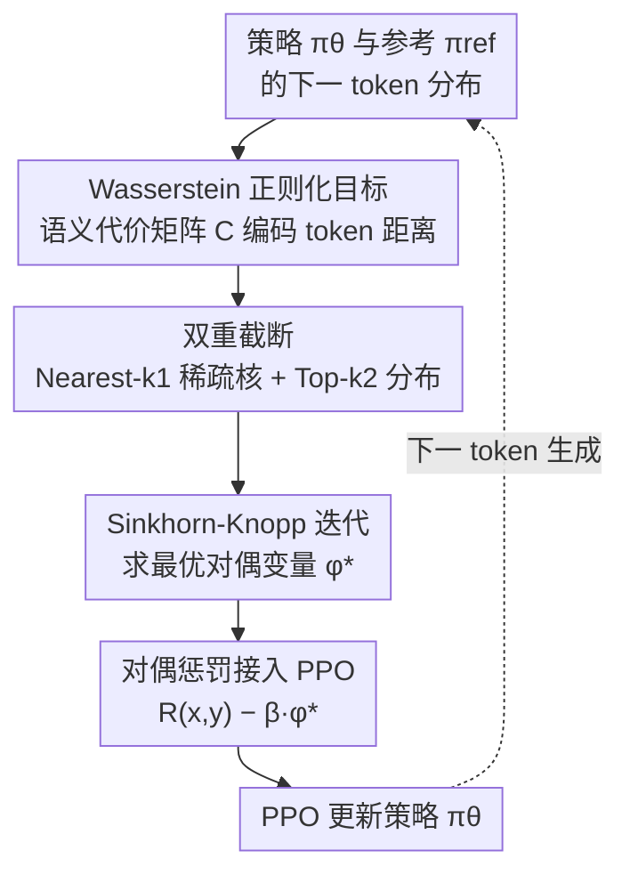

# Semantic-aware Wasserstein Policy Regularization for Large Language Model Alignment

**会议**: ICLR 2026  
**arXiv**: [2602.01685](https://arxiv.org/abs/2602.01685)  
**代码**: [https://github.com/aailab-kaist/WPR](https://github.com/aailab-kaist/WPR)  
**领域**: 对齐RLHF  
**关键词**: Wasserstein距离, RLHF正则化, 语义感知, 最优传输, Sinkhorn算法

## 一句话总结
指出 RLHF 中标准 KL 散度正则化仅比较相同索引处的 token 概率而忽略语义相似性，提出基于熵正则化 Wasserstein 距离的语义感知策略正则化（WPR），通过对偶公式将正则化转化为 token 级惩罚项，在对话生成和摘要任务上一致优于 KL 及各类 f-散度基线。

## 研究背景与动机
RLHF 是 LLM 对齐的主流范式。其标准流程是：用奖励模型评分，同时用 KL 散度正则化防止策略偏离参考模型太远。KL 散度在实践中使用广泛，因为它可以直接从两个策略的 token 概率计算，并轻松集成到PPO训练中。

然而，KL 散度和其他 f-散度（如 JS、$\chi^2$、TV 等）有一个根本性的局限：**它们仅比较相同索引位置上的 token 概率，完全忽略了 token 之间的语义关系**。

论文用一个直观的例子说明了这个问题：假设词表是 {cat, kitten, dog, table}，参考策略将概率集中在"cat"上。策略1 将概率集中在"kitten"上，策略2 集中在"table"上。语义上，"cat"和"kitten"非常接近，而"cat"和"table"毫无关系。但 KL 散度由于 support 不匹配会给出极大值（对策略1不公平），JS 散度则给策略1和策略2完全相同的距离值——两者都无法反映语义距离。

**核心矛盾**：KL/f-散度是"逐索引比较"的，完全无法利用 token 空间的几何结构；而语言生成中，将概率从"cat"转移到"kitten"和转移到"table"应该有本质不同的惩罚。

**切入角度**：用 Wasserstein 距离替代 KL 散度作为策略正则化，因为 Wasserstein 距离天然考虑底层空间的度量结构，可以编码 token 间的语义距离。

## 方法详解

### 整体框架
WPR 要解决的核心问题是：标准 RLHF 用 KL 把策略拉回参考模型，但 KL 只在相同索引上逐 token 比概率，区分不出"把概率从 cat 挪到 kitten"和"挪到 table"这两种语义上天差地别的偏移。WPR 的办法是把目标里那项 KL 正则化换成熵正则化 Wasserstein（Sinkhorn）距离，让正则化能感知 token 之间的语义远近。

真正的工程难点在于 Wasserstein 距离本身要解线性规划、复杂度高、也无法像 KL 那样写成 token 级惩罚塞进 PPO。整套方法因此沿一条计算链展开：先用参考模型的 embedding 距离构造**语义代价矩阵**，把"语义近则搬运代价小"编码进正则化；再用**双重截断**把整个词表的计算压回常数量级；然后用 **Sinkhorn-Knopp 迭代**解出最优对偶变量 $\phi^*$；最后靠对偶定理把 $\phi^*$ 当成一个 **token 级奖励惩罚**接回 PPO，其余流程原封不动。

### 关键设计

**1. Wasserstein 正则化目标：让正则化看见 token 的语义几何**

标准 RLHF 用 KL 把策略拉回参考模型，但 KL 只在相同索引上比概率，无法区分"把概率从 cat 挪到 kitten"和"挪到 table"。WPR 直接把目标中逐 token 的 KL 项替换为熵正则化 Wasserstein 距离 $D_{\tilde{W}}$，优化目标变为 $\max_{\pi_\theta} \mathbb{E}[\sum_n R(\mathbf{x}, \mathbf{y}_{1:n}) - \beta \sum_n D_{\tilde{W}}(\pi_\theta(y_n|\cdot) \| \pi_{ref}(y_n|\cdot))]$。这里的关键是代价矩阵 $C$——它取参考策略 token embedding 空间里的欧氏距离，于是"语义相近的 token 之间搬运概率代价小、语义无关则代价大"这一几何结构被直接编码进了正则化，KL 的盲点也就被填上了。Wasserstein 距离还有个附带好处：即使两个分布 support 不重叠它也良定义，不会像 KL 那样发散到无穷。

**2. 双重截断：把 $O(d^2)$ 的词表计算压回常数量级**

把目标换成 Wasserstein 后第一道坎是规模：对整个词表算代价矩阵是 $O(d^2)$，在动辄 256K 的词表上吃不消。WPR 用两道截断把规模压下来：一是 Nearest-$k_1$ 截断，把核矩阵 $K = \exp(-\lambda C)$ 只保留每个 token 的 $k_1=512$ 个近邻并稀疏存储，因为远距离 token 之间几乎不会发生概率搬运、保留它们没意义；二是 Top-$k_2$ 截断，把策略分布只截到 top-$k_2=128$ 个 token，使有效支持规模从 $d$ 降到 $2k_2+2$。两道截断叠加后，相比纯 KL 正则化，每千步的额外计算开销仅增加约 2.5%、显存约多 15GB（A100），实践中近乎免费。消融显示 $k_2$ 收得太狠（如 64）会明显掉点，说明截断尺度需要留足够的有效支持。

**3. Sinkhorn-Knopp 求解对偶变量：少量迭代换来稳定收敛**

截断后还要真把这个最优传输问题解出来。直接求 Wasserstein 距离要解线性规划，而引入熵正则化后它变成 Sinkhorn 距离，其对偶最优条件恰好对应矩阵的行列缩放因子，可以用经典的 Sinkhorn-Knopp 迭代闭式求解——在熵正则化下交替做行、列归一化，高效逼近最优传输的对偶解 $\phi^*$。实践中通常 10 次迭代即收敛，tolerance 取 $10^{-4}$。迭代次数是个敏感旋钮：消融里迭代降到 5 次会因收敛不充分导致性能严重下降，而加到 30 次又没有额外收益，10 次正好落在性价比拐点上。

**4. 对偶惩罚接入 PPO：把搬土问题变回一个奖励惩罚**

最后一步是让上一步解出的 $\phi^*$ 真正能用来训练。Wasserstein 距离不像 KL 那样能天然写成 token 级惩罚塞进 PPO，论文用 Sinkhorn 距离的对偶形式补上这一环：它证明（Theorem 2）最优对偶变量 $\phi^*$ 恰好可以充当 token 级的奖励惩罚项，目标可改写为 $\mathcal{J}_{\tilde{W}}(\pi_\theta) = \mathbb{E}[\sum_n \mathbb{E}_{y_n}[R(\mathbf{x}, \mathbf{y}_{1:n}) - \beta \phi^*_{y_n}]] + \mathcal{C}$。这一步是整套方法落地的支点：训练时只需把原来的 KL 惩罚换成 $\phi^*$，PPO 的其余部分原封不动，工程改动极小。

### 损失函数 / 训练策略
整体沿用 SFT → Reward Model → PPO 的标准三阶段 RLHF 流程，只在 PPO 阶段把 KL 惩罚替换为 Wasserstein 对偶变量。实验以 Gemma-2B 为 base model，在 TL;DR（摘要）和 HH-RLHF（对话）上训练，默认超参为 $\lambda=100$、$k_1=512$、$k_2=128$。

## 实验关键数据

### 主实验（GPT-4 Win Rate）

| 散度/方法 | TL;DR vs SFT | TL;DR vs RKL | HH-RLHF vs SFT | HH-RLHF vs RKL |
|-----------|-------------|-------------|-----------------|-----------------|
| RKL | 0.848 | - | 0.828 | - |
| FKL | 0.316 | 0.040 | 0.808 | 0.564 |
| JS | 0.540 | 0.204 | 0.744 | 0.424 |
| $\alpha$(0.5) | 0.724 | 0.304 | 0.792 | 0.524 |
| TV | 0.364 | 0.052 | 0.748 | 0.376 |
| $\chi^2$ | 0.904 | - | - | - |
| **Wasserstein** | **0.924** | **0.608** | **0.852** | **0.596** |

### 消融实验

| 配置 | vs SFT | vs RKL | 说明 |
|------|--------|--------|------|
| 默认(L2, k1=512, k2=128, λ=100) | 0.924 | 0.608 | 最佳 |
| Cost: cosine | 0.932 | 0.644 | 余弦距离略优于L2 |
| k1=256 | 0.920 | 0.572 | 近邻减少,性能微降 |
| k2=64 | 0.864 | 0.528 | 分布截断过多,下降明显 |
| λ=10 | 0.868 | 0.552 | 熵正则化过强 |
| Sinkhorn iter=5 | 0.708 | 0.328 | 收敛不充分,严重下降 |
| Sinkhorn iter=30 | 0.880 | 0.536 | 增加迭代无额外收益 |

### 关键发现
- WPR 在所有任务上一致优于 KL 和所有 f-散度基线，是唯一在 TL;DR 和 HH-RLHF 上都保持最优的方法
- FKL 和 TV 在 TL;DR 上训练不稳定（概率比爆炸），WPR 即使在 support 不匹配时也良定义
- MT-Bench 评估中 WPR 也取得最高分（4.272 vs RKL 4.000）
- 在代码生成（APPS + CodeGemma-7B）上同样有效
- Wasserstein 惩罚与 KL 惩罚呈强正相关（r=0.917），但斜率<1说明 WPR 更宽容
- WPR 训练的模型 top-10 候选 token 语义一致性显著更高
- 计算开销仅增加 2.5%（每千步），内存增加约 15GB（A100）

## 亮点与洞察
- 从最优传输理论出发重新审视 RLHF 正则化，理论优雅且实用
- Figure 2 的 cat/kitten/table 例子极具说服力，直观展示了 KL 的盲点
- 对偶公式将 Wasserstein 正则化转化为 token 级奖励惩罚，与 PPO 无缝集成
- 截断策略设计精巧，将 $O(d^2)$ 降到 $O(k_2^2)$，计算开销几乎可忽略
- 案例分析（Figure 6）直观展示了 WPR 在语义相近token上惩罚小、语义漂移时惩罚大

## 局限与展望
- 代价矩阵依赖参考模型的 embedding，不同 tokenizer 的模型之间无法直接迁移
- 仅在 2B-7B 规模验证，更大模型的缩放特性未知
- $\beta$ 仍需手动调节（虽然比 f-散度更鲁棒），自动调整是未来方向
- 将 WPR 扩展到 DPO 范式（不需要显式奖励模型）是一个自然的下一步

## 相关工作与启发
- **vs KL-DPO/PPO**: 标准方法，仅逐索引比较概率，忽略语义
- **vs f-DPO/χPO**: 推广到其他f-散度，但仍然是逐索引比较
- **vs Wasserstein GAN**: 同样利用 Wasserstein 距离，但应用在生成模型判别器vs这里用于策略正则化
- **vs MA-RLHF**: 同期工作，也改进RLHF正则化，但从动作粒度角度切入

## 评分
- 新颖性: ⭐⭐⭐⭐⭐ 将最优传输引入RLHF正则化，理论创新突出
- 实验充分度: ⭐⭐⭐⭐⭐ 两个任务×七种散度对比，多模型规模，代码生成，完整消融和分析
- 写作质量: ⭐⭐⭐⭐⭐ 理论推导严谨，直觉解释到位，案例分析精彩
- 价值: ⭐⭐⭐⭐⭐ 对RLHF正则化的根本性改进，有望成为新标准

<!-- RELATED:START -->

## 相关论文

- [\[ICLR 2026\] Towards Understanding Valuable Preference Data for Large Language Model Alignment](towards_understanding_valuable_preference_data_for_large_language_model_alignmen.md)
- [\[ICLR 2026\] GuardAlign: Test-time Safety Alignment in Multimodal Large Language Models](guardalign_test-time_safety_alignment_in_multimodal_large_language_models.md)
- [\[ICLR 2026\] Chasing the Tail: Effective Rubric-based Reward Modeling for Large Language Model Post-Training](chasing_the_tail_effective_rubric-based_reward_modeling_for_large_language_model.md)
- [\[NeurIPS 2025\] GVPO: Group Variance Policy Optimization for Large Language Model Post-Training](../../NeurIPS2025/llm_alignment/gvpo_group_variance_policy_optimization_for_large_language_model_post-training.md)
- [\[ICLR 2026\] Unifying Stable Optimization and Reference Regularization in RLHF (DAR)](unifying_stable_optimization_and_reference_regularization_in_rlhf.md)

<!-- RELATED:END -->
