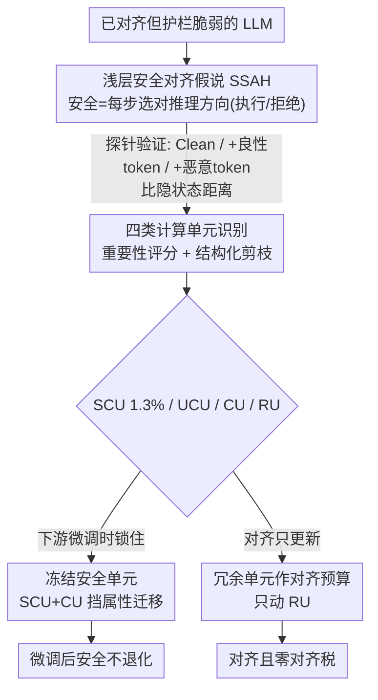

# Superficial Safety Alignment Hypothesis

**会议**: ICLR 2026  
**arXiv**: [2410.10862](https://arxiv.org/abs/2410.10862)  
**代码**: [https://ssa-h.github.io/](https://ssa-h.github.io/)  
**领域**: AI安全 / LLM对齐  
**关键词**: 安全对齐, 安全脆弱性, 神经元级分析, 对齐税, 模型剪枝

## 一句话总结
提出"浅层安全对齐假说"(SSAH)：安全对齐本质上是教模型做一个隐式的二分类任务（执行还是拒绝），只需约1.3%的神经元即可建立安全护栏；冻结这些安全关键单元可在微调时保持安全性，利用冗余单元作为"对齐预算"可消除对齐税。

## 研究背景与动机

**领域现状**：LLM安全对齐主要依赖SFT、RLHF、DPO等方法，但这些方法通常将安全对齐视为通用对齐的子集，忽略了安全对齐的独特性质。

**现有痛点**：
   - 安全机制极度脆弱——即使用良性数据微调，安全护栏也会崩溃（Qi et al., 2023）
   - 存在"对齐税"——提升安全性会牺牲模型的通用能力
   - 当前方法需要全参数微调，计算成本高

**核心矛盾**：我们对安全对齐如何影响模型行为、为什么安全机制如此脆弱缺乏深入理解。

**本文目标** 三个问题：安全对齐如何影响模型行为？安全为何脆弱？如何缓解这些问题？

**切入角度**：关键观察——能执行恶意请求的模型已经具备相关知识和推理能力，因此安全对齐只需教会模型选择正确的推理方向（执行 vs 拒绝），而非注入新知识。

**核心 idea**：安全对齐 ≈ 隐式二分类任务，只需极少量(~1.3%)安全关键神经元即可实现。

## 方法详解

### 整体框架
SSAH 不是某个具体训练算法，而是一个关于"安全对齐到底改了模型什么"的假说，再围绕这个假说做定位和应用。起点是一个已经对齐、但护栏很脆弱的 LLM：作者先提出假说并用探针实验确认，安全对齐改变的是模型在每一步生成时选择的"推理方向"（执行还是拒绝），而不是注入新知识；接着用结构化剪枝加重要性评分把神经元拆成四类（安全关键 SCU、效用关键 UCU、复合 CU、冗余 RU），定位出到底是哪一小撮神经元在撑安全护栏；最后顺着这个定位分出两个应用分支——下游微调时冻结安全单元防止安全退化，做对齐时只更新冗余单元来消除对齐税。

### 关键设计

**1. 浅层安全对齐假说 (SSAH)：把安全对齐重新理解成一个隐式二分类，并用探针证实**

通用对齐假说(SAH)笼统地认为对齐要给模型补上一整套价值观，难以验证。SSAH 把范围收窄到一个关键观察上：一个能完整执行恶意请求的模型，其实已经具备相关知识和推理能力，所以安全对齐并不需要再教它新东西，只需要教它在面对请求时选对"推理方向"——是执行还是拒绝；除了这个二分类决策，对齐还附带提供了一套标准化的拒绝机制和备选回复模板。这样收窄之后假说变得具体可验证，因为它聚焦在"已具备知识"的模型上，排除了知识不足这个干扰因素。

推理方向是模型内部的抽象量没法直接观测，作者于是用隐状态空间里的距离来间接推断：为每条恶意查询构造三个版本——原始恶意查询(Clean)、查询后接良性 token（"Sorry, I can't..."）、查询后接恶意 token（"Here's how..."）。对一个对齐模型，Clean 的隐状态应当在每一步生成都更靠近"接良性 token"那一版、远离"接恶意 token"那一版；未对齐模型则相反。实验证实了这一点，且这种对安全方向的偏好贯穿所有 Transformer block 而非只在靠后的层显现。作者也强调这是必要而非充分的证据，安全对齐可能还有 SSAH 未捕获的更微妙变化。这个视角顺带解释了越狱为什么有效——当前对齐只在初始 token 处把推理方向定一次，攻击者操纵开头几个 token 就能把方向掰到"执行"一侧；真正稳健的对齐应该在每一步生成时重新评估推理方向，而不是开局定好就不管。

**2. 四类计算单元识别 (SCU/UCU/CU/RU)：用结构化剪枝定位撑安全的那一小撮神经元**

如果安全对齐真是个简单二分类，那撑起安全护栏的神经元应该极少。为了验证并定位它们，作者对每个 depth-2 模块 $f(X) = B\sigma(AX)$ 计算逐单元的重要性分数：

$$\mathbf{I}_{:,j} = \frac{1}{N-1}\sum_{n=1}^{N}(X^B_{n,j,:} - \bar{X}^B_{:,j,:})^2 \cdot \|\mathbf{W}^B_{:,j}\|_2^2$$

也就是把第 $j$ 个单元的激活方差乘上其输出权重的范数平方，方差大、权重重的单元就重要。分别在安全数据集和效用数据集上算出 $\mathbf{I_S}$ 和 $\mathbf{I_U}$，再据此划进四类：先把 $\mathbf{I_U}+\mathbf{I_S}$ 最小的单元判为冗余单元(RU)，再把 $\mathbf{I_S}-\mathbf{I_U}$ 取最大、最小两端分别判为安全关键单元(SCU)和效用关键单元(UCU)，剩下两者都重要的归为复合单元(CU)。剪枝采用整通道/整神经元的结构化移除（不是非结构化稀疏），并从高剪枝比例逐步往下扫、选对应属性掉点最小的比例。结果印证了假说——SCU 仅占约 1.3% 的神经元，却是安全护栏的命门：单独移除这 1.3% 就能让 ASR 暴涨。

**3. 冻结安全单元：微调时锁住它们，挡住把安全悄悄挪走的"属性迁移"**

良性数据微调为什么会破坏安全？作者做了属性迁移分析，追踪每个神经元微调前后的归类变化，发现微调会把安全关键单元一步步往效用方向挪——超过一半的 SCU 退化成复合单元 CU、部分 CU 再退化成 UCU，原本贡献安全的单元总量随之下降，安全性自然崩。对策很直接：微调时冻结安全关键组件（SCU 加上排名靠前的 CU），从源头阻断这条迁移路径。实测在 LLaMA2 上冻结 SCU + 全部 CU 后，AdvBench 的 ASR 从 11.92% 降到 2.88%，且迁移分析确认安全单元向效用单元的转化被显著抑制。

**4. 冗余单元作为对齐预算：只动 RU 来消除对齐税**

对齐税的根源是对齐微调会改动效用关键单元从而牺牲通用能力——作者在对齐过程的属性迁移分析里看到，大量原本只贡献效用的单元被翻成 CU/SCU，而预训练里本就有的冗余单元几乎没被用上。既然预训练模型本就有至少约 20% 的冗余参数(RU)，那干脆把对齐只限制在这些冗余单元上：先用上面的剪枝法定位 RU、冻结其余全部参数，只更新 RU 来建立安全/对齐行为，完全不碰 UCU。这样既完成了对齐又不伤效用。实测只更新 20% 参数即可达到同等的对齐效果，数学能力(GSM8K)反而从 9.24 提升到 13.4，优于全参数微调的 8.8——说明把对齐挤进冗余空间不仅没有代价，还顺带避开了全参微调对效用单元的扰动。

### 训练策略
剪枝统一用上面基于激活方差的重要性评分、按结构化方式整通道移除。两个应用分支都靠"冻结一部分单元、只训练另一部分"实现（冻结 SCU/CU，或反过来只在 RU 上更新）；为保证公平对比，冻结版本把训练 epoch 翻倍，确保其最终训练 loss 与全参基线相当或更低，排除"是不是只是训练不充分才更安全"的混淆。

## 实验关键数据

### 主实验：冻结安全单元防微调攻击

| 模型/设置 | AdvBench ASR (keyword) | AdvBench ASR (llama3-guard) | HEx-PHI Score | HEx-PHI Rate |
|-----------|----------------------|---------------------------|---------------|-------------|
| LLaMA2 初始 | 0.19% | 0.19% | 1.05 | 0.3% |
| LLaMA2 + Dolly微调 | 11.92% | 10.58% | 1.95 | 18.78% |
| LLaMA2 + 冻结SCU+6%CU | 3.65% | 2.31% | 1.55 | 10.6% |
| LLaMA2 + 冻结SCU+全CU | 2.88% | 1.92% | 1.48 | 9.0% |
| LLaMA3 初始 | 1.54% | 1.15% | 1.16 | 3.0% |
| LLaMA3 + Dolly微调 | 61.15% | 50.58% | 2.95 | 37.2% |
| LLaMA3 + 冻结SCU+全CU | 40.58% | 28.27% | 2.32 | 23.6% |

### 消融实验：四类单元剪枝影响

| 单元类型 | 比例 | 效用下降(LLaMA2) | 安全ASR增加(LLaMA2) |
|---------|------|-----------------|-------------------|
| SCU | 1.3% | -1.3% | +56.0% |
| UCU | 13.3% | -15.6% | +18.3% |
| RU | 14.8% | -2.8% | +4.6% |
| Dense(完整模型) | 100% | 基准 | 基准(10.0%) |

### 关键发现
- **SCU极度稀少但关键**：仅1.3%的神经元负责安全，移除后ASR从10%飙升至66%
- **LLaMA3比LLaMA2更脆弱**：微调后ASR从1.54%暴涨至61.15%，可能因为LLaMA3会"分析"恶意请求的真实意图
- **PEFT方法比全参数微调对安全的破坏更大**：LoRA导致26.9%高危率 vs 全参数微调18.48%，这与直觉相反
- **冗余单元对齐不降反升数学能力**：GSM8K从9.24→13.4(仅20%参数微调) vs 9.24→8.8(全参数微调)

## 亮点与洞察
- **安全 ≈ 二分类的独到见解**：将安全对齐问题降维为推理方向选择的二分类，这个视角既简洁又有强解释力。巧妙之处在于它解释了为什么安全如此脆弱——只需翻转少量神经元的"投票方向"即可破坏安全
- **冗余单元作对齐预算**：预训练模型天然有~20%冗余参数，用这些参数做对齐可以避免修改效用单元。这个思路可迁移到任何需要在不损害原有能力的前提下增加新功能的场景
- **属性迁移分析框架**：追踪微调前后每个神经元的属性变化，形成SCU→CU→UCU的迁移图谱，为理解微调对齐破坏提供了可视化工具
- **探针方法验证内部推理方向**：通过对比Query+benign/malicious tokens的隐状态距离来推断推理方向，方法简单但有效

## 局限与展望
- **SSAH是必要条件而非充分证明**：作者承认探针实验是必要而非充分的证据，安全对齐可能还有SSAH未捕获的更微妙变化
- **每步重评估的理想方案未实现**：论文提出理想的安全对齐应在每个生成步重新选择推理方向，但这会带来推理开销
- **LLaMA3实验受限**：由于计算限制，只冻结了前12个block，效果不如LLaMA2
- **只验证了SFT场景**：未探索RLHF/DPO对齐中SCU/RU的行为
- **改进思路**：可以将SCU/RU识别与LoRA结合，设计"安全感知LoRA"——只在RU上插入LoRA适配器

## 相关工作与启发
- **vs Wei et al. (2024)**：他们也研究安全关键组件，但在权重级别识别；本文在神经元级别，粒度更细，且实验更充分地验证了冻结策略的效果
- **vs SafeDPO**：SafeDPO通过训练目标约束安全，本文从模型结构角度出发；两者可互补——用SSAH识别安全单元+用SafeDPO目标训练
- **vs AlphaSteer**：AlphaSteer通过null-space约束实现拒绝转向，与SSAH的冻结策略都是保护安全参数不被修改的思路，但切入角度不同

## 评分
- 新颖性: ⭐⭐⭐⭐⭐ SSAH假说视角独到，将安全问题降维为二分类的观察非常有洞察力
- 实验充分度: ⭐⭐⭐⭐ 多模型多基准多评估方法，但LLaMA3实验因计算限制不够完整
- 写作质量: ⭐⭐⭐⭐⭐ 逻辑清晰，从假说→验证→应用的叙事循序渐进
- 价值: ⭐⭐⭐⭐⭐ 为理解安全对齐本质和设计高效安全训练策略提供了理论基础

<!-- RELATED:START -->

## 相关论文

- [\[ICML 2026\] Curriculum Learning for Safety Alignment](../../ICML2026/llm_alignment/curriculum_learning_for_safety_alignment.md)
- [\[ICLR 2026\] GuardAlign: Test-time Safety Alignment in Multimodal Large Language Models](guardalign_test-time_safety_alignment_in_multimodal_large_language_models.md)
- [\[ICLR 2026\] Mitigating the Safety Alignment Tax with Null-Space Constrained Policy Optimization](mitigating_the_safety_alignment_tax_with_null-space_constrained_policy_optimizat.md)
- [\[ICLR 2026\] Reasoned Safety Alignment: Ensuring Jailbreak Defense via Answer-Then-Check](reasoned_safety_alignment_ensuring_jailbreak_defense_via_answer-then-check.md)
- [\[ICLR 2026\] A2D: Any-Order, Any-Step Safety Alignment for Diffusion Language Models](a2d_any-order_any-step_safety_alignment_for_diffusion_language_models.md)

<!-- RELATED:END -->
