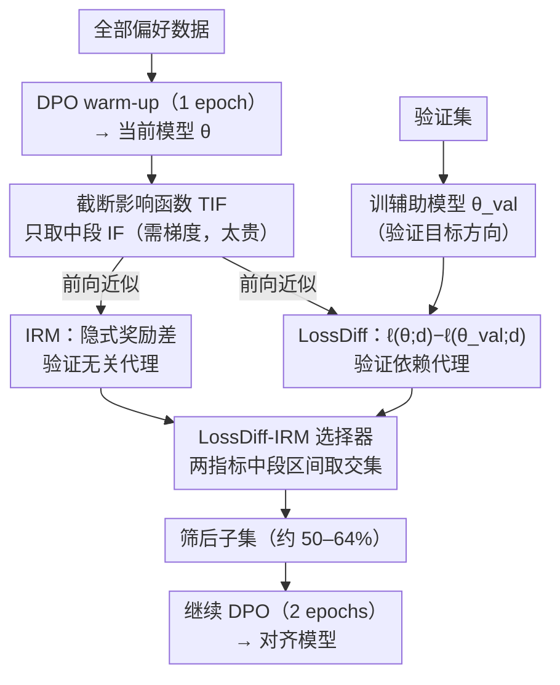

# Towards Understanding Valuable Preference Data for Large Language Model Alignment

**会议**: ICLR 2026  
**arXiv**: [2510.13212](https://arxiv.org/abs/2510.13212)  
**代码**: [GitHub](https://github.com/tmlr-group/TIF_LossDiff-IRM)  
**领域**: LLM对齐  
**关键词**: 偏好数据选择, 影响函数, DPO, 数据质量, 模型依赖

## 一句话总结
从模型依赖视角研究偏好数据质量：提出截断影响函数(TIF)发现中等IF值的数据才是最有价值的(而非经典观点中的高IF) -> 设计LossDiff和IRM两个轻量代理指标近似TIF -> 两者组合的LossDiff-IRM选择器仅用50-64%数据即可平均提升WinRate 13.58%，在多个LLM家族和对齐benchmark上均有效。

## 研究背景与动机

**领域现状**：LLM对齐依赖高质量偏好数据。现有方法用外部reward model或GPT-4过滤数据，隐含假设"数据质量是数据自身的固有属性"。但这忽略了模型和训练配置对数据价值的影响。

**现有痛点**：(1) 外部过滤(GPT-4/reward model)把数据质量视为数据固有属性，不考虑模型差异——同一数据对不同模型可能有益也可能有害；(2) 经典影响函数(IF)在偏好对齐中存在过拟合验证集的问题(高IF数据不一定最好)；(3) 精确IF计算需要梯度，对大模型不可行。

**核心矛盾**：偏好对齐是开放式任务(没有标准答案)，验证集gradient只是不完美的代理。传统IF假设高IF数据=好数据，但在偏好对齐中这导致过拟合——模型在少数high-IF样本上overfit到极大margin而损害其他样本。

**本文目标**：(a) 什么样的偏好数据真正有价值？(b) 如何高效识别有价值的数据？(c) 如何使数据选择适配到具体模型？

**切入角度**：用IF把训练数据分成small/medium/large三组 -> 观察训练动态发现medium-IF数据产生最稳定的对齐效果 -> 提出TIF(截断IF)只保留中间区间 -> 设计轻量正相关代理指标近似TIF。

**核心 idea**：偏好数据的价值是模型依赖的，且中等影响力的数据最有价值——不是太容易也不是太难，而是"刚好合适"的数据。

## 方法详解

### 整体框架
这篇论文想回答两件事：偏好对齐里到底什么样的数据有价值，以及如何在不算梯度的情况下、针对某个具体模型把这些数据挑出来。它的答案建立在一个反直觉的观察上——影响函数(IF)取中段的数据才最好，太小是噪声、太大会过拟合。

整条流水线是"先训一小段、再筛、再接着训"：先在全部偏好数据上做一个 epoch 的 DPO warm-up，让模型进入对齐状态，同时在验证集上训一个辅助模型当作"验证目标方向"；接着用两个只需前向 pass 的轻量指标 LossDiff 和 IRM 去近似每条数据的 TIF；只保留两个指标都落在中间百分位区间的交集数据(约 50–64%)；最后在这个子集上继续 DPO 训练 2 个 epoch。下面四个关键设计就对应这条流水线上的四个环节——先有"中段 IF 才好"的判据(TIF)，再有近似它的两个代理(LossDiff、IRM)，最后用组合选择器把它们落地成实际的筛选规则。

### 关键设计

**1. 截断影响函数(TIF)：把"高 IF=好数据"修正成"中段 IF 才好"**

经典影响函数在分类任务里默认 IF 越高数据越有价值，但偏好对齐是开放式任务、没有标准答案，验证集的梯度只是人类偏好的不完美代理，照搬这个假设会出问题。作者把训练数据按 IF 百分位切成 small / medium / large 三组观察训练动态，发现三组表现截然不同：small-IF 数据是噪声或歧义样本，训练后 eval loss 反而上升、reward margin 跌成负值；large-IF 数据会过拟合，eval loss 先降后升、少数 pair 的 margin 被推到极大；只有 **medium-IF** 数据让 eval loss 稳定下降、margin 稳定上升，是最优区间。于是 TIF 只保留中间区间，丢掉两头：

$$\text{TIF}(d) = \mathbb{I}[\delta_{small} < \text{IF}(d) < \delta_{large}]$$

这和分类任务里的结论正好相反——counter-intuitive，但在"验证梯度本身就不完美"的前提下是合理的：极端的 IF 值(过小过大)恰恰是低质量数据的信号。

**2. Loss Difference(LossDiff)：用两次前向 pass 近似 IF 的验证依赖代理**

精确算 IF 需要梯度，对大模型不可行，所以要找一个能用前向 pass 算出来、又和 IF 同向的代理。LossDiff 的做法是先在验证集上训出一个对齐好的辅助模型 $\pi_{\theta_{val}}$，把它当作"验证目标方向"，再看当前模型 $\theta$ 和这个目标模型在同一条数据上的 loss 差：

$$\text{LossDiff}(d) = \ell(\theta; d) - \ell(\theta_{val}; d)$$

直觉是：LossDiff 越大，说明把参数从 $\theta$ 往 $\theta_{val}$ 挪能更多降低这条样本的 loss，也就说明这条样本和验证目标越一致、越值得学。作者从数学上证明了 LossDiff 与 IF 正相关，实测 Pearson $r=0.77$，而代价只是两次前向 pass、完全不用反向传播。

**3. Implicit Reward Margin(IRM)：只靠模型自身信号、不碰验证集的代理**

LossDiff 仍需要一个在验证集上训出的辅助模型，IRM 则更进一步，只用当前模型的内部信号。它直接取 DPO loss 里 sigmoid 内部那一项——也就是模型对 chosen 相对 rejected 的隐式奖励差：

$$\text{IRM}(d) = \beta \log \frac{\pi_\theta(y_w|x)}{\pi_{ref}(y_w|x)} - \beta \log \frac{\pi_\theta(y_l|x)}{\pi_{ref}(y_l|x)}$$

IRM 衡量的是模型当前对 chosen vs rejected 的偏好强度，同样与 IF 正相关($r=0.67$)，但因为没用上验证信息，精度弱于 LossDiff；换来的好处是彻底不依赖验证集，适合连验证集都没有的场景。

**4. LossDiff-IRM 组合选择器：两个误差来源互补的代理取交集**

单独用任一指标近似 TIF 的精度都有限(Overlap 约 0.66–0.70)。关键观察是 LossDiff 和 IRM 的误差来源不同——一个依赖验证集、一个完全不依赖，所以它们犯错的地方往往不重合。选择器因此只保留两个指标**同时**落在中间百分位区间的数据，让两类误差互相抵消。组合后对 TIF 的 Overlap 提升到 0.73–0.78，明显高于任一单指标。

### 训练策略
- Warm-up：在全部数据上做 1 个 epoch 的 DPO，让模型进入对齐状态；
- 同时在验证集上训练辅助模型 1 个 epoch 得到 $\pi_{\theta_{val}}$；
- 对每条数据算 LossDiff(两次前向)+ IRM(一次前向)；
- 按 LossDiff-IRM 规则取两指标中间区间的交集，保留约 50–64% 数据；
- 在筛后的子集上继续 DPO 训练 2 个 epoch。

## 实验关键数据

### 主实验：LossDiff-IRM选择 vs 基线 (DPO)

| 方法 | 数据量 | UltraFeedback WR | AlpacaEval WR | Vicuna WR | Arena-Hard WR |
|------|--------|-----------------|---------------|-----------|---------------|
| Full Data (Llama-3.1-8B) | 100% | 77.61 | 78.41 | 73.75 | 81.39 |
| GPT4 Filter | 64% | 80.57 | 81.09 | 80.31 | 84.30 |
| Reward Model Filter | 64% | 82.68 | 83.76 | 76.88 | 86.19 |
| **LossDiff-IRM** | **64%** | **83.97** | **87.08** | **86.88** | **88.40** |

### 消融：数据分组训练动态 (TIF验证)

| IF区间 | 训练Loss | Eval Loss | Eval Margin | 效果 |
|--------|---------|-----------|-------------|------|
| Small-IF | 下降 | 上升 | 负值 | 有害(噪声/歧义) |
| Large-IF | 下降 | 先降后升 | 持续上升 | 过拟合(少数pair过度优化) |
| **Medium-IF** | **下降** | **稳定下降** | **稳定上升** | **最优** |

### 关键发现
- **模型依赖性验证**: 同一数据在Qwen-0.6B和Llama-1B上的IF值分布不同，某些数据对一个模型有益对另一个有害
- **Medium-IF最优是关键发现**: 挑战了传统"高IF=好数据"的认知，在偏好对齐中medium-IF才是最有价值的
- **LossDiff-IRM效率极高**: Llama-1B上IF计算需~10小时，LossDiff-IRM仅需~5分钟(120x加速)
- **跨模型/跨方法泛化**: 在Llama-3.1-8B/Qwen3-8B/Pythia系列上，以及DPO和SLiC两种对齐方法上都一致有效
- **组合优于单一**: LossDiff-IRM的TIF overlap (0.73-0.78) > LossDiff alone (0.66-0.70) > IRM alone (0.60-0.70)

## 亮点与洞察
- **"数据质量是模型的属性"**颠覆了偏好数据领域的主流假设。现有数据过滤pipelines(用GPT-4/RM)都是模型无关的，但本文证明应该为每个目标模型定制数据选择
- **Medium-IF最优的"Goldilocks效应"**非常有insight：small-IF是噪声，large-IF导致过拟合，只有"刚好合适"的难度才最有益。类比curriculum learning但更有理论支撑
- **LossDiff的"验证对齐辅助模型"思路**巧妙：用验证集训练的模型作为proxy方向，再用loss差异close-form近似IF。可迁移到任何需要高效数据估值的场景
- **两个代理指标的组合抵消误差**类似于ensemble思想，但用的是互补信号源(验证依赖 vs 验证无关)

## 局限与展望
- warm-up阶段仍需在全部数据上训练一个epoch，大规模时有开销
- TIF的百分位阈值需要手动设定，不同数据集可能需要调整
- 实验中验证集假设可获得，但实际场景中高质量验证集不易得
- 在更大模型(>8B)上的验证未充分展示

## 相关工作与启发
- **vs Morimura/Deng等(外部RM过滤)**: 把数据质量视为数据固有属性，不适配模型。LossDiff-IRM是模型依赖且计算更高效
- **vs Pattnaik(curriculum)**: 用GPT-4 score做curriculum，但score是模型无关的。LossDiff-IRM的排序随模型变化
- **vs 经典影响函数(Koh&Liang)**: 在分类中高IF=好数据。偏好对齐中截断IF(medium区间)更优——这是领域特有的新发现

## 评分
- 新颖性: ⭐⭐⭐⭐⭐ "数据质量是模型属性"和"medium-IF最优"都是重要的新洞察
- 实验充分度: ⭐⭐⭐⭐⭐ 多模型族(Llama/Qwen/Pythia)、多benchmark、多对齐方法验证全面
- 写作质量: ⭐⭐⭐⭐ 分析驱动、层层递进、逻辑清晰
- 价值: ⭐⭐⭐⭐⭐ 对LLM对齐的数据选择有范式级影响

<!-- RELATED:START -->

## 相关论文

- [\[ICLR 2026\] Semantic-aware Wasserstein Policy Regularization for Large Language Model Alignment](semantic-aware_wasserstein_policy_regularization_for_large_language_model_alignm.md)
- [\[ICML 2025\] PoisonBench: Assessing Large Language Model Vulnerability to Data Poisoning](../../ICML2025/llm_alignment/poisonbench_assessing_large_language_model_vulnerability_to_data_poisoning.md)
- [\[ICLR 2026\] Chasing the Tail: Effective Rubric-based Reward Modeling for Large Language Model Post-Training](chasing_the_tail_effective_rubric-based_reward_modeling_for_large_language_model.md)
- [\[ACL 2026\] Alignment Data Map for Efficient Preference Data Selection and Diagnosis](../../ACL2026/llm_alignment/alignment_data_map_for_efficient_preference_data_selection_and_diagnosis.md)
- [\[ICLR 2026\] Skywork-Reward-V2: Scaling Preference Data Curation via Human-AI Synergy](skywork-reward-v2_scaling_preference_data_curation_via_human-ai_synergy.md)

<!-- RELATED:END -->
