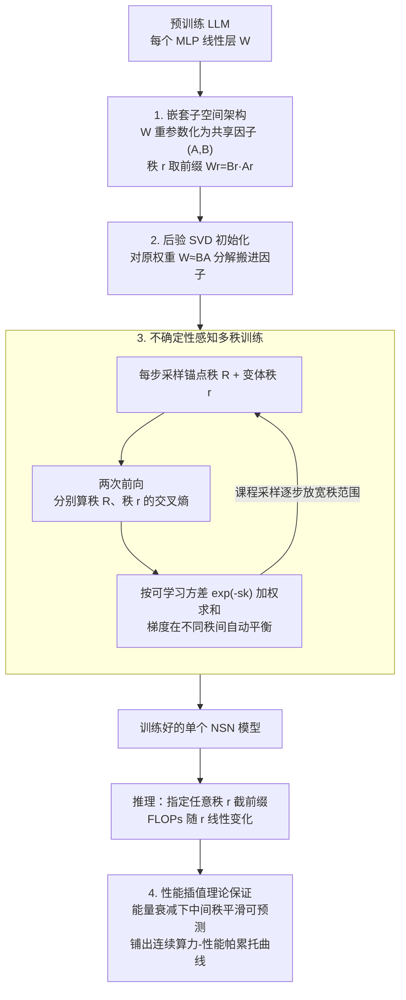

# Deep Hierarchical Learning with Nested Subspace Networks for Large Language Models

**会议**: ICLR 2026  
**arXiv**: [2509.17874](https://arxiv.org/abs/2509.17874)  
**代码**: [https://github.com/pauliusrauba/nested-subspace-networks](https://github.com/pauliusrauba/nested-subspace-networks)  
**领域**: LLM效率  
**关键词**: 嵌套子空间, 动态推理, 低秩分解, 不确定性感知训练, 弹性计算

## 一句话总结
提出嵌套子空间网络（NSN），通过低秩分解使线性层形成严格嵌套的子空间层次，配合不确定性感知多秩训练，使单个模型在测试时可即时调节计算量与性能的权衡（50% FLOPs 减少仅损失 5% 精度），且可后验应用于预训练 LLM。

## 研究背景与动机

**领域现状**：大型神经网络固定计算预算，在资源受限或动态环境中缺乏灵活性。主流压缩方法（剪枝、蒸馏、LoRA）产生静态模型，无法运行时调节。

**现有痛点**：
   - 为每个计算预算训练独立模型代价巨高
   - 可变宽网络（Slimmable Networks）需从头训练，无法应用于预训练模型
   - 现有方法仅提供离散的几个操作点，非连续光滑谱

**核心矛盾**：如何在单个模型中同时满足三个需求——(D1) 推理时即时调节、(D2) 可后验应用于任意预训练模型、(D3) 提供连续光滑的计算-性能帕累托边界？

**切入角度**：低秩分解 $W = BA$ 天然支持通过截断秩 $r$ 来调节计算量。关键洞察是如果让不同秩的模型形成严格嵌套的子空间，就能保证性能单调平滑退化。

**核心 idea**：将线性层重参数化为共享的 $(A, B)$ 因子对，秩 $r$ 模型使用 $A$ 的前 $r$ 行和 $B$ 的前 $r$ 列，天然形成嵌套层次结构，配合不确定性加权训练实现帕累托最优。

## 方法详解

### 整体框架
NSN 要解决的是「一个模型、多档算力」的问题：训练完一次，推理时想省一半 FLOPs 就省一半，且性能平滑退化而不是断崖式掉。它的做法是把预训练 LLM 里每个 MLP 的线性层换成一个 NSN 层——这个层不再存一个稠密权重 $W$，而是存一对共享因子 $(A, B)$，并约定秩 $r$ 的有效权重就取它们的前缀 $W_r = B_r A_r$。要把这套因子从已有模型里「搬」出来，初始化时直接对原权重做 SVD（$W \approx BA$），让低秩前缀一上来就是个像样的近似而非噪声。然后用一种「不确定性感知的多秩训练」把整个秩层次一起优化：每步同时在一个高秩（锚点）和一个随机低秩（变体）上算损失，用可学习的方差自动平衡两者的梯度，反复迭代。训练好之后，推理时只要指定一个秩 $r$，就等于截取这套因子的前 $r$ 个分量来算，FLOPs 随 $r$ 线性变化；而一条能量衰减假设下的理论界保证了那些没单独训过的中间秩也平滑可信，于是单个模型就铺出了一整条连续的算力-性能帕累托曲线。

### 关键设计

**1. 嵌套子空间架构：让小秩模型严格是大秩模型的子集**

弹性推理最怕的是不同档位之间互相打架——换一个算力点就像换了个模型，性能没法预测。NSN 用「严格嵌套」来根治这点：把线性层重参数化为一对共享因子 $(A, B)$，秩 $r$ 的有效权重就取它们的前缀 $W_r = B_r A_r$（$A$ 的前 $r$ 行、$B$ 的前 $r$ 列）。这样秩 $r$ 模型的函数类天然是秩 $r+1$ 的严格子集，所有操作点都只是同一套 $(A, B)$ 的不同前缀，因此提高秩只会单调地补充表达力、不会推翻已有行为。和 Slimmable Networks 不同的是，NSN 调秩并不改变输入输出维度、也不改中间张量的形状，所以无需动归一化层或任何接口，可以直接插进已有的 Transformer——这正好满足「可后验应用于任意预训练模型」(D2) 的诉求。

**2. 后验 SVD 初始化：用奇异值分解把预训练权重无损搬进因子**

有了嵌套架构，还要回答怎么把一个已经训练好的 LLM 的权重灌进这对因子里——随机初始化会直接丢掉预训练权重里的全部信息，等于从头再来。NSN 改用 SVD：对每个 MLP 线性层把原权重分解为 $W \approx BA$ 来初始化因子矩阵，再用下面的多秩训练做微调。SVD 的好处是它按奇异值大小排序地保留了权重的主要成分，前缀截断恰好对应「保留能量最大的若干方向」，因此天然契合后面要用到的能量衰减假设，让低秩前缀一开始就是个不错的近似而非噪声。

**3. 不确定性感知多秩训练：把「不同秩」当成「不同难度的任务」来联合优化**

光有好的初始化还不够，关键是怎么训才能让全部秩都好用：低秩模型容量小、本质上更难学，若所有秩共用一个损失权重，梯度会被容易学的高秩主导，低秩被牺牲。NSN 借用 Kendall 等人的不确定性加权思路，给每个秩 $k$ 配一个可学习方差 $\sigma_k^2$（实现上学的是 $s_k = \log \sigma_k^2$ 以保证正定与数值稳定）。每一步训练采样一个锚点秩 $\tilde{R}$（取最大秩）和一个变体秩 $r$，优化目标为

$$\mathcal{L} = \big(\exp(-s_{\tilde{R}}) \cdot \mathcal{L}_{CE}(\tilde{R}) + s_{\tilde{R}}\big) + \big(\exp(-s_r) \cdot \mathcal{L}_{CE}(r) + s_r\big).$$

这里 $\exp(-s_k)$ 是自动调节的权重、$s_k$ 是防止方差无限放大的正则项。它的好处是梯度平衡完全由数据自己定：闭式最优解为 $w_k^* = 1/L_k$，也就是损失越大（越难学）的秩，拿到的学习权重越大，于是低秩不会在联合训练里被淹没。锚点秩固定取最大秩可稳定训练、并帮高秩学得更好；变体秩的采样还配了课程学习——训练早期只在较窄的秩范围里采样，再逐步放宽到完整范围，让模型先学稳高秩再扩展到低秩。

**4. 性能插值理论保证：让没单独训过的中间秩也可信**

实际只采样训练少数几个秩，但部署时用户可能选任意秩，所以必须从理论上保证那些「没被直接优化过」的中间秩不会崩。NSN 在能量衰减假设下给出了界：当基向量的能量 $\|a_i\|$ 随下标 $i$ 递减时，任意两个秩之间的期望损失差被夹在中间那段基向量的累积能量之内。论文进一步指出，正是多秩训练目标本身鼓励模型把最关键的信息塞进下标最小的基向量（因为它们要被所有嵌套子模型共用），从而自发满足这条能量衰减假设——实验里也确实观测到低秩线性层满足、而普通 MLP 不满足。换句话说，只要能量随秩平滑衰减，相邻秩的性能差就被卡得很小，插值出来的中间秩性能可预测、不会突然跳变——这把「连续光滑的帕累托边界」(D3) 从经验现象提升成了有保证的性质。

### 损失函数 / 训练策略
训练目标即设计 3 的多秩损失：每步采样锚点秩（最大秩）加一个随机变体秩，两者各自的交叉熵由可学习方差加权相加。梯度因此写成

$$\nabla_\theta \mathcal{L} = \exp(-s_{\tilde{R}}) \nabla \mathcal{L}_{CE}(\tilde{R}) + \exp(-s_r) \nabla \mathcal{L}_{CE}(r),$$

两条前向传播分别贡献被各自不确定性缩放后的梯度，每次迭代同时更新共享参数 $(A, B)$ 与各秩的 log-variance $s_k$。代价是每步需要两次前向传播，训练开销约为标准训练的 2 倍。

## 实验关键数据

### 主实验

| 模型 | 任务 | 50% FLOPs 精度损失 | 帕累托边界 |
|------|------|-------------------|----------|
| Pythia-2.8B | NLI | **仅 5 pp** | 光滑单调 |
| GPT-Neo-2.7B | 分类 | ~6 pp | 光滑单调 |
| Gemma-2B | 分类 | ~5 pp | 光滑单调 |
| Qwen2-0.5B | 分类 | ~4 pp | 光滑单调 |

### 消融实验（CIFAR-10 MLP）

| 训练策略 | Anchor Acc | Avg ID | Avg OOD (插值) |
|---------|-----------|--------|--------------|
| CE Only (单秩) | 0.87 | 0.48 | 0.57 |
| Two CEs (本文) | **0.88** | **0.79** | **0.81** |
| + Logits Reg | 0.87 | 0.64 | 0.64 |
| + Residual Ortho | 0.88 | 0.78 | 0.80 |

### 关键发现
- **两个 CE 就够了**：联合训练锚点秩和变体秩的简单策略，比任何额外正则化都好——显式正则化反而有害
- **能量衰减假设成立**：SVD 初始化 + 多秩训练天然使基向量能量递减，标准 MLP 则不满足此性质
- **插值可靠**：未训练的中间秩性能平滑可预测，验证了理论保证
- **学习到的 log-variance 反映秩的表达力**：高秩→低方差（容易学），低秩→高方差（难学），与直觉一致
- **4 个不同 LLM 一致**：后验适配在全部测试模型上都产生光滑帕累托边界

## 亮点与洞察
- **"嵌套子空间"概念极其优雅**：比 Slimmable Networks 更通用（不改 tensor shape），比 LoRA 更灵活（连续秩调节），比剪枝更可逆（同一参数不同前缀）。这是一个可能成为新范式的架构设计。
- **不确定性加权的多任务视角**巧妙地将"不同秩=不同任务难度"问题转化为经典的多任务学习问题，用 Kendall et al. 的不确定性加权自动解决。
- **理论+实验双重验证插值可靠性**——不仅有形式化的能量衰减界，实验也完美验证。这对实际部署至关重要：用户可以信任任意中间秩的性能。

## 局限与展望
- 所有层使用相同秩——层自适应秩分配（如不同层使用不同秩 $r_l$）可能进一步优化帕累托边界
- 仅替换 MLP 层——注意力层的 QKV 投影也可 NSN 化
- 实验规模有限（最大 2.8B）——需在 7B+ 模型上验证
- 仅测试分类任务——生成任务（如文本生成 perplexity）的效果未探索
- 多秩训练需要两个前向传播——训练成本约为标准训练的 2 倍

## 相关工作与启发
- **vs LoRA**: LoRA 产生固定秩的静态适配；NSN 在同一参数中编码所有秩，推理时即时选择
- **vs Slimmable Networks**: 可变宽改变 tensor shape，难以后验应用；NSN 只改秩不改维度
- **vs MatFormer (Devvrit et al.)**: 也做弹性推理，但依赖于粒度化的嵌套 Transformer 结构；NSN 更通用（任意线性层可替换）

## 评分
- 新颖性: ⭐⭐⭐⭐⭐ 嵌套子空间概念优雅原创，不确定性多秩训练巧妙
- 实验充分度: ⭐⭐⭐⭐ 4 个 LLM + 消融 + 理论验证；但缺生成任务和更大模型
- 写作质量: ⭐⭐⭐⭐⭐ 三个 Desiderata 的框架化，理论推导清晰，图表精美
- 价值: ⭐⭐⭐⭐⭐ 弹性推理的新范式，可能改变 LLM 部署方式

<!-- RELATED:START -->

## 相关论文

- [\[ICLR 2026\] DND: Boosting Large Language Models with Dynamic Nested Depth](dnd_boosting_large_language_models_with_dynamic_nested_depth.md)
- [\[ICLR 2026\] Expert Divergence Learning for MoE-based Language Models](expert_divergence_learning_for_moe-based_language_models.md)
- [\[ICML 2026\] ProactiveLLM: Learning Active Interaction for Streaming Large Language Models](../../ICML2026/llm_efficiency/proactivellm_learning_active_interaction_for_streaming_large_language_models.md)
- [\[ICLR 2026\] Understanding and Improving Length Generalization in Hierarchical Sparse Attention Models](understanding_and_improving_length_generalization_in_hierarchical_sparse_attenti.md)
- [\[ICLR 2026\] EvoEngineer: Mastering Automated CUDA Kernel Code Evolution with Large Language Models](evoengineer_mastering_automated_cuda_kernel_code_evolution_with_large_language_m.md)

<!-- RELATED:END -->
