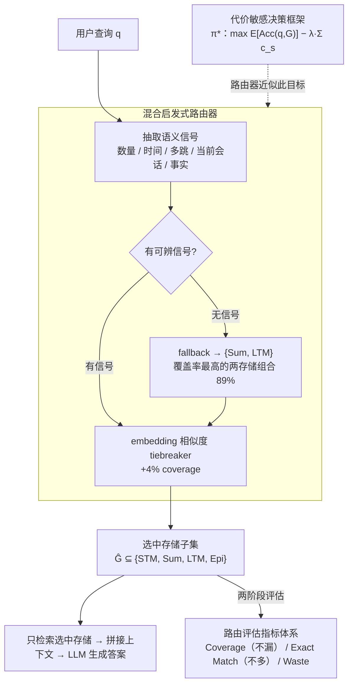

# Did You Check the Right Pocket? Cost-Sensitive Store Routing for Memory-Augmented Agents

**会议**: ICLR 2026 Workshop  
**arXiv**: [2603.15658](https://arxiv.org/abs/2603.15658)  
**代码**: 无  
**领域**: LLM效率  
**关键词**: memory-augmented agents, store routing, cost-sensitive retrieval, RAG, memory architecture  

## 一句话总结
将记忆增强 Agent 的多存储检索形式化为代价敏感的存储路由问题（store routing），证明选择性检索相比全量检索可在减少 62% context token 的同时提升 QA 准确率（86% vs 81%），并提出基于语义信号的启发式路由基线。

## 研究背景与动机
**领域现状**：记忆增强 Agent（如 MemGPT）通常维护多个专用存储——短期记忆（STM, 当前对话）、摘要存储（Summary, 压缩用户事实）、长期记忆（LTM, 历史对话摘要）、情景记忆（Episodic, 原始转录）。但大多数系统对每个查询都从所有存储中检索。

**现有痛点**：全量检索带来两个代价——① 计算浪费（查询不可能包含答案的存储）；② 准确率下降（无关/噪声上下文降低信噪比，尤其在长上下文下模型需要在大量无关文本中寻找答案）。

**核心矛盾**：更多上下文 ≠ 更好性能。在长上下文设置中，无关存储引入的干扰信息实际上会误导模型——例如 LTM 中过时信息可能与 Summary 中最新信息冲突，模型有时会错误选择旧信息。

**本文要解决**：在检索之前决定"查哪个口袋"（which stores to search），将存储选择与存储内排序解耦，使 accuracy-cost tradeoff 显式化。

**切入角度**：从信息检索领域的联邦搜索（federated search）和认知科学的记忆分类（episodic vs semantic memory）获得启发，将查询路由到语义角色不同的存储。

**核心idea**：路由决策是记忆增强 Agent 设计的一等公民（first-class component），而非事后问题。形式化为 $\pi^*(q) = \arg\max_{G \subseteq \mathcal{S}} [\mathbb{E}[\text{Acc}(q,G)] - \lambda \sum_{s \in G} c_s]$。

## 方法详解

### 整体框架
记忆增强 Agent 维护四个语义角色不同的存储，构成存储集合 $\mathcal{S} = \{\text{STM}, \text{Sum}, \text{LTM}, \text{Epi}\}$——短期记忆装当前对话、摘要存储压缩用户事实、长期记忆存历史会话摘要、情景记忆保留原始转录。大多数系统对每个查询都把这四个口袋全翻一遍，靠 LLM 在生成时自己过滤；本文的核心转变是把"该查哪几个口袋"提前到检索之前来决定。给定查询 $q$，路由策略 $\pi$ 先选出存储子集 $\hat{G} = \pi(q) \subseteq \mathcal{S}$，系统只从被选中的存储取内容、拼接后送入 LLM 生成答案——存储选择与存储内排序被显式解耦。

整套方法围绕三件事展开：一把理论尺子（代价敏感目标 $\pi^*$ 定义什么叫"选得最优"）、一个可部署的近似（混合启发式路由器靠查询语义信号收窄范围），以及一套度量（指标体系把路由质量拆成"漏"与"多"来量化）。为了把"选得好不好"和"答得对不对"分开看，论文用两阶段评估：先做**合成路由评估**，拿带 ground-truth 存储标签的查询验证路由本身的选择质量；再做 **LLM QA 评估**，把路由结果接上真实模型看下游答题准确率。被评估的策略排成一条从简到强的谱系——Uniform（$\lambda=0$ 的全量检索）→ Fixed Subset（如固定查 STM+Sum+LTM）→ Hybrid Heuristic（规则+fallback）→ Oracle（理论上界），论文跑遍其中 12 种。

### 关键设计

**1. 代价敏感决策框架：给"选哪几个口袋"一个最优性定义**

整套方法的理论尺子，回答"理论上最优的存储选择长什么样"。论文把存储路由形式化为一个代价敏感的子集选择问题：

$$\pi^*(q) = \arg\max_{G \subseteq \mathcal{S}} \left[\mathbb{E}[\text{Acc}(q,G)] - \lambda \sum_{s \in G} c_s\right]$$

即在期望准确率 $\mathbb{E}[\text{Acc}(q,G)]$ 和检索代价 $\sum_{s\in G} c_s$（以 context token 计）之间按权重 $\lambda$ 取平衡。这个式子能统一解释整条策略谱系：$\lambda=0$ 时代价项消失，退化成无脑全量检索的 Uniform；Oracle routing 则是已知每个查询真实相关存储时对 $\pi^*$ 的近似上界。它的解释力在于揭示选择性检索为何两端都有收益——一旦无关存储被检索进来，有效检索代价上升，同时上下文噪声还会拉低正确抽取的概率，所以少查反而可能既省 token 又更准。这也点出存储路由与检索门路由（retriever routing）的本质区别：后者在同质文档集合里选索引/检索器，而存储路由是 memory-architecture level 的决策，几个存储语义角色差异极大（STM vs LTM vs Summary），直接决定了喂给 LLM 的上下文信噪比，粒度比 passage-level 的段落路由要粗得多。

**2. 混合启发式路由器（Hybrid Heuristic）：靠查询里的语义信号收窄口袋范围**

把上面那个理论目标落成可部署基线，思路是从查询语言本身读出"答案该在哪个语义角色的存储里"。它先从查询抽取语义信号，再用一组规则把信号映射到存储：数量信号（"list all"、"every"）和时间信号（"before"、"changed"）指向 {LTM, Epi}（穷尽召回 / 历史对比）；多跳信号（"compare"、"relate"）指向 {Sum, LTM}（交叉引用）；当前会话信号（"just said"、"today"）指向 {STM}；事实查找（"what is my"、"who is my"）指向 {Sum}。当查询没有任何可辨信号时，路由器 fallback 到 {Sum, LTM}——作者实测全部六种两存储组合后，这一组覆盖率最高（89%），故选作安全默认。在规则之上，再用 query-store embedding similarity 作为 tiebreaker，在无规则命中时细调，单这一项就再贡献 +4% coverage。整套设计的优先级很明确：先保 coverage（漏掉含答案的存储等于问题不可回答的死局），只在确有信号支撑时才敢收窄检索范围。论文也强调这只是 baseline 而非终态路由器——它和 Oracle 还差 16 点，留给后续端到端学习的路由策略。

**3. 路由评估指标体系：把"漏"和"多"拆成两件事来量**

要让 accuracy-cost tradeoff 可度量，得分别回答两个不同的问题：有没有漏掉必须查的存储，以及有没有多查了无关的存储。论文用三个指标分别盯这两件事。Coverage $= \frac{1}{N}\sum_i \mathbf{1}[G_i \subseteq \hat{G}_i]$ 衡量是否包含了所有必要存储——在"全存储内容拼接"的评估协议下这是硬约束，一旦漏掉含答案的存储，问题就根本不可回答。Exact Match $= \frac{1}{N}\sum_i \mathbf{1}[G_i = \hat{G}_i]$ 衡量是否恰好选中必要存储、一个不多一个不少，EM 高对应不过度检索的高效路由。Waste $= \frac{1}{N}\sum_i |\hat{G}_i \setminus G_i|$ 则把"多查了几个无关存储"量化成软代价，是 token 成本的存储级代理。把覆盖率（不漏）和精确度（不多）分开度量，路由质量才不会被一个笼统的准确率掩盖。

## 实验关键数据

### 合成路由评估（1000 查询，7 种类型）

| 策略 | Coverage | Exact Match | Waste |
|------|----------|-------------|-------|
| Uniform | 100% | 8% | 2.9 |
| Rule-based（仅语言学） | 57% | 35% | 0.5 |
| **Hybrid (Ours)** | **94%** | **58%** | **1.2** |
| Oracle | 100% | 100% | 0.0 |

### LLM QA 评估（150 问题）

| 模型 | 策略 | 总体准确率 | Short | Long | Token数 |
|------|------|-----------|-------|------|---------|
| GPT-4o-mini | Oracle | **86.7%** | 94% | **72%** | **299** |
| GPT-4o-mini | STM+Sum+LTM | 84.7% | 92% | 70% | 591 |
| GPT-4o-mini | Uniform | 81.3% | 92% | 60% | 787 |
| GPT-4o-mini | Hybrid | 70.7% | 80% | 52% | 379 |
| GPT-3.5 | Oracle | 85.3% | 93% | 70% | 299 |
| GPT-3.5 | Uniform | 83.3% | 91% | 68% | 787 |

### 特征消融

| 特征组 | Coverage | Δ |
|--------|----------|---|
| 语言学特征（代词、时态） | 57% | baseline |
| + 语义信号（数量、时间、多跳） | 90% | +33% |
| + Embedding 相似度 | 94% | +4% |

### 关键发现
- **Oracle 用 62% 少的 token 却获得更高准确率**（86.7% vs 81.3%），铁证"更多上下文 ≠ 更好"
- **长上下文放大过度检索惩罚**：Long 场景下 Oracle 72% vs Uniform 60%，差距从 Short 的 2% 扩大到 12%
- **固定策略 STM+Sum+LTM 接近 Oracle**（84.7% vs 86.7%），是实用的 deployable 方案
- **Coverage-Accuracy Gap**：Hybrid 94% coverage 但仅 70% QA 准确率。12% 错误来自路由失误（漏存储），18% 来自抽取失败（存储正确但模型提取错误）

## 全量检索为何反而更差？
两个机制：① **Needle in haystack**：787 token 中寻找少量相关信息，信噪比低；② **信息冲突**：不同存储含过时/冲突信息。典型案例："Who is my current manager?"——Summary 存储有正确答案 "Jennifer Williams"，但 LTM 中有历史记录 "Before the reorg...reported to Michael Torres"，全量检索时模型有时错误提取了更详细的旧信息。

## 亮点与洞察
- **"更多不是更好"的严格实证**——这对所有 RAG/记忆系统都有警示意义：盲目增加上下文长度可能适得其反
- **存储路由 vs 检索路由的概念区分**：存储路由是 architecture-level 决策（语义角色不同的存储），比 passage-level 检索路由影响更大但被忽视
- **两阶段评估设计**：先用合成标签验证路由质量，再用真实 LLM 验证下游性能，有效分离了路由决策与模型能力的影响
- **Coverage-Accuracy Gap 的分解分析**：区分路由错误（12%）和抽取错误（18%），指明了改进方向

## 局限与展望
- 标签来自查询分类规则而非人工标注，可能不完全反映真实场景的存储需求
- 启发式路由器与 Oracle 差距 16 点（70% vs 86%），需要端到端学习的路由策略（如 RL 优化 $\lambda$-tradeoff）
- 仅测试了 GPT-3.5 和 GPT-4o-mini 两个模型家族，上下文处理策略不同的模型可能响应不同
- 使用全存储内容拼接而非 top-k 检索，与生产系统设置有差异——路由与存储内检索的交互尚待研究
- 仅 150 个测试问题，统计效力有限

## 相关工作与启发
- **vs Self-RAG / FLARE**: 它们决定"是否检索"（when），本文决定"从哪个存储检索"（where），是互补维度
- **vs MemGPT**: MemGPT 关注记忆的组织和管理操作（读/写/整合），本文关注记忆访问的路由决策——两者可结合
- **vs ExpertRAG / RAP-RAG**: ExpertRAG 用 MoE 路由上下文选择，RAP-RAG 规划多跳检索序列；本文的存储路由粒度更粗（存储级 vs 段落级）
- **vs 联邦检索文献**: 信息检索中的资源选择（resource selection）算法估计每个集合的相关性分布，可直接迁移到 Agent 记忆路由
- 可启发 multi-store RAG 系统设计：先路由再检索 > 全量检索后让 LLM 自己过滤

## 评分
- 新颖性: ⭐⭐⭐ 问题定义清晰（存储路由作为一等公民），但技术方案（规则+fallback）较简单
- 实验充分度: ⭐⭐⭐ 两阶段评估设计合理，但样本规模小（150 问题）
- 写作质量: ⭐⭐⭐⭐ 论述逻辑清晰，failure case 分析深入，决策框架优雅
- 价值: ⭐⭐⭐⭐ "路由是一等公民"观点对记忆增强系统有实际指导意义，16点的 Oracle gap 激励后续研究

<!-- RELATED:START -->

## 相关论文

- [\[ICLR 2026\] Universe Routing: Why Self-Evolving Agents Need Epistemic Control](universe_routing_why_self-evolving_agents_need_epistemic_control.md)
- [\[ACL 2026\] MTRouter: Cost-Aware Multi-Turn LLM Routing with History-Model Joint Embeddings](../../ACL2026/llm_efficiency/mtrouter_cost-aware_multi-turn_llm_routing_with_history-model_joint_embeddings.md)
- [\[ICLR 2026\] IterResearch: Rethinking Long-Horizon Agents with Interaction Scaling](iterresearch_rethinking_long-horizon_agents_with_interaction_scaling.md)
- [\[ACL 2026\] RACER: Retrieval-Augmented Contextual Rapid Speculative Decoding](../../ACL2026/llm_efficiency/racer_retrieval-augmented_contextual_rapid_speculative_decoding.md)
- [\[ICML 2026\] Variational Routing: 校准 MoE Transformer 的可扩展贝叶斯框架](../../ICML2026/llm_efficiency/variational_routing_a_scalable_bayesian_framework_for_calibrated_mixture-of-expe.md)

<!-- RELATED:END -->
