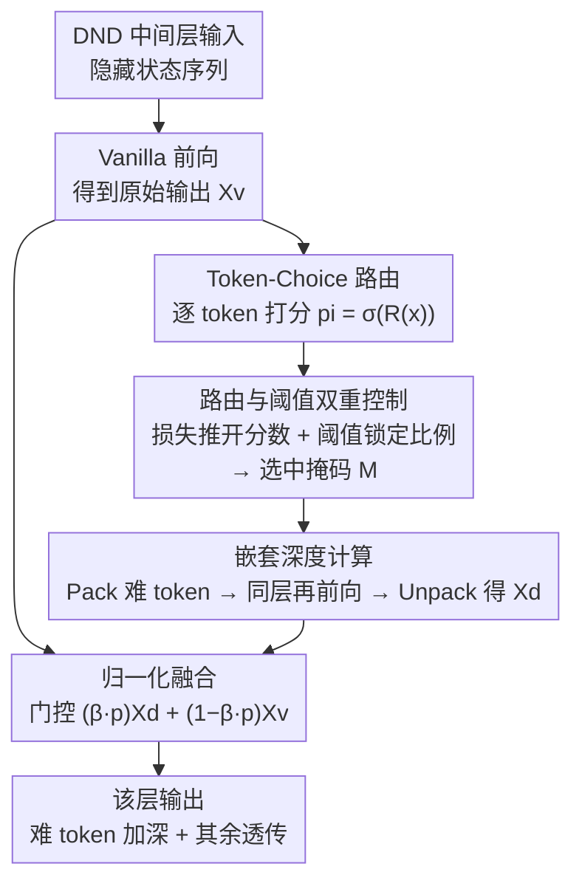

# DND: Boosting Large Language Models with Dynamic Nested Depth

**会议**: ICLR 2026  
**arXiv**: [2510.11001](https://arxiv.org/abs/2510.11001)  
**代码**: 无  
**领域**: LLM效率 / 自适应计算  
**关键词**: 动态深度, 自适应token选择, 大语言模型, 后训练增强, MoE

## 一句话总结
DND在Transformer层末端通过路由器选出关键token，将其回送同一层进行额外处理（嵌套深度），配合路由控制损失和阈值控制方案实现精确稳定的token选择，以极少的参数增加（<0.1M）在Qwen3-1.7B和Qwen3-30B-A3B上分别获得1.88%和0.87%的平均性能提升。

## 研究背景与动机
大语言模型的主要提升策略一直是扩展规模——更多参数、数据和计算。但这带来了指数级增长的计算开销。一个关键观察是：**预测难度在token之间差异显著**——大部分token是"简单"的（如语言连贯性token），只有少数"关键"token涉及复杂的逻辑推理或规划任务。

这引出两个相关的研究方向：
- **Token剪枝**: 过滤掉不重要的token以减少计算——但这只是"不处理"简单token
- **测试时计算扩展（隐式策略）**: 在隐藏状态中循环计算来增强推理——但对所有token均匀应用

核心矛盾：简单token不需要额外计算，但关键token需要更深层的处理。现有方法要么只做减法（剪枝），要么一视同仁地做加法（全部循环），缺乏**针对性的深度增益**。

DND的切入角度是将这两个方向结合：先选出困难token，再为它们分配额外的计算深度——一种"审阅"机制。这是token级选择与隐式空间加深的首次有效融合。

## 方法详解

### 整体框架
DND 只改造模型的中间层（首尾若干层保持原样，以保护预训练好的推理模式）。在每个 DND 层里，输入先照常做一次 vanilla 前向得到原始输出 $\mathbf{X}^v$；随后一个轻量路由器逐 token 打分，再配合一套控制机制把分数稳定地拉开、把阈值锁定到目标比例，从而精确选出那一小撮"难"token；这些 token 被打包成一条短序列、重新过一遍**同一层**得到加深输出 $\mathbf{X}^d$，最后按门控权重与原始输出融合后散射回原位。难点不在"再算一遍"本身，而在于如何稳定地选中真正需要加深的 token、又不破坏已有知识——这正是下面几个设计要解决的。下图是一个 DND 层内部的完整数据流：

### 关键设计

**1. Token-Choice 路由：让选择与自回归解码兼容**

框架里"选难 token"这一步直接决定后面所有额外计算花在哪。DND 用一个把隐藏状态映射到标量的线性路由器 $R: \mathbb{R}^{d_{model}} \to \mathbb{R}$，对每个 token 独立算偏好分数 $p_i = \sigma(R(\mathbf{x}_i^v))$，再与阈值 $\tau$ 比较，$p_i > \tau$ 即选中。这里刻意用 token-choice 而非 MoE 常见的 expert-choice：后者要先看到整段序列才能选出 top-k，会把未来 token 的信息泄露给当前位置、违反自回归解码的因果性；token-choice 每个位置只看自己的分数独立决定，天然兼容逐 token 生成。

**2. 路由与阈值双重控制：让选择既稳定又精确锁定比例**

token-choice 没有 top-k 那种天然的比例约束，于是带来两个隐患：路由分数容易挤成一团，让"谁被选中"近乎随机、轻微扰动阈值就让选中比例剧烈抖动；同时实际选中比例也未必等于目标值。DND 用一组损失加一套阈值调节联手解决。损失侧是一对"推拉"目标：分数分散损失 $\mathcal{L}_{sd}$ 基于信息熵，鼓励同一序列内的分数铺开到更宽区间、拉大 token 之间的区分度；分布保持损失 $\mathcal{L}_{dp}$ 用 MSE 惩罚偏离 0.5 的分数，把它们拉回 sigmoid 的线性敏感区，防止滑进饱和区后梯度消失——前者推开、后者拉回，平衡后路由器才能给出既稳定又有区分度的打分。阈值侧则做双重调节：缓冲比例控制在每个 mini-batch 上算出实际选择比例与目标比例 $k_{target}$ 的误差 $e$，按 $\tau \leftarrow \tau + \alpha \cdot e$ 实时微调阈值；EMA 同步每隔若干步（如 50 步）取缓冲区内 top-k 路由值的均值 $\bar{\tau}_{topk}$，按 $\tau = (1-\gamma)\tau + \gamma\bar{\tau}_{topk}$ 校正，避免路由器与阈值长期朝相反方向漂移。相比此前工作用 z-loss 粗略约束比例，这套机制能把选中比例精确锁定在设定值附近。

**3. 嵌套深度计算：把难 token 送回同一层再审一遍**

选中的 token 按二元掩码 $\mathbf{M}$ 被 Pack 成一条短得多的子序列，赋予新的位置编码 $\mathbf{E}'_{pos}$ 后再次喂进**同一个** Transformer 层，算完用 Unpack 按原索引散射回各自位置。关键在于复用同一层权重而非新增一层——这步几乎不带来额外参数（<0.1M）；又因为只对被选中的少数 token 生效，额外计算量被牢牢压住（20% 选择比例下总 FLOPs 仅增约 6.27%）。本质上是对困难 token 做了一次"内部审阅迭代"，让它们比简单 token 多走一遍同样的变换。

**4. 归一化融合：用门控保住预训练知识**

DND 是后训练方法，若让加深输出直接覆盖原始输出，很容易一上来就扰乱预训练好的全局 token 交互分布。于是加深后的输出 $\mathbf{x}_i^d$ 不直接替换，而是按 $\mathbf{x}_i = (\beta \cdot p_i)\,\mathbf{x}_i^d + (1 - \beta \cdot p_i)\,\mathbf{x}_i^v$ 与原始输出门控融合（仅对选中 token，未选中的直接保留 $\mathbf{x}_i^v$）。$\beta$ 是可学习标量、初始化为 0.1，训练起步时融合权重很小、几乎等同原模型，避免破坏预训练分布；随训练推进，路由分数 $p_i$ 越高的 token，其嵌套输出 $\mathbf{x}_i^d$ 的占比越大——"加深"被逐步、平滑地释放到最该加深的那批 token 上。

### 一个完整示例
以一个 DND 中间层、目标选择比例 20% 为例：长度 100 的序列先正常前向得到 $\mathbf{X}^v$；路由器给 100 个 token 各打一个 $p_i$，阈值控制此时已把 $\tau$ 调到使约 20 个 token 的 $p_i$ 超过它；这 20 个 token 被 Pack 成一条长 20 的子序列、配上新位置编码后再过一遍同一层，得到 $\mathbf{x}_i^d$ 并 Unpack 回原位；最后这 20 个位置按 $\mathbf{x}_i = (\beta p_i)\mathbf{x}_i^d + (1-\beta p_i)\mathbf{x}_i^v$ 与原输出融合，其余 80 个 token 原样透传。整层只多算了 20% 的 token、且不增加层数，却让最难的那批 token 多被"审"了一遍。

### 损失函数 / 训练策略
总损失为交叉熵加两项路由正则：$\mathcal{L} = \mathcal{L}_{ce} + \lambda_{sd}\mathcal{L}_{sd} + \lambda_{dp}\mathcal{L}_{dp}$。整体走后训练（SFT）路线，AdamW优化器配cosine学习率（5e-6 衰减到 1e-6）：Qwen3-1.7B 在128块H100上训2个epoch（约1天），Qwen3-30B-A3B 在256块H100上训4个epoch（约3天）。DND只挂在中间层（$L_s=4$ 到 $L_e=43$），目标选择比例20%，路由器全零初始化、阈值初始化0.5、$\beta$初始化0.1。

## 实验关键数据

### 主实验
Qwen3-30B-A3B MoE模型，17个benchmark：

| 任务类别 | 代表benchmark | SFT基线 | +DND | 提升 |
|---------|-------------|---------|------|------|
| 通用&对齐 | MMLU | 85.41 | 85.91 | +0.50 |
| 通用&对齐 | C-Eval | 83.09 | 84.92 | +1.83 |
| 通用&对齐 | IFEval | 83.09 | 84.31 | +1.22 |
| 数学&STEM | AIME24 | 51.46 | 52.37 | +0.91 |
| 数学&STEM | GPQA-Diamond | 56.76 | 57.67 | +0.91 |
| 代码&Agent | BFCL v3 | 75.43 | 77.48 | +2.05 |
| 代码&Agent | LCB-v6 | 31.14 | 32.56 | +1.42 |
| **平均** | 17 benchmarks | 75.70 | 76.57 | **+0.87** |

### 消融实验（Qwen3-1.7B）

| 配置 | 平均分数 | 提升 | 说明 |
|------|---------|------|------|
| Qwen3-1.7B SFT | 59.53 | 0.00 | 基线 |
| +DND (完整) | 61.41 | +1.88 | 全部策略 |
| +DND (仅z-loss控制) | 60.54 | +1.01 | 无精确路由控制 |
| +DND (仅路由控制) | 60.58 | +1.05 | 无阈值动态调整 |
| +DND (仅阈值控制) | 60.68 | +1.15 | 无路由分散损失 |
| 选择比例=10% | 60.33 | +0.80 | token太少，attention不充分 |
| 选择比例=20% | 61.41 | +1.88 | 最佳平衡 |
| 选择比例=30% | 61.03 | +1.50 | 略低于20% |

### 关键发现
- **计算开销极低**: 20%选择比例下，总FLOPs增加仅约6.27%，参数增加<0.1M
- **无任何性能下降**: 17个benchmark全部提升，没有出现性能权衡
- **代码和Agent任务受益最大**: BFCL v3提升2.05，验证了DND过滤噪声token、聚焦关键推理token的假设
- **Token选择可视化**: 浅层倾向选择关键名词，深层选择数学表达式和逻辑动词——模型学到了分层处理策略
- **选择比例在推理时稳定**: 平均在0.178~0.242范围内，中间层略高

## 亮点与洞察
- **简洁而有效**: 核心idea非常直观——选出难的token多处理一遍。仅用一个线性路由器就实现了显著提升
- **后训练可插拔**: 不需要从头预训练，可以直接插入已有dense和MoE模型，实用价值极高
- **路由控制设计精巧**: 分散损失+保持损失的"推拉"机制，比简单的z-loss更适合精确比例控制
- **兼容dense和MoE**: 在1.7B dense和30B MoE上均验证有效，且后者成本更低（MoE层已有稀疏激活）
- **可视化分析有说服力**: token选择的层次化模式（浅层→实体，深层→逻辑）为adaptive computation提供了经验证据

## 局限与展望
- 仅在后训练(SFT)阶段验证，预训练和持续预训练阶段的影响未探索
- 仅在自回归LLM上测试，扩散式LLM等其他架构的适用性未知
- 层间选择比例不同（中间层和边界层更高），但论文未利用这一发现进行层自适应比例设计
- 嵌套深度固定为1（只额外处理一次），多次嵌套是否进一步有效未探索
- 训练策略的超参数（$\lambda_{sd}$, $\lambda_{dp}$, $\alpha$, $\gamma$等）需要精心调整

## 相关工作与启发
- **Mixture-of-Depths (MOD, Raposo et al., 2024)**: 动态减少计算层数以降低冗余，DND则反向——为关键token增加深度
- **MOR (Bae et al., 2025)**: 最相关工作，也做token选择+额外计算，但仅限1B规模预训练，用z-loss控制比例（不精确），无融合策略
- **Inner Thinking Transformer (ITT, Chen et al., 2025)**: 类似动态选择+额外计算，DND在控制策略上更精细
- **DeepSeek-V3的平衡损失**: DND的缓冲比例控制灵感来源于此
- 启发：token级自适应计算是一个有前景的方向，关键在于如何精确控制选择比例和融合策略

## 评分
- 新颖性: ⭐⭐⭐⭐
- 实验充分度: ⭐⭐⭐⭐⭐
- 写作质量: ⭐⭐⭐⭐
- 价值: ⭐⭐⭐⭐

<!-- RELATED:START -->

## 相关论文

- [\[ICLR 2026\] Deep Hierarchical Learning with Nested Subspace Networks for Large Language Models](deep_hierarchical_learning_with_nested_subspace_networks_for_large_language_mode.md)
- [\[ICLR 2026\] EvoEngineer: Mastering Automated CUDA Kernel Code Evolution with Large Language Models](evoengineer_mastering_automated_cuda_kernel_code_evolution_with_large_language_m.md)
- [\[ICLR 2026\] Expert Divergence Learning for MoE-based Language Models](expert_divergence_learning_for_moe-based_language_models.md)
- [\[ACL 2025\] Dynamic Chunking and Selection for Reading Comprehension of Ultra-Long Context in Large Language Models](../../ACL2025/llm_efficiency/dynamic_chunking_and_selection_for_reading_comprehension_of_ultra-long_context_i.md)
- [\[ACL 2026\] Are Large Language Models Economically Viable for Industry Deployment?](../../ACL2026/llm_efficiency/are_large_language_models_economically_viable_for_industry_deployment.md)

<!-- RELATED:END -->
