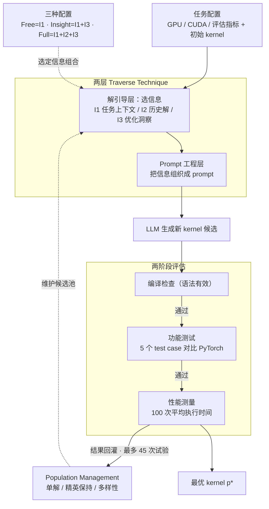

# EvoEngineer: Mastering Automated CUDA Kernel Code Evolution with Large Language Models

**会议**: ICLR 2026  
**arXiv**: [2510.03760](https://arxiv.org/abs/2510.03760)  
**代码**: 有（开源平台）  
**领域**: LLM效率  
**关键词**: CUDA Kernel Optimization, LLM Code Evolution, Evolutionary Search, Code Generation, Prompt Engineering

## 一句话总结
提出 EvoEngineer，首个系统化的 LLM-based 代码演化框架，将代码演化分解为 traverse technique（含两层设计：solution guiding + prompt engineering）和 population management 两个正交组件，在 91 个真实 CUDA kernel 上实现最高 2.72× 中位加速比和 69.8% 代码有效率，在性能和正确性两个维度上超越现有方法。

## 研究背景与动机

**领域现状**：CUDA kernel 性能是 AI 训练和推理效率的核心瓶颈。手动优化需要深厚的 GPU 架构专业知识（内存层次、线程调度、Tensor Core 等），而 LLM 已展现出自动化优化的潜力。近期出现了 AI CUDA Engineer、KernelBench 等 kernel-specific 方法以及 EoH、FunSearch 等通用代码演化方法。

**现有痛点**：(a) Kernel-specific 方法将评估过程与优化策略紧耦合，问题形式化不清晰，无法做公平比较；(b) 通用代码演化方法仅在宽松正确性要求的场景下验证过（如数学问题），难以满足 CUDA kernel 的严格正确性约束；(c) 两类方法都缺乏系统框架来理解不同优化策略在不同场景下的有效性。

**核心矛盾**：性能提升与代码正确性之间存在 trade-off。追求高加速比往往导致代码有效率下降，而保守策略又限制了性能提升空间。现有方法要么忽视这个 trade-off（策略盲目），要么通过复杂 prompt 过度消耗 token（资源低效）。

**本文目标** 如何系统化地选择和设计优化策略，在 LLM-based kernel 优化中同时提升性能和正确性？

**切入角度**：将代码演化分解为两个正交组件（traverse + population management），并在 traverse 内部进一步分离策略层和 prompt 工程层，使得分析和设计优化策略成为可能。

**核心 idea**：通过两层分解的 traverse technique 设计（解耦"用什么信息指导搜索"和"如何写 prompt"），实现对 LLM-based 代码演化策略的系统化分析和选择。

## 方法详解

### 整体框架

EvoEngineer 想回答一个被领域长期回避的问题：在用 LLM 自动演化 CUDA kernel 时，到底"喂给模型什么信息、怎么组织 prompt、怎么维护候选解"才能同时兼顾加速比和正确性？为此它把整套代码演化拆成两个正交组件——**Traverse Techniques**（决定如何在代码空间里导航搜索）和 **Population Management**（决定如何维护和选择候选解），让二者可以独立分析、自由组合。

落到运行流程上是三步闭环：先做任务配置（Task Configuration），指定 GPU 类型、CUDA 版本、评估指标等约束；再做解生成（Solution Generation），由配置好的 traverse technique 和 population management 共同产出一批新 kernel 候选；最后做解评估（Solution Evaluation），对每个候选跑编译检查、功能测试和性能测量，把结果回灌进种群，进入下一轮迭代。整个过程被形式化为带约束的优化问题 $p^* = \arg\min_{p \in \mathcal{S}} f(p)$，其中 $f(p)$ 是执行时间，约束 $g(p) = 0$ 要求候选既能编译通过又功能正确；每个 kernel 最多分配 45 次优化试验。

### 关键设计

**1. 两层 Traverse Technique：把"搜索策略"和"prompt 怎么写"彻底解耦**

现有方法（EoH、FunSearch）的根本问题是把"用什么信息指导搜索"和"如何把信息写成 prompt"混在一起，还机械模仿进化算子（crossover/mutation），但从没有实证说明 LLM 真能有效执行这些算子。EvoEngineer 把 traverse 切成两层：上层 Solution Guiding Layer 只管"给 LLM 什么信息"，下层 Prompt Engineering Layer 只管"把这些信息翻译成具体 prompt"。Solution Guiding Layer 维护三类 closed-world 信息——当前任务上下文（优化目标与约束，记为 I1）、历史高质量解（I2）、优化洞察（设计理由和 LLM 的推理过程，I3），并可选择性接入 open-world 的领域知识（I4）。这样一来，"换一种搜索信息组合"和"换一种 prompt 写法"成了两件可以分别试验的事，策略分析和 prompt 优化得以独立推进。

**2. 三种 EvoEngineer 配置：用不同信息组合系统扫一遍 trade-off**

上层信息一旦可以自由拼装，作者就构造了三档配置来系统比较信息量的影响。EvoEngineer-Free 只用任务上下文 I1，配简单 prompt 和 best-solution 维护策略，几乎不给约束、优先放手探索，因此加速比高但正确性偏低；EvoEngineer-Insight 在 I1 之上加入优化洞察 I3，并刻意把 insights 当作独立信息源而非绑在某个 solution 上，配单最优解维护，正确性和加速比都落在中段；EvoEngineer-Full 则整合 I1 + I2 + I3（任务上下文 + 历史解 + 优化洞察），用 elite preservation 策略，信息量最大、约束最强，正确性最高但加速最保守。三档配置不是随意调参，而是有意把"信息使用量 → 性能/正确性"这条关系曲线扫出来。

**3. Population Management：用候选解的维护方式调节探索与利用**

这一组件决定候选解怎么维护、怎么选择、怎么演化，本质是在调探索与利用的平衡。它提供三种策略：单解策略只保留当前最优解，迭代快但容易陷入局部最优；精英保持策略保留一小组高性能解，在正确性上更稳；多样性维护策略刻意保持解的差异，以更广地覆盖搜索空间。前面三种配置里 Free 用单解、Full 用精英保持，正是借这一层把"激进探索"和"稳健保正确"两种取向落地。

**4. 两阶段评估：把 CUDA kernel 的严格正确性约束钉进搜索回路**

CUDA kernel 优化和一般代码生成最大的区别，是它对正确性几乎零容忍——一个数值偏差就让加速毫无意义。所以每个生成的 kernel 都要过两道关：先做编译检查保证语法有效，再用 5 个 test case 对比 PyTorch 参考实现做功能测试。只有两关都过的候选才进入性能测量，取 100 次运行的平均执行时间作为 $f(p)$。这道严格的验证流程也是前面约束 $g(p)=0$ 的具体落地，把"正确"作为搜索的硬门槛而非事后筛选。

### 损失函数 / 训练策略

本文不涉及传统的损失函数训练，而是基于搜索的优化，优化目标即上文的 $p^* = \arg\min_{p \in \mathcal{S}} f(p)$，约束 $g(p) = 0$（编译通过 + 功能正确），每个 kernel 最多 45 次优化试验。

## 实验关键数据

### 主实验

| 方法 | LLM | 中位加速比 | 功能正确率 (Pass@1) | 编译成功率 |
|------|-----|-----------|-------------------|----------|
| AI CUDA Engineer | GPT-4.1 | 1.19 | 59.4% | 84.0% |
| FunSearch | GPT-4.1 | 1.34 | 53.2% | 73.8% |
| EoH (EvoEngineer-Solution) | GPT-4.1 | 1.57 | 53.7% | 74.7% |
| EvoEngineer-Free | Claude-Sonnet-4 | **2.72** | 52.2% | 74.1% |
| EvoEngineer-Insight | GPT-4.1 | 1.60 | 60.0% | 82.2% |
| EvoEngineer-Full | GPT-4.1 | 1.20 | **69.8%** | **87.5%** |

最大加速比：36.75× over PyTorch kernels。在 50 个达到 2× 加速的 operation 中，EvoEngineer 在 28 个 (56%) 上取得最高加速。

### 消融实验

| 信息组合 | 加速方向 | 正确性方向 | 说明 |
|---------|---------|----------|------|
| I1 only (Free) | 最高 (2.72×) | 最低 (52.2%) | 自由探索，高风险高回报 |
| I1 + I3 (Insight) | 中等 (1.60×) | 中等 (60.0%) | insights 提升正确性但限制探索 |
| I1 + I2 (EoH/Solution) | 中等 (1.57×) | 较低 (53.7%) | 历史解增加约束 |
| I1 + I2 + I3 (Full) | 较低 (1.20×) | 最高 (69.8%) | 信息越多正确性越高但加速越保守 |

### 关键发现
- **信息量与性能/正确性呈反向关系**：更多信息（I2+I3）显著提升正确性（+17.6%），但牺牲加速比（-56%）
- **LLM 选择影响巨大**：Claude-Sonnet-4 + EvoEngineer-Free 组合加速比最高（2.72×），说明强大 LLM 在自由探索策略下表现最好
- **EvoEngineer-Full 在正确性上显著领先**：69.8% vs AI CUDA Engineer 的 59.4%，编译成功率 87.5% vs 84.0%
- AI CUDA Engineer 使用 >5 个历史解的复杂 prompt，但加速比反而最低，验证了"策略盲目"问题

## 亮点与洞察
- **首次将代码演化分解为正交组件并进行系统化分析**：两层 traverse 设计清晰分离了"策略"和"实现"，使得不同方法可以在统一框架下公平比较。可迁移到任何 LLM-based 代码优化场景。
- **揭示了 LLM 代码演化中的核心 trade-off**：信息越多→正确性越高但加速越保守。这是一个重要的框架级洞察，对后续工作有很强的指导意义。
- **问题形式化是关键贡献**：将 CUDA kernel 优化形式化为约束优化问题，并定义统一的评估协议，解决了领域碎片化问题。

## 局限与展望
- 仅在单 GPU 架构 (RTX 4090) 上测试，跨架构泛化性未知
- 45 次试验的预算限制可能不足以展示某些方法的潜力
- Open-world 信息（I4: domain knowledge）未被探索，可能是提升上限的关键
- 搜索过程仍然是暴力式的 random search + LLM，缺乏学习型的搜索策略（如 bandit、BO）
- 未考虑 kernel fusion 等跨 operation 优化

## 相关工作与启发
- **vs AI CUDA Engineer**: AI CUDA Engineer 用 >5 个历史解的复杂 prompt 但无系统框架，token 使用量高但效果不如 EvoEngineer-Free（加速比仅 1.19 vs 2.72）。
- **vs FunSearch/EoH**: 这些通用方法被 EvoEngineer 统一在框架内。EoH 在框架中被映射为 EvoEngineer-Solution 配置。FunSearch 只用 2 个历史解且不利用 optimization insights。
- **vs 传统遗传编程**: 传统方法在 AST/语法树空间中操作，LLM-based 方法直接在文本空间搜索，灵活性更高。

## 评分
- 新颖性: ⭐⭐⭐⭐ 框架设计和分解思路有创新，但单个组件并不新
- 实验充分度: ⭐⭐⭐⭐⭐ 91 个 kernel × 3 个 LLM × 6 种方法，分析非常全面
- 写作质量: ⭐⭐⭐⭐ 结构清晰，分析系统化，但符号有些冗余
- 价值: ⭐⭐⭐⭐ 对 LLM-based 代码优化领域有框架级贡献

<!-- RELATED:START -->

## 相关论文

- [\[ICLR 2026\] DND: Boosting Large Language Models with Dynamic Nested Depth](dnd_boosting_large_language_models_with_dynamic_nested_depth.md)
- [\[ICLR 2026\] Deep Hierarchical Learning with Nested Subspace Networks for Large Language Models](deep_hierarchical_learning_with_nested_subspace_networks_for_large_language_mode.md)
- [\[ACL 2026\] Lizard: An Efficient Linearization Framework for Large Language Models](../../ACL2026/llm_efficiency/lizard_an_efficient_linearization_framework_for_large_language_models.md)
- [\[ACL 2026\] Are Large Language Models Economically Viable for Industry Deployment?](../../ACL2026/llm_efficiency/are_large_language_models_economically_viable_for_industry_deployment.md)
- [\[ICLR 2026\] Expert Divergence Learning for MoE-based Language Models](expert_divergence_learning_for_moe-based_language_models.md)

<!-- RELATED:END -->
